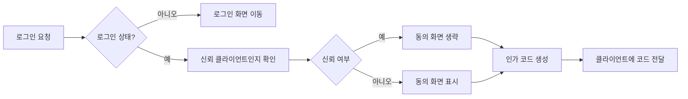

# OAuth 서버 종합 비즈니스 및 기능 요구사항

## 1. 서비스 개요
본 OAuth 서버는 OAuth 2.0과 OpenID Connect Core 1.0 표준을 준수하며, 개발자가 5분 내에 연동할 수 있는 쉽고 직관적인 인증 및 인가 시스템을 제공한다. 기본 회원가입, 다양한 소셜 로그인 연동, 불투명 토큰 발급, Redis 캐싱을 통한 고성능 토큰 검증, 그리고 게임 전적 검색 등 부가 기능을 포함한다.

## 2. 사용자 역할 및 권한
| 역할 | 설명 | 권한 및 기능 |
|-------|--------|----------------|
| 비회원 (guest) | 인증되지 않은 상태, 로그인 및 정보 조회 가능 | 로그인, 회원가입, 공용 정보 조회 |
| 회원 (member) | 이메일/소셜 로그인 인증 유저 | 프로필 관리, OAuth 토큰 발급 및 갱신, 게임 전적 조회 |
| 개발자 (developer) | OAuth 클라이언트 등록 및 API 연동자 | 클라이언트 등록/수정/삭제, SDK 사용, API 테스트 |
| 관리자 (admin) | 시스템 전체 관리 | 사용자 및 클라이언트 관리, 토큰 모니터링, 보안 설정 및 감사 로그 조회 |

## 3. 기능 요구사항
### 3.1 OAuth 인증 플로우
- THE system SHALL OAuth 2.0 Authorization Code Flow를 지원한다.
- WHEN 사용자가 /oauth/authorize 요청 시 로그인 여부를 확인하고 미인증 시 로그인 페이지로 이동시킨다.
- WHERE 클라이언트가 신뢰 클라이언트라면 동의 화면을 건너뜰 수 있어야 한다.
- WHEN 인가 코드가 생성되면, THE system SHALL 관련 정보를 JSONB 포맷으로 Safe 저장한다.
- THE system SHALL 불투명 토큰(access_token, refresh_token)을 UUID, CUID, ULID 등을 사용해 생성한다.
- token 엔드포인트에서 인가 코드 유효성을 확인한 뒤 토큰을 발급한다.

### 3.2 사용자 관리
- THE system SHALL 이메일과 비밀번호를 통한 회원가입 및 로그인을 지원한다.
- THE system SHALL 소셜 로그인(naver, daum, apple, google) 기능을 통합하며, 이메일을 기준으로 계정을 병합한다.
- THE system SHALL 사용자 프로필에 스팀 및 카카오 배틀그라운드, 롤 플레이어명을 저장한다.
- THE system SHALL 닉네임, 프로필사진 등 빈번히 변경되는 프로필 항목을 별도 테이블로 관리한다.

### 3.3 클라이언트 관리
- THE system SHALL 클라이언트 등록, 수정, 삭제 기능 및 시크릿 재생성을 지원한다.
- THE system SHALL redirect_uri와 스코프 검증을 철저히 수행한다.
- deletedAt 필드를 두어 클라이언트 및 기타 테이블은 soft delete 방식으로 관리한다.

### 3.4 토큰 및 인증 관리
- THE system SHALL 발급되는 access_token과 refresh_token은 불투명 토큰으로 구현하며 UUID, CUID, ULID 방식으로 키를 생성한다.
- THE system SHALL Redis 캐싱을 활용하여 토큰 검증 및 사용자 정보 조회 성능을 최적화한다.

### 3.5 소셜 로그인 및 서버 연동
- THE system SHALL 네이버, 다음, 애플, 구글 등 주요 소셜 로그인 연동을 지원한다.
- THE system SHALL 자체 OAuth 서버도 외부에서 이용 가능하도록 클라이언트 등 설정을 지원한다.

### 3.6 게임 전적 조회
- THE system SHALL 사용자 프로필에 게임 플랫폼별 플레이어명을 등록하는 페이지를 제공한다.
- THE system SHALL 공식 API를 호출하여 배틀그라운드, 롤 전적 데이터를 시즌별로 조회할 수 있다.
- THE system SHALL Redis 캐싱으로 전적 조회 결과를 최적화한다.

### 3.7 포인트 및 쿠폰 시스템
- THE system SHALL 사용자가 보유한 포인트를 관리하며, 아이콘 구매 시 사용된다.
- THE system SHALL 포인트 지급 쿠폰 기능을 제공하여, 쿠폰 등록 시 포인트 적립이 가능하다.

## 4. 비즈니스 규칙 및 데이터 관리
- THE system SHALL User 테이블을 제외한 모든 테이블에 deletedAt 컬럼을 포함하여 soft delete를 지원한다.
- THE system SHALL 빈번히 변경되는 프로필 필드는 별도의 프로필 테이블에 분리하여 데이터 무결성과 성능을 높인다.

## 5. 외부 연동 및 캐싱
- THE system SHALL Redis를 활용하여 토큰 검증, 사용자 정보, 클라이언트, 게임 전적 데이터를 캐싱한다.
- 캐시 무효화 및 TTL 정책을 적용하여 최신성과 성능을 보장한다.

## 6. 관리자 및 운영 기능
- THE system SHALL 관리자 UI에서 클라이언트, 사용자, 토큰 상태를 관리하고 모니터링할 수 있다.
- THE system SHALL 감사 로깅과 보안 설정을 지원한다.

## 7. 성능 및 테스트 요구사항
- THE system SHALL OAuth 요청 및 토큰 발급 시 100ms 미만 응답 속도를 보장해야 한다.
- THE system SHALL 100 동시 요청 처리 가능성을 확보해야 한다.
- Playwright 기반 프론트엔드 E2E 테스트를 포함한다.

## 8. 에러 처리
- THE system SHALL 사용자에게 친숙한 한글 에러 메시지와 복구 안내를 제공한다.

## 9. 문서 및 개발자 지원
- THE system SHALL 5분 이내 연동 가이드와 자동 SDK 생성 도구를 제공한다.

---

## Mermaid OAuth 인증 플로우 다이어그램

> 이 문서는 개발자가 OAuth 서버를 구현하는 데 필요한 비즈니스 요구사항을 상세하게 기술한다. 모든 기술적인 구현 결정은 개발자에게 위임된다. 개발자는 아키텍처, API, 데이터베이스 설계 등을 자유롭게 선택할 수 있으며, 본 문서는 WHAT을 기술하고 HOW를 지시하지 않는다.