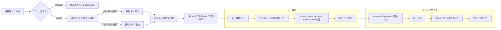
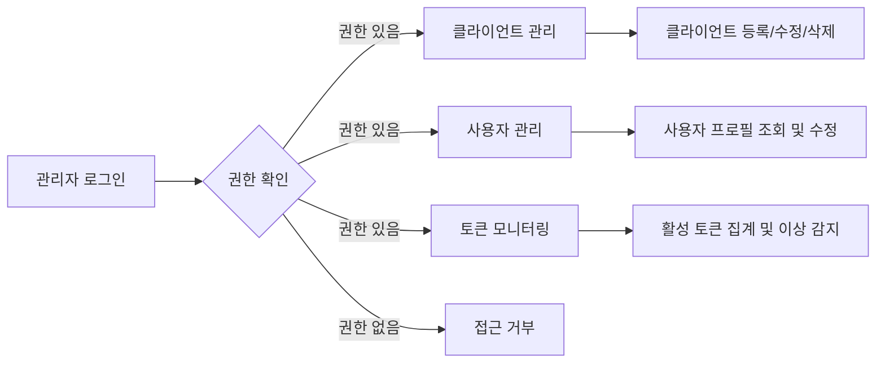
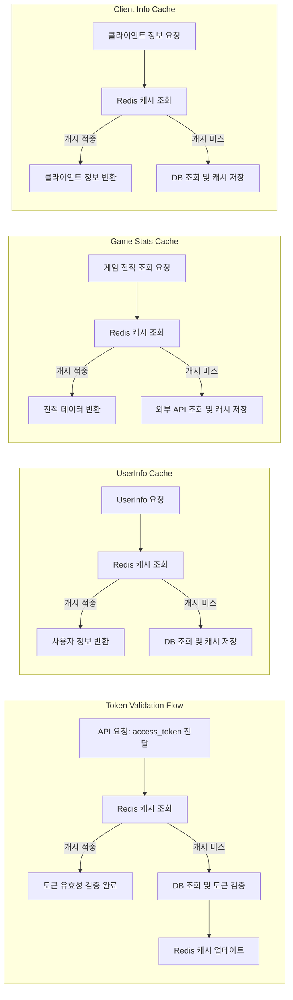

# OAuth 서버 비즈니스 요구사항 및 기능 정의

## 1. 서비스 개요 및 비즈니스 모델

### 1.1 서비스 개요
- THE OAuth 서버 SHALL OAuth 2.0 및 OpenID Connect Core 1.0 사양을 완전 준수한다.
- THE 서버 SHALL opaque token 방식(access_token, refresh_token)을 사용하며, UUID, CUID, ULID 중 적절한 식별자를 사용한다.
- THE 서버 SHALL 자체 이메일 로그인 및 네이버, 다음, 애플, 구글 소셜 로그인을 지원하고, 사용자 이메일을 키로 하여 계정 통합이 이루어진다.
- THE 서버 SHALL 외부 OAuth 서버도 클라이언트처럼 이 서버를 이용하여 인증할 수 있게 한다.
- THE 서버 SHALL 사용자 프로필에 게임 계정(스팀 배틀그라운드, 카카오 배틀그라운드, 롤) 플레이어명 등록을 지원하며, 공식 API를 통해 시즌별 전적 조회 기능을 제공한다.
- THE 서버 SHALL Redis를 활용해 토큰, 사용자정보, 클라이언트 정보, 게임 API 결과 캐싱을 수행한다.
- THE 서버 SHALL 포인트 시스템 및 포인트 지급 쿠폰 기능을 갖춘다.

### 1.2 비즈니스 모델
- THE 서비스 SHALL 빠른 OAuth 연동(5분 내)을 통한 개발자 확보 및 사용자 증가를 목표로 한다.
- THE 서비스 SHALL API 사용량 기반 과금 모델 및 프리미엄 관리 기능 제공으로 수익화가 가능하다.
- THE 서비스 SHALL 보안성을 최우선으로 하여 장기적 운영과 확장성을 보장한다.

## 2. 사용자 역할 및 인증 흐름

### 2.1 사용자 역할
| 역할      | 설명                                   | 권한 및 기능                             |
|---------|----------------------------------|------------------------------------|
| guest   | 미인증 사용자                         | 로그인, 회원가입, 공용 정보 조회         |
| member  | 인증 사용자                         | 프로필 관리, OAuth 토큰 발급, 소셜 로그인 |
| admin   | 시스템 관리자                       | 사용자 및 클라이언트 관리, 감사 로그 조회 |
| developer | 개발자 및 API 클라이언트 관리      | 클라이언트 등록, SDK 생성, API 테스트    |

### 2.2 인증 흐름
- WHEN 사용자가 /oauth/authorize에 요청하면 THE 시스템 SHALL 로그인 상태를 확인한다.
- IF 미인증 사용자이면 THEN THE 시스템 SHALL 로그인 페이지로 리다이렉트한다.
- IF 클라이언트가 신뢰 클라이언트이면 THEN THE 시스템 SHALL 자동 동의 처리하여 동의 페이지를 건너뛴다.
- THE 시스템 SHALL 인가 코드를 생성 및 저장하며, 외부에 인가 코드는 알 수 없다.
- WHEN /oauth/token 요청 시 THE 시스템 SHALL 인가 코드와 클라이언트 인증을 검증 후 opaque token 발급한다.

## 3. 기능 요구사항

### 3.1 OAuth 인증 및 토큰 흐름
- THE 시스템 SHALL GET /oauth/authorize 엔드포인트를 통해 인가 코드를 발급한다.
- THE 시스템 SHALL POST /oauth/token 엔드포인트를 통해 access_token, id_token, refresh_token (opaque token) 발급한다.
- THE 시스템 SHALL GET /oidc/userinfo 엔드포인트에서 Bearer 토큰 검증 후 스코프에 따른 사용자 정보를 반환한다.

### 3.2 사용자 및 클라이언트 관리
- THE 시스템 SHALL User 테이블에는 email, email_verified, picture 필드를 포함한다.
- THE 클라이언트 정보는 OAuthClient 테이블에 logo_url, is_trusted 필드를 포함하며, deletedAt 컬럼으로 soft delete를 지원한다.
- THE 시스템 SHALL 빈번한 변경 프로필 필드(nickname, 프로필사진 등)는 별도 UserProfile 테이블로 분리 관리한다.

### 3.3 포인트 및 쿠폰 시스템
- THE 시스템 SHALL UserPoint 및 UserPointHistory 테이블로 포인트 잔액 및 변동 이력을 관리한다.
- THE 시스템 SHALL 쿠폰 사용시 포인트가 충전되며, 쿠폰은 PointCoupon, UserPointCoupon 테이블로 관리한다.

### 3.4 소셜 로그인 및 외부 OAuth 연동
- THE 시스템 SHALL 네이버, 다음, 애플, 구글 소셜 로그인 연동을 지원한다.
- THE 사용자 이메일이 동일하면 소셜 로그인 및 자체 가입 계정을 통합한다.
- THE 시스템 SHALL 자체 OAuth 서버를 외부 서비스가 클라이언트로 등록하여 인증에 사용할 수 있게 한다.

### 3.5 게임 전적 조회
- THE 시스템 SHALL 사용자 프로필에 스팀 배틀그라운드, 카카오 배틀그라운드, 롤 플레이어명 등록 페이지를 제공한다.
- THE 시스템 SHALL 공식 게임 API를 통해 시즌별 전적을 조회하고 Redis 캐싱으로 성능을 향상시킨다.

### 3.6 Redis 캐싱 적용
- THE 시스템 SHALL Redis를 통해 토큰 검증, 사용자 정보, 클라이언트 정보, 게임 API 통계 데이터를 캐싱한다.
- THE Redis 캐시 TTL 정책은 토큰 만료, 데이터 신선도 기준으로 적용한다.

## 4. 보안 및 감사

- THE 시스템 SHALL HTTPS를 프로덕션 환경에서 강제한다.
- THE 시스템 SHALL PKCE(S256) 지원 및 공개 클라이언트 강제로 구현한다.
- THE 시스템 SHALL IP별, 클라이언트별 Rate Limiting을 실시한다.
- THE 시스템 SHALL 상태(state) 파라미터 검증으로 CSRF 공격 방지한다.
- THE 시스템 SHALL 감사 로그에 인증, 토큰 발급, 관리 기능 변경 이력을 기록한다.
- THE 시스템 SHALL 민감정보를 로그에 저장하지 않는다.

## 5. 운영 및 관리 기능

- THE 시스템 SHALL 관리자가 클라이언트, 사용자, 토큰 모니터링을 할 수 있는 UI를 제공한다.
- THE 시스템 SHALL 클라이언트 등록, 수정, 삭제 및 시크릿 재생성 기능 제공한다.
- THE 시스템 SHALL 사용자 목록, 프로필 수정, 검색 기능 구현한다.
- THE 시스템 SHALL 활성 토큰 집계 및 최근 로그인 기록 모니터링 기능을 제공한다.

## 6. 배포 및 환경 설정

- THE 시스템 SHALL Node.js 18+, PostgreSQL 13+ 환경에서 동작한다.
- THE 시스템 SHALL 환경변수 5개 필수설정(DATABASE_URL, JWT_SECRET, ISSUER_URL, PORT, NODE_ENV)을 요구한다.
- THE 시스템 SHALL Docker-compose와 프로덕션 Dockerfile 제공한다.
- THE 시스템 SHALL 개발 서버 명령어는 pnpm 기반으로 일원화 한다.

## 7. 성능 및 테스트 요구사항

- THE 시스템 SHALL 인가 코드, 토큰 발급 응답 시간을 100ms 이내로 유지한다.
- THE 시스템 SHALL 100동시 요청 이상을 안정적으로 처리한다.
- THE 시스템 SHALL OAuth 플로우 및 UserInfo API 동작을 자동화 테스트한다.
- THE Playwright를 활용해 프론트엔드 로그인, 동의, 에러 페이지 테스트를 수행한다.

## 8. 에러 처리

- IF 유효하지 않은 인가 코드가 사용되면 THEN THE 시스템 SHALL 한국어 에러 메시지를 반환하고 해결 안내를 제공한다.
- IF 클라이언트 인증 실패 시 THEN THE 시스템 SHALL 명확한 에러 메시지를 제공한다.
- IF 토큰 만료 혹은 권한 부족 시 THEN THE 시스템 SHALL HTTP 상태 코드와 한글 메시지를 반환한다.

---

## Mermaid Diagram: OAuth 인증 흐름

## Mermaid Diagram: 관리 기능 흐름

## Mermaid Diagram: Redis 캐시 적용 구조

## Summary

- The OAuth server SHALL be a fully OAuth 2.0 and OpenID Connect compliant service with opaque token issuance.
- Social login SHALL unify accounts by email.
- Redis SHALL be extensively used for caching tokens, user and client data, and external game stats.
- Soft deletion applied except for User table.
- Frequent profile updates SHALL be stored in separate profile tables.
- Administrative functions SHALL allow client and user management, token monitoring, and auditing.
- Korean error messages with solutions SHALL improve developer and user experiences.

---

> This document provides business requirements only. All technical implementation decisions belong to developers. Developers have full autonomy over architecture, APIs, and database design. The document describes WHAT the system should do, not HOW to build it.