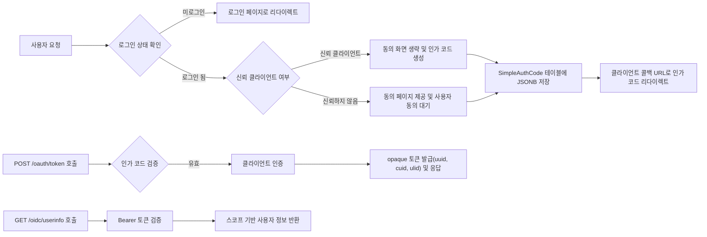

# OAuth 서버 전체 요구사항 분석 및 기능 정의

## 1. 서비스 개요 및 비즈니스 모델

### 1.1 서비스 목적

THE OAuth 서버 SHALL 네이버 수준의 빠르고 간단한 OAuth 2.0 및 OpenID Connect (OIDC) 인증 인가 서버를 개발한다. THE 서버 SHALL 5분 내 OAuth 연동이 완료되도록 개발자 친화적인 인터페이스를 제공한다. THE 서버 SHALL OAuth 2.0 및 OIDC Core 1.0 표준을 완전히 준수한다.

### 1.2 비즈니스 전략

THE 서비스 SHALL OAuth 인증 및 인가를 간소화하여 다양한 서비스 제공자와 클라이언트가 안전하게 사용자 인증을 할 수 있도록 한다. THE 서비스 SHALL 점진적 확장 기능을 제공하여 기본 MVP에서부터 보안 강화 및 고급 기능까지 제공한다. THE 서비스 SHALL SDK 자동 생성 및 라이브 API 테스터 등 개발자 생산성 도구를 제공한다.

### 1.3 성공 기준

THE 서버 SHALL 개발자가 환경변수만으로 동작하며 5분 내 OAuth 연동을 완료할 수 있게 한다. THE 서버 SHALL 모든 주요 OAuth 요구사항 및 OIDC 필수 클레임을 지원한다. THE 시스템 SHALL 100ms 미만의 응답 속도를 유지한다. THE 서버 SHALL 한글 친화적 에러 메시지와 함께 문제 해결 가이드를 제공한다.

## 2. 사용자 역할 및 인증 구조

THE 시스템 SHALL 다음 사용자 역할을 지원한다.

| 역할       | 설명                              | 권한 및 기능                             |
|------------|---------------------------------|----------------------------------------|
| guest      | 인증되지 않은 사용자              | 로그인, 회원가입, 에러 페이지 접근     |
| member     | 자체 이메일 또는 소셜 로그인한 사용자 | 프로필 관리, OAuth 토큰 요청 및 갱신  |
| admin      | 시스템 관리자                    | 사용자 및 클라이언트 관리, 감사 로그 조회 |
| developer  | API 클라이언트 및 OAuth 개발자    | 클라이언트 등록, SDK 생성, API 테스트  |

THE 시스템 SHALL 사용자 로그인 시 역할에 따른 적절한 권한을 부여한다. THE 시스템 SHALL 안전한 세션 및 토큰 관리를 실시한다.

## 3. OAuth 인증 및 인가 플로우

### 3.1 인가 요청

WHEN OAuth 클라이언트가 GET /oauth/authorize 요청을 하면, THE 시스템 SHALL 로그인 상태를 확인한다. IF 로그인이 되어있지 않으면, THEN THE 시스템 SHALL 로그인 페이지로 리다이렉트한다. WHEN 클라이언트가 is_trusted로 설정되어 있으면, THEN THE 시스템 SHALL 동의 화면을 생략하고 자동 승인한다. ELSE, THEN THE 시스템 SHALL 동의 페이지를 표시하고, 요청된 스코프별 내용을 친절히 안내한다.

WHEN 사용자가 동의를 하면, THE 시스템 SHALL 인가 코드를 생성해 JSONB 형식으로 SimpleAuthCode 테이블에 저장한다. THE 시스템 SHALL 클라이언트의 redirect_uri로 인가 코드와 함께 리다이렉트한다.

### 3.2 토큰 요청

WHEN POST /oauth/token 요청이 들어오면, THE 시스템 SHALL 인가 코드 유효성과 클라이언트 인증을 검증한다. THE 시스템 SHALL opaque tokens 형태를 사용하며 UUID, CUID, ULID 키를 발급한다. THE 시스템 SHALL access_token, id_token(표준 클레임 포함), refresh_token을 발급한다.

### 3.3 UserInfo 엔드포인트

WHEN GET /oidc/userinfo 요청이 있으면, THE 시스템 SHALL Bearer token을 검증한다. THE 시스템 SHALL 스코프에 따라 필터링된 사용자 정보를 반환한다.

## 4. 토큰 관리 및 발급 정책

THE 시스템 SHALL 토큰 관련 모든 정보를 DB에 저장하되, Redis 캐싱을 통해 조회 성능을 최적화한다. THE 시스템 SHALL refresh token grant와 token revocation 기능을 지원한다.

## 5. 사용자 및 클라이언트 관리

THE 시스템 SHALL 사용자 정보를 자체 이메일과 소셜 로그인의 이메일 기준으로 통합 관리한다. THE 시스템 SHALL 빈번히 변경하는 프로필 정보(닉네임, 프로필사진 등)를 별도 테이블로 분리 관리한다. THE 시스템 SHALL 클라이언트 등록, 수정, 삭제 관리 및 soft delete(deletedAt 컬럼 포함) 기능을 제공한다.

## 6. 소셜 로그인 및 외부 OAuth 연동

THE 시스템 SHALL 네이버, 다음, 애플, 구글 등 주요 소셜 로그인 공급자 연동을 지원한다. THE 시스템 SHALL 외부 OAuth 서버도 클라이언트로 등록하여 내 OAuth 서버를 인증 공급자로 사용할 수 있게 한다. THE 소셜 로그인 시 이메일을 기반으로 기존 사용자와 계정 통합을 수행한다.

## 7. 게임 전적 데이터 연동 및 캐싱

THE 시스템 SHALL 사용자 프로필에 스팀 배틀그라운드, 카카오 배틀그라운드, 롤 플레이어명을 등록할 수 있게 한다. THE 시스템 SHALL 공식 API를 통해 시즌별 배틀그라운드 및 롤 전적 데이터를 조회하고, Redis 캐시로 저장하여 응답 속도 및 API 부하를 최적화한다.

## 8. 포인트 및 쿠폰 관리

THE 시스템 SHALL 사용자별 포인트 잔액을 관리하며, 아이콘 구매 등에 사용할 수 있다. THE 시스템 SHALL 포인트 적립 및 사용 내역을 기록한다. THE 시스템 SHALL 포인트 지급 쿠폰 기능을 포함하며, 쿠폰 코드별 유효성 검증 및 사용 이력 관리를 제공한다.

## 9. Redis 캐싱 아키텍처 및 정책

THE Redis SHALL 토큰 검증, 사용자 정보, 클라이언트 정보, 게임 전적 데이터 등에 광범위하게 사용된다. THE Redis 캐시에는 각각 적절한 TTL을 설정하고, 캐시 미스 시 DB 또는 외부 API를 사용하는 fallback 정책이 적용된다.

## 10. 보안 정책 및 감사 로그

THE 시스템 SHALL HTTPS를 프로덕션에서 필수화한다. THE 시스템 SHALL PKCE를 지원하며, 공개 클라이언트에 대해선 강제한다. THE 시스템 SHALL IP 및 클라이언트별 rate limiting 정책을 적용한다. THE 시스템 SHALL 감사 로깅을 통해 중요한 인증 및 관리 활동을 기록하되, 민감 정보는 로그에서 제외한다.

## 11. 관리 기능

THE 시스템 SHALL 관리자용 클라이언트, 사용자, 토큰 관리 페이지를 제공하며, 클라이언트 시크릿 재생성, 사용자 검색, 토큰 활성화 모니터링 기능을 포함한다.

## 12. 개발 환경 및 배포

THE 개발자는 Node.js 18 이상, PostgreSQL 13 이상 환경을 구성하며, pnpm 패키지 매니저를 사용한다. docker-compose 기반 개발 환경과 프로덕션용 Dockerfile 및 환경변수 관리 가이드를 제공한다.

## 13. 테스트 및 성능 요구사항

THE 시스템 SHALL OAuth 플로우 전체를 100ms 미만 응답 속도로 처리하며, 100 동시 요청을 지원한다. THE 시스템 SHALL Playwright 기반 프론트엔드 E2E 테스트를 포함하여 주요 사용자 흐름을 검증한다.

## 14. 성공 기준 및 문서화

THE 시스템 SHALL 개발자가 5분 내 OAuth 연동을 완료 가능하며, 모든 표준 요구사항을 준수한다. THE 시스템 SHALL 한글 친화적 에러 메시지를 제공하고, 라이브 테스트 도구로 즉시 검증 가능하다.

---

## Mermaid Diagram: OAuth 인가 코드 플로우

---

> 본 요구사항 문서는 OAuth 서버 구현에 필요한 비즈니스 요구사항만을 포함하며, 기술 구현 세부사항(아키텍처, API 명세, DB 설계 등)은 개발자의 재량에 맡긴다.