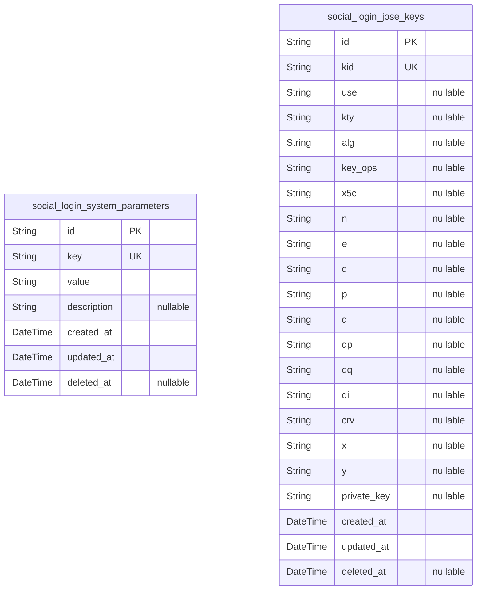
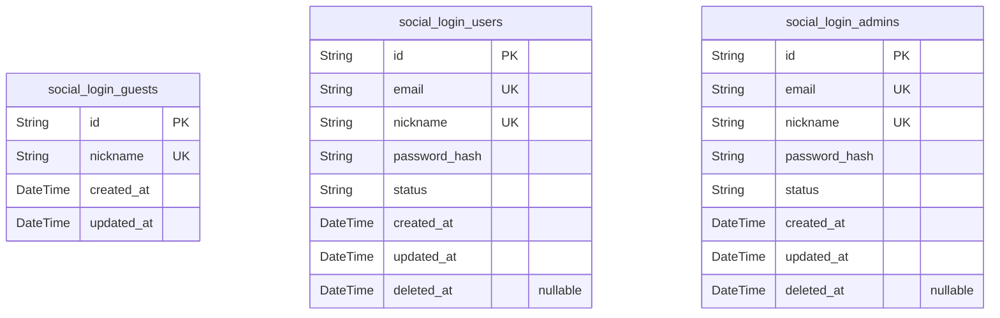
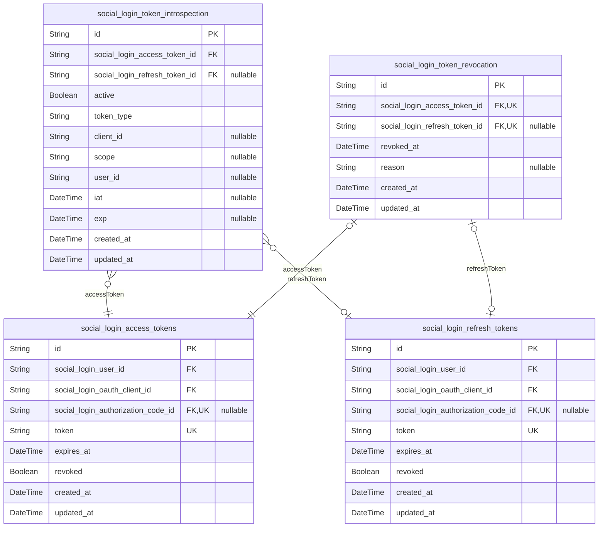
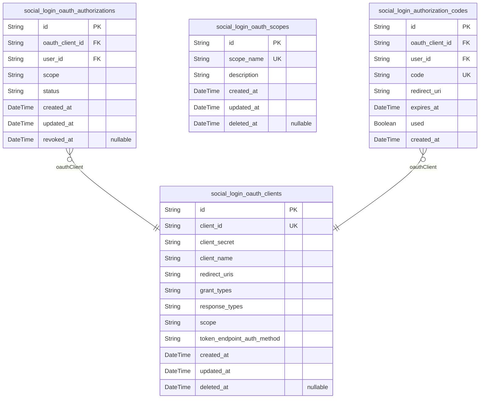
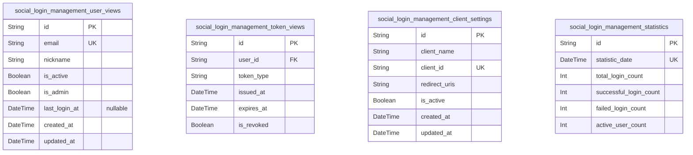

# Prisma Markdown

> Generated by [`prisma-markdown`](https://github.com/samchon/prisma-markdown)

- [Systematic](#systematic)
- [Actors](#actors)
- [Auth](#auth)
- [OAuthClients](#oauthclients)
- [Management](#management)

## Systematic

### `social_login_system_parameters`

System-wide configuration parameters for the SocialLogin service. This
table stores key-value pairs representing configurable options that
govern system behavior. These parameters are essential for operations and
can be updated by administrators. It includes audit timestamps and
supports soft deletion for safe cleanup.

Properties as follows:

- `id`: Primary Key.
- `key`: Unique identifier for the system parameter.
- `value`: Value associated with the system parameter key.
- `description`: Detailed explanation of the system parameter's purpose and usage.
- `created_at`: Timestamp when this system parameter was created.
- `updated_at`: Timestamp when this system parameter was last updated.
- `deleted_at`: Timestamp marking soft deletion of this system parameter, if applicable.

### `social_login_jose_keys`

Storage of JOSE (JSON Object Signing and Encryption) cryptographic keys
used for securing tokens and communications in the SocialLogin service.
Each key record includes metadata, public and private key material, key
status, and usage contexts. This table is critical for token signing and
verification workflows.

Properties as follows:

- `id`: Primary Key.
- `kid`: Key ID - a unique identifier for the JOSE key.
- `use`
  > Intended usage of the key (e.g., 'sig' for signature, 'enc' for
  > encryption).
- `kty`: Key type (e.g., RSA, EC).
- `alg`: Algorithm associated with the key (e.g., RS256, ES256).
- `key_ops`: Key operations this key can perform, e.g., sign, verify.
- `x5c`: X.509 certificate chain associated with the key in base64 encoding.
- `n`: RSA public modulus.
- `e`: RSA public exponent.
- `d`: RSA private exponent.
- `p`: RSA private prime p.
- `q`: RSA private prime q.
- `dp`: RSA exponent 1.
- `dq`: RSA exponent 2.
- `qi`: RSA coefficient.
- `crv`: Elliptic curve used.
- `x`: Elliptic curve x coordinate.
- `y`: Elliptic curve y coordinate.
- `private_key`: Private key material if stored separately.
- `created_at`: Timestamp when this JOSE key record was created.
- `updated_at`: Timestamp when this JOSE key record was last updated.
- `deleted_at`: Soft deletion timestamp, marks when the key was logically removed.

## Actors

### `social_login_guests`

Guest users for temporary session identification and minimal tracking
within the social login system. Guests do not have permanent credentials
or authentication but are distinguished by unique nicknames for ephemeral
identification.

Properties as follows:

- `id`: Primary Key.
- `nickname`: Guest user's temporary nickname used for display and identification.
- `created_at`: Record creation timestamp.
- `updated_at`: Record last update timestamp.

### `social_login_users`

Registered users authenticated via social login, requiring unique email
and nickname. Users have password hash for authentication, status
indicating lifecycle, and support soft deletion.

Properties as follows:

- `id`: Primary Key.
- `email`: Unique email address for user login and communication.
- `nickname`: Unique display nickname for the user.
- `password_hash`: Hashed password for user authentication.
- `status`: Account lifecycle status, e.g., active, suspended, withdrawn.
- `created_at`: Record creation timestamp.
- `updated_at`: Record last update timestamp.
- `deleted_at`: Soft delete timestamp for logical deletion without physical removal.

### `social_login_admins`

Administrator accounts with elevated privileges in the social login
system. Admins have unique email and nickname, password hash for
authentication, status lifecycle, and soft delete capability.

Properties as follows:

- `id`: Primary Key.
- `email`: Unique admin email address for authentication and notifications.
- `nickname`: Admin's unique display nickname.
- `password_hash`: Hashed password for admin authentication.
- `status`: Account lifecycle status such as active, suspended, or disabled.
- `created_at`: Record creation timestamp.
- `updated_at`: Record last update timestamp.
- `deleted_at`: Soft delete timestamp to mark logical deletion.

## Auth

### `social_login_access_tokens`

Access tokens represent opaque credentials issued to users upon
authentication as part of OAuth 2.0/OpenID Connect flows. Each token is
linked to a user, OAuth client, and optionally an authorization code.
Tokens have expiry and revocation status. This table is crucial for
managing user sessions and API access authorization.

Properties as follows:

- `id`: Primary Key.
- `social_login_user_id`: Belonged user's [social_login_users.id](#social_login_users).
- `social_login_oauth_client_id`
  > OAuth client that requested this token {@link
  > social_login_oauth_clients.id}.
- `social_login_authorization_code_id`
  > Authorization code linked to this access token {@link
  > social_login_authorization_codes.id}.
- `token`: Opaque access token string issued to the client for authentication.
- `expires_at`: Expiration date and time of the access token in ISO 8601 format.
- `revoked`: Flag indicating whether this access token has been revoked.
- `created_at`: Timestamp when this access token was created.
- `updated_at`: Timestamp when this access token was last updated.

### `social_login_refresh_tokens`

Refresh tokens allow renewing access tokens without re-authenticating the
user. Each refresh token is linked to a user, OAuth client, and
optionally an authorization code. Includes token string, expiration,
revocation status, and timestamps. Supports secure OAuth 2.0 session
extension.

Properties as follows:

- `id`: Primary Key.
- `social_login_user_id`: Belonged user's [social_login_users.id](#social_login_users).
- `social_login_oauth_client_id`
  > OAuth client that owns this refresh token {@link
  > social_login_oauth_clients.id}.
- `social_login_authorization_code_id`
  > Authorization code linked to this refresh token {@link
  > social_login_authorization_codes.id}.
- `token`: Opaque refresh token string issued to the client.
- `expires_at`: Expiration datetime of the refresh token in ISO 8601 format.
- `revoked`: Flag indicating whether this refresh token is revoked.
- `created_at`: Timestamp when this refresh token was created.
- `updated_at`: Timestamp when this refresh token was last updated.

### `social_login_token_introspection`

Records each request to introspect access or refresh tokens for
validation and auditing per OAuth 2.0 token introspection RFC. Tracks
token active status, metadata, scope, and associated client and user
identifiers to support operational monitoring and security audits.

Properties as follows:

- `id`: Primary Key.
- `social_login_access_token_id`: Referenced access token [social_login_access_tokens.id](#social_login_access_tokens).
- `social_login_refresh_token_id`: Referenced refresh token [social_login_refresh_tokens.id](#social_login_refresh_tokens).
- `active`: Indicates if the token is currently active according to introspection.
- `token_type`: Denotes whether token is access_token or refresh_token.
- `client_id`: Identifier of the client requesting introspection.
- `scope`: Scope string of token.
- `user_id`: User identifier associated with token.
- `iat`: Issued at timestamp claim in the token.
- `exp`: Expiry timestamp claim in the token.
- `created_at`: Creation time of this introspection record.
- `updated_at`: Last update time of this introspection record.

### `social_login_token_revocation`

Tracks revocation events for access and refresh tokens marking them as
invalidated due to logout, user action, or security issues. Maintains
token blacklist for enforcing immediate access denial.

Properties as follows:

- `id`: Primary Key.
- `social_login_access_token_id`: Revoked access token reference [social_login_access_tokens.id](#social_login_access_tokens).
- `social_login_refresh_token_id`: Revoked refresh token reference [social_login_refresh_tokens.id](#social_login_refresh_tokens).
- `revoked_at`: Datetime when revocation occurred.
- `reason`: Textual reason for token revocation, if provided.
- `created_at`: Timestamp when this revocation record was created.
- `updated_at`: Timestamp when this revocation record was last updated.

## OAuthClients

### `social_login_oauth_clients`

OAuth client registration information representing third-party
applications authorized to interact with the social login service.
Contains client identification, secret, redirect URIs, scope definitions,
and management metadata for life cycle control. Supports registration,
update, and status management for OAuth clients.

Properties as follows:

- `id`: Primary Key.
- `client_id`: Unique client identifier (client_id) issued to third-party OAuth clients.
- `client_secret`: Confidential client secret used for authenticating the OAuth client.
- `client_name`: Human-readable name of the OAuth client.
- `redirect_uris`
  > Comma-separated list of authorized redirect URIs for OAuth client
  > callbacks.
- `grant_types`
  > Allowed OAuth 2.0 grant types for this client (authorization_code,
  > refresh_token, etc.).
- `response_types`: Supported OAuth 2.0 response types (code, token, id_token).
- `scope`: Space-separated list of scopes this client is allowed to request.
- `token_endpoint_auth_method`
  > Client authentication method for token endpoint (client_secret_basic,
  > none, private_key_jwt).
- `created_at`: Timestamp when the OAuth client registration was created.
- `updated_at`: Timestamp when the OAuth client registration was last updated.
- `deleted_at`
  > Soft deletion timestamp to mark the client as deleted without hard
  > removal.

### `social_login_oauth_authorizations`

Represents consents and authorizations granted by users or admins to
OAuth clients for access scopes. This entity tracks which user authorized
which client with which scopes and maintains revocation status and
timestamps.

Properties as follows:

- `id`: Primary Key.
- `oauth_client_id`: Authorized OAuth client's [social_login_oauth_clients.id](#social_login_oauth_clients)
- `user_id`: User who granted authorization [social_login_users.id](#social_login_users)
- `scope`: Space-separated list of scopes authorized by the user for the client.
- `status`: Authorization status (active, revoked, expired).
- `created_at`: Timestamp when the authorization was granted.
- `updated_at`: Timestamp when the authorization was last updated.
- `revoked_at`: Timestamp when the authorization was revoked, if applicable.

### `social_login_oauth_scopes`

Defines OAuth scopes available in the social login system, specifying the
scope name and description to control permissions that clients can
request.

Properties as follows:

- `id`: Primary Key.
- `scope_name`: Name of the OAuth scope (e.g., openid, email, profile).
- `description`: Detailed description of the scope purpose and usage.
- `created_at`: Timestamp when the scope was created.
- `updated_at`: Timestamp when the scope description was last updated.
- `deleted_at`: Soft deletion timestamp to mark scope as deleted without removal.

### `social_login_authorization_codes`

Authorization codes issued during the OAuth authorization code flow,
uniquely linked to OAuth clients and users, with expiration and usage
status tracking. These codes are exchanged for access tokens.

Properties as follows:

- `id`: Primary Key.
- `oauth_client_id`
  > OAuth client associated with this authorization code {@link
  > social_login_oauth_clients.id}
- `user_id`: User who requested authorization [social_login_users.id](#social_login_users)
- `code`: Authorization code string issued during authorization flow.
- `redirect_uri`: Redirect URI used during authorization request.
- `expires_at`: Expiration timestamp after which the code is invalid.
- `used`: Flag indicating whether the authorization code has been used.
- `created_at`: Timestamp when the authorization code was created.

## Management

### `social_login_management_user_views`

View aggregated user information for administrative management in the
social login system. Includes essential identifiers, status flags, and
timestamps relevant to user administration and monitoring. Relates to
underlying user and guest tables for detailed linkage.

Properties as follows:

- `id`: Primary Key.
- `email`: User email address, uniquely identifying the user for login and contact.
- `nickname`: User chosen nickname visible in administrative view.
- `is_active`: Flag indicating if the user account is currently active.
- `is_admin`: Flag indicating if the user has administrative privileges.
- `last_login_at`: Timestamp of the last successful login by the user.
- `created_at`: Timestamp when the user account was created.
- `updated_at`: Timestamp of the last update to the user account information.

### `social_login_management_token_views`

Consolidated view of access and refresh token information for management
console oversight. Includes token status, expiration, associated user
reference, and audit timestamps for administrative token control and
monitoring.

Properties as follows:

- `id`: Primary Key.
- `user_id`: Reference to the user's [social_login_users.id](#social_login_users) who owns this token.
- `token_type`: Indicates token type, e.g., access or refresh.
- `issued_at`: Timestamp when the token was issued.
- `expires_at`: Timestamp when the token expires.
- `is_revoked`: Flag indicating if the token has been revoked and is no longer valid.

### `social_login_management_client_settings`

Management configuration settings of OAuth clients used in the social
login service. Includes client identifiers, redirect URIs, status flags,
and timestamps relevant for administrative control and auditing purposes.

Properties as follows:

- `id`: Primary Key.
- `client_name`: Human-readable OAuth client name for identification.
- `client_id`: Unique client identifier used in OAuth flows.
- `redirect_uris`: JSON formatted string listing allowed redirect URIs for the client.
- `is_active`: Flag indicating whether this client configuration is currently active.
- `created_at`: Timestamp when the client was registered.
- `updated_at`: Timestamp of the last update to client settings.

### `social_login_management_statistics`

Aggregated statistics data for monitoring social login system usage and
performance over time. Supports administrative reporting and trend
analysis.

Properties as follows:

- `id`: Primary Key.
- `statistic_date`: The date for which these aggregated statistics are recorded.
- `total_login_count`: Total number of login attempts made on the given date.
- `successful_login_count`: Number of successful login attempts on the given date.
- `failed_login_count`: Number of failed login attempts recorded for the date.
- `active_user_count`: Number of active users on the given date.
