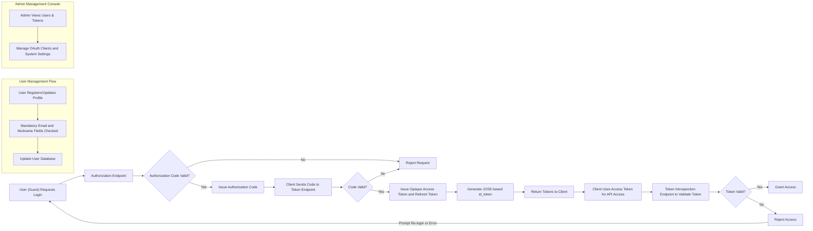

# SocialLogin OAuth 2.0 + OpenID Connect Service Business Requirements

## 1. Business Model

### Why This Service Exists
The SocialLogin service addresses the need for a secure, standardized, and convenient authentication backend using OAuth 2.0 and OpenID Connect (OIDC), supporting both web and mobile applications. It enables seamless third-party login integration, filling market demand for reusable, privacy-conscious authentication infrastructure.

### Business Strategy
The service targets developers and organizations requiring robust social login capabilities without building custom OAuth/OIDC servers. Monetization may include subscription plans for API access or usage-based fees. Its growth depends on excellent developer documentation, reliability, and ease of integration.

### Key Features Supporting Business Model
- OAuth 2.0 authorization code flow with OIDC extensions.
- Support for both web and mobile app clients.
- Mandatory user attributes: email and nickname.
- Use of opaque access tokens and refresh tokens.
- id_token generation following JOSE standards.
- Full user account lifecycle management.
- Developer-oriented documentation (README, Swagger, class docs).
- Admin management console for users, tokens, and clients.

### Success Metrics
- Authentication success rates.
- Token issuance and validation latency (<2 seconds).
- User account management efficiency.
- Service uptime and reliability.

## 2. User Roles and Authentication

### 2.1 User Roles
- **Guest:** Unauthenticated users with access to public resources and registration/login operations.
- **User:** Authenticated individuals who completed login with mandatory email and nickname; can manage their own profile.
- **Admin:** Administrators with privileges for user management, token control, OAuth client settings, and system monitoring.

### 2.2 Authentication Flows
- Users authenticate via OAuth 2.0 authorization code grant with OIDC.
- Upon successful authentication, id_tokens are created using JOSE.
- Access and refresh tokens are issued as opaque tokens.

## 3. Functional Requirements

### 3.1 OAuth 2.0 + OIDC Login Flow
- WHEN a client initiates an authentication request, THE system SHALL support OAuth 2.0 authorization code flow compliant with OIDC.
- WHEN authentication succeeds, THE system SHALL issue an id_token compliant with JOSE standards including user claims.

### 3.2 Token Management
- WHEN a user logs in, THE system SHALL issue opaque access and refresh tokens with configurable expiration.
- THE system SHALL provide endpoints for token introspection and revocation.

### 3.3 User Account Management
- THE system SHALL require email and nickname as mandatory fields.
- THE system SHALL allow users to register, update their profile (nickname), and delete their account.
- THE system SHALL provide an endpoint for users to retrieve their current profile information.

### 3.4 API Endpoints
- POST /auth/authorize : Handle OAuth 2.0 authorization requests.
- POST /auth/token : Exchange authorization code or refresh token for access tokens.
- POST /auth/introspect : Validate tokens.
- POST /auth/revoke : Revoke tokens.
- GET /auth/jwks : Provide JOSE public keys.
- POST /users : User registration.
- GET /users/me : Retrieve authenticated user profile.
- PATCH /users/me : Update user profile.
- DELETE /users/me : Delete user account.
- GET /docs/swagger.json : API specification.
- GET /docs : Interactive API documentation.
- GET /health : Service health check.

### 3.5 Management Console
- User management: Search, view, update nicknames, activate/deactivate, force delete.
- Token management: List, introspect, revoke tokens.
- OAuth client management: Register/update clients, configure redirect URIs and scopes.
- Monitoring: Login statistics, error logs.
- Access to developer documentation.

## 4. Business Rules and Validation

- Email and nickname are mandatory and unique per user.
- Tokens are opaque and stored securely.
- id_token complies with JOSE cryptographic standards.
- User sessions expire according to token policies.
- User deletion removes user data and revokes tokens.

## 5. Error Handling and Recovery

- IF invalid credentials are submitted, THEN the system SHALL respond with HTTP 401 Unauthorized error.
- IF access tokens expire or are invalid, THEN API calls SHALL return HTTP 401 with detailed error.
- IF mandatory fields are missing during user registration or update, THEN the system SHALL reject with HTTP 400 Bad Request.

## 6. Performance Requirements

- Token issuance and validation SHALL complete within 2 seconds in typical load conditions.
- User information queries SHALL respond within 1 second.

## 7. Security Considerations

- All endpoints SHALL enforce HTTPS/TLS.
- Tokens SHALL be opaque, preventing client-side introspection.
- id_tokens SHALL be cryptographically signed using JOSE.
- Admin actions SHALL require authorization and be logged for audit.

## 8. Diagrams and Workflows

## 9. Summary and Developer Guidelines

- This document specifies business requirements only.
- Developers have full autonomy for implementation details, including APIs, architecture, and database design.
- The document describes WHAT to build, not HOW to build it.

---

This document provides business requirements only. All technical implementation decisions belong to developers. Developers have full autonomy over architecture, APIs, and database design. The document describes WHAT the system should do, not HOW to build it.
