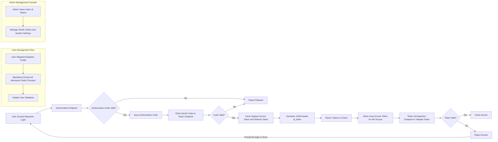

# Social Login Service - Requirement Analysis Report

## 1. Business Model

### Why This Service Exists
The Social Login service addresses the growing need for secure and convenient authentication by enabling third-party login via OAuth 2.0 combined with OpenID Connect (OIDC) protocols. It fills the market gap where organizations want to provide seamless, standards-compliant authentication to both web and mobile app clients while maintaining user privacy and security.

### Business Strategy
The service aims to support developers by offering a reusable social login backend that handles authentication flows, token management, user identity extraction, and administrative oversight. Monetization strategies could include service subscription plans or integration with larger platforms.

### Key Features Supporting Business Model
- OAuth 2.0 and OIDC based authentication
- Support for web and app clients
- Mandatory collection of email and nickname
- Use of opaque access and refresh tokens
- id_token generation using JOSE for secure identity tokens
- User account management (registration, update, withdrawal)
- Comprehensive developer documentation
- Management console for admin tasks

### Success Metrics
- Authentication success rate
- Token issuance latency (target <2 seconds)
- User registration and management efficiency
- Uptime and availability

## 2. User Roles and Authentication

### User Roles
- **Guest:** Unauthenticated users who can access public resources, register, or login.
- **User:** Authenticated users who use the social login system, provide mandatory email and nickname, and manage their account.
- **Admin:** Administrators with elevated permissions to manage users, tokens, OAuth clients, and system settings.

### Authentication Flow
- WHEN a guest attempts to register or perform social login, THE system SHALL authenticate via OAuth 2.0 and OpenID Connect protocols.
- THE system SHALL enforce collection and verification of email and nickname during the first login or registration.
- WHEN authentication is successful, THE system SHALL issue an opaque access token and a refresh token.
- THE system SHALL generate an id_token using JOSE for user identity claims.
- THE system SHALL provide endpoint(s) for token introspection to validate opaque tokens.

## 3. Functional Requirements

### 3.1 OAuth 2.0 and OIDC Login Flow
- WHEN a client initiates authentication, THE system SHALL support authorization code grant flow conforming to OAuth 2.0 and OIDC standards.
- THE system SHALL generate an id_token signed via JOSE for identity claims.

### 3.2 Token Management
- WHEN a user is authenticated, THE system SHALL issue an opaque access token and a refresh token.
- THE system SHALL provide token introspection endpoint to validate opaque tokens.
- THE system SHALL support token revocation endpoint.

### 3.3 User Account Management
- THE system SHALL require email and nickname as mandatory fields during or after social login.
- The system SHALL allow users to register, update profile (nickname), and delete their account.
- THE system SHALL provide an endpoint for retrieving current user information.

### 3.4 API Endpoints
- POST /auth/authorize: to handle authorization requests.
- POST /auth/token: to exchange authorization code or refresh token for access tokens.
- POST /auth/introspect: to validate tokens.
- POST /auth/revoke: to revoke tokens.
- GET /auth/jwks: to provide JOSE public keys.
- POST /users: to register new users.
- GET /users/me: to fetch current user info.
- PATCH /users/me: to update user info.
- DELETE /users/me: to delete the user account.
- GET /docs/swagger.json and /docs: to provide API documentation.
- GET /health: to report service health.

### 3.5 Management Console Features
- User management (view list, search, status change, force withdrawal).
- Token management (list tokens, status, revoke, expiration).
- Statistics dashboard (login counts, usage trends).
- OAuth client management (register clients, set redirects, scopes).
- Access to documentation and notices.

## 4. Business Rules and Validation

- Email and nickname are mandatory and must be unique per user.
- Tokens must be opaque and stored securely.
- id_token must comply with JOSE standards.
- User session expires according to refresh token validity.
- User deletion entails removal from user database and invalidation of tokens.

## 5. Error Handling and Recovery

- IF invalid credentials are provided, THEN THE system SHALL respond with appropriate error codes (e.g., HTTP 401).
- IF access token is expired or invalid, THEN THE system SHALL return HTTP 401 with error details.
- IF mandatory fields are missing, THEN THE system SHALL reject requests with HTTP 400 errors.

## 6. Performance Requirements

- THE system SHALL respond to authorization and token requests within 2 seconds under typical load.
- User info retrieval SHALL be instantaneous (sub-second response time).

## 7. Security Considerations

- All token exchanges shall use secure transport (TLS/HTTPS).
- Access and refresh tokens SHALL be opaque to clients to prevent data leakage.
- id_token shall be cryptographically signed using JOSE.
- Admin operations SHALL require proper authorization.

## 8. Summary and Developer Guidelines

This document specifies all business requirements necessary for backend developers to implement a scalable, secure, and standards-compliant social login service supporting web and mobile applications via OAuth 2.0 and OIDC. Developers should refer also to related documents focused on detailed user roles, API functional specifications, and administrative management. The service must strictly enforce mandatory fields, use opaque tokens, and provide comprehensive interfaces for both users and administrators.

---

This document provides business requirements only. All technical implementation decisions belong to developers. Developers have full autonomy over architecture, APIs, and database design. This document describes WHAT the system should do, not HOW to build it.

