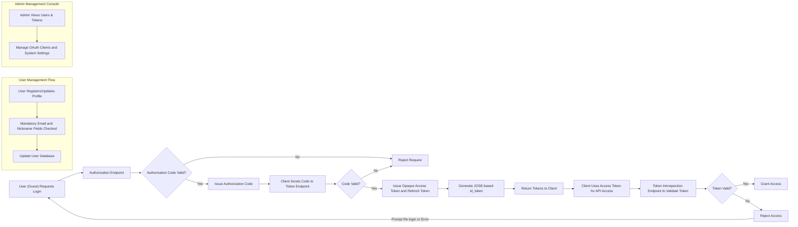

# SocialLogin 서비스 요구사항 분석 문서

## 1. 비즈니스 모델

### 1.1 서비스 존재 이유

SocialLogin 서비스는 OAuth 2.0과 OpenID Connect(OIDC) 프로토콜을 기반으로, 웹 및 모바일 앱 모두를 지원하는 안전하고 편리한 소셜 로그인 기능을 제공합니다. 
이 서비스는 표준 기반 인증 방식을 통해 개발자들이 원활하게 로그인 기능을 통합할 수 있도록 지원하며, 사용자 개인정보 보호와 보안을 우선시합니다.

### 1.2 비즈니스 전략

- 재사용 가능한 소셜 로그인 백엔드를 제공하여 개발자 지원
- 서비스 구독 기반 혹은 대규모 플랫폼 통합을 통한 수익 모델 가능성

### 1.3 주요 기능

- OAuth 2.0 및 OIDC 표준 인증
- 웹 및 앱 클라이언트 지원
- 필수 사용자 정보: 이메일 및 닉네임 수집
- 불투명한 액세스 및 리프레시 토큰 사용
- JOSE 기반 id_token 생성
- 사용자 계정 관리 (가입, 수정, 탈퇴)
- 개발자 문서 제공 (README, Swagger, 클래스 주석)
- 관리 콘솔 제공

### 1.4 성공 지표

- 인증 성공률
- 토큰 발급 및 응답 지연시간 (목표 2초 이내)
- 사용자 가입 및 관리 효율성
- 시스템 가용성 및 안정성

## 2. 사용자 역할 및 인증 시스템

### 2.1 사용자 역할 정의

- Guest: 비인증 사용자, 공개 리소스 접근 가능
- User: 소셜 로그인 인증 사용자, 이메일과 닉네임 필수, 계정 관리 가능
- Admin: 사용자 및 토큰, OAuth 클라이언트, 시스템 설정 등 관리자 기능 수행

### 2.2 인증 플로우

- OAuth 2.0 인가 코드 그랜트 플로우 기반
- JOSE를 사용해 id_token 서명
- 불투명 토큰(access, refresh) 발급 및 관리

### 2.3 토큰 정책

- Access Token: 불투명 토큰, 15-30분 유효기간 권장
- Refresh Token: 불투명 토큰, 7-30일 유효기간 권장

## 3. 기능 요구사항

### 3.1 인증 및 토큰 관련

- WHEN 클라이언트가 인증 요청을 할 때, THE 시스템 SHALL OAuth 2.0 및 OIDC 표준에 따라 인가 코드 그랜트 플로우를 지원한다.
- THE 시스템 SHALL JOSE로 서명된 id_token을 생성한다.
- WHEN 사용자가 인증되면, THE 시스템 SHALL 불투명 access token과 refresh token을 발급한다.
- THE 시스템 SHALL 토큰 인트로스펙션 및 폐기 엔드포인트를 제공한다.

### 3.2 사용자 관리

- THE 시스템 SHALL 이메일과 닉네임을 필수 정보로 요구한다.
- WHEN 사용자가 가입하거나 프로필을 수정할 때, THE 시스템 SHALL 필수 정보를 검증한다.
- THE 시스템 SHALL 사용자 조회, 수정, 탈퇴 기능을 제공한다.

### 3.3 API 엔드포인트

- POST /auth/authorize
- POST /auth/token
- POST /auth/introspect
- POST /auth/revoke
- GET /auth/jwks
- POST /users
- GET /users/me
- PATCH /users/me
- DELETE /users/me
- GET /docs/swagger.json
- GET /docs
- GET /health

### 3.4 관리 콘솔 기능

- 사용자 목록 조회 및 검색
- 사용자 상태 변경, 강제 탈퇴 기능
- 토큰 관리 및 인트로스펙션
- 인증 요청 통계 및 시스템 모니터링
- OAuth 클라이언트 등록 및 관리

## 4. 비즈니스 규칙 및 검증

- 이메일과 닉네임은 반드시 중복되지 않고 필수 입력되어야 한다.
- 토큰은 불투명 형식으로 저장 및 관리되어야 한다.
- id_token은 JOSE 표준을 준수하여 서명되어야 한다.
- 유저 세션은 리프레시 토큰 유효기간에 따라 관리된다.
- 탈퇴 시 사용자 정보와 토큰은 모두 무효화되어야 한다.

## 5. 오류 처리 및 복구

- IF 인증 실패 시, THEN 시스템은 HTTP 401 오류와 명확한 에러 메시지를 제공해야 한다.
- IF 필수 필드 누락 시, THEN HTTP 400 오류를 반환한다.
- IF 토큰 만료 혹은 무효 시, THEN API 접근을 거부하고 재인증을 요구한다.

## 6. 성능 요구사항

- 인증과 토큰 응답 시간은 2초 이내여야 한다.
- 프로필 조회 요청은 순간적으로 처리되어야 한다.

## 7. 보안 고려사항

- 모든 통신은 TLS/HTTPS로 암호화된다.
- 토큰은 클라이언트에 노출되지 않아야 한다.
- 관리자 기능은 높은 권한 검증을 거쳐야 한다.

## 8. 부록: 주요 플로우 다이어그램

---

본 문서는 개발자가 구현 가능하도록 모든 비즈니스 요구 사항과 시나리오, 정책을 구체적으로 명시한 문서이다. 모든 기술 구현 사항은 개발자의 재량에 맡기며, 이 문서는 어떤 기능을 구현해야 하는지를 명확히 설명한다.