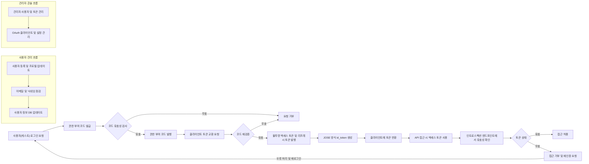

# SocialLogin API 기능 요구사항

## 1. 소개
SocialLogin 서비스는 OAuth 2.0과 OIDC(OpenID Connect) 기반의 안전하고 사용하기 편리한 소셜 로그인 기능을 제공합니다. 이 서비스는 웹 및 앱 버전을 모두 지원하며, 사용자 인증 후 전송되는 액세스 토큰과 리프레시 토큰은 불투명 토큰(opaque token) 방식으로 처리됩니다. 또한, id_token은 JOSE(JSON Object Signing and Encryption) 표준을 이용하여 생성됩니다.

이 문서는 백엔드 개발자가 명확하고 구체적으로 API를 구현할 수 있도록, 각 API 엔드포인트의 정의 및 서버가 준수해야 할 기능 요구사항을 상세히 기술합니다.

## 2. 인증 API 엔드포인트

### POST /auth/authorize
WHEN 클라이언트가 인증을 요청하면, THE 시스템 SHALL OAuth 2.0 권한 부여 코드(authorization code) 흐름을 따라 요청을 처리하고 유효한 경우 권한 부여 코드를 발급한다.

### POST /auth/token
WHEN 클라이언트가 권한 부여 코드 또는 리프레시 토큰을 제출하면, THE 시스템 SHALL 불투명 액세스 토큰과 리프레시 토큰을 발급하고 JOSE 방식으로 서명된 id_token을 생성하여 전달한다.

### POST /auth/introspect
WHEN 클라이언트가 토큰의 유효성을 검사 요청하면, THE 시스템 SHALL 해당 토큰의 활성 상태 및 메타데이터를 응답한다.

### POST /auth/revoke
WHEN 클라이언트가 토큰 폐기 요청을 하면, THE 시스템 SHALL 즉시 해당 토큰을 무효화한다.

### GET /auth/jwks
THE 시스템 SHALL JOSE 서명 검증에 필요한 공개 키 집합(JSON Web Key Set)을 제공한다.

## 3. 사용자 관리 API

### POST /users
WHEN 사용자가 회원가입 요청 시, THE 시스템 SHALL 이메일과 닉네임을 필수로 받고, 유효성을 검사하여 신규 사용자 계정을 생성한다.

### GET /users/me
WHEN 인증된 사용자가 자신의 정보를 요청하면, THE 시스템 SHALL 이메일과 닉네임을 포함한 사용자 정보를 반환한다.

### PATCH /users/me
WHEN 인증된 사용자가 자신의 정보를 수정하려 하면, THE 시스템 SHALL 닉네임 등의 일부 정보 수정만 허용한다.

### DELETE /users/me
WHEN 사용자가 회원탈퇴 요청 시, THE 시스템 SHALL 사용자 계정을 삭제하고 관련 토큰을 무효화한다.

## 4. 토큰 및 세션 관리

### POST /auth/logout
WHEN 사용자가 로그아웃 요청 시, THE 시스템 SHALL 사용자와 관련된 모든 액세스 토큰과 리프레시 토큰을 즉시 무효화한다.

## 5. 개발자 문서 엔드포인트

### GET /docs/swagger.json
THE 시스템 SHALL Swagger 형식의 API 명세 파일을 제공한다.

### GET /docs
THE 시스템 SHALL 개발자가 API를 쉽게 탐색할 수 있도록 Swagger UI 웹 페이지를 제공한다.

### GET /health
THE 시스템 SHALL 서비스 상태 및 가용성을 확인할 수 있는 헬스 체크 API를 제공한다.

## 6. 관리 콘솔 기능 개요

### 6.1 사용자 관리
- THE 시스템 SHALL 관리 콘솔에서 이메일과 닉네임을 포함한 사용자 목록을 제공한다.
- WHEN 관리자가 사용자 목록에 접근하면, THE 시스템 SHALL 사용자 검색 및 필터링 기능을 지원한다.
- THE 시스템 SHALL 관리자가 사용자 상세 정보를 조회하고 닉네임 변경, 계정 활성화/비활성화, 강제 탈퇴 가능하도록 한다.

### 6.2 토큰 관리
- THE 시스템 SHALL 발급된 액세스 토큰 및 리프레시 토큰 목록을 관리 콘솔에 노출한다.
- WHEN 관리자가 특정 토큰을 조회하면, THE 시스템 SHALL 해당 토큰의 유효성, 만료 정보, 연관 사용자 정보를 표시한다.
- WHEN 관리자가 토큰을 폐기 요청하면, THE 시스템 SHALL 즉시 토큰을 무효화한다.

### 6.3 통계 및 모니터링
- THE 시스템 SHALL 로그인 시도 횟수, 토큰 발급 현황 등 사용량 통계를 제공한다.
- THE 시스템 SHALL 관리 콘솔에서 서비스 상태 확인 및 주요 지표 모니터링 기능을 제공한다.

### 6.4 OAuth 클라이언트 관리
- THE 시스템 SHALL 권한 부여 클라이언트(애플리케이션)의 등록, 수정, 비활성화 기능을 관리 콘솔에서 제공한다.
- WHEN 관리자가 클라이언트를 등록하거나 수정하면, THE 시스템 SHALL 리디렉션 URI, 권한 범위 등을 등록 및 관리할 수 있어야 한다.

### 6.5 문서 및 지원
- THE 시스템 SHALL 관리 콘솔에서 README, Swagger UI, 코드 주석 등의 문서에 접근 가능하도록 한다.

## 7. API 사용 시 고려사항

- THE 시스템 SHALL 토큰 검증을 위해 인트로스펙션(endpoint)을 반드시 사용한다.
- THE 시스템 SHALL JOSE 방식의 id_token 유효성을 확인할 수 있는 메커니즘을 제공한다.
- 이메일과 닉네임은 모든 사용자 인증과정에서 필수적으로 수집된다.
- 에러 상황 발생 시, THE 시스템 SHALL 에러 코드와 상세 메시지를 명확히 전달해야 한다.
- 응답 시간은 정상 부하 상태에서 2초 이내를 목표로 한다.

## 8. 다이어그램

### 인증 및 토큰 발급 흐름

---

이 문서는 비즈니스 요구사항만을 포함하며, 모든 기술적 구현 세부사항은 개발자에게 위임된다. 개발자는 시스템 아키텍처, API 설계, 데이터베이스 구성 등 구현 방식을 자율적으로 결정할 권한이 있다. 문서는 시스템이 무엇을 해야 하는지에 대한 내용을 다루며, 어떻게 구축할지는 포함하지 않는다.
