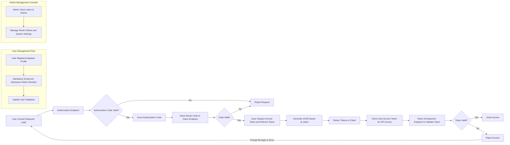

# Social Login Service OAuth 2.0 + OIDC Business Requirements

## 1. Service Overview and Business Model

### 1.1 Why This Service Exists
The Social Login service exists to provide a secure, standardized authentication mechanism that allows third-party applications to integrate user authentication seamlessly. It solves complexity and security challenges faced by organizations that require a reliable OAuth 2.0 and OpenID Connect compliant service supporting both web and app clients.

### 1.2 Business Strategy
The service provides a reusable backend platform supporting OAuth 2.0 authorization code flow with OIDC extensions. It aims to attract developers through ease of integration, robust security, and comprehensive user management features. Potential revenue streams include subscription-based plans for third-party clients.

### 1.3 Key Features Supporting Business Model
- OAuth 2.0 + OIDC compliant authentication
- Support for web and app clients
- Mandatory email and nickname user attributes
- Use of opaque tokens for access and refresh
- JOSE-based id_token generation
- User account management (registration, profile update, withdrawal)
- Administrative management console
- Developer documentation including README and Swagger

### 1.4 Success Metrics
- Authentication success rate over 99%
- Token issuance response time under 2 seconds
- User management operations completion within 1 second
- System uptime of 99.9%

## 2. User Roles and Authentication

### 2.1 User Roles
- Guest: Unauthenticated users with read-only access to public resources and ability to register or login.
- User: Authenticated users with mandatory verified email and nickname, capable of managing their own profile and tokens.
- Admin: Users with elevated privileges to manage system users, tokens, OAuth clients, and configurations.

### 2.2 Authentication Process
WHEN a guest initiates login, THE system SHALL authenticate them following OAuth 2.0 authorization code flow extended by OpenID Connect protocols.

WHILE the authentication is in progress, THE system SHALL enforce validation of mandatory user attributes: email and nickname.

WHEN authentication completes successfully, THE system SHALL issue opaque access and refresh tokens and generate a JOSE-signed id_token containing user claims.

## 3. Functional Requirements

### 3.1 OAuth 2.0 + OIDC Authentication Flow
- WHEN receiving an authorization request, THE system SHALL validate client information and user credentials.
- WHEN the authorization code is valid, THE system SHALL issue opaque access and refresh tokens.
- THE system SHALL generate an id_token signed with JOSE standards including claims for sub, email, nickname, iat, and exp.

### 3.2 Token Management
- THE system SHALL use opaque tokens for access and refresh tokens.
- Access tokens SHALL have 15-30 minutes expiration.
- Refresh tokens SHALL have 7-30 days expiration.
- THE system SHALL provide token introspection and revocation endpoints.

### 3.3 User Account Management
- THE system SHALL require email and nickname during user registration.
- THE system SHALL allow users to view and update their nickname.
- THE system SHALL allow users to delete their accounts, which shall invalidate all tokens.

## 4. API Endpoint Specifications

### 4.1 Authentication Endpoints
- POST /auth/authorize: Process OAuth 2.0 authorization requests.
- POST /auth/token: Exchange authorization codes or refresh tokens for access tokens.
- POST /auth/introspect: Validate token status and metadata.
- POST /auth/revoke: Invalidate tokens.
- GET /auth/jwks: Publish JOSE public keys.

### 4.2 User Management Endpoints
- POST /users: Register new users with mandatory email and nickname.
- GET /users/me: Retrieve authenticated user's profile.
- PATCH /users/me: Update user's nickname.
- DELETE /users/me: Delete user account and invalidate tokens.

### 4.3 Documentation and Monitoring Endpoints
- GET /docs/swagger.json: Provide Swagger API specification.
- GET /docs: Interactive API documentation.
- GET /health: Service health status.

## 5. Admin Management Console Requirements

### 5.1 User Management
- View user lists with filters and search.
- View and update user profiles.
- Activate, deactivate, or delete user accounts.

### 5.2 Token Management
- List active tokens with introspection details.
- Revoke tokens immediately.

### 5.3 Monitoring and Statistics
- Provide authentication and token usage metrics over selectable periods.

### 5.4 OAuth Client Management
- Register, update, and disable OAuth clients with comment scopes and redirect URIs.

### 5.5 Documentation Access
- Provide access to README, Swagger UI, and code documentation.

## 6. Business Rules and Validation

- Email and nickname are mandatory and must be unique.
- Tokens are opaque and securely stored.
- id_token complies with JOSE specification with required claims.
- User session expires according to refresh token validity.
- Account deletion removes user data and tokens.

## 7. Error Handling and Recovery

- IF authentication fails, THEN the system SHALL respond with HTTP 401 errors.
- IF tokens are expired or invalid, THEN requests SHALL be rejected with appropriate error messages.
- IF mandatory fields are missing, THEN THE system SHALL reject the request with HTTP 400 errors.

## 8. Performance and Security Requirements

- Authorization and token request handling SHALL complete within 2 seconds under typical load.
- User information retrieval SHALL occur within 1 second.
- All token exchanges SHALL use secure transport (TLS/HTTPS).
- Admin functions SHALL require proper authorization.
- Rate limiting SHALL be implemented for critical endpoints.

## 9. Workflow Diagrams

---

This document provides business requirements only. All technical implementation decisions belong to developers. Developers have full autonomy over architecture, APIs, and database design. The document describes WHAT the system should do, not HOW to build it.
