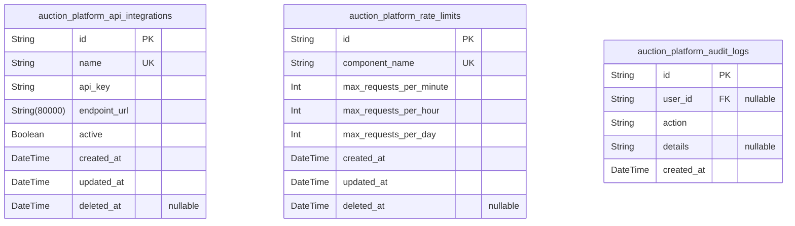
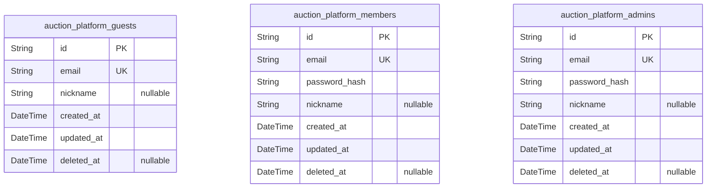
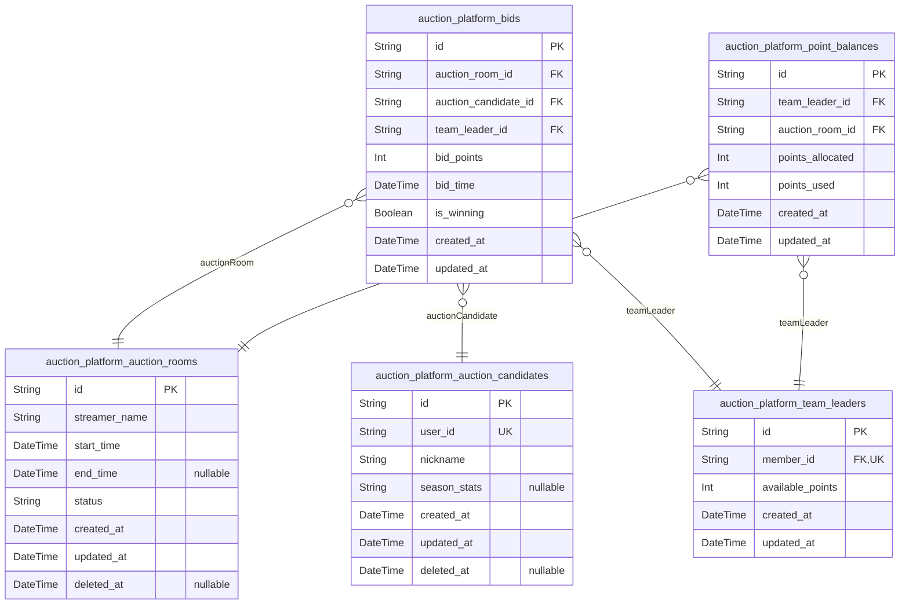
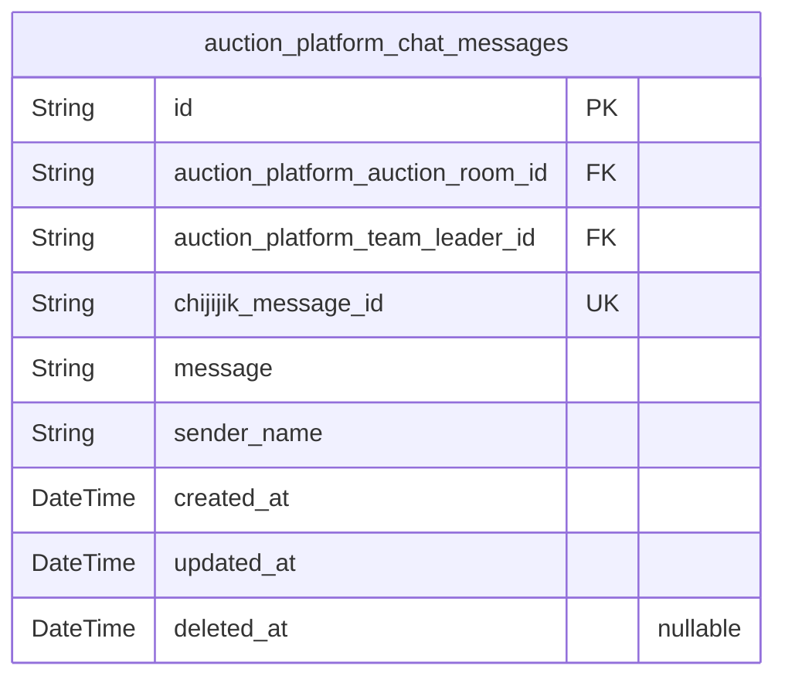
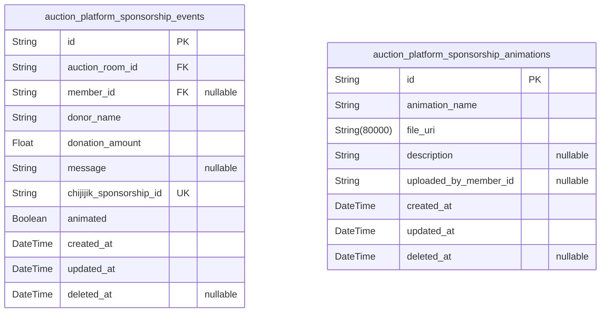
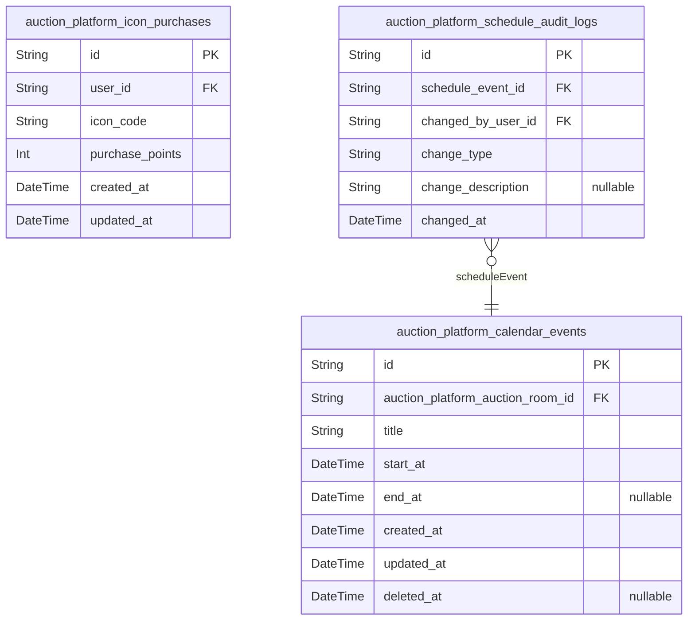

# Prisma Markdown

> Generated by [`prisma-markdown`](https://github.com/samchon/prisma-markdown)

- [Systematic](#systematic)
- [Identity](#identity)
- [Auctions](#auctions)
- [Chat](#chat)
- [Sponsorship](#sponsorship)
- [Schedule](#schedule)

## Systematic

### `auction_platform_api_integrations`

Stores external API integration configurations for the auction platform.
Includes API keys, endpoint URLs, and integration status. Enables
controlled, auditable access to third-party services.

Properties as follows:

- `id`: Primary Key.
- `name`: Name of the external API integration, unique identifier.
- `api_key`: API key or token used for authentication with the external service.
- `endpoint_url`: Base URL endpoint of the external API service.
- `active`: Indicates whether this integration is currently active and should be used.
- `created_at`: Timestamp when this integration record was created.
- `updated_at`: Timestamp when this integration record was last updated.
- `deleted_at`: Timestamp marking soft deletion; null if not deleted.

### `auction_platform_rate_limits`

Defines configurable rate limiting policies applicable to various
components and endpoints of the auction platform. Controls request
frequency to protect system stability and prevent abuse.

Properties as follows:

- `id`: Primary Key.
- `component_name`: Name of the component or service this rate limit policy applies to.
- `max_requests_per_minute`: Maximum allowed requests per minute for the component.
- `max_requests_per_hour`: Maximum allowed requests per hour for the component.
- `max_requests_per_day`: Maximum allowed requests per day for the component.
- `created_at`: Timestamp when this rate limit record was created.
- `updated_at`: Timestamp when this rate limit record was last updated.
- `deleted_at`: Timestamp marking soft deletion; null if not deleted.

### `auction_platform_audit_logs`

Records system audit logs capturing significant operations, state
changes, and administrative actions across the auction platform. Supports
monitoring, analytics, and compliance requirements.

Properties as follows:

- `id`: Primary Key.
- `user_id`
  > Reference to system user performing the action, if applicable. {@link
  > auction_platform_members.id}
- `action`: Description of the performed action or event.
- `details`: Optional detailed context or metadata associated with the action.
- `created_at`: Timestamp when this audit log entry was created.

## Identity

### `auction_platform_guests`

Guest user identities allowing limited view-only access without login
credentials; primarily tracked by email and nickname. Includes timestamps
for creation and soft deletion enabling audit and recovery.

Properties as follows:

- `id`: Primary Key.
- `email`
  > Guest user's email address for identification and notifications. Unique
  > to ensure no duplicate guest records.
- `nickname`: Guest display nickname visible on platform chats and leaderboards.
- `created_at`: Record creation timestamp for auditing purposes.
- `updated_at`: Timestamp for the latest update of the guest record.
- `deleted_at`: Soft deletion timestamp; null if active record.

### `auction_platform_members`

Registered members (team leaders) authorized to bid in auctions. Stores
authentication data including password hash and unique email. Maintains
point of contact and display nickname. Includes timestamps and soft
deletion to enable auditing and account lifecycle management.

Properties as follows:

- `id`: Primary Key.
- `email`: Member's unique email address used for login and notifications.
- `password_hash`
  > Hashed password for secure authentication processes. Not stored in
  > plaintext.
- `nickname`: Member's display nickname on platform and auction chats.
- `created_at`: Account creation timestamp for audit trail.
- `updated_at`: Last update timestamp for account data.
- `deleted_at`: Soft deletion timestamp indicating account deactivation; null if active.

### `auction_platform_admins`

Administrative user identities responsible for managing the auction
platform. Secure authentication with password hash and unique email
enforced. Includes audit timestamps and soft deletion for lifecycle and
compliance.

Properties as follows:

- `id`: Primary Key.
- `email`: Admin's unique email address used for authentication and notifications.
- `password_hash`: Secure hashed password for administrator login.
- `nickname`: Admin display nickname for identification in admin tools and logs.
- `created_at`: Timestamp when the admin record was created for auditing.
- `updated_at`: Timestamp of last update on the admin record for audit tracking.
- `deleted_at`: Soft deletion timestamp indicating admin deactivation; null if active.

## Auctions

### `auction_platform_auction_rooms`

Auction room information managed per streamer with schedule data and
auction lifecycle status. This entity tracks start/end times, status, and
auditing timestamps.

Properties as follows:

- `id`: Primary Key.
- `streamer_name`: Name of the streamer who owns this auction room.
- `start_time`: Scheduled start time of the auction room.
- `end_time`: Optional scheduled end time of the auction room.
- `status`: Status of the auction room (e.g., open, closed, pending).
- `created_at`: Record creation timestamp.
- `updated_at`: Record last updated timestamp.
- `deleted_at`: Soft delete timestamp for marking deletion.

### `auction_platform_auction_candidates`

Registered users who are candidates for auction, including their profile
information and performance statistics. Used for auction bid targets.

Properties as follows:

- `id`: Primary Key.
- `user_id`: Identifier referencing the member user who is the auction candidate.
- `nickname`: Candidate's display nickname in auctions.
- `season_stats`: Serialized or JSON string holding game season statistics.
- `created_at`: Timestamp when candidate record was created.
- `updated_at`: Timestamp when candidate record was last updated.
- `deleted_at`: Soft delete timestamp to mark record removal.

### `auction_platform_team_leaders`

Team leaders participating in auctions, linked to member users. Stores
auction point data and account activity timestamps.

Properties as follows:

- `id`: Primary Key.
- `member_id`
  > References the member user who is the team leader. {@link
  > auction_platform_members.id}
- `available_points`: Points currently available for auction bidding by the team leader.
- `created_at`: Creation timestamp for team leader record.
- `updated_at`: Last update timestamp for team leader record.

### `auction_platform_bids`

Records of individual bids made by team leaders on auction candidates
within specific auction rooms, with bid amount and timestamps.

Properties as follows:

- `id`: Primary Key.
- `auction_room_id`: Reference to auction room [auction_platform_auction_rooms.id](#auction_platform_auction_rooms)
- `auction_candidate_id`
  > Reference to auction candidate {@link
  > auction_platform_auction_candidates.id}
- `team_leader_id`
  > Reference to the bidding team leader {@link
  > auction_platform_team_leaders.id}
- `bid_points`: Number of points bid for the candidate.
- `bid_time`: Timestamp when the bid was placed.
- `is_winning`: Indicates if this bid is currently the highest winning bid.
- `created_at`: Record creation timestamp.
- `updated_at`: Last update timestamp.

### `auction_platform_point_balances`

Tracks auction points allocated and used by team leaders per auction
room, enabling point management and auditing.

Properties as follows:

- `id`: Primary Key.
- `team_leader_id`: Reference to team leader [auction_platform_team_leaders.id](#auction_platform_team_leaders)
- `auction_room_id`: Reference to auction room [auction_platform_auction_rooms.id](#auction_platform_auction_rooms)
- `points_allocated`: Total auction points allocated to the team leader.
- `points_used`: Total auction points spent by the team leader.
- `created_at`: Timestamp when point balance record was created.
- `updated_at`: Last update timestamp.

## Chat

### `auction_platform_chat_messages`

Real-time chat messages collected from the Chijijik API for auction
rooms, linking each message to the corresponding auction room and team
leader. Supports message content storage, timestamps, and soft deletion
to maintain audit trails and historical analysis.

Properties as follows:

- `id`: Primary Key.
- `auction_platform_auction_room_id`: Belonged auction room's [auction_platform_auction_rooms.id](#auction_platform_auction_rooms).
- `auction_platform_team_leader_id`: Belonged team leader's [auction_platform_team_leaders.id](#auction_platform_team_leaders).
- `chijijik_message_id`: Unique chat message ID from Chijijik API.
- `message`: Content of the chat message.
- `sender_name`: Name of the message sender.
- `created_at`: Timestamp when the message was created.
- `updated_at`: Timestamp when the message was last updated.
- `deleted_at`: Soft deletion timestamp; null if not deleted.

## Sponsorship

### `auction_platform_sponsorship_events`

Sponsorship event records that capture donation details during auctions,
including donor information, donation amount, auction room association,
and optional member association. These events impact auction bids
dynamically and are traced with timestamps for creation, updating, and
soft deletion.

Properties as follows:

- `id`: Primary Key.
- `auction_room_id`: Related auction room [auction_platform_auction_rooms.id](#auction_platform_auction_rooms).
- `member_id`: Associated member (team leader) [auction_platform_members.id](#auction_platform_members).
- `donor_name`
  > Name of the donor or sponsor from the sponsorship event. May be display
  > name or anonymous.
- `donation_amount`: Amount donated in this sponsorship event.
- `message`: Optional message included with the sponsorship.
- `chijijik_sponsorship_id`
  > Unique identifier for this sponsorship event from the Chijijik API, used
  > to prevent duplicates.
- `animated`
  > Flag indicating whether an animation was triggered for this sponsorship
  > event.
- `created_at`: Timestamp when this record was created.
- `updated_at`: Timestamp when this record was last updated.
- `deleted_at`: Timestamp for soft deletion; null if active.

### `auction_platform_sponsorship_animations`

Custom animation metadata for sponsorship notifications to enrich auction
user experience. Contains animation name, file URI, optional description,
and uploader information. Managed through soft deletion and audit
timestamps.

Properties as follows:

- `id`: Primary Key.
- `animation_name`: Name of the custom animation file for sponsorship notifications.
- `file_uri`: URI location of the animation file, such as S3 URL or CDN link.
- `description`: Optional detailed description of the animation.
- `uploaded_by_member_id`: UUID of the member (team leader or admin) who uploaded this animation.
- `created_at`: Creation timestamp of the animation record.
- `updated_at`: Last update timestamp of the animation record.
- `deleted_at`: Soft deletion timestamp; null if animation is active.

## Schedule

### `auction_platform_calendar_events`

Calendar events representing scheduled auction rooms with support for
mandatory start time and optional end time. This entity supports linking
auction rooms with streaming schedules and enables users to view and
interact with auctions on the platform calendar. It includes temporal
fields for event lifecycle management and a foreign key to the auction
room.

Properties as follows:

- `id`: Primary Key.
- `auction_platform_auction_room_id`: Belonged auction room. [auction_platform_auction_rooms.id](#auction_platform_auction_rooms).
- `title`: Title or name of the calendar event representing the auction.
- `start_at`: Mandatory start date and time of the auction event in ISO 8601 format.
- `end_at`
  > Optional end date and time of the auction event, nullable for ongoing or
  > open-ended events.
- `created_at`: Timestamp of when the calendar event was created.
- `updated_at`: Timestamp of the last update to the calendar event.
- `deleted_at`: Soft delete timestamp, null if not deleted.

### `auction_platform_icon_purchases`

Records of calendar icon purchases by users, allowing customization of
event appearance on the platform calendar. Each purchase links a user to
a specific icon and contains temporal data for tracking purchase
activity.

Properties as follows:

- `id`: Primary Key.
- `user_id`: Purchasing user. [auction_platform_members.id](#auction_platform_members).
- `icon_code`: Code identifying the purchased icon for calendar display.
- `purchase_points`: Points spent for this icon purchase.
- `created_at`: Timestamp when the purchase was made.
- `updated_at`: Timestamp of the last update to the purchase record.

### `auction_platform_schedule_audit_logs`

Audit logs capturing changes made to schedule records, providing a
historical trail for compliance and troubleshooting. Each log entry
records what was changed, who changed it, and when.

Properties as follows:

- `id`: Primary Key.
- `schedule_event_id`: Referenced calendar event. [auction_platform_calendar_events.id](#auction_platform_calendar_events).
- `changed_by_user_id`: User who made the change. [auction_platform_members.id](#auction_platform_members).
- `change_type`: Type of change (e.g., create, update, delete).
- `change_description`: Detailed description of the change made.
- `changed_at`: Timestamp when the change occurred.
