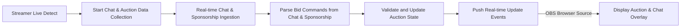

# Auction Platform Business Requirements for Real-Time Auction with Chat and Sponsorship Integration

## 1. Overview

The auction platform enables live, dynamic auctions where registered users with gaming profiles are auctioned to team leaders who bid using limited points. The system integrates real-time chat and sponsorship inputs via the Chijijik API to update bids dynamically and provide engaging interactive experiences.

### Purpose
This document specifies detailed business requirements to guide backend developers in implementing a reliable, scalable auction platform with real-time chat and sponsorship integration.

## 2. Business Model

### Why This Service Exists
- To provide an innovative real-time auction experience leveraging gaming and streaming communities.
- To create engagement by combining live chat, sponsorship, and auction mechanisms.
- To enable revenue generation via transactional fees, sponsorships, and premium features.

### Revenue Streams
- Fees from auction participation and transactions.
- Sponsorship commissions.
- Premium account subscriptions.

### Value Proposition
- Real-time, interactive auctions with integrated chat and donation support.
- Streamer-aligned auction rooms with calendar scheduling and visual customization.

## 3. User Roles and Authentication

### Roles
- Guests: view-only access, limited browsing powers.
- Team Leaders: authenticated members placing bids using assigned points.
- Admins: manage users, auctions, schedules, external integrations.

### Authentication
- JWT token-based authentication.
- Role-based access control securing API endpoints and data.

## 4. Functional Requirements

### 4.1 Auction Management
- Auction rooms created with mandatory start and optional end times.
- Users registered as auction items with comprehensive profiles.
- Team leaders assigned point budgets to bid.
- Bids via chat or sponsorship update auction states in real time.
- Auction winners declared at closing; point deductions processed.

### 4.2 Chat and Sponsorship Integration
- Real-time chat messages received and parsed through Chijijik API.
- Sponsorships captured with donor details and custom messages.
- Rate limiting on chat/sponsorship data to ensure scalability.

### 4.3 Schedule and Calendar Management
- Auction rooms managed as calendar entries, icons purchased for decoration.
- Audit logs capturing schedule modifications.

### 4.4 Real-Time Updates and Notifications
- WebSocket/SSE push of auction, chat, and sponsorship data.
- Latency under 500 milliseconds.

### 4.5 OBS Integration
- Browser source URLs for chat and auction overlays.
- Synchronized real-time updates optimized for streaming.

### 4.6 User Management and Invitations
- Invitation workflow managing team leader participation.
- Access control enforcing invitation status.

## 5. Business Rules and Validation
- Bid validation against point balances and auction states.
- Broadcasting suspension outside streamer live periods.
- Custom animation validations for sponsorship notifications.
- Rate limiting configurable by admins.

## 6. Error Handling and Recovery
- Clear user messages on bid failures.
- Retry mechanisms for API failures.

## 7. Performance Expectations
- Sub-second responsiveness.
- Support for 50 simultaneous auction rooms and thousands of chat messages.

## 8. External Integrations
- Chijijik API for chat and sponsorship.
- OBS for streaming overlays.

## 9. Data Flow and Event Processing

## 10. Security and Compliance
- Secure JWT authentication and role-based access control.
- Audit logs for sensitive operations.
- Data privacy compliance.

> This document provides business requirements only. All technical implementation decisions including architecture, APIs, database design, etc., are at the discretion of the development team. The document specifies WHAT to build, not HOW.