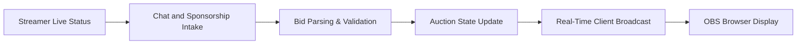

# Detailed Business Requirements for Auction Platform Real-Time Auction and Chat Integration

## 1. Executive Summary

### 1.1 Overview
The platform enables real-time auctions with integrated chat and sponsorship inputs sourced from Chijijik API for streamers and team leaders.

### 1.2 Business Justification
THE auction platform SHALL fill the gap in the market for live interactive auctions with gaming participants, integrating real-time chat and sponsorship.

### 1.3 Revenue Streams
THE system SHALL generate revenue from auction fees, sponsorships, and premium services.

## 2. Business Model

### 2.1 Market Demand
Real-time auctions in streaming communities combine live bidding and chat engagement for vibrant user interactions.

### 2.2 Value Proposition
The system offers team leaders dynamic bidding with limited points, real-time updates, customizable notifications, and OBS integration.

## 3. User Roles and Authentication

### 3.1 Roles
- Guest: limited browsing
- Team Leader: bidding participant
- Admin: full control and management

### 3.2 Authentication
THE system SHALL enforce secure JWT-based authentication and role-based authorization.

## 4. Functional Requirements

### 4.1 Auction Management
- WHEN a streamer creates an auction room with schedule, THE system SHALL register it with mandatory start and optional end times.
- THE system SHALL allow management of auction items, teams, and bids.

### 4.2 Chat and Sponsorship
- WHILE a streamer is live, THE system SHALL ingest chat and sponsorship data via Chijijik API.
- THE system SHALL update auction bids real-time based on chat messages and sponsorships.

### 4.3 Schedule and Calendar
- THE system SHALL manage flexible schedule entries with optional end times.
- THE system SHALL allow purchase and display of icons on calendars.

### 4.4 Real-Time Updates
- THE system SHALL push real-time auction and chat updates via WebSocket.

### 4.5 OBS Integration
- THE system SHALL expose real-time overlays for OBS.

### 4.6 User Management
- THE system SHALL support team leader registrations and point management.

### 4.7 Invitations
- THE system SHALL manage invitations to auction participation.

## 5. Business Rules
- Bids SHALL be validated against available points.
- Chat ingestion SHALL be rate limited.

## 6. Error Handling
- THE system SHALL provide user friendly error messages.

## 7. Performance
- Real-time updates SHALL occur within 1 second.

## 8. External Integrations
- Chijijik API and OBS browser sources.

## 9. Data Flow

## 10. Security
- THE system SHALL implement role based security and audit trails.

> This document provides business requirements only. All technical implementation decisions including architecture, API design, and database schemas are at developers' discretion.
