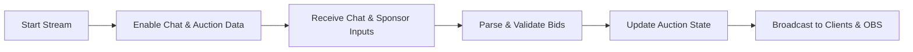

# Seamless Auction Platform with Real-Time Chat and Sponsorship Integration: Detailed Business Requirements

## 1. Introduction and Business Justification

The auction platform service enables streamers and team leaders to engage in real-time auctions of registered users (players) with integrated chat and sponsorship-driven bidding. It addresses a market need for interactive, transparent, and scalable auction experiences combined with live streaming overlays and sponsorship alerts.

## 2. User Roles and Authentication

### 2.1 User Roles
- **Guest**: Has limited read-only access.
- **Member (Team Leader)**: Authenticated user authorized to create teams, place bids using assigned points, and participate in auctions.
- **Admin**: Full system control, including user, auction, schedule, and integration management.

### 2.2 Authentication
- Users SHALL register with email and password and authenticate via JWT.
- THE system SHALL maintain secure sessions and enforce role-based access controls.

## 3. Functional Requirements

### 3.1 Auction Registration and Management
- WHEN a streamer creates an auction room, THE system SHALL register it with a streamer name and calendar schedule (start time mandatory, end time optional).
- Users to be auctioned SHALL be registered with profile details including season performance stats.
- Team Leaders SHALL receive initial auction points to bid.
- WHEN a team leader places a bid, THE system SHALL verify point sufficiency and update the auction status in real time.

### 3.2 Real-Time Chat and Sponsorship Integration
- THE system SHALL connect with Chijijik API to receive streamer chat messages and sponsorship events.
- WHILE the streamer is live, THE system SHALL store chat messages with unique Chijijik IDs.
- THE system SHALL enforce rate limiting on chat and sponsorship data to prevent overload.
- THE system SHALL parse bid amounts from chat messages and sponsorships and apply these to auctions.

### 3.3 Auction Bidding and Point Management
- Four key rules govern bidding:
  - Bids SHALL not exceed a team leader's available points.
  - Bids received via chat or sponsorship SHALL be validated before acceptance.
  - On bid acceptance, points SHALL be deducted.
  - Auction winners SHALL be determined correctly at auction close.

### 3.4 Schedule and Calendar Management
- THE system SHALL allow creation, updating, and deletion of auction rooms linked to calendar entries.
- Calendar entries SHALL have an optional end time.
- Users SHALL be able to purchase icons for calendar entries using specific icon points.
- The system SHALL track audit logs of calendar changes.

### 3.5 Real-Time Updates and OBS Integration
- THE system SHALL use WebSocket or SSE to push auction and chat updates with under 500 ms latency.
- OBS browser source URLs SHALL be provided for live chat, auction status, and sponsorship notifications.

## 4. Business Rules and Validation
- Points and bids SHALL be validated strictly to avoid fraud or errors.
- Streaming status SHALL govern chat message collection.
- Rate limits SHALL be configurable.

## 5. Error Handling and Recovery
- Invalid bids SHALL trigger specific error responses.
- Chat API errors SHALL be logged and cause graceful degradation.

## 6. Performance and Scalability
- The platform SHALL support 50+ concurrent auction rooms, 5000+ connected clients with minimal latency.

## 7. External Integrations
- Chijijik API for chat and sponsorship input.
- OBS for live broadcast overlays.

## 8. Data Flow and Event Processing

## 9. Security and Compliance
- JWT authentication with strict role-based controls.
- Audit logging and data privacy compliance.

> This document provides business requirements only. All technical implementation decisions including architecture, API design, and database schemas are under backend developers' full autonomy. The document defines WHAT to build, not HOW.
