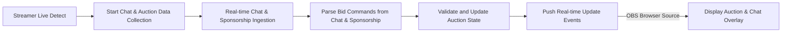

# Functional Requirements for Real-Time Auction Platform with Chat and Sponsorship Integration

## 1. Business Model

The auction platform enables team leaders to bid on registered users in scheduled auction rooms linked with streamers. Real-time chat and sponsorship inputs via Chijijik API dynamically update auction bids and status, enhancing engagement and monetization.

Requirements focus on real-time responsiveness, user role management, auction integrity, and integration with streaming tools like OBS.

## 2. User Roles and Authentication

**Roles:**
- Guest: View-only access for unauthenticated users.
- Member (Team Leader): Authenticated users who can register auction users, place bids, and participate in chats.
- Admin: System administrators managing auctions, schedules, users, and API integrations.

**Authentication:**
- JWT-based authentication for API access.
- Role-based access control defined by user permissions.

## 3. Auction Management

- WHEN a streamer creates an auction room with a mandatory start time and optional end time, THE system SHALL register it on the calendar.
- THE system SHALL allow auction users to be registered with detailed profiles including gaming statistics.
- Team leaders SHALL receive an initial allocation of auction points used solely for bidding.
- WHEN a bid is submitted via chat or sponsorship input, THE system SHALL verify point sufficiency and update the auction state in real time.
- THE system SHALL determine winners based on highest bids at auction close and deduct points accordingly.

## 4. Real-Time Chat and Sponsorship Integration

- WHILE a streamer is live, THE system SHALL collect chat messages from the Chijijik API and store them using unique Chijijik IDs.
- THE system SHALL enforce rate limiting on chat message processing to maintain performance.
- Sponsorship events from the Chijijik API SHALL be captured with donor name, amount, and messages.
- THE system SHALL allow user-uploaded custom animations for sponsorship alerts.

## 5. Schedule and Calendar Management

- THE system SHALL provide CRUD operations for auction schedules with start time required and end time optional.
- Users may purchase icons using icon points to decorate calendar events.
- Schedule changes SHALL be tracked through audit logs.

## 6. Real-Time Updates and Notifications

- The system SHALL broadcast real-time updates of bids, chat messages, and sponsorship events.
- Real-time communication SHALL use WebSocket or Server-Sent Events.
- Updates SHALL propagate to all clients, including OBS browser sources, within 500 milliseconds.

## 7. OBS Integration

- THE system SHALL expose browser source URLs for real-time auction and chat overlays compatible with OBS.
- THE overlays SHALL display synchronized auction and chat data relevant to each streamer’s auction room.

## 8. User Invitations and Access Control

- Auction room creators SHALL be able to invite team leaders.
- Invitations SHALL provide statuses: pending, accepted, or rejected.
- Access to auction participation SHALL be limited to authorized invitees.

## 9. Business Rules and Validation

- Bids SHALL not exceed the available auction points of a team leader.
- Chat and sponsorship bids SHALL be parsed and validated before applying.
- Auctions respect scheduled start and optional end times.
- Rate limiting SHALL prevent abuse of chat and sponsorship inputs.

## 10. Error Handling and Recovery

- THE system SHALL provide clear and descriptive error messages on bid or authentication failures.
- External API failures SHALL be logged and retried with appropriate backoff.
- THE system SHALL handle disconnections gracefully without data loss.

## 11. Performance Requirements

- THE system SHALL handle at least 50 concurrent auctions and 1000 simultaneous users.
- Real-time updates SHALL be delivered within 500ms latency.

## 12. External Integrations

- Integration with Chijijik API for real-time chat and sponsorship.
- OBS integration for overlay display.

## 13. Data Flow and Event Processing

## 14. Security and Compliance

- JWT based authentication with role-based authorization.
- Audit logs for all bidding and chat events.
- Compliance with data protection regulations.

> This document provides business requirements only. All technical implementation decisions including architecture, APIs, database design, etc., are at the discretion of the development team. The document specifies WHAT needs to be built, not HOW.