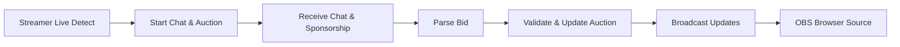

# Detailed API and Real-Time Processing Design for Auction Platform

## 1. Introduction and Overview

The auction platform service combines real-time auction functionality with chat and sponsorship integration to create an interactive live bidding environment for streamers and teams.

## 2. Business Model

The platform facilitates live auctions where registered users are auctioned off to team leaders who bid using limited points. Real-time chat and sponsorship inputs dynamically adjust bids and update the auction state.

## 3. User Roles and Authentication

### Roles

- Guest: Visitors who can browse limited auction information.
- Member (Team Leader): Authenticated users able to place bids and participate in auctions.
- Admin: System administrators managing users, auctions, and integrations.

### Authentication

Users authenticate with email and password, receiving JWT tokens with embedded roles for API access control.

## 4. Auction Room and Schedule Management

- Auction rooms are created with mandatory start times and optional end times.
- Rooms are associated with streamers and scheduled via a calendar interface.
- Users are registered as auction items with profiles and game stats.
- Two types of points exist: auction points for bidding, and icon points for calendar UI decorations.

## 5. Chat and Sponsorship Integration

- The platform connects to Chijijik API to ingest live chat messages and sponsorship events.
- Chat messages are stored with unique identifiers; rate limiting is applied to manage load.
- Sponsorship data, including sponsor name, amount, and message, are recorded and can trigger bid updates.

## 6. Real-Time Event Processing

- WebSocket or server-sent events deliver real-time auction, chat, and sponsorship updates to connected clients.
- Clients include web dashboards and OBS overlay browser sources.

## 7. Bid and Sponsorship Processing

- Incoming bids are validated against team leader points.
- Valid bids update the auction state and deduct points.
- Sponsorships can influence bids if configured.

## 8. Error Handling and Recovery

- Bid validation errors return descriptive messages.
- Failures in chat or sponsorship data ingestion trigger retries and error logging.

## 9. Performance and Scalability Requirements

- Latency for real-time updates shall be below 500ms.
- The system shall support dozens of simultaneous auction rooms and thousands of concurrent chat users.

## 10. Security and Compliance

- JWT-based authentication and role-based access control are enforced.
- Sensitive data is encrypted and audited.

## 11. Data Flow

## 12. Conclusion

The document provides a clear and comprehensive set of business requirements, workflows, user roles, and real-time processing instructions to produce a fully functional interactive auction platform with chat and sponsorship integration.

---

> This document provides business requirements only. All technical implementation decisions are at the discretion of the developers. The document focuses on WHAT to build, not HOW to build it.
