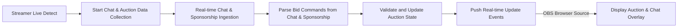

# Real-Time Auction Platform Business Requirements

## 1. Executive Summary

The service provides a multi-auction platform enabling team leaders to bid on registered users using limited points. It incorporates live, real-time chat and sponsorship integrations through the Chijijik API to dynamically update auction bids via chat messages and sponsorship donations. The platform supports calendar-based scheduling, flexible auction rooms linked to streamers, and OBS overlay integration.

## 2. Business Model

### 2.1 Why This Service Exists

This service addresses the growing demand for interactive, engaging live auctions in the gaming and streaming community space. It fills the market gap by integrating live chat-based bidding and sponsorship donation-driven bids, providing a unique and engaging experience for streamers and their audiences.

### 2.2 Revenue Streams

- Auction participation fees
- Sponsorship promotions and commissions
- Premium subscription or enhanced feature fees

### 2.3 Key Features

- Real-time multi-auction support
- Integration with Chijijik API for chat and sponsorship data
- OBS-compatible browser source overlays
- User role-based access and permissions

## 3. User Roles and Authentication

### 3.1 Roles

| Role   | Description                        |
|--------|----------------------------------|
| Guest  | Unauthenticated, view-only access |
| Member | Authenticated team leader, can bid and participate in auctions |
| Admin  | Administrative control over auctions, users, schedules, and integrations |

### 3.2 Authentication

- JWT-based authentication with role-based authorization.

## 4. Functional Requirements

### 4.1 Auction Management

- WHEN a streamer creates an auction room, THE system SHALL register the room with a calendar schedule.
- THE system SHALL allow registering users (auction items) with detailed profiles.
- Team leaders SHALL receive initial auction points and use them for bidding.
- The system SHALL allow bids from chat messages and sponsorship inputs parsed in real-time.
- THE auction SHALL close at the scheduled time or when ended by admin, determining the highest bidder as winner.

### 4.2 Chat and Sponsorship Integration

- THE system SHALL collect chat messages and sponsorship events from Chijijik API.
- WHILE the streamer is live, THE system SHALL store chat messages uniquely by Chijijik IDs.
- THE system SHALL parse bid amounts from chat and sponsorship for auction updates.
- Rate limits SHALL protect the system from excessive chat or sponsorship inputs.

### 4.3 Schedule and Calendar Management

- Auction rooms SHALL be associated with calendar entries with start time mandatory and optional end time.
- Users MAY purchase icons using dedicated points to customize calendar events.

### 4.4 Real-Time Updates

- WebSocket or SSE channels SHALL broadcast bid updates, chat messages, and sponsorship alerts to clients and OBS overlays.

### 4.5 OBS Integration

- Browser sources compatible URLs SHALL be provided for auction and chat overlays.

### 4.6 User and Invitation Management

- Invitations to auction rooms SHALL be managed with states: pending, accepted, and rejected.
- Access control based on roles and invitation status SHALL be enforced.

## 5. Business Rules and Validation

- Bids SHALL not exceed team leader's available auction points.
- Valid bid parsing and rejection SHALL be enforced.
- Rate limiting SHALL be applied to chat and sponsorship message processing.

## 6. Error Handling and Recovery

- Clear error messages SHALL be returned to users for invalid bids or authentication failures.
- System SHALL log errors and retry external API calls when necessary.

## 7. Performance

- Real-time updates SHALL propagate within 500 milliseconds.
- At least 50 concurrent auction rooms SHALL be supported.

## 8. External Integrations

- Chijijik API for chat and sponsorship data.
- OBS streaming overlays.

## 9. Data Flow Diagram

## 10. Security and Compliance

- JWT authentication and role-based authorization enforced.
- Audit logs maintained for all bid and chat events.

> This document provides business requirements only. All technical implementation decisions including architecture, APIs, and database schema are at the discretion of the development team. The document specifies WHAT needs to be built, not HOW.
