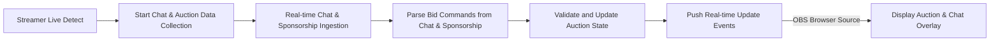

# Detailed Design for Auction Platform Real-Time Auction and Chat Integration

## 1. Overview
The Auction Platform service is designed to enable dynamic real-time auctions where users (team leaders) bid on auctioned users registered with detailed profiles including gaming statistics. The platform integrates real-time chat and sponsorship inputs from the Chijijik API to update auction bids dynamically, allowing engagements directly through streaming chat or channel sponsorship.

### Purpose
This document translates business goals into explicit functional requirements, focusing on how real-time chat and sponsorship inputs interact with the auction system to provide an engaging live bidding experience.

## 2. Business Model

### Why This Service Exists
- Fulfills a niche in eSports-related auction platforms by combining live streaming chat with auction mechanics.
- Addresses demand for real-time participatory auctions among competitive gaming teams.

### Revenue Streams
- Auction fees collected from teams for participation.
- Sponsorship and advertising integration.

### Value Proposition
- Real-time, interactive auction experience merging gaming stats and live chat sponsorship.
- Scalable platform supporting multiple auction rooms linked to streamers and calendars.

## 3. User Roles and Authentication

### User Roles
- Guest: Can view some auction data and register
- Member (Team Leader): Authenticated, can participate in auctions and place bids
- Admin: Manage users, auctions, schedules, and API integrations

### Authentication Flow
- Email/password based login with JWT authentication tokens
- Role-based access control enforced at API level

## 4. Functional Requirements

### 4.1 Auction Management
- Auction rooms can be created with calendar scheduling (start mandatory, end optional)
- Users can be listed as auction items with detailed metadata
- Members (team leaders) have a limited point budget to bid
- Bids can come via chat messages or sponsorship inputs reflected live
- Auction winners determined by highest bid at auction close

### 4.2 Real-Time Chat and Sponsorship Integration
- Real-time ingestion of chat messages and sponsorship notifications via Chijijik API
- Mapping of sponsorships and chat commands to bid increments
- Rate limiting applied to avoid overload on streaming message ingestion
- Chat message storage tied to streaming state (only when streamer is live)

### 4.3 Schedule and Calendar Management
- Flexible calendar with optional end times per schedule
- Icon purchases represent calendar events visually
- Sound and animation are customizable via uploader in admin

### 4.4 Real-Time Updates and Notifications
- WebSocket or Server-Sent Events (SSE) to push real-time auction and chat updates
- Notifications sent on bidding, outbidding, and auction closure

### 4.5 OBS Integration
- Browser source URLs created for chat and auction UI
- Integrate both chat and auction displays for streamer overlays

## 5. Business Rules and Validation
- Only live streamers have active chat and auction sessions
- Points cannot be exceeded beyond budget during bids
- Bids from chat or sponsorship commands parsed and validated
- Auctions respect start and optional end times
- Rate limits prevent spam and overload

## 6. Error Handling and Recovery
- Validation failures respond with precise error messages
- System handles API downtime gracefully with cached last state
- Recovery mechanisms for temporary communication failure

## 7. Performance Expectations
- Real-time updates delivered within 1 second latency
- System supports at least 50 concurrent auctions and 1000 simultaneous chat messages

## 8. External Integrations
- Chijijik API for chat and sponsorship
- Payment middleware for sponsorship processing
- OBS streaming for overlay integration

## 9. Data Flow and Event Processing

## 10. Security and Compliance
- Authentication using JWT tokens with role validation
- Logging and auditing of all bidding and chat events
- Data privacy compliant with applicable regulations

> This document provides business requirements only. All technical implementation decisions including database schemas, API routes, and technical architecture are to be determined by backend developers with full autonomy. The document specifies WHAT needs to be built, not HOW.
