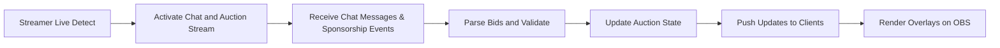

# Real-Time Auction Platform Business Requirements

## 1. Overview and Business Model

The platform enables real-time auctions where registered users (auction candidates) are bid upon by team leaders using limited points. Integration with the Chijijik API allows real-time ingestion of chat and sponsorship data that influence auction bids live. The platform is designed to support multiple concurrent auction rooms associated with streamer schedules and includes OBS overlay compatibility.

### 1.1 Why the Business Exists

- To provide an engaging, interactive auction experience for eSports communities.
- To enable transparent and dynamic auctions with real-time updates.
- To support streamers and their audiences with integrated chat and sponsorship interaction.

### 1.2 Revenue Streams

- Auction participation fees
- Sponsorship-driven advertising
- Paid features for customization and enhanced interaction

## 2. User Roles and Authentication

### 2.1 Roles

| Role          | Description                                  |
|---------------|----------------------------------------------|
| Guest         | Public viewer with limited access            |
| Team Leader   | Authenticated user who bids and manages teams|
| Admin         | Full system control and configuration rights |

### 2.2 Authentication

- THE system SHALL support JWT-based authentication.
- THE system SHALL enforce role-based permissions for API access and business functions.

## 3. Functional Requirements

### 3.1 Auction Room and User Registration

- WHEN a streamer creates an auction room with a scheduled start time (mandatory) and an optional end time,
  THE system SHALL register the room on the platform calendar.
- THE system SHALL allow registration of auction candidates (users) with detailed profiles including game stats.

### 3.2 Bid and Sponsorship Processing

- WHEN a bid is submitted via chat message or sponsorship input,
  THE system SHALL parse the bid, validate point sufficiency, and update the auction's highest bid in real time.
- THE system SHALL enforce rate limits on chat and sponsorship bid submissions to maintain system stability.

### 3.3 Schedule and Calendar Management

- THE system SHALL allow CRUD operations on auction schedules.
- THE system SHALL enable calendar icon purchases with a separate point system for visual indicators.

### 3.4 Real-Time Updates and Notifications

- THE system SHALL deliver real-time auction and chat updates via WebSocket or SSE.
- THE system SHALL provide OBS-compatible browser source URLs for live auction and chat overlays.

## 4. Business Rules and Validation

- Bid amounts SHALL NOT exceed the bidding team leader's available points.
- Only bids placed during active auction periods SHALL be accepted.
- Chat messages SHALL be uniquely identified by Chijijik IDs and stored conditionally when the streamer is live.
- Sponsorships SHALL be recorded with donor name, amount, and message content.
- Uploading of custom animation files SHALL be validated and managed by administrators.
- Rate limiting SHALL be applied per user and stream to prevent abuse.

## 5. Error Handling and Recovery

- IF a bid is invalid due to insufficient points,
  THEN THE system SHALL reject the bid and notify the user immediately.
- IF the streamer is offline, chat collection SHALL pause until the streamer resumes broadcasting.
- System errors SHALL be logged and monitored with retry mechanisms for external API failures.

## 6. Performance Requirements

- THE system SHALL process and broadcast real-time chat and auction updates within 500ms latency.
- THE system SHALL support at least 50 concurrent auction rooms and 5,000 simultaneous chat users.

## 7. External Integrations

- Integration with Chijijik API for real-time chat and sponsorship data.
- OBS streaming via browser source URLs to support live stream overlays.

## 8. Data Flow and Event Processing

## 9. Security and Compliance

- THE system SHALL implement secure JWT authentication with role management.
- Audit logs SHALL be maintained for all bid and data modifications.
- Data SHALL be encrypted in transit and storage per compliance requirements.

> This document provides business requirements only. All technical implementation decisions including architecture, APIs, database design, etc. are at the discretion of the development team. The document specifies WHAT needs to be built, not HOW.
