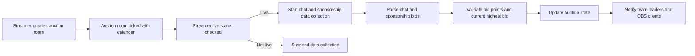

# 세부 API 및 실시간 처리 기능 설계

## 1. 서비스 개요 및 목표
본 시스템은 '경매 방' 단위로 사용자(팀장)가 경매 대상 유저에 제한된 포인트로 입찰하며, 치지직 API를 통한 실시간 채팅 및 후원 내역을 반영하여 입찰가가 변동되는 실시간 경매 플랫폼입니다. 입찰 및 후원 내역, 경매 상태를 실시간으로 갱신하여 OBS 브라우저 소스 연동용 UI에 제공하는 것을 목표로 합니다.

## 2. 사용자 역할 및 권한
- **스트리머(방장)**: 경매 방 생성 및 스케줄 관리, 입찰자 초대, 경매 상태 모니터링
- **팀장(입찰자)**: 포인트를 사용해 경매에 입찰, 입찰 현황 확인
- **일반 회원(유저)**: 경매 및 채팅 열람
- **관리자**: 시스템 환경 설정과 전체 경매 관리

## 3. 주요 기능 요구사항

### 3.1 경매 관리 기능
- WHEN 새로운 경매 방이 생성되면 THE 시스템 SHALL 캘린더에 연동하여 관리하고, 시작시간 필수, 종료시간 옵션으로 등록할 수 있어야 한다.
- THE 경매 방은 스트리머명이 식별자로 사용되고, 입찰 가능한 유저가 등록된다.
- THE 경매 방 내 팀장별 초기 포인트 자본이 할당되어야 한다.

### 3.2 실시간 채팅 및 후원 연동
- WHILE 스트리머가 방송중인 동안 THE 시스템 SHALL 치지직 API를 통해 채팅 메시지와 후원 데이터를 실시간으로 수집한다.
- THE 시스템 SHALL 수집된 메시지를 고유 치지직 ID를 기준으로 저장하고, 팀장 및 실시간 화면에 제공한다.
- THE 시스템 SHALL 채팅 및 후원 빈도에 대해 rate-limit 기능을 적용하여 시스템 과부하를 방지한다.

### 3.3 입찰 처리 및 검증
- WHEN 팀장이 채팅이나 후원을 통해 입찰가를 전송하면 THE 시스템 SHALL 해당 금액을 파싱하고 유효성을 검사한다.
- THE 입찰가는 팀장 포인트를 초과할 수 없으며, 현 최고가를 넘어야 한다.
- THE 시스템 SHALL 유효 입찰가를 반영하여 경매 상태를 갱신하고 이를 실시간으로 전파한다.

### 3.4 경매 상태 실시간 갱신
- THE 경매 상태는 채팅, 후원, 입찰 데이터를 반영하여 실시간으로 갱신된다.
- THE 시스템 SHALL WebSocket 또는 SSE를 통해 관련 유저 및 OBS 웹 소스에 상태 변화를 푸시한다.

### 3.5 OBS 연동 요구사항
- THE 시스템 SHALL 스트리머의 OBS에서 호출 가능한 웹페이지 형태의 브라우저 소스를 제공한다.
- THE OBS 브라우저 소스는 실시간 채팅과 경매 상태를 시각적으로 표시한다.

## 4. 업무 흐름 및 프로세스

### 4.1 경매 방 생성 및 스케줄 관리
- 스트리머가 경매 방을 생성하고 캘린더에 시작시간과 (선택적) 종료시간을 등록한다.
- 방장은 팀장을 초대하고 초기 포인트를 할당한다.

### 4.2 채팅 및 후원 데이터 수집 및 처리
- 방송중 스트리머 채널에 치지직 API를 통해 연동된 채팅과 후원 데이터가 지속적으로 수집된다.
- 수집된 데이터는 rate-limit 정책에 따라 필터링되고 저장된다.

### 4.3 입찰 시나리오
- 팀장은 채팅 또는 후원을 통해 입찰가를 입력할 수 있다.
- THE 시스템은 입찰가의 유효성을 즉시 검증하고, 유효 시 경매 상태와 포인트 잔액을 갱신한다.

### 4.4 실시간 데이터 푸시
- THE 시스템은 입찰 현황과 채팅, 후원 알림을 WebSocket 연결을 통해 관련 유저와 OBS 클라이언트에 전파한다.

## 5. 비즈니스 규칙 및 검증
- 입찰가는 현재 최고가보다 높아야 하며, 팀장의 포인트 잔액을 초과할 수 없다.
- 방송중이 아닐 경우 채팅과 후원 수집을 중단한다.
- 동일한 치지직 ID는 중복 저장하지 않는다.
- 경매 방 시작시간과 종료시간을 준수한다.
- 지정된 rate-limit 기준을 초과하는 요청은 차단한다.

## 6. 에러 처리 및 사용자 알림
- 부적절한 입찰가 입력 시 명확한 이유와 함께 거부 메시지를 반환한다.
- 채팅 API 오류 시 복구 절차를 수행하고 유저에게 서비스 장애 안내를 한다.
- OBS 연결 오류 발생 시 관리자에게 알림이 가도록 처리한다.

## 7. 성능 요구사항 및 확장성
- 입찰 및 채팅 이벤트는 1초 이내에 실시간 반영되어야 한다.
- 시스템은 40개 이상의 동시 경매 방과 1000명 이상의 동시 접속자를 지원한다.
- rate-limit 정책으로 시스템 부하를 안정적으로 관리한다.

## 8. 보안 및 인증
- 서비스 접속은 JWT 기반 인증을 통해 승인된 사용자만 가능하다.
- 각 역할별 권한을 엄격히 구분하여 행위를 제한한다.

## 9. 용어 정의 및 부록
- 경매 방: 스트리머 단위로 운영되는 경매별 캘린더 일정
- 팀장: 포인트를 가지고 입찰에 참여하는 사용자
- 치지직 ID: 치지직 API 상의 고유 사용자 식별자
- OBS: 방송 소프트웨어에서 실시간 콘텐츠를 브라우저 소스로 불러오는 시스템

---

> This document provides business requirements only. All technical implementation decisions including architecture, APIs, and database design are at the full discretion of the development team.