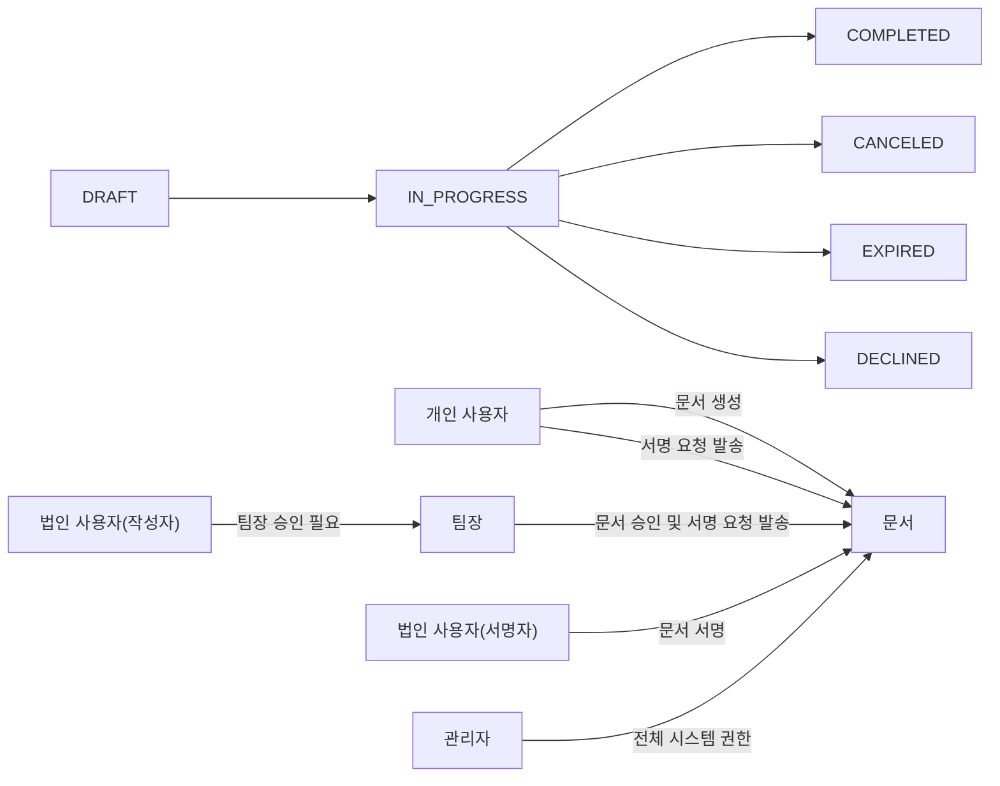

# EasySign 백엔드 요구사항 분석서

## 1. 서비스 개요 및 비즈니스 모델

EasySign은 계약의 모든 과정을 디지털화하여 사용자가 시간과 장소에 구애받지 않고 쉽고 빠르며 안전하게 계약을 체결할 수 있도록 지원하는 대한민국 대표 전자계약 서비스입니다. 기존 오프라인 계약 방식의 비효율성, 시간과 비용 문제, 위변조 위험을 해소하고 업무 생산성을 극대화하는 것을 목표로 합니다.

주요 목표 사용자는 프리랜서, 중소기업, 대기업으로 구분되며, 각 사용자 그룹에 맞는 적절한 역할과 권한 구조가 적용됩니다.

비즈니스 목표는 시장 점유율 1위 달성과 가입자 및 유료 전환율 증가, API 서비스 확대를 통한 B2B 연동 강화입니다.

### 성공 지표
- 월간 활성 사용자 수(MAU) 증가
- 계약서 발송 및 체결 건수 증가
- 계약 발송부터 완료까지 시간 단축
- 무료 사용자 대비 유료 전환율 증가
- 고객 만족도 지표(CSAT, NPS) 향상

## 2. 사용자 역할 및 인증 체계

### 2.1 사용자 그룹 및 역할
- 개인 사용자 (freelancerUser): 문서 생성 및 서명 요청, 승인 절차 없음
- 법인 사용자 (corporateUser): 문서 생성 후 팀장 승인 필요
- 팀장 (teamLeader): 법인 문서 검토 및 승인 권한 보유
- 관리자 (admin): 시스템 전체 권한 보유

### 2.2 권한 매트릭스

| 기능              | freelancerUser | corporateUser (Creator) | corporateUser (Signer) | teamLeader | admin |
|-------------------|----------------|------------------------|-----------------------|------------|-------|
| 문서 생성          | ✅             | ✅                     | ❌                    | ❌         | ✅    |
| 서명 요청 발송      | ✅             | ❌ (팀장 승인 필요)     | ❌                    | ✅         | ✅    |
| 문서 조회 및 서명   | ✅             | ✅                     | ✅                    | ✅         | ✅    |
| 문서 승인 및 검토   | ❌             | ❌                     | ❌                    | ✅         | ✅    |
| 사용자 및 시스템 관리 | ❌           | ❌                     | ❌                    | ❌         | ✅    |

### 2.3 인증 요구사항
- 이메일, 이름, 비밀번호 필수 입력
- JWT 및 OAuth 2.0 인증 방식
- Access Token 만료 15~30분, Refresh Token 7~30일
- 2단계 인증(2FA) 옵션 지원

## 3. 기능 요구사항

### 3.1 문서 업로드 및 변환
- PDF 우선 지원, DOCX, HWP, XLSX, PNG, JPG 확장 지원
- 자동 PDF 변환 프로세스
- 드래그앤드롭 UI 제공

### 3.2 서명 필드 배치 및 템플릿
- 서명, 텍스트, 체크박스, 날짜 필드 지원
- 서명자별 필드 배정 및 필수 입력 설정 기능
- 템플릿 저장 및 검색 지원

### 3.3 서명 요청 및 알림
- 이메일, 카카오톡, SMS 발송 지원
- 메시지 커스터마이징 및 서명 순서 지정

### 3.4 서명 입력 방식
- 링크를 통한 별도 회원가입 없이 서명 가능
- 그리기, 텍스트, 도장 방식 지원
- 공인인증서 등 추가 방식 고려 가능

### 3.5 문서 상태 및 대시보드
- 문서 상태 DRAFT, IN_PROGRESS, COMPLETED, CANCELED, EXPIRED, DECLINED 관리
- 대시보드에서 서명 진행 상황 실시간 제공

### 3.6 완료 문서 및 감사추적 인증서
- 최종 서명 완료 시 서명 이미지 PDF 삽입
- 읽기 전용 문서 및 감사추적 인증서 즉시 생성

## 4. 법적 효력 및 감사 관리

### 4.1 서명 이미지 삽입
- 모든 서명 완료 시점에 원본 PDF 내 서명 이미지 삽입
- 문서 읽기 전용 처리 및 무결성 보장

### 4.2 감사추적인증서 생성
- 계약 승인 즉시 실시간 생성 및 다운로드 지원
- 문서 정보, 서명자, 이벤트 로그 포함
- 무결성 검증을 위한 해시값 저장

### 4.3 블록체인 해시 기록
- 최종본 및 감사추적인증서 해시 결합 후 단일 트랜잭션 기록
- 비용 및 효율성을 고려한 최적화

## 5. 보안 및 권한 관리

### 5.1 데이터 암호화 및 키 관리
- AES-256 암호화 적용
- AWS KMS, Google Cloud KMS 키 관리
- 연 1회 이상 키 자동 순환

### 5.2 역할 기반 접근 제어
- RBAC 적용 및 최소 권한 원칙 준수
- 애플리케이션 레벨 소유권 기반 권한 검증

### 5.3 인증 및 2단계 인증
- JWT 인증 및 토큰 만료 정책
- 로그인, 중요 정보 변경 시 2FA 필수 적용

## 6. 에러 처리 및 예외 시나리오

- 지원 포맷 오류 시 명확한 메시지 제공
- 인증 실패 시 HTTP 401 및 오류 코드 반환
- 서명 요청 발송 실패 시 재시도 및 로그 기록
- 권한 없는 접근 시 HTTP 403 에러 반환

## 7. 성능 및 가용성

- 업로드 및 로딩 3초 이내 완료
- 99.9% 이상 가용성 유지
- 클라우드 기반 확장성 아키텍처

## 8. 용어 및 Mermaid 다이어그램

> EasySign 백엔드 요구사항 문서는 비즈니스 요구사항에 한정하며, 모든 기술 구현 사항은 개발팀에서 결정합니다. 시스템은 무엇을 해야 하는지 기술할 뿐이며, 구현 방법은 자유롭게 설계할 수 있습니다.