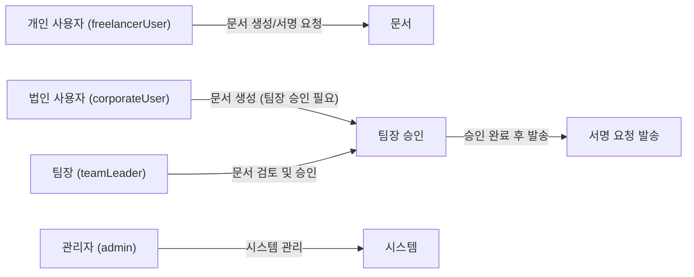

# EasySign 전자계약 서비스 백엔드 요구사항 분석서

## 1. 서비스 개요 및 비즈니스 모델
EasySign은 사용자가 시간과 장소에 구애받지 않고 쉽고 빠르며 안전하게 계약을 체결할 수 있는 대한민국 대표 전자계약 서비스다. 기존 오프라인 계약 방식의 시간 지연과 비용 낭비, 문서 위변조 위험을 해결하여 업무 효율성을 극대화한다.

### 1.1 비즈니스 모델
- 시장의 고객 니즈에 맞춰 빠르고 안전한 전자계약 서비스를 제공하여 시장 점유율을 확대한다.
- 기본적으로 개인 사용자는 직접 계약 문서를 생성하고 서명할 수 있으며 검토 단계가 없다.
- 법인 사용자는 계약서 생성 후 팀장이 반드시 검토 및 승인하여 문서가 확정되면 서명 요청을 발송한다.
- 수익 모델은 유료 구독 서비스 및 API 판매를 중심으로 한다.

## 2. 사용자 역할 및 권한
- 개인 사용자(freelancerUser): 문서 생성, 서명 요청, 서명 진행, 문서 조회 및 다운로드 권한 보유.
- 법인 사용자(corporateUser): 문서 작성 후 팀장 승인 필요, 승인 완료 문서에 대해 서명 요청 및 서명 가능.
- 팀장(teamLeader): 법인 계약서에 대한 검토 및 승인 권한 보유.
- 관리자(admin): 시스템 설정, 사용자 및 권한 관리 등 운영 전반 권한 보유.

## 3. 기능 요구사항

### 3.1 문서 준비 및 업로드
- WHEN 사용자가 계약 문서를 업로드하면, THE 시스템 SHALL PDF, DOCX, HWP, XLSX, PNG, JPG 포맷을 지원하며 업로드된 문서는 서버에서 표준 PDF로 변환된다.
- THE 시스템 SHALL 문서의 기본 정보(제목, 작성자, 상태 등)를 저장하고 문서 상태를 DRAFT로 설정한다.

### 3.2 서명 필드 배치 및 템플릿
- THE 시스템 SHALL 서명, 텍스트, 체크박스, 날짜 필드 배치를 드래그앤드롭 방식으로 지원한다.
- THE 시스템 SHALL 각 필드를 특정 서명자에게 할당하고 필수 입력 여부를 지정할 수 있다.
- WHERE 사용자가 템플릿 저장을 결정하면, THE 시스템 SHALL 현재 필드 배치 상태를 저장하여 재사용할 수 있도록 지원한다.

### 3.3 서명 요청 및 알림 발송
- THE 시스템 SHALL 이메일, 카카오톡, SMS를 통해 서명 요청 알림을 발송한다.
- THE 시스템 SHALL 서명자 별 서명 순서 지정 및 메시지 커스터마이징 기능을 제공한다.
- THE 시스템 SHALL 서명 진행 상태를 대시보드에서 실시간 모니터링할 수 있다.

### 3.4 서명 입력 및 완료 처리
- WHEN 서명자가 서명 링크를 클릭할 때, THE 시스템 SHALL 별도 회원가입 없이 문서에 접근하고 서명할 수 있도록 한다.
- THE 시스템 SHALL 그리기, 텍스트, 도장 업로드 방식을 지원한다.
- WHEN 모든 서명자가 완료되면, THE 시스템 SHALL 최종 PDF 문서에 서명 이미지를 지정 위치에 삽입하고 읽기 전용 처리한다.

### 3.5 감사추적 및 법적 효력 보장
- WHEN 계약서가 COMPLETED 상태가 되면, THE 시스템 SHALL 실시간으로 감사추적인증서를 생성하여 사용자가 다운로드할 수 있도록 한다.
- THE 시스템 SHALL 주요 감사 이벤트에 대해 해시값을 생성하여 무결성을 보장하며, 최종 해시는 블록체인에 단일 기록한다.

### 3.6 인증 및 권한 관리
- THE 시스템 SHALL JWT 기반 인증을 제공하며, Access Token과 Refresh Token을 발급한다.
- THE 시스템 SHALL 역할 기반 접근 통제(RBAC)를 적용하며, 사용자와 관리자를 구분한다.
- WHERE 2단계 인증이 적용될 경우, THE 시스템 SHALL 로그인, 비밀번호 변경 시 추가 인증을 요구한다.

### 3.7 오류 처리
- IF 문서 포맷이 지원되지 않으면, THEN THE 시스템 SHALL 사용자에게 명확한 오류 메시지를 제공한다.
- IF 서버 또는 네트워크 장애가 발생하면, THEN THE 시스템 SHALL 해당 오류를 기록하고 관리자에게 알린다.
- IF 서명 요청 발송 실패 시, THEN THE 시스템 SHALL 재시도 기능을 제공한다.

### 3.8 성능 및 가용성
- THE 시스템 SHALL 문서 업로드 및 페이지 로딩 시간을 3초 이내로 유지한다.
- THE 시스템 SHALL 연간 99.9% 이상의 가용성을 보장한다.

### 3.9 외부 연동
- THE 시스템 SHALL 이메일, 카카오톡, SMS 알림과 Google Drive, Dropbox, Zapier, Slack 연동을 제공한다.
- THE 시스템 SHALL RESTful API를 지원하여 외부 서비스와 통합할 수 있도록 한다.

## 4. 비즈니스 프로세스 및 워크플로우

### 4.1 개인 사용자 계약 프로세스
- 개인 사용자는 문서를 업로드하고, 서명 필드를 배치한다.
- 서명 요청을 이메일 또는 카카오톡으로 발송한다.
- 서명자가 별도 회원가입 없이 링크로 서명하고, 완료 알림을 받는다.
- 완료 문서를 다운로드하여 보관한다.

### 4.2 법인 사용자 계약 프로세스
- 계약 작성자는 문서 작성 후 팀장에게 검토 요청을 보낸다.
- 팀장은 문서를 승인하거나 반려한다.
- 승인된 문서는 서명자에게 서명 요청이 발송된다.
- 모든 서명이 완료되면 최종 서명본이 생성되고, 감사 증빙서가 발급된다.

## 5. 법적 효력 및 감사추적
- WHEN 계약이 COMPLETED 상태가 되면, THE 시스템 SHALL 최종 서명본 PDF에 서명 이미지 삽입을 수행한다.
- THE 시스템 SHALL 감사 이벤트를 실시간 기록하고, 감사증명서를 즉시 생성 및 다운로드 가능하게 제공한다.
- THE 시스템 SHALL 최종 문서 및 감사증명서 해시값을 결합하여 단일 블록체인 트랜잭션에 기록한다.

## 6. 보안 및 인증 요구사항
- THE 시스템 SHALL 저장 데이터에 AES-256 암호화를 적용하고, 키 관리는 AWS KMS 또는 Google Cloud KMS로 수행한다.
- THE 시스템 SHALL RBAC에 기반한 권한 관리를 제공하며, 최소 권한 원칙을 따른다.
- THE 시스템 SHALL JWT 토큰 기반 인증을 제공하며, 관리자와 일반 사용자 역할을 구분한다.
- WHERE 2단계 인증 기능이 활성화되면, THE 시스템 SHALL 로그인과 중요 정보 변경 시 2FA를 요구한다.

## 7. 에러 시나리오 및 회복
- IF 지원하지 않는 파일 포맷을 업로드하면, THEN THE 시스템 SHALL 사용자에게 포맷 오류 메시지를 제공한다.
- IF 서명 링크가 만료되거나 토큰 불일치인 경우, THEN THE 시스템 SHALL 접근 제한 메시지를 제공한다.
- IF 서명자가 서명을 거절하면, THEN THE 시스템 SHALL 서명 요청 상태를 DECLINED로 변경한다.
- IF 서명 요청 발송 실패 시, THEN THE 시스템 SHALL 재발송 및 실패 기록 기능을 제공한다.
- IF 인가되지 않은 사용자가 문서에 접근 시도 시, THEN THE 시스템 SHALL HTTP 403 에러를 반환한다.

## 8. 성능 및 가용성
- THE 시스템 SHALL 모든 문서 업로드 및 페이지 로딩 작업을 3초 이내에 처리한다.
- THE 시스템 SHALL 99.9% 이상의 서비스 가용성을 보장한다.

## 9. 외부 서비스 연동
- THE 시스템 SHALL 이메일, 카카오톡, SMS, Google Drive, Dropbox, Zapier, Slack 등 외부 서비스와 연동하여 문서 업로드, 알림, 자동화 기능을 제공한다.

# Mermaid Diagram: 서명 및 문서 라이프사이클
```mermaid
graph LR
  A["문서 업로드"] --> B{"서명 필드 배치 완료 여부"}
  B --|"예"| C["서명 요청 생성 및 발송"]
  B --|"아니오"| D["사용자에게 필드 배치 안내"]
  C --> E{"모든 서명 완료?"}
  E --|"예"| F["최종 서명본 생성 및 감사증적인증서 발행"]
  E --|"아니오"| G["서명 진행 상태 모니터링"]
  F --> H["사용자에 증빙서류 제공"]
  G --> I["서명자 알림 발송"]
  I --> J["서명 입력 (그리기, 텍스트, 도장) 지원"]
  J --> E
```

# Mermaid Diagram: 사용자 역할 및 권한 흐름



---

> This document provides business requirements only. All technical implementation decisions belong to developers. Developers have full autonomy over architecture, APIs, and database design. The document describes WHAT the system should do, not HOW to build it.