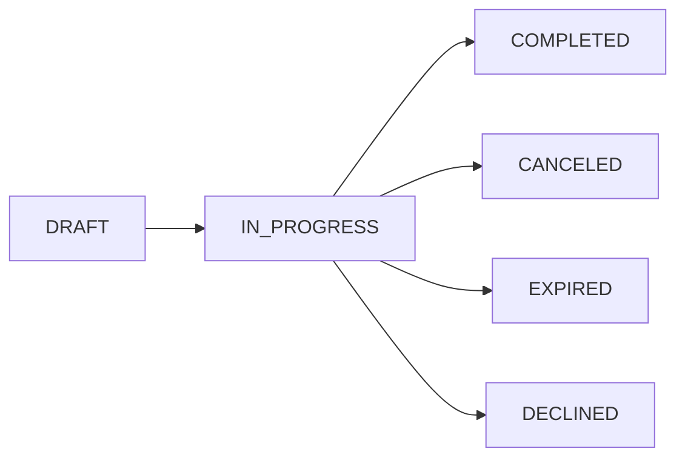
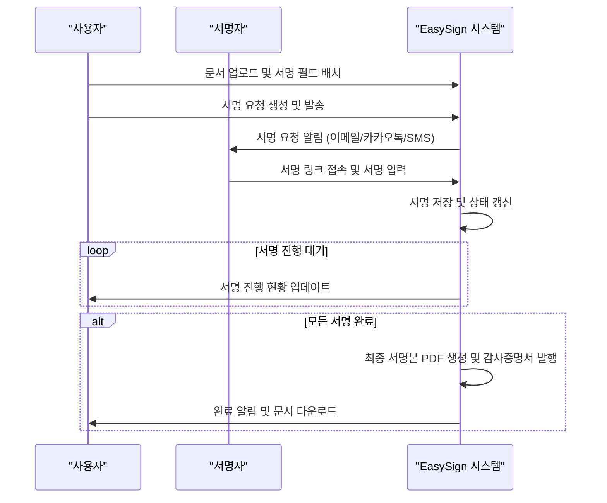

# EasySign 전자계약 서비스 백엔드 요구사항 문서

## 1. 서비스 개요
EasySign은 시간과 장소의 제약 없이 서명과 계약 관리가 가능한 대한민국 대표 전자계약 서비스이다. 계약 업무의 디지털 전환을 지원하며 법적 신뢰성과 편리성을 최우선 목표로 한다.

## 2. 사용자 역할 및 권한

### 2.1 사용자 구분
- 개인 사용자(freelancerUser): 문서 생성, 서명 요청, 서명 완료 권한을 보유하고 승인 절차 없이 직접 계약을 체결한다.
- 법인 사용자(corporateUser): 계약서를 생성하고 팀장의 승인 후 서명 요청을 발송한다.
- 팀장(teamLeader): 법인 사용자 계약서에 대한 검토 및 승인 권한이 있으며, 서명 요청을 발송한다.
- 관리자(admin): 시스템 전반 관리 권한 및 사용자 관리, 권한 분배를 총괄한다.

### 2.2 역할별 권한 매트릭스

| 기능                     | freelancerUser | corporateUser(작성자) | teamLeader | admin |
|------------------------|----------------|----------------------|------------|-------|
| 문서 생성 및 수정         | ✅             | ✅                   | ❌         | ✅    |
| 팀장 승인 요청           | ❌             | ✅                   | ❌         | ✅    |
| 문서 승인 및 서명 요청    | ❌             | ❌                   | ✅         | ✅    |
| 서명 요청 발송           | ✅             | ✅                   | ✅         | ✅    |
| 문서 서명                 | ✅             | ✅                   | ✅         | ✅    |
| 문서 조회 및 다운로드     | ✅             | ✅                   | ✅         | ✅    |
| 사용자 및 권한 관리       | ❌             | ❌                   | ❌         | ✅    |

## 3. 데이터 모델 개요
서비스의 주요 데이터 모델은 문서(Document), 서명 요청(SignRequest), 서명자(Signatory), 템플릿(Template), 감사추적 이벤트(AuditEvent)로 구성된다. 이들 모델은 사용자 및 문서 간 관계를 기반으로 운용된다.

## 4. 기능 요구사항

### 4.1 사용자 인증 및 권한 관리
- WHEN 사용자가 회원가입을 요청하면, THE 시스템 SHALL 이름, 이메일, 비밀번호를 필수로 수집하고 저장한다.
- WHEN 사용자가 로그인하면, THE 시스템 SHALL JWT 기반 인증 방식을 통해 액세스 토큰과 리프레시 토큰을 생성한다.
- WHERE OAuth 2.0 로그인이 활성화된 경우, THE 시스템 SHALL 구글 및 카카오 로그인을 지원한다.
- WHERE 법인 사용자 팀장 권한이 필요한 경우, THE 시스템 SHALL 해당 사용자에게 승인 및 문서 검토 권한을 부여한다.

### 4.2 문서 업로드 및 관리
- WHEN 사용자가 문서를 업로드하면, THE 시스템 SHALL PDF, DOCX, HWP, XLSX, PNG, JPG 형식의 파일을 지원한다.
- WHEN 문서가 업로드되면, THE 시스템 SHALL 자동으로 PDF로 변환하여 표준화된 포맷으로 저장한다.
- WHEN 문서를 생성하면, THE 시스템 SHALL 문서 상태를 DRAFT로 설정한다.
- WHEN 서명 요청을 최초 발송할 때, THE 시스템 SHALL 문서 상태를 IN_PROGRESS로 변경한다.
- WHEN 서명이 완료되면, THE 시스템 SHALL 문서 상태를 COMPLETED로 변경한다.

### 4.3 서명 요청 및 처리
- WHEN 서명 요청을 생성하면, THE 시스템 SHALL 각 서명자에 대해 이름, 이메일, 연락처, 서명 순서, 상태 정보를 저장한다.
- WHEN 서명 요청이 발송되면, THE 시스템 SHALL 고유 액세스 토큰을 생성하여 서명 링크의 보안을 보장한다.
- WHEN 서명자가 서명 링크에 접근하면, THE 시스템 SHALL 웹 브라우저 기반 서명 입력 UI를 제공한다.
- WHEN 서명 입력이 시작되면, THE 시스템 SHALL 그리기, 텍스트, 도장 입력 방식을 모두 지원한다.
- WHEN 모든 서명이 완료되면, THE 시스템 SHALL 최종 서명본 PDF에 서명 이미지를 삽입한다.

### 4.4 템플릿 및 대량 서명 요청
- WHERE 사용자가 템플릿 저장을 요청하면, THE 시스템 SHALL 현재 필드 배치, 크기, 종류, 담당 서명자 정보를 JSON 형식으로 저장한다.
- WHEN 다수 서명자에게 서명 요청을 발송할 때, THE 시스템 SHALL 이메일, 카카오톡, SMS 채널을 통한 대량 발송 기능을 제공한다.

### 4.5 법적 효력 및 감사 기능
- WHEN 문서 상태가 COMPLETED로 전환되면, THE 시스템 SHALL 원본 PDF에 서명 이미지들을 삽입하여 읽기 전용 최종본을 생성한다.
- WHEN 문서가 완료될 때, THE 시스템 SHALL 문서 및 전자서명 활동에 관한 모든 이벤트 데이터를 시간순으로 기록한 감사추적인증서를 즉시 생성하여 제공한다.
- WHERE 블록체인 해시 기록 조건이 충족되면, THE 시스템 SHALL 최종 서명 완료본 PDF와 감사증명서의 해시를 결합하여 블록체인에 단일 트랜잭션으로 기록한다.

### 4.6 보안 요구사항
- THE 시스템 SHALL 저장 데이터에 대해 AES-256 암호화를 적용한다.
- THE 시스템 SHALL AWS KMS 또는 유사한 중앙 키관리 시스템을 이용해 키의 생성, 순환 및 폐기를 체계적으로 수행하며, 최소 연 1회 이상의 키 순환 정책을 운영한다.
- THE 시스템 SHALL 역할 기반 접근 제어(RBAC)를 구현하고 최소 권한 원칙을 엄격히 준수한다.
- THE 시스템 SHALL JWT 인증 방식을 기반으로 관리자와 일반 사용자의 권한을 분리 관리한다.
- WHERE 2단계 인증이 발생하면, THE 시스템 SHALL 로그인 및 중요 정보 변경 시 추가 인증을 요구한다.

### 4.7 예외 처리 및 에러 시나리오
- IF 지원하지 않는 파일 포맷이 업로드되면, THEN THE 시스템 SHALL 사용자에게 명확하고 즉각적인 오류 메시지를 제공한다.
- IF 서명 요청 발송이 실패할 경우, THEN THE 시스템 SHALL 자동 재시도와 실패 내역 기록 및 알림 기능을 제공한다.
- IF 서명 링크가 만료되거나 유효하지 않으면, THEN THE 시스템 SHALL 접근 거부 메시지를 출력하고 재요청 절차를 안내한다.
- IF 서명자가 서명을 거부하는 경우, THEN THE 시스템 SHALL 서명 요청 상태를 DECLINED로 변경하고 관련자에게 알림을 전송한다.

### 4.8 성능 및 가용성 요구사항
- THE 시스템 SHALL 문서 업로드 및 웹페이지 로딩 응답 시간을 3초 이내로 유지한다.
- THE 시스템 SHALL 99.9% 이상의 서비스 가용성을 보장한다.
- THE 시스템 SHALL 사용자 및 트래픽 증가에 대비하여 클라우드 기반 수평 확장 아키텍처를 적용한다.

# 5. 비즈니스 프로세스 및 사용자 시나리오

## 5.1 개인 사용자 프로세스
- 개인 사용자는 계약서 생성, 서명 필드 배치, 서명 요청 발송, 서명 완료, 계약서 저장 및 다운로드를 독립적으로 수행한다.

## 5.2 법인 사용자 프로세스
- 법인 사용자는 계약서 초안 작성 후 팀장 승인 요청하고
- 팀장은 문서 승인 시 서명 요청 발송을 트리거하며
- 서명자는 링크를 통해 서명하고
- 시스템은 완성된 서명본과 감사추적인증서를 생성하고 저장한다.

## 5.3 문서 상태 전이 흐름

# 6. Mermaid 다이어그램

### 6.1 서명 요청 프로세스 시퀀스

---

> 이 문서는 EasySign 전자계약 서비스의 백엔드 비즈니스 요구사항만을 정의하며, 모든 기술적 구현은 개발팀 재량으로 결정됩니다.