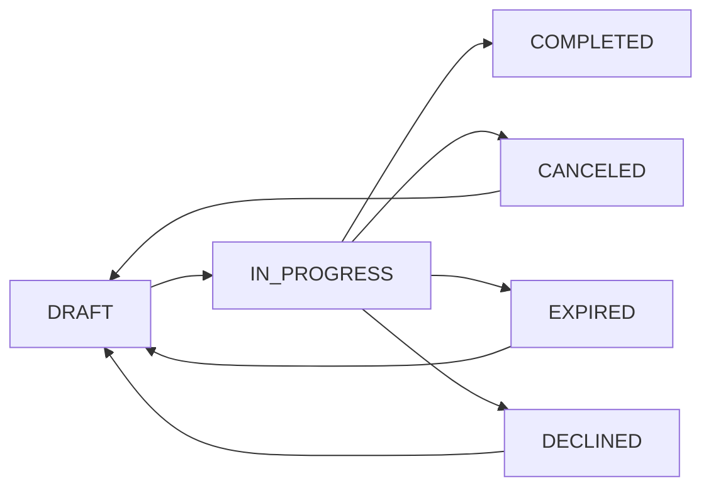

# EasySign 전자계약 서비스 백엔드 요구사항

## 1. 서비스 개요

EasySign 전자계약 서비스는 계약 과정을 시간과 장소에 구애받지 않고 쉽고, 빠르고, 안전하게 진행할 수 있도록 지원한다. 기존의 계약 방식에서 발생하는 서류 출력, 대면, 우편 발송 등의 비효율 요소를 제거하고, 문서 위변조와 분실 위험을 줄이며, 체계적인 문서 관리와 법적 효력 보장을 제공한다.

### 비즈니스모델

EasySign은 프리랜서, 중소기업, 대기업 등 다양한 고객층을 대상으로 온라인 전자계약 서비스를 제공한다. 주요 수익원은 유료 구독 서비스 및 API 판매이다. 사용자 편의성과 법적 신뢰성을 극대화함으로써 전자계약 시장 점유율 1위를 목표로 한다.

### 사용자 역할 및 권한 체계

- 개인 사용자 (freelancerUser): 계약서 생성 및 서명 요청, 서명 진행에 대해 별도의 검토 없이 즉시 문서를 관리할 수 있다.

- 법인 사용자 (corporateUser): 계약서 생성 후 팀장(또는 승인자)의 검토 및 승인이 필수적이며, 승인 완료 후 서명 요청이 발송된다. 계약 당사자는 문서를 조회하고 서명할 수 있다.

- 팀장 (teamLeader): 법인 계약서에 대한 검토 및 승인 권한을 가지며, 서명 요청 발송 권한이 있다.

- 관리자 (admin): 시스템 전반 권한을 가지고 사용자 및 시스템 설정을 관리할 수 있다.

## 2. 사용자 시나리오

### 2.1 프리랜서 사용자 '하나'

- 문서 템플릿을 불러와 필요한 정보 수정
- 서명 요청을 이메일, 카카오톡으로 발송
- 서명 완료 시 즉시 알림 받고 완료 문서 다운로드

### 2.2 법인 사용자 '민준'

- 표준 근로계약서 업로드 및 서명 필드 지정
- 서명자 목록을 입력하여 대량 서명 요청 발송
- 대시보드에서 서명 진행 현황 및 미서명자 리마인더 관리

### 2.3 대기업 법무팀 '지연'

- 내부 시스템과 API 연동으로 계약 자동 등록 및 승인
- 서명 요청 발송 및 서명 완료 문서 자동 저장
- 계약 전 과정을 로그로 감사 가능

## 3. 기능 요구사항

### 3.1 회원가입 및 인증

- WHEN 사용자가 이름, 이메일, 비밀번호를 입력하고 회원가입을 시도하면, THE 시스템 SHALL 사용자 정보를 저장하고 JWT 기반 인증 토큰을 발급한다.

- WHERE OAuth 2.0 방식으로 구글, 카카오 계정을 이용한 소셜 로그인 기능을 제공한다.

### 3.2 문서 업로드 및 변환

- WHEN 사용자가 PDF, DOCX, HWP, XLSX, PNG, JPG 중 하나의 형식으로 문서를 업로드하면, THE 시스템 SHALL 이를 PDF로 변환하고 무결성을 위해 해시값을 저장한다.

- THE 시스템 SHALL 문서 상태를 DRAFT로 설정하고 생성 및 수정 일시를 기록한다.

### 3.3 서명 필드 배치 및 서명 요청

- THE 시스템 SHALL 다양한 필드(서명, 텍스트, 체크박스, 날짜)에 대해 드래그앤드롭 위치 지정 기능을 제공한다.

- THE 시스템 SHALL 각 필드를 특정 서명자에게 할당할 수 있고, 필수 입력 필드를 지정할 수 있다.

- WHEN 서명 요청이 생성되어 발송되면, THE 시스템 SHALL 각 서명자에게 고유한 접근 토큰을 포함한 링크를 이메일, 카카오톡, SMS로 발송한다.

### 3.4 서명 입력 및 완료

- WHEN 서명자가 링크를 통해 문서에 접속하면, THE 시스템 SHALL 반응형 UI를 제공하여 그리기, 텍스트, 도장 방식의 서명 입력을 지원한다.

- WHEN 모든 서명자가 서명을 완료하면, THE 시스템 SHALL 최종 서명본 PDF에 모든 서명 이미지를 삽입하고 문서 상태를 COMPLETED로 변경한다.

### 3.5 감사 추적 및 법적 효력 보장

- WHEN 문서 상태가 COMPLETED가 되면, THE 시스템 SHALL 즉시 감사추적인증서를 생성하여 사용자에게 제공한다.

- THE 시스템 SHALL 감사추적인증서에 문서 제목, 서명자 정보, IP, 타임스탬프 등 모든 활동 로그를 포함한다.

- THE 시스템 SHALL 블록체인에 최종 문서 및 감사추적 인증서 해시값 결합체를 단일 트랜잭션으로 기록한다.

### 3.6 알림 및 대량 발송 기능

- THE 시스템 SHALL 이메일, 카카오톡, SMS를 통한 서명 요청 발송 기능을 제공한다.

- WHERE 다수 서명자에 대해 대량 발송을 수행할 때, THE 시스템 SHALL 발송 현황을 대시보드에서 실시간 감시할 수 있다.

### 3.7 API 연동 및 외부 서비스 통합

- THE 시스템 SHALL RESTful API를 제공하여 문서 업로드, 서명 요청, 진행 상태 조회, 문서 다운로드 기능을 지원한다.

- THE 시스템 SHALL Zapier, Google Drive, Slack 등 주요 SaaS와 연동 기능을 지원한다.

## 4. 비기능 요구사항

### 4.1 보안 요구사항

- THE 시스템 SHALL AES-256 방식으로 저장 데이터 암호화 및 AWS KMS, Google Cloud KMS와 같은 전문 키 관리 시스템을 이용한다.

- THE 시스템 SHALL 역할 기반 접근 제어(RBAC)를 통해 관리자, 팀장, 법인 사용자, 개인 사용자별 권한을 엄격히 분리한다.

- THE 시스템 SHALL JWT 기반 인증을 제공하고, 로그인 및 민감 정보 변경 시 2단계 인증을 지원한다.

### 4.2 성능 및 가용성

- THE 시스템 SHALL 문서 업로드 및 페이지 로딩을 3초 이내에 완료한다.

- THE 시스템 SHALL 99.9% 이상의 가용성을 유지하며, 클라우드 아키텍처를 사용하여 확장성을 보장한다.

## 5. 비즈니스 규칙 및 오류 처리

### 5.1 문서 상태 관리

- WHEN 문서를 처음 생성하면, THE 시스템 SHALL 문서 상태를 DRAFT로 설정한다.
- WHEN 서명 요청이 발송되면, THE 시스템 SHALL 상태를 IN_PROGRESS로 변경한다.
- WHEN 모든 서명자가 서명을 완료하면, THE 시스템 SHALL 상태를 COMPLETED로 변경한다.
- WHEN 발송자가 서명 요청을 취소하면, THE 시스템 SHALL 상태를 CANCELED로 변경한다.
- WHEN 서명 기한이 만료되면, THE 시스템 SHALL 상태를 EXPIRED로 변경한다.
- WHEN 서명자가 서명을 거부하면, THE 시스템 SHALL 상태를 DECLINED로 변경한다.

### 5.2 권한 관리

- THE 시스템 SHALL 사용자별 문서 소유권을 강력히 검증하여 권한 없는 접근을 차단한다.
- THE 시스템 SHALL 팀장 승인 없이는 법인 문서가 서명 요청 단계로 넘어가지 않는다.
- THE 시스템 SHALL 역할에 따라 접근 가능한 API 기능을 제한하며 권한 없는 접근은 HTTP 403 에러를 반환한다.

### 5.3 오류 처리

- IF 인증 실패 시, THEN THE 시스템 SHALL HTTP 401 에러 및 인증 실패 코드를 클라이언트에 전달한다.
- IF 지원하지 않는 문서 포맷 업로드 시, THEN THE 시스템 SHALL 사용자에게 명확한 오류 메시지를 보여준다.
- IF 서명 링크가 만료되거나 유효하지 않으면, THEN THE 시스템 SHALL 서명 불가 메시지와 재요청 방법 안내를 제공한다.
- IF 서명자가 서명을 거절하면, THEN THE 시스템 SHALL 해당 서명 요청을 DECLINED 상태로 변경하고 관련자에게 알린다.

## 6. 전체 시스템 데이터 흐름

> 이 문서는 EasySign 전자계약 서비스 백엔드 개발을 위한 완전하고 구체적인 비즈니스 요구사항을 담고 있으며, 모든 기술 구현 세부사항은 개발팀의 재량에 따릅니다. 시스템은 무엇을 해야 하는지 명확히 설명하며, 어떻게 구현하는지는 개발자가 자유롭게 결정할 수 있습니다.