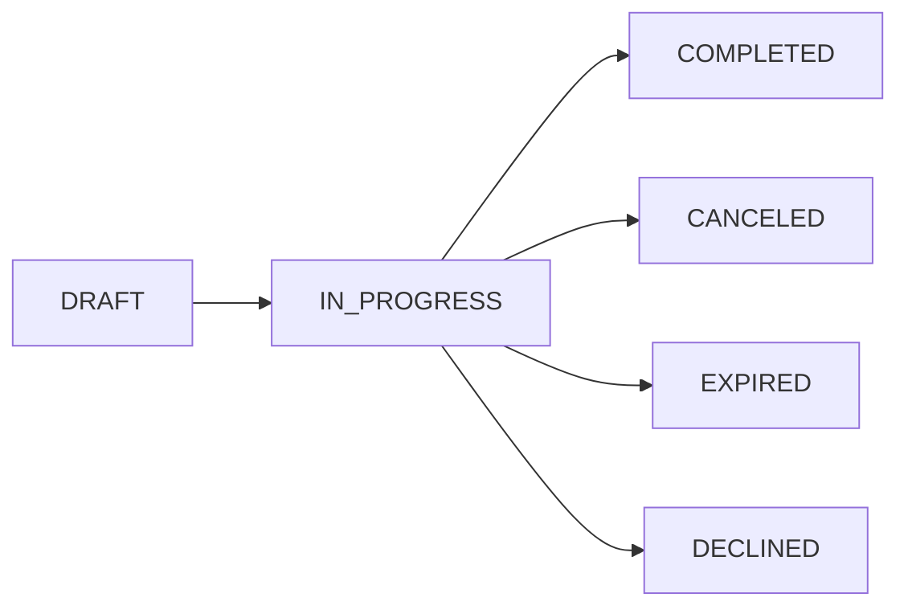

# EasySign 전자계약 서비스 백엔드 요구사항 분석서

## 1. 서비스 개요

EasySign은 시간과 장소에 구애받지 않고 쉽고 빠르며 안전하게 계약을 체결할 수 있는 대한민국 대표 전자계약 서비스이다. 기존 종이 기반 오프라인 계약 방식의 비효율성을 개선하고, 법적 효력을 갖춘 전자서명의 신뢰성을 확보하여 사용자에게 높은 업무 효율성을 제공함을 목적으로 한다.

### 1.1 비즈니스 모델

- 계약의 디지털화를 통해 계약서 작성, 발송, 서명, 보관, 증빙 등 전 과정을 온라인에서 처리할 수 있도록 지원한다.
- 주요 사용자로는 프리랜서, 중소기업 담당자, 대기업 법무팀이 있으며, 각각의 니즈에 맞춘 맞춤형 기능을 제공한다.
- 수익 모델은 기본 무료 회원제와 유료 프리미엄 서비스, API 라이선스 판매로 구성되며, B2B 파트너십을 통한 확장도 추진한다.

## 2. 사용자 역할 및 인증 요구사항

### 2.1 사용자 역할 및 권한

- 개인 사용자는 계약 문서 생성 및 직접 서명이 가능하며, 승인 절차가 필요하지 않다.
- 법인 사용자는 계약서 작성 후 팀장이 검토 및 승인하여야 하며, 승인 완료된 계약서만 서명 요청이 가능하다.
- 팀장은 법인 사용자 내에서 계약서 검토 및 승인 권한을 갖는다.
- 관리자는 시스템 전반에 대한 관리 권한을 보유한다.

### 2.2 인증 및 권한 관리

- 회원가입 시 이름, 이메일, 비밀번호를 필수로 수집하여 JWT 기반 인증 시스템을 제공한다.
- 소셜 로그인(Google, Kakao) 지원으로 간편한 인증 환경을 제공한다.
- 로그인 성공 시 Access Token과 Refresh Token을 발급하며, Access Token의 유효 기간은 15~30분, Refresh Token은 7~30일로 설정한다.
- Role-Based Access Control(RBAC)을 통해 역할별 세분화된 권한을 관리한다.
- 2단계 인증(2FA)을 로그인 및 민감 정보 변경 시 적용한다.

## 3. 문서 및 서명 관리

### 3.1 문서 업로드 및 변환

- PDF, DOCX, HWP, XLSX, PNG, JPG 포맷을 지원하며, 서버에서 표준 PDF 포맷으로 변환한다.
- 문서 업로드 시 원본 파일 해시(SHA-256)를 저장하여 위변조를 방지한다.
- 문서 상태는 DRAFT, IN_PROGRESS, COMPLETED, CANCELED, EXPIRED, DECLINED로 관리한다.

### 3.2 서명 필드 배치 및 템플릿

- 서명, 텍스트, 체크박스, 날짜 필드를 지원하고, 드래그 앤 드롭 방식으로 배치 가능하다.
- 각 필드는 특정 서명자에게 할당되며, 필수 입력 여부를 지정할 수 있다.
- 필드 배치 상태를 템플릿으로 저장, 관리, 불러오기 기능을 제공한다.

### 3.3 서명 요청 및 서명 처리

- 이메일, 카카오톡, SMS 채널을 통해 서명 요청을 발송한다.
- 서명자는 별도 회원가입 없이 링크를 통해 언제 어디서든 서명할 수 있다.
- 서명 방식은 그리기, 텍스트, 도장 업로드를 지원한다.
- 서명 완료 시 최종 문서에 서명 이미지를 삽입하고 읽기 전용 문서로 생성한다.

## 4. 계약 프로세스 및 상태 전이

### 4.1 계약 흐름

```mermaid
graph LR
  A["문서 업로드"] --> B{"서명 필드 배치 완료?"}
  B --|"예"| C["서명 요청 발송"]
  B --|"아니오"| D["필드 배치 요청"]
  C --> E{"모든 서명 완료?"}
  E --|"예"| F["최종 서명본 생성 및 저장"]
  E --|"아니오"| G["서명 진행 상태 모니터링"]
  F --> H["감사추적인증서 생성 및 제공"]

  subgraph 서명 요청 발송
    I["서명자 이메일/카카오톡으로 링크 발송"]
  end

  subgraph 서명 입력
    J["그리기, 텍스트, 도장 입력 방식 지원"]
  end

  G --> I
  I --> J
  J --> E
```

### 4.2 문서 상태 전이



## 5. 법적 효력 및 감사 추적

- WHEN 모든 서명이 완료되어 문서 상태가 COMPLETED가 되면, THE 시스템 SHALL 지정된 좌표에 서명 이미지를 PDF 문서에 삽입하고 읽기 전용으로 최종 서명본을 생성한다.
- WHEN 계약 상태가 COMPLETED로 변경되면, THE 시스템 SHALL 즉시 감사추적인증서를 생성하고 사용자에게 다운로드할 수 있도록 제공한다.
- WHERE 계약 완료 시, THE 시스템 SHALL 최종 서명본과 감사추적인증서의 해시값 결합 결과를 단일 블록체인 트랜잭션으로 기록한다.

## 6. 보안 및 권한 관리

- THE 시스템 SHALL 저장 데이터에 AES-256 암호화를 적용한다.
- THE 시스템 SHALL AWS KMS와 같은 중앙화된 키 관리 시스템을 사용하여 키의 생성과 순환을 효율적으로 관리한다.
- THE 시스템 SHALL 역할 기반 접근 제어(RBAC)를 구현하여 최소 권한 원칙에 따른 접근 권한을 엄격히 관리한다.
- THE 시스템 SHALL JWT 기반 인증으로 세션을 관리하고, 관리자와 일반 사용자를 명확히 구분한다.
- WHERE 2단계 인증이 활성화되면, THE 시스템 SHALL 로그인과 중요 정보 변경 시 2FA 인증을 필수로 적용한다.

## 7. 오류 처리 및 예외 시나리오

- IF 사용자가 지원하지 않는 파일 형식을 업로드하면, THEN THE 시스템 SHALL 명확한 오류 메시지를 제공하고 업로드를 거부한다.
- IF 서명 링크가 만료거나 유효하지 않은 경우, THEN THE 시스템 SHALL 서명 불가 메시지와 재요청 방법 안내를 사용자에게 제공한다.
- IF 서명이 거절되면, THEN THE 시스템 SHALL 서명 요청 상태를 DECLINED로 변경하고 관련자에게 알림을 전송한다.
- IF 권한 없는 사용자가 문서에 접근하려 하면, THEN THE 시스템 SHALL HTTP 403 에러를 반환한다.

## 8. 성능 및 확장성

- THE 시스템 SHALL 문서 업로드 및 페이지 로딩을 3초 이내 완료한다.
- THE 시스템 SHALL 99.9% 이상의 가용성을 보장한다.
- THE 시스템 SHALL 클라우드 기반 아키텍처를 활용하여 트래픽 증가에 대응한다.

## 9. 부록

- 문서 상태: DRAFT, IN_PROGRESS, COMPLETED, CANCELED, EXPIRED, DECLINED
- 용어 정의 및 참고 문서 목록

> EasySign 전자계약 서비스 백엔드 요구사항 문서는 비즈니스 요구사항에 중점을 두며, 구체적인 기술 구현은 개발자 재량이다.