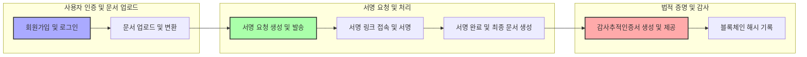

# EasySign 전자계약 서비스 백엔드 요구사항

## 1. 서비스 개요
### 1.1 비전 및 목표
EasySign은 계약의 모든 과정을 디지털화하여, 시간과 장소에 구애받지 않고 쉽고 빠르며 안전하게 계약을 체결할 수 있는 대한민국 대표 전자계약 서비스이다. 이 서비스는 기존 오프라인 계약 방식의 비효율성과 위험 요소를 해결하여 업무 효율성을 극대화하고 사용자 편의성을 향상시키는 것을 목표로 한다.

### 1.2 주요 사용자 및 역할 정의
- 개인 사용자(freelancerUser): 서명 요청과 계약 체결을 직접 진행하며 승인 절차가 필요 없다.
- 법인 사용자(corporateUser): 계약서 작성, 팀장의 승인 및 검토를 거쳐 최종 서명 요청이 진행된다.
- 팀장(teamLeader): 법인 사용자 중 계약 승인 및 관리 권한을 가진 사용자.
- 관리자(admin): 서비스 전반의 관리 및 운영 권한을 가진 관리자.

### 1.3 서비스 가치 및 성공 지표
- 계약 시간 단축 및 업무 효율성 향상
- 다양한 기기와 간편한 서명 인터페이스 제공
- 안전한 계약서 보관과 즉시 검색 기능
- 전자계약 시장 점유율 1위 및 가입자 증가
- 계약 완성 시간 단축, 활성 사용자 수, 전환율, 고객 만족도 지표 관리

## 2. 사용자 역할 및 권한
### 2.1 사용자 그룹 및 권한 체계
- 개인 사용자는 본인이 생성한 문서에 대한 모든 권한을 가지며 승인 과정 없이 계약 체결이 가능하다.
- 법인 사용자 계약서 생성자는 문서 작성 및 팀장 승인 요청 권한을 가진다.
- 법인 팀장(검토자)은 문서 승인 권한을 갖고, 승인된 계약서만 서명 요청 발송이 가능하다.
- 계약 당사자는 문서 열람과 서명 권한만 가진다.
- 관리자는 시스템 전체 접근 및 사용자를 관리하는 권한을 가진다.

### 2.2 역할별 권한 매트릭스
| 기능                       | freelancerUser | corporateUser (Creator) | teamLeader | admin |
|---------------------------|----------------|------------------------|------------|-------|
| 계약서 생성                | ✅             | ✅                     | ❌          | ✅     |
| 문서 승인                 | ❌             | ❌                     | ✅          | ✅     |
| 서명 요청 발송             | ✅             | ✅                     | ✅          | ✅     |
| 계약서 서명                | ✅             | ✅                     | ✅          | ✅     |
| 문서 조회 및 다운로드      | ✅             | ✅                     | ✅          | ✅     |
| 사용자 및 권한 관리        | ❌             | ❌                     | ❌          | ✅     |

### 2.3 인증 및 권한 관리 정책
- JWT(JSON Web Token) 기반 인증방식을 사용하며, Access 및 Refresh Token을 발급한다.
- 소셜 로그인(Google, Kakao) OAuth 2.0 방식을 지원한다.
- 2단계 인증(2FA)을 로그인 및 중요 정보 변경 시 적용한다.
- 최소 권한 원칙과 역할 기반 접근 제어(RBAC)를 철저히 시행한다.

## 3. 주요 데이터 모델
### 3.1 문서(Document)
- 고유 식별자, 작성자 정보, 제목, 원본 파일명, 저장 경로, 파일 해시, 상태, 생성 및 수정 일시, 완료 일시 포함.
- 상태는 DRAFT, IN_PROGRESS, COMPLETED, CANCELED, EXPIRED, DECLINED.
- 한 문서는 여러 서명 요청(SignRequest)를 가질 수 있다.

### 3.2 서명 요청(SignRequest)
- 고유 식별자, 연결 문서 ID, 서명자 이름과 이메일, 전화번호 옵션, 서명 순서, 상태, 액세스 토큰, 메시지, 생성 및 발송 일시 포함.

### 3.3 서명자(Signatory)
- 서명 고유 식별자, 요청 ID, 서명 이미지 경로, 서명 방식(DRAW, TEXT, STAMP), 서명 시간, IP, 사용자 에이전트 포함.

### 3.4 템플릿(Template)
- 고유 식별자, 생성자, 템플릿명, 설명, 원본 문서 경로, 필드 위치 및 정보, 생성 및 수정 일시 포함.

### 3.5 감사추적 이벤트(AuditEvent)
- 이벤트 고유 식별자, 문서 ID, 행위자 정보, 이벤트 종류(DOCUMENT_CREATED, REQUEST_SENT 등), 발생 시각, IP, 추가 상세 정보, 이벤트 해시 포함.

## 4. 기능 요구사항
### 4.1 사용자 인증 및 권한 관리
- WHEN 사용자가 이메일, 이름, 비밀번호로 회원가입을 요청할 때, THE 시스템 SHALL 회원 정보를 저장하고 검증한다.
- WHEN 사용자가 로그인하면, THE 시스템 SHALL JWT 기반 Access 및 Refresh Token을 발급한다.
- WHERE OAuth 로그인 요청 시, THE 시스템 SHALL Google 및 Kakao 소셜 로그인을 지원한다.
- WHEN 사용자의 권한 변경이 발생하면, THE 시스템 SHALL 역할과 권한을 즉시 반영한다.

### 4.2 문서 업로드 및 변환
- WHEN 사용자가 문서를 업로드하면, THE 시스템 SHALL PDF, DOCX, HWP, XLSX, PNG, JPG 포맷을 지원한다.
- WHEN 문서가 업로드되면, THE 시스템 SHALL 표준 PDF 포맷으로 변환한다.
- WHEN 문서 업로드 완료 후, THE 시스템 SHALL 문서 상태를 DRAFT로 설정한다.

### 4.3 서명 필드 배치
- THE 시스템 SHALL 드래그앤드롭 방식으로 서명, 텍스트, 체크박스, 날짜 필드를 배치할 수 있게 한다.
- WHEN 필드를 배치할 때, THE 시스템 SHALL 각 필드에 대해 담당 서명자를 지정할 수 있다.
- WHERE 필드가 필수 입력일 경우, THE 시스템 SHALL 서명 완료 전까지 입력이 필수임을 검증한다.

### 4.4 서명 요청 및 서명 처리
- WHEN 서명 요청이 생성되면, THE 시스템 SHALL 각 서명자에게 고유 보안 토큰과 함께 서명 요청 링크를 이메일 또는 카카오톡, SMS로 발송한다.
- WHEN 서명자가 링크에 접속하면, THE 시스템 SHALL 문서를 원활하게 표시하고 서명 입력 기능을 제공한다.
- THE 시스템 SHALL 그리기, 텍스트, 도장 방식의 서명 입력 방식을 지원한다.
- WHEN 모든 서명이 완료되면, THE 시스템 SHALL 최종 서명본에 서명 이미지를 삽입한다.

### 4.5 완료 문서 및 감사증명서 생성
- WHEN 문서 상태가 COMPLETED로 변경되면, THE 시스템 SHALL 최종 서명본 PDF와 감사추적인증서를 실시간으로 생성한다.
- WHEN 감사추적인증서가 생성되면, THE 시스템 SHALL 사용자에게 다운로드 기능을 제공한다.

### 4.6 템플릿 및 대량 발송 기능
- WHERE 사용자가 템플릿을 저장 및 불러올 때, THE 시스템 SHALL 필드 배치 상태를 유지한다.
- WHEN 다수 서명자가 있을 경우, THE 시스템 SHALL 순차 서명 및 동시 서명 기능을 지원한다.
- THE 시스템 SHALL 이메일, 카카오톡, SMS 방식으로 대량 서명 요청 발송을 지원한다.

### 4.7 API 연동 및 외부 서비스 통합
- THE 시스템 SHALL RESTful API를 제공하여 문서 업로드, 서명 요청, 문서 상태 조회, 문서 다운로드 기능을 지원한다.
- THE 시스템 SHALL Zapier, Google Drive, Dropbox, Slack 등 주요 외부 서비스와 연동할 수 있다.

## 5. 법적 효력 및 감사 추적
### 5.1 서명 이미지 삽입
- WHEN 모든 서명자가 완료되어 문서 상태가 COMPLETED로 변경되면, THE 시스템 SHALL 원본 PDF에 서명 이미지를 지정된 위치에 삽입한다.
- THE 시스템 SHALL 최종 서명본 PDF를 읽기 전용 처리하여 변경이 불가능하도록 한다.

### 5.2 감사추적인증서 생성 및 구성
- WHEN 계약 완료 시, THE 시스템 SHALL 즉시 서명 요청, 열람, 서명 완료 등 모든 AuditEvent 데이터를 시간순으로 조회하여 인증서를 생성한다.
- 인증서에는 문서 메타정보, 서명자 목록, IP, 타임스탬프, 유효성 검증 해시 등이 포함된다.

### 5.3 블록체인 해시 기록 전략
- THE 시스템 SHALL 최종 서명본과 감사추적인증서 PDF의 해시값을 결합하여 단일 해시값을 생성한다.
- WHEN 최종 해시값이 생성되면, THE 시스템 SHALL 단 한 번 블록체인에 기록하여 변조 방지를 보장한다.

## 6. 보안 및 인증 요구사항
### 6.1 데이터 암호화 및 키 관리
- THE 시스템 SHALL AES-256 수준의 암호화를 모든 저장 데이터에 적용한다.
- THE 시스템 SHALL AWS KMS 또는 Google Cloud KMS를 이용해 키 생성, 순환, 폐기 과정 관리하며 최소 연 1회 이상 키를 순환한다.

### 6.2 접근 권한 및 인증 관리
- THE 시스템 SHALL 역할 기반 접근 제어(RBAC)를 적용하여 사용자별 최소 권한만 부여한다.
- THE 시스템 SHALL JWT 기반 인증 방식을 사용한다.
- THE 시스템 SHALL 2단계 인증(2FA)를 로그인 및 중요한 계정 정보 변경 시 적용한다.
- THE 시스템 SHALL 애플리케이션 레벨에서 소유권 검증 로직을 적용해 사용자 문서 접근을 제한한다.

## 7. 오류 처리 및 예외 시나리오
### 7.1 인증 및 권한 오류
- IF 인증 실패 시, THEN THE 시스템 SHALL HTTP 401 상태 코드와 함께 인증 실패 메시지를 반환한다.
- IF 권한 없는 사용자가 문서에 접근하려 할 경우, THEN THE 시스템 SHALL HTTP 403 상태 코드를 반환한다.

### 7.2 파일 업로드 및 변환 오류
- IF 지원하지 않는 파일 포맷 업로드 시, THEN THE 시스템 SHALL 정확한 오류 메시지와 함께 업로드를 거부한다.
- IF 문서 변환에 실패하면, THEN THE 시스템 SHALL 변환 실패 메시지를 반환하고 재시도 옵션을 제공한다.

### 7.3 서명 요청 및 서명 시 오류
- IF 서명 요청 발송 실패 시, THEN THE 시스템 SHALL 로그에 기록하고 재발송 기능을 제공한다.
- IF 서명 링크가 만료되거나 토큰이 유효하지 않으면, THEN THE 시스템 SHALL 접근 불가 메시지와 재요청 안내를 표시한다.
- IF 서명자가 서명 거절 시, THEN THE 시스템 SHALL 요청 상태를 DECLINED로 변경하고 관련자에게 알림을 발송한다.

## 8. 성능 및 가용성 요구사항
- THE 시스템 SHALL 문서 업로드 및 페이지 로딩 속도를 3초 이내로 유지한다.
- THE 시스템 SHALL 연간 99.9% 이상의 서비스 가용성을 보장한다.
- THE 시스템 SHALL 증가하는 사용자 수와 트래픽에 대응할 수 있도록 클라우드 기반 확장성을 갖춘다.

## 9. 데이터 흐름 및 계약 라이프사이클 관리
### 9.1 계약 데이터 흐름
- WHEN 문서가 업로드되면, THE 시스템 SHALL PDF 변환 후 메타정보 저장, 상태를 DRAFT로 설정한다.
- WHEN 서명 요청이 생성되고 발송되면, THE 시스템 SHALL SignRequest 생성 및 상태를 변경하고, 이메일과 카카오톡, SMS로 알림을 발송한다.
- WHEN 서명자가 서명에 참여하면, THE 시스템 SHALL 상태를 갱신하고 Signatory 정보를 기록한다.
- WHEN 모든 서명이 완료되면, THE 시스템 SHALL COMPLETED 상태로 변경하고 최종 서명본 PDF와 인증서를 생성한다.

### 9.2 이벤트 로깅 및 처리
- THE 시스템 SHALL 모든 계약 관련 이벤트(AuditEvent)를 정확하게 기록하고 시간순으로 관리한다.
- THE 시스템 SHALL 감사추적인증서를 즉시 생성하여 계약 완료 시점에 법적 증거로 사용된다.
- THE 시스템 SHALL 블록체인에 최종 해시 기록을 단일 트랜잭션으로 수행한다.

### 9.3 시스템 확장성과 백업
- THE 시스템 SHALL 클라우드 기반 구조로 확장성을 확보하고 무상태 아키텍처를 지향한다.
- THE 시스템 SHALL 데이터 및 스토리지 정기 백업과 암호화 보관을 수행한다.

## 10. 성공 지표 및 분석
### 10.1 핵심 성공 지표
- 월간 활성 사용자 수
- 계약서 발송 및 체결 건수
- 업무 프로세스 효율성 (평균 계약 완료 시간)
- 무료 사용자 대비 유료 전환율
- 고객 만족도 및 순 추천 지수

### 10.2 사용자 행동 분석
- THE 시스템 SHALL 사용자 행동 로그를 수집하고 분석한다.
- THE 시스템 SHALL 분석 결과를 바탕으로 서비스 개선과 사용자 맞춤형 경험 제공에 활용한다.

### 10.3 지속적인 개선
- THE 시스템 SHALL 주기적으로 성과 지표를 검토하고 개선 계획을 수립한다.
- THE 시스템 SHALL 고객 피드백을 토대로 기능 개선 및 신규 기능 개발을 진행한다.

---

