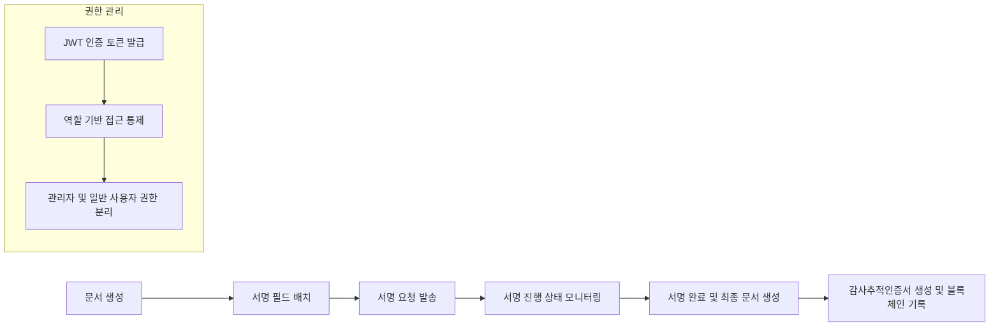

# EasySign 전자계약 서비스 백엔드 요구사항 문서

## 1. 서비스 개요 및 비즈니스 모델

### 1.1 서비스 목적
EasySign은 대한민국 내 계약 업무의 디지털 전환을 선도하는 전자계약 서비스로서, 종이 계약서의 시간 및 비용 낭비, 위변조 위험을 해소하고 사용자가 언제 어디서나 안전하고 신속하게 계약을 체결할 수 있도록 지원한다.

### 1.2 시장 문제와 해결책
기존 오프라인 계약은 서류 인쇄, 직접 대면, 우편 발송 등의 비효율과 분실 및 위변조 위험에 노출되어 있다. EasySign은 디지털화 및 자동화를 통해 계약 업무를 간소화하며 법적 효력을 보장하는 솔루션을 제공한다.

### 1.3 비즈니스 모델 및 성장 전략
- 수익원: 구독 요금제 및 API 기능 판매로 매출 발생
- 사용자 확보 전략: 프리랜서부터 대기업까지 다양한 사용자 맞춤 서비스 제공
- 성장 목표: 전자계약 시장 점유율 1위 달성 및 유지

## 2. 사용자 역할 및 인증 요구사항

### 2.1 역할 정의
- 개인 사용자 (freelancerUser): 계약서 생성 및 서명 요청, 별도의 승인 없이 서명 가능
- 법인 사용자 (corporateUser): 문서 작성 후 팀장 승인 필요, 승인 완료 시 서명 요청 발송 가능
- 팀장 (teamLeader): 계약 검토 및 승인 권한 부여
- 관리자 (admin): 전체 시스템 및 사용자 관리 권한 보유

### 2.2 권한 매트릭스

| 기능                     | freelancerUser | corporateUser (Creator) | teamLeader | admin |
|------------------------|---------------|------------------------|------------|-------|
| 계약서 생성              | ✅             | ✅                     | ❌          | ✅     |
| 계약서 승인              | ❌             | ❌                     | ✅          | ✅     |
| 서명 요청 발송           | ✅             | ✅                     | ✅          | ✅     |
| 계약서 서명              | ✅             | ✅                     | ✅          | ✅     |
| 문서 조회 및 다운로드      | ✅             | ✅                     | ✅          | ✅     |
| 사용자 및 권한 관리        | ❌             | ❌                     | ❌          | ✅     |

### 2.3 인증 및 보안
- 회원가입 시 이름, 이메일, 비밀번호 필수 입력
- 이메일/비밀번호 로그인 및 JWT 기반 인증
- OAuth 소셜 로그인 지원 (Google, Kakao)
- 2단계 인증(2FA) 로그인 및 중요 정보 변경 시 적용

## 3. 사용자 시나리오

### 3.1 프리랜서 '하나'의 계약 프로세스
1. 템플릿 불러오기 및 문서 업로드
2. 서명 필드 배치 및 서명 요청 발송(이메일, 카카오톡)
3. 서명자가 링크 통해 별도 가입 없이 서명
4. 서명 완료 알림 및 완료 문서 다운로드

### 3.2 중소기업 담당자 '민준'의 대량 발송
1. 표준 근로계약서 업로드 및 필드 지정
2. 복수 서명자 이메일 목록 업로드 후 대량 서명 요청
3. 대시보드에서 서명 진행 실시간 모니터링
4. 미서명자에게 리마인더 자동 발송

### 3.3 대기업 법무팀 '지연'의 API 연동
1. 내부 승인 시스템과 EasySign API 연동
2. 계약서 자동 등록 및 팀장 승인
3. 서명 요청 발송 및 서명 처리
4. 완료 문서 및 감사증적인증서 자동 저장

## 4. 기능 요구사항

### 4.1 문서 업로드 및 변환
- THE 시스템 SHALL PDF, DOCX, HWP, XLSX, PNG, JPG 포맷 지원
- WHEN 문서 업로드 시 THE 시스템 SHALL PDF 포맷으로 변환
- THE 시스템 SHALL 파일 무결성을 위해 SHA-256 해시 저장

### 4.2 서명 필드 배치 및 관리
- THE 시스템 SHALL 드래그앤드롭 방식 지원
- THE 시스템 SHALL 필드별 서명자 할당 가능
- THE 시스템 SHALL 필수 입력 필드 지정 기능

### 4.3 서명 요청 및 알림
- THE 시스템 SHALL 이메일, 카카오톡, SMS를 통한 서명 요청 발송
- THE 시스템 SHALL 서명 요청 메시지 커스터마이징 가능
- THE 시스템 SHALL 순차 서명 및 동시 서명 옵션 제공

### 4.4 서명 방식
- THE 시스템 SHALL 그리기, 텍스트, 도장 업로드 지원
- THE 시스템 SHALL 별도 회원가입 없이 링크로 서명 가능

### 4.5 완료 문서 처리 및 법적 증빙
- WHEN 모든 서명이 완료되면 THE 시스템 SHALL 서명 이미지 PDF 삽입 및 읽기 전용 문서 생성
- THE 시스템 SHALL 즉시 감사추적인증서 생성 및 다운로드 지원
- THE 시스템 SHALL 최종 문서 및 감사증명서 해시 기반 블록체인 기록 단일 수행

### 4.6 템플릿 및 대량 발송
- THE 시스템 SHALL 템플릿 저장 및 불러오기 기능 제공
- THE 시스템 SHALL 대량 발송 기능 및 알림톡, SMS 등 부가 알림 지원

### 4.7 API 제공
- THE 시스템 SHALL RESTful API 지원
- THE 시스템 SHALL 개발자 포털 및 SDK 문서 제공

## 5. 법적 효력 및 보안 요구사항

### 5.1 데이터 암호화 및 키 관리
- THE 시스템 SHALL AES-256 암호화 적용
- THE 시스템 SHALL AWS KMS, Google Cloud KMS 이용 키 관리 및 연 1회 이상 키 순환

### 5.2 접근 제어 및 인증
- THE 시스템 SHALL RBAC 기반 역할 분리 및 최소 권한 원칙 준수
- THE 시스템 SHALL JWT 기반 인증 및 2단계 인증(2FA) 지원
- THE 시스템 SHALL 관리자와 일반 사용자 권한 엄격 분리 및 관리 페이지 분리

## 6. 비즈니스 규칙

### 6.1 문서 상태 라이프사이클
- DRAFT, IN_PROGRESS, COMPLETED, CANCELED, EXPIRED, DECLINED 상태 정의 및 전환 규칙

### 6.2 상태 전환
- WHEN 이벤트에 따라 문서 상태를 적절히 전환
- WHEN 서명 거절 시 DECLINED 상태 설정
- WHEN 서명 완료 시 COMPLETED 상태 설정
- WHEN 문서 취소 시 CANCELED 상태 설정

### 6.3 유효성 검사
- WHEN 업로드 파일이 미지원 포맷이면 업로드 거부 및 오류 반환
- WHEN 필수 필드 미입력 시 제출 차단

### 6.4 권한 및 접근
- THE 시스템 SHALL JWT 검증 후 권한별 API 접근 제한
- THE 시스템 SHALL 사용자 소유 문서에만 접근 허용

## 7. 데이터 흐름 및 시스템 운영

### 7.1 계약 데이터 흐름
- 계약 데이터 생성, 변환, 서명 요청, 서명 완료 및 상태 업데이트, 최종 문서 생성 및 보관

### 7.2 이벤트 기록 및 감사 추적
- 모든 주요 이벤트를 AuditEvent에 시간순 기록 및 무결성 해시 저장
- 블록체인 단일 트랜잭션으로 최종 해시 기록

### 7.3 확장성 및 장애복구
- 클라우드 기반 무상태 아키텍처 및 분산 처리
- 자동 장애 감지 및 복구, 백업 정책

## 8. 성공 지표 및 분석

### 8.1 KPI 및 지표
- MAU, 계약 발송 건수, 계약 완료 평균 시간, 무료/유료 전환율

### 8.2 데이터 분석
- 사용자 행동 및 계약 흐름 분석, 개선 피드백

## 9. 부록: Mermaid 다이어그램

---

이 문서는 EasySign 전자계약 서비스의 백엔드 비즈니스 요구사항을 명확히 정의하며, 모든 기술적 구현 사항은 개발팀의 재량에 맡긴다. 개발자는 본 문서를 기반으로 시스템을 구축한다.