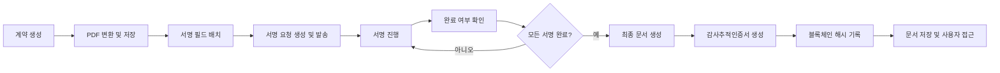

# EasySign 전자계약 서비스 백엔드 요구사항 분석서

## 1. 서비스 개요

EasySign는 대한민국 내 계약 업무를 디지털화하여 쉽고 빠르고 안전하게 계약을 체결할 수 있는 원스톱 전자계약 서비스입니다. 기존 오프라인 계약 방식의 비효율성과 보안 문제를 해결하며, 프리랜서부터 대기업까지 폭넓은 사용자층을 대상으로 합니다.

서비스는 다음과 같은 핵심 가치를 제공합니다:
- 시간과 장소에 구애받지 않는 계약 체결
- 서류 출력 및 우편 발송 등 번거로움 제거
- 문서 위변조 및 분실 위험 제거
- 효율적인 문서 관리 및 체계적인 검색 기능

## 2. 사용자 역할 및 권한

EasySign 서비스는 다음과 같은 사용자 역할과 권한을 명확히 구분하여 운영합니다.

### 2.1 개인 사용자 (freelancerUser)
- 계약 문서 생성 및 직접 서명 요청 가능
- 검토 또는 승인 절차 없이 서명 진행 가능
- 자신이 생성한 문서 조회 및 다운로드 권한 보유

### 2.2 법인 사용자 (corporateUser)
- 계약 문서 작성자, 팀장(팀리더), 서명자로 역할 구분
- 작성자는 계약서 작성 및 팀장 검토 요청 가능
- 팀장은 계약서 검토 및 승인 권한 보유
- 서명자는 최종 승인된 계약서에 서명 가능

### 2.3 팀장 (teamLeader)
- 법인 계약의 검토 및 승인 담당
- 계약서 승인 후 서명 요청을 발송

### 2.4 관리자 (admin)
- 시스템 전체 운영 및 관리 권한 보유
- 사용자 관리 및 권한 분배

### 2.5 권한 관리 및 규칙
- 문서는 작성자 및 승인자에 의해 상태가 관리됨
- 사용자별 문서 접근 권한은 소유권과 역할에 따라 제한됨
- JWT 토큰을 통한 인증 및 역할 기반 권한 검증 수행

## 3. 기능 및 비즈니스 프로세스

### 3.1 문서 업로드 및 변환
- WHEN 사용자가 문서를 업로드하면, THE 시스템 SHALL PDF, DOCX, HWP, XLSX, PNG, JPG 형식 파일을 지원한다.
- WHEN 문서가 업로드되면, THE 시스템 SHALL 이를 표준 PDF 포맷으로 변환하여 저장한다.
- THE 시스템 SHALL 문서의 원본 파일명, 해시값(SHA-256), 저장 경로를 관리한다.
- 문서 상태는 DRAFT, IN_PROGRESS, COMPLETED, CANCELED, EXPIRED, DECLINED 중에 하나로 구분된다.

### 3.2 서명 필드 배치 및 관리
- THE 시스템 SHALL 드래그앤드롭 방식으로 서명, 텍스트, 체크박스, 날짜 필드를 문서에 배치할 수 있다.
- THE 시스템 SHALL 각 필드는 특정 서명자에게 할당 가능하며 크기 및 위치 조정이 가능하다.
- 필수 작성 필드에 대해 입력 여부를 검사한다.
- 사용자는 배치한 필드의 구성을 템플릿으로 저장하고 재사용할 수 있다.

### 3.3 서명 요청 및 발송
- WHEN 서명 요청을 발송하면, THE 시스템 SHALL 이메일, 카카오톡, SMS 채널을 통해 서명자에게 서명 링크를 전달한다.
- THE 시스템 SHALL 서명 요청 순서(순차 또는 동시)를 지정할 수 있다.
- THE 시스템 SHALL 서명 요청 상황(발송, 조회, 완료 등)을 대시보드에서 실시간 추적 가능하다.

### 3.4 서명 처리 방식
- THE 시스템 SHALL 서명자는 별도의 회원가입 없이 링크를 통해 문서에 접근하여 서명할 수 있다.
- THE 시스템 SHALL 서명 입력은 그리기, 텍스트 자동 생성 서명 이미지, 도장 이미지 업로드 방식을 지원한다.
- 서명자가 서명을 완료하면, THE 시스템 SHALL 서명 내용을 저장하고 상태를 갱신한다.

### 3.5 완료 문서 관리 및 감사 추적
- WHEN 모든 서명이 완료되면, THE 시스템 SHALL 최종 서명 이미지를 지정 좌표에 PDF에 삽입하여 최종본을 생성한다.
- THE 시스템 SHALL 최종본은 읽기 전용(Flattening) 처리된다.
- THE 시스템 SHALL 감사추적인증서를 즉시 생성하여 사용자에게 제공한다.
- 블록체인에는 최종 문서 및 감사증명서 해시값을 결합하여 단일 트랜잭션으로 기록한다.

### 3.6 템플릿 및 대량 발송 기능
- THE 시스템 SHALL 서명 및 입력 필드 배치 상태를 템플릿으로 저장 및 불러오기 기능을 제공한다.
- WHEN 대량 발송 시, THE 시스템 SHALL 다수 서명자 대상으로 이메일, 카카오톡, SMS를 통해 서명 요청을 한 번에 발송한다.

### 3.7 API 연동 및 외부 서비스 통합
- THE 시스템 SHALL RESTful API를 통해 문서 업로드, 서명 요청, 상태 조회, 문서 다운로드 기능을 외부에 제공한다.
- THE 시스템 SHALL Zapier, Google Drive, Dropbox, Slack 등과 연동하여 업무 자동화 및 알림 서비스를 지원한다.

## 4. 법적 효력 및 감사 요구사항

### 4.1 서명 이미지 삽입
- WHEN 문서의 모든 서명이 완료되고 상태가 COMPLETED로 변경될 때, THE 시스템 SHALL 지정된 좌표에 서명 이미지를 삽입한 최종 문서를 생성한다.
- 최종 문서는 수정 불가능한 읽기 전용 형태로 저장한다.

### 4.2 감사추적인증서 생성
- WHEN 문서 상태가 COMPLETED가 되면, THE 시스템 SHALL 계약 정보, 참여자, 모든 AuditEvent 로그를 포함한 감사추적인증서를 즉시 생성하여 제공한다.

### 4.3 블록체인 해시 기록
- THE 시스템 SHALL 최종 서명 완료본과 감사추적인증서의 해시값을 결합하여 단일 해시값을 만든 후, 이를 한 번만 블록체인에 기록한다.

## 5. 보안 요구사항

### 5.1 데이터 암호화 및 키 관리
- THE 시스템 SHALL AES-256 수준의 암호화를 저장 데이터에 적용한다.
- THE 시스템 SHALL AWS KMS, Google Cloud KMS 등의 전문 키 관리 시스템을 사용하고 최소 연 1회 키를 순환한다.
- THE 시스템 SHALL 역할 기반 접근 제어(RBAC)를 적용하여 최소 권한 원칙을 지킨다.

### 5.2 인증 및 권한 관리
- THE 시스템 SHALL JWT 기반 인증을 사용하고 Access Token과 Refresh Token을 발급한다.
- THE 시스템 SHALL 사용자 역할에 따라 시스템 접근 권한을 분리하며, 관리자 영역은 별도 관리 페이지로 구분한다.
- THE 시스템 SHALL 2단계 인증(2FA)을 로그인, 비밀번호 변경 등 민감 작업에 도입하여 보안을 강화한다.

## 6. 오류 처리 및 예외 시나리오

### 6.1 오류 상황 및 대응
- IF 지원하지 않는 파일 포맷을 업로드하면, THEN THE 시스템 SHALL 사용자에게 정확한 오류 메시지를 제공한다.
- IF 서명 요청 발송 실패 시, THEN THE 시스템 SHALL 재시도를 실행하고 일정 횟수 초과 시 관리자 알림을 수행한다.
- IF 서명링크 만료 또는 무효 시, THEN THE 시스템 SHALL 사용자에게 알림 메시지를 출력하고 재요청 방법을 안내한다.
- IF 서명자가 서명을 거부하면, THEN THE 시스템 SHALL 상태를 DECLINED로 변경하고 적절히 알린다.
- IF 인증 실패 및 권한 부족 시, THEN THE 시스템 SHALL HTTP 401 또는 HTTP 403 상태 코드를 반환하고 알림 메시지를 표시한다.

## 7. 성능 및 가용성 요구사항

### 7.1 성능 기준
- THE 시스템 SHALL 문서 업로드 및 페이지 로딩을 3초 이내 완료한다.

### 7.2 가용성
- THE 시스템 SHALL 연간 99.9% 이상의 서비스를 제공한다.

### 7.3 확장성
- THE 시스템 SHALL 클라우드 기반 아키텍처로 사용자와 트래픽 증가에 유연하게 대응한다.

## 8. 데이터 흐름 및 이벤트 관리

### 8.1 계약 라이프사이클 데이터 흐름
- 계약 생성, PDF 변환, 서명 필드 배치, 서명 요청 및 발송, 서명 진행, 완료 문서 생성, 감사추적인증서 발급, 블록체인 기록을 포함하는 전체 데이터 처리 과정을 포함한다.

### 8.2 이벤트 기록 및 무결성
- 모든 주요 이벤트는 AuditEvent 테이블에 기록되고 해시값을 통해 변경 불가능함을 보장한다.
- 감사추적인증서 발급 시 모든 이벤트 로그는 시간순으로 정리되어 포함된다.

### 8.3 시스템 확장성 및 백업
- THE 시스템 SHALL 무상태 아키텍처로 설계하여 수평 확장성을 지원한다.
- THE 시스템 SHALL 정기적으로 백업을 진행하고 암호화하여 안전하게 보관한다.

## 9. 성공 지표 및 분석

### 9.1 핵심 지표
- 월간 활성 사용자 수(MAU)
- 계약 발송 건수
- 무료 사용자 대비 유료 전환율
- 고객 만족도(CSAT, NPS)

### 9.2 데이터 분석 및 보고
- 사용자 행동 및 계약 처리 데이터를 실시간으로 수집, 분석한다.
- 분석 결과를 기반으로 서비스 개선 방향을 도출한다.

### 9.3 지속적 개선 프로세스
- 사용자 피드백 및 KPI 데이터를 활용하여 기능 보완 및 개선을 지속적으로 진행한다.

---

> This document defines business requirements only. All technical implementation decisions belong to developers. Developers have full autonomy over architecture, APIs, and database design. The document describes WHAT the system should do, not HOW to build it.