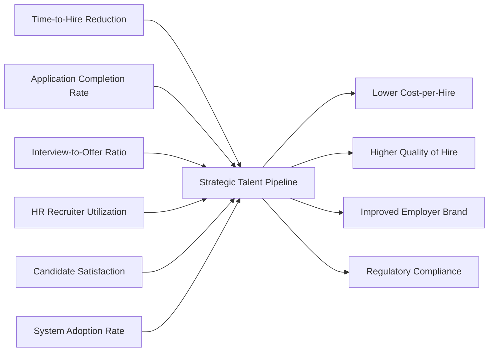

## Success Metrics for ATS System

This document defines the critical business outcomes and Key Performance Indicators (KPIs) that will be used to measure the success, efficiency, and value delivery of the ATS system. These metrics are not technical performance indicators but are instead business-oriented measurements tied directly to hiring outcomes, user experience, and operational efficiency. Each metric includes a baseline (current state without ATS), a target (goal after implementation), and a method of measurement.

### Introduction to Success Metrics

The primary objective of the ATS system is to replace manual, fragmented hiring processes (spreadsheet tracking, email coordination, paper resumes) with an integrated digital workflow that accelerates hiring, reduces administrative burden, and improves candidate experience. Success will be measured not by system uptime or code quality, but by how effectively the system enables hiring teams to fill roles faster, with better quality of hire, and with greater satisfaction from all stakeholders.

All metrics must be tracked monthly and reported to HR leadership and engineering leadership to drive iterative improvement. Data collection is enabled via system logs, user interactions, and automated surveys — no manual data entry shall be required.

### Time-to-Hire Reduction

The time-to-hire is the number of calendar days between when a candidate first submits an application and when they accept an offer.

WHEN a candidate applies to a job posting, THE system SHALL begin tracking the time-to-hire clock.
WHEN a candidate accepts a job offer, THE system SHALL stop the time-to-hire clock.
THE system SHALL calculate and store this value automatically for every hire.

The baseline time-to-hire across the organization is currently 42 days. 
THE system SHALL reduce the average time-to-hire to 28 days within six months of full deployment.
WHEN the average time-to-hire drops below 25 days for three consecutive months, THE system SHALL be considered highly successful in accelerating hiring.

The system SHALL measure time-to-hire by calculating the difference between the application submission timestamp (when candidate status changes from "Application Received" to "Resume Verified") and the offer acceptance timestamp (when candidate status changes from "Offer Extended" to "Hired").

### Application Completion Rate

The application completion rate measures the percentage of candidates who begin the application process and successfully submit a complete application.

WHEN a candidate starts filling out an application, THE system SHALL record the start event.
WHEN a candidate submits their resume and completes required fields, THE system SHALL record the completion event.
THE system SHALL calculate the application completion rate as: (Completed Applications / Started Applications) × 100.

The current application completion rate is 58% due to long forms and unclear instructions.
THE system SHALL increase the application completion rate to 80% or higher within six months.
IF the completion rate falls below 70% for two consecutive months, THEN THE system SHALL trigger an alert to the system admin to review the application flow.

The system SHALL track completion rate by counting the number of candidates who reach the "Resume Verified" status divided by the number of candidates who reach the "Application Started" status.

### Interview-to-Offer Ratio

The interview-to-offer ratio measures the efficiency of the selection process — how many interviews are required, on average, before an offer is extended.

WHEN a candidate is scheduled for an interview, THE system SHALL increment the interview count for that candidate.
WHEN an offer is extended to a candidate, THE system SHALL record the final interview count.
THE system SHALL calculate the average interview-to-offer ratio across all hires.

The current ratio is 3.8 interviews per offer due to misaligned screening.
THE system SHALL reduce the average interview-to-offer ratio to 2.2 or lower within six months.
WHERE the technical reviewer provides feedback of "strong fit" on the first review, THE system SHALL log the candidate as a "high-confidence match."
WHEN more than 60% of hires are classified as high-confidence matches, THEN THE system SHALL be considered to have improved screening quality.

The system SHALL calculate this ratio by dividing the total number of interviews conducted by the total number of offers extended across all job postings over a given period.

### HR Recruiter Utilization

HR recruiter utilization measures the reduction in time spent on administrative tasks (resume screening, scheduling, email follow-ups) and the increase in time spent on strategic hiring activities (candidate conversations, stakeholder alignment).

WHILE a recruiter is logged in, THE system SHALL log time spent on:
- Manual resume review
- Calendar scheduling
- Email and message responses
- System-driven actions (e.g., clicking "schedule interview" or "approve candidate")

THE system SHALL calculate the percentage of time spent on system-driven actions versus manual actions.

The current baseline is 72% manual administrative work and 28% strategic work.
THE system SHALL shift this ratio to 35% manual and 65% strategic within six months.
IF the percentage of manual time drops below 30% for three consecutive months, THEN THE system SHALL be considered to have achieved significant productivity gains.

The system SHALL measure utilization by combining user interaction logs with time-to-action metrics. For example, when an HR recruiter clicks "Schedule Interview" and the system auto-fills the time based on calendar availability, this SHALL count as a system-driven action.

### Candidate Satisfaction

Candidate satisfaction is measured via an automated, post-process survey sent to every applicant, regardless of outcome.

WHEN a candidate’s application status changes to "Hired" or "Rejected," THE system SHALL automatically send an email with a 5-question survey.

Survey questions (1–5 scale):
1. How easy was it to apply for this position?
2. How clear was the communication during the process?
3. How professional was the interaction with our team?
4. How well did the process reflect the company’s culture?
5. Would you recommend our hiring process to a friend?

THE system SHALL calculate the average score across all submissions.
THE system SHALL maintain a candidate satisfaction score of 4.2 or higher on average.
IF the score falls below 3.8 for two months in a row, THEN THE system SHALL lock further job postings until the HR team investigates the feedback.

The system SHALL collect survey responses via embedded survey links in automated emails and SHALL calculate the average score using a weighted mean of all completed surveys.

### System Adoption Rate

System adoption rate measures the percentage of eligible users actively using the ATS system for hiring activities.

WHEN a user logs in and performs any action (viewing candidates, scheduling interviews, reviewing resumes, exporting lists), THE system SHALL record an active session.

The eligible user population includes:
- All HR recruiters
- All technical reviewers
- All system administrators

The baseline adoption rate is 40% (many still use email and spreadsheets).
THE system SHALL increase the active adoption rate to 95% or higher within three months of full deployment.

WHEN a user has not logged in for 14 consecutive days, THE system SHALL send one reminder email.
WHEN a user has been inactive for 28 days, THEN THE system SHALL flag the account to the system admin for re-engagement.

The system SHALL track adoption by counting unique weekly active users (WAU) who perform at least one of the defined actions and dividing by the total number of eligible user accounts.

### Target Benchmarks and Baselines

| Metric | Baseline (Current) | Target (6 Months) | Critical Threshold |
|--------|------------------|------------------|-------------------|
| Time-to-Hire | 42 days | ≤28 days | ≤25 days (for 3 months) |
| Application Completion Rate | 58% | ≥80% | ≥70% |
| Interview-to-Offer Ratio | 3.8 interviews | ≤2.2 interviews | ≤2.0 interviews |
| HR Recruiter Manual Time | 72% | ≤35% | ≤30% |
| Candidate Satisfaction | 3.6 (avg) | ≥4.2 | ≥3.8 |
| System Adoption Rate | 40% | ≥95% | ≥90% |

### Monitoring and Reporting

All metrics shall be updated daily and presented in a public dashboard available to:
- HR leadership
- Engineering leadership
- The system admin

Each metric shall be visualized as a trend line over time with alerts configured for:
- 10% deviation below target for two weeks
- 15% deviation below critical threshold

The report shall be generated automatically every Monday morning and emailed to department heads.

WHEN a metric surpasses its target for three consecutive months, THE system SHALL recommend a new, higher target based on historical improvement rate.

The system SHALL log all metric calculations, including the data sources and timestamp of calculation, with audit trail access for compliance purposes.

> *Developer Note: This document defines **business requirements only**. All technical implementations (architecture, APIs, database design, etc.) are at the discretion of the development team.