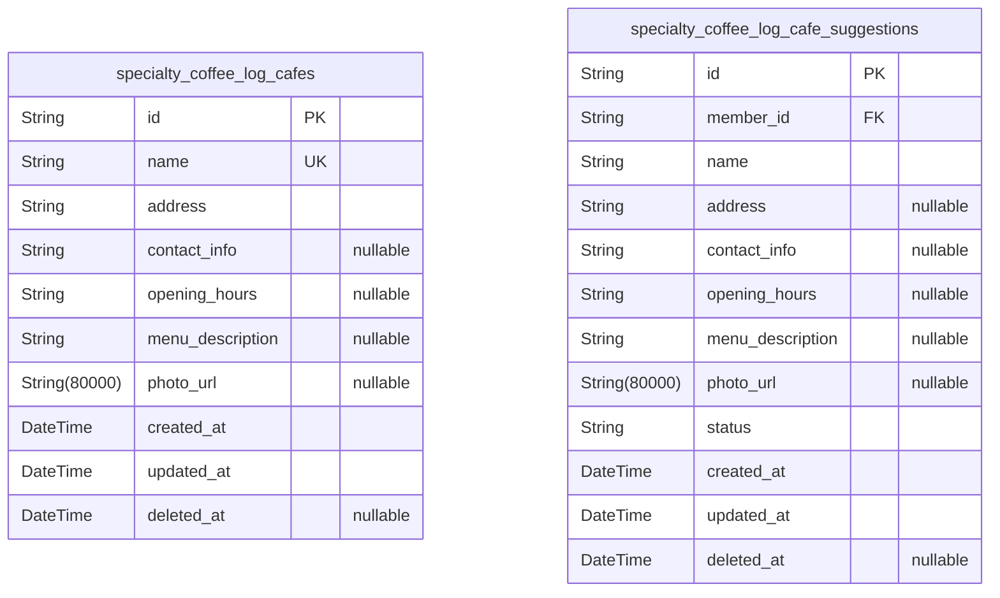
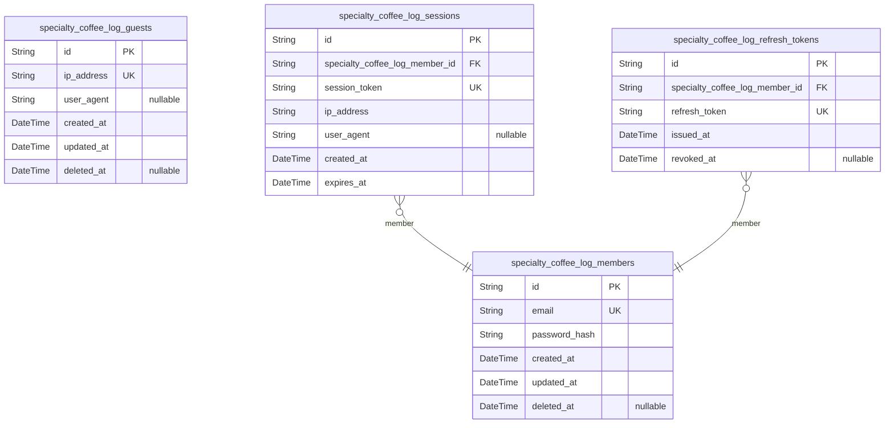
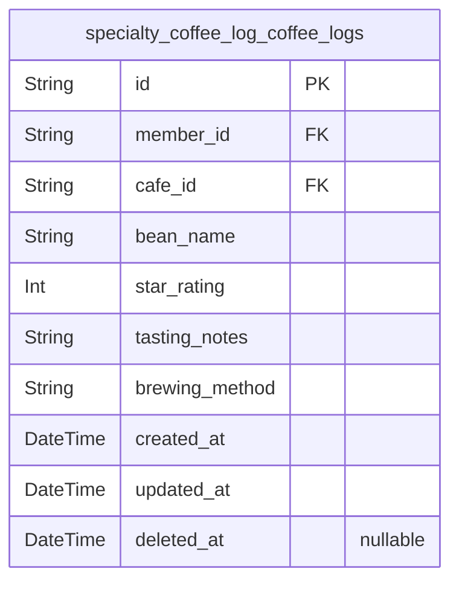

# Prisma Markdown

> Generated by [`prisma-markdown`](https://github.com/samchon/prisma-markdown)

- [Systematic](#systematic)
- [Actors](#actors)
- [CoffeeLogs](#coffeelogs)

## Systematic

### `specialty_coffee_log_cafes`

Holds detailed information about specialty coffee cafes including name,
address, contact details, opening hours, menu description, and photo.
This table is a core business entity accessible to all users for browsing
and searching cafe information. Enforces uniqueness on cafe name to
prevent duplicates and supports soft deletion for data integrity and
recovery.

Properties as follows:

- `id`: Primary Key.
- `name`: Unique name of the specialty coffee cafe.
- `address`: Physical address of the cafe.
- `contact_info`: Contact information such as phone number or email.
- `opening_hours`: Human-readable opening hours of the cafe.
- `menu_description`: Brief description of the cafe menu offerings.
- `photo_url`: URL string pointing to a photo of the cafe.
- `created_at`: Timestamp when the cafe record was created.
- `updated_at`: Timestamp when the cafe record was last updated.
- `deleted_at`: Timestamp when the cafe was soft deleted, if applicable.

### `specialty_coffee_log_cafe_suggestions`

Stores user-submitted suggestions for adding new cafes or editing
existing cafe information. Suggestions include proposed cafe data and
track status for review workflow, allowing independent management of
suggestions separate from the core cafe data. Each suggestion is linked
to the member who submitted it for accountability.

Properties as follows:

- `id`: Primary Key.
- `member_id`: Submitting member's [specialty_coffee_log_members.id](#specialty_coffee_log_members).
- `name`: Proposed cafe name in the suggestion.
- `address`: Proposed physical address in the suggestion.
- `contact_info`: Proposed contact info such as phone or email.
- `opening_hours`: Proposed opening hours in human-readable format.
- `menu_description`: Proposed menu description.
- `photo_url`: Proposed photo URL for the cafe.
- `status`
  > Review status of the suggestion, such as 'pending', 'approved', or
  > 'rejected'.
- `created_at`: Timestamp when the suggestion was created.
- `updated_at`: Timestamp when the suggestion was last updated.
- `deleted_at`: Timestamp when the suggestion was soft deleted, if applicable.

## Actors

### `specialty_coffee_log_guests`

Guest user identities who can browse cafes and search but cannot log in
or manage personal logs. Contains basic identification details and soft
deletion for data management.

Properties as follows:

- `id`: Primary Key.
- `ip_address`: IP address of the guest user for session tracking and identification.
- `user_agent`
  > User agent string from the guest's device, providing metadata about the
  > browser or app.
- `created_at`: Timestamp when the guest record was created.
- `updated_at`: Timestamp when the guest record was last updated.
- `deleted_at`: Soft deletion timestamp to allow guest data recovery or logical deletion.

### `specialty_coffee_log_members`

Authenticated members who can create coffee logs, manage profiles, add
cafes, and suggest edits. Stores login credentials and personal data with
audit timestamps and soft deletion support.

Properties as follows:

- `id`: Primary Key.
- `email`: Unique email address used for member login and communication.
- `password_hash`
  > Hashed password for secure authentication; plain passwords are never
  > stored.
- `created_at`: Timestamp when the member record was created.
- `updated_at`: Timestamp when the member record was last updated.
- `deleted_at`: Soft deletion timestamp to allow member deactivation and data recovery.

### `specialty_coffee_log_sessions`

Session information for authenticated members. Tracks active login
sessions with expiration and IP metadata, linked to members for ownership
and validation.

Properties as follows:

- `id`: Primary Key.
- `specialty_coffee_log_member_id`: Linked authenticated member's [specialty_coffee_log_members.id](#specialty_coffee_log_members).
- `session_token`: Unique session token identifying the user session securely.
- `ip_address`: IP address from which the session was initiated.
- `user_agent`: User agent string describing client device and browser.
- `created_at`: Timestamp when the session was created.
- `expires_at`: Expiration timestamp at which the session becomes invalid.

### `specialty_coffee_log_refresh_tokens`

Refresh tokens for authenticated members to obtain new access tokens
securely. Each token is unique and associated with a member, with
timestamps for issuing and revocation.

Properties as follows:

- `id`: Primary Key.
- `specialty_coffee_log_member_id`
  > Associated member for this refresh token. {@link
  > specialty_coffee_log_members.id}.
- `refresh_token`: Unique refresh token string used to request new access tokens.
- `issued_at`: Timestamp when the refresh token was issued.
- `revoked_at`: Timestamp when this refresh token was revoked or invalidated.

## CoffeeLogs

### `specialty_coffee_log_coffee_logs`

Stores personal coffee logs created by authenticated members. Each log is
tied to one member and one cafe, representing the user's tasting
experience including bean name, rating, tasting notes, and brewing
method. Logs are private to members and support soft deletion and audit
timestamps.

Properties as follows:

- `id`: Primary Key.
- `member_id`
  > Belonged member's [specialty_coffee_log_members.id](#specialty_coffee_log_members) who owns this
  > coffee log.
- `cafe_id`
  > Belonged cafe's [specialty_coffee_log_cafes.id](#specialty_coffee_log_cafes) where the coffee
  > log is created.
- `bean_name`: Name of the coffee bean tasted, as recorded by the user.
- `star_rating`: User's rating of the coffee from 1 to 5 stars, inclusive.
- `tasting_notes`: Detailed tasting notes provided by the user.
- `brewing_method`: Brewing method used for this coffee tasting (e.g., espresso, pour-over).
- `created_at`: Timestamp when this log was created.
- `updated_at`: Timestamp when this log was last updated.
- `deleted_at`: Timestamp when this log was soft deleted; null if not deleted.
