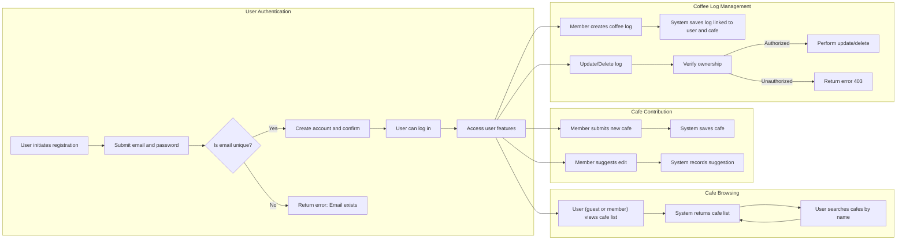

# Specialty Coffee Log - Functional Requirements

This document comprehensively defines the business and functional requirements for the backend system of the Specialty Coffee Log service. It strictly specifies WHAT the system shall do to meet business goals and user needs without prescribing technical implementation details.

---

## 1. Introduction

The Specialty Coffee Log service is designed to provide users with an easy way to find information about specialty coffee cafes and to record and manage personal experiences of coffees tasted at those cafes. This document focuses on the MVP functional requirements supporting these goals.

## 2. Business Model

### Why This Service Exists
Specialty coffee enthusiasts often face challenges in discovering quality cafes and tracking their tasting experiences across various locations. Existing platforms lack tailored features for personal logging combined with comprehensive cafe information.

### Core Value Proposition
- Aggregated, reliable cafe information with details like address, contact info, opening hours, menus, and photos.
- Personal coffee logs enabling users to rate, note tasting, and record brewing methods.
- Empowering users to contribute via adding new cafes and suggesting edits.

### Business Strategy and Success Metrics
Although the MVP excludes monetization, the platform is positioned to grow via community engagement and eventual premium features.
Success will be measured by user signups, cafe contributions, and active coffee log entries.

## 3. User Roles and Permissions

| Role   | Description | Permissions |
|--------|-------------|-------------|
| Guest  | Unauthenticated users | View cafe list and search cafes by name |
| Member | Authenticated users | Sign up, log in, update profile, create/update/delete personal logs, add cafes, suggest edits |

## 4. Authentication and User Account Management

### 4.1 Authentication Flow Requirements
- Users SHALL register and log in using email and password.
- Users SHALL be able to update their profile information.
- System SHALL maintain user sessions securely with JWT tokens.

### 4.2 Functional Requirements
- WHEN a user submits registration with valid email and password, THE system SHALL create a new user account.
- WHEN a user attempts login with correct credentials, THE system SHALL authenticate and issue a session token within 2 seconds.
- IF login credentials are invalid, THEN THE system SHALL return an authentication failure response with HTTP status 401.
- WHEN a logged-in user requests profile update, THE system SHALL update user details ensuring email uniqueness.

### 4.3 Business Rules
- Emails must be unique and validated for format.
- Passwords SHALL meet security standards (minimum length, complexity).

## 5. Cafe Information Management

### 5.1 Cafe Data Fields
- Name (string, required)
- Address (string, required)
- Contact info (string, phone/email)
- Opening hours (string, human-readable format)
- Menu description (string)
- Photo (URL string)

### 5.2 Functional Requirements
- THE system SHALL provide a list of all cafes to users, accessible without login.
- THE system SHALL allow users to search cafes by name with case-insensitive partial matches.
- WHEN a member adds a new cafe, THE system SHALL save the cafe with provided details.
- WHEN a member suggests edits to an existing cafe, THE system SHALL record the suggested edits for review (review process is out of scope).
- THE system SHALL allow all users (guest and members) to view and search cafes by name.

### 5.3 Business Rules
- Cafe names must be unique within the system.
- Suggested edits SHALL not instantly overwrite existing cafe data.

## 6. Coffee Log Management

### 6.1 Coffee Log Fields
- Bean name (text, required)
- Star rating (integer 1 to 5, required)
- Tasting notes (text, required)
- Brewing method (text, required)

### 6.2 Functional Requirements
- WHEN a member creates a coffee log for a specific cafe, THE system SHALL save the log attached to that user and cafe.
- WHEN a member updates an existing log, THE system SHALL verify ownership and update the log.
- WHEN a member deletes a log, THE system SHALL remove it.
- THE system SHALL provide a "My Page" view listing all logs by the authenticated user.
- Logs SHALL be private and accessible only to the owning user.

### 6.3 Business Rules
- Star rating values SHALL be integers strictly between 1 and 5 inclusive.
- Bean name and tasting notes SHALL not be empty.

## 7. Search and Listing Functionalities

- THE system SHALL enable cafe search by name with partial, case-insensitive matching.
- THE system SHALL display cafes ordered alphabetically.
- THE system SHALL paginate cafe lists when results exceed 20 entries.

## 8. User Private Data Management

- THE system SHALL ensure coffee logs are accessible only to the authenticated user who created them.
- THE system SHALL prevent any user from accessing others' logs.
- Profile information updates SHALL be validated for correctness and uniqueness.

## 9. Access Restrictions and Security

- Guests SHALL have read-only access to cafe lists and search.
- Members SHALL require authentication for adding/editing cafes and creating/managing logs.
- THE system SHALL respond with HTTP 403 for unauthorized modification attempts.

## 10. Error Handling and Performance Requirements

### 10.1 Error Scenarios
- IF registration email is already in use, THEN return HTTP 409 with reason "Email already registered".
- IF login credentials are invalid, THEN return HTTP 401 with reason "Invalid credentials".
- IF a member attempts to update or delete a log they do not own, THEN return HTTP 403 "Unauthorized action".
- IF validation on required fields fails, THEN respond with HTTP 400 detailing the missing or invalid fields.

### 10.2 Performance
- THE system SHALL respond to login, search, and data retrieval requests within 2 seconds under normal load.

---

## User and System Interaction Flows

---

## Conclusion

This document defines all functional and business requirements necessary for developing the backend of the Specialty Coffee Log service MVP. It clearly delineates roles, permissions, workflows, validations, and error handling to ensure a robust, user-focused system.

Developers are advised that this document states WHAT must be implemented; the HOW is left to the discretion of the implementation team, including technical architecture, API design, and data models.

All design and development decisions should align with these business requirements to maintain integrity and user satisfaction of the Specialty Coffee Log service.

> *This document defines **business requirements only**. All technical implementations (architecture, APIs, database design, etc.) are at the discretion of the development team.*