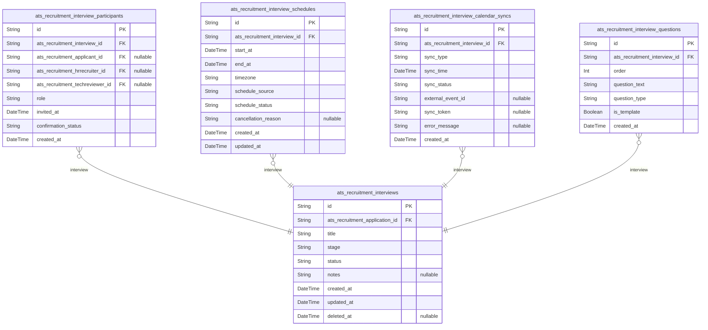
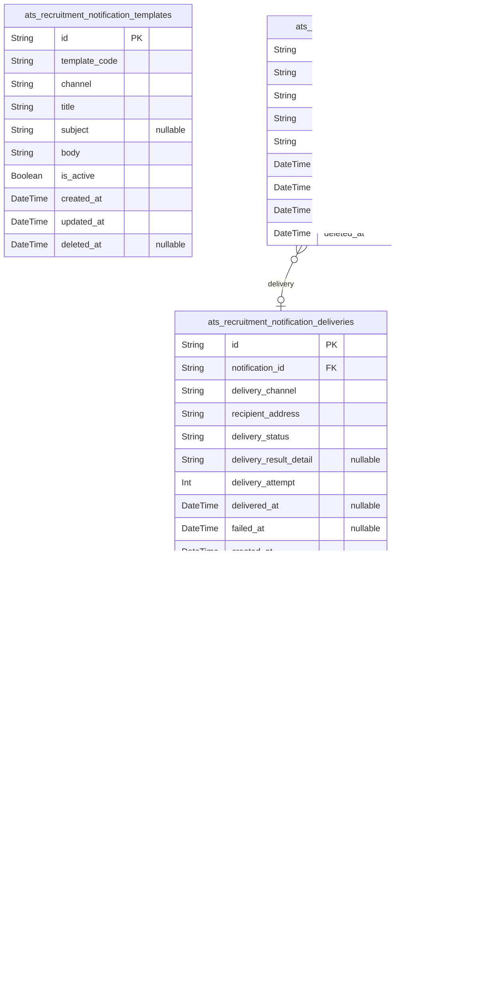

# Prisma Markdown

> Generated by [`prisma-markdown`](https://github.com/samchon/prisma-markdown)

- [Systematic](#systematic)
- [Actors](#actors)
- [JobPostings](#jobpostings)
- [Applications](#applications)
- [Resumes](#resumes)
- [CodingTests](#codingtests)
- [Interviews](#interviews)
- [Notifications](#notifications)
- [Exports](#exports)
- [SecurityLogs](#securitylogs)

## Systematic

### `ats_recruitment_system_settings`

Global system configuration settings for the ATS platform. Used to
control system-wide technical options, enable/disable features, set
thresholds, and maintain platform-level parameters managed by system
administrators. Key-value style, with support for type annotation and
descriptions. CRUD operations are logged in audit trails.

Properties as follows:

- `id`: Primary Key.
- `setting_name`
  > Name of the system setting. Must be unique and refer to a platform-wide
  > configuration field.
- `setting_value`
  > Current value of the setting in string format. Interpreted based on its
  > type (e.g., number, JSON, boolean as string).
- `setting_type`
  > Data type of the setting (e.g., string, int, boolean, json). Used to cast
  > the value appropriately in application logic.
- `description`
  > Detailed human-readable description of the setting for documentation and
  > maintenance use.
- `created_at`: Timestamp of creation for this configuration record.
- `updated_at`: Timestamp of last update for this configuration record.
- `deleted_at`: Soft delete timestamp, null if active. Used for recovery and audit trace.

### `ats_recruitment_external_api_credentials`

Secure storage for external API credentials required by the ATS platform
to integrate with third-party services (e.g., Email, SMS, Coding Test,
Google Calendar, AI APIs). Each credential can be referenced by
application code, and is encrypted in storage. Managed independently from
business data. Access and modification are strictly audited.

Properties as follows:

- `id`: Primary Key.
- `credential_key`
  > Unique logical key for this external credential (e.g.,
  > 'google_calendar_main', 'sendgrid_email_default').
- `service_name`
  > Name of third-party service (e.g., Google Calendar, SendGrid,
  > Programmers, CodeSignal).
- `credential_json`
  > Serialized credential object (typically JSON-encoded, supports secret
  > keys, OAuth tokens/refresh secrets, etc).
- `expires_at`: Expiration timestamp for this credential, or null if persistent.
- `description`: Business/contextual description for what this credential is used for.
- `created_at`: Timestamp of creation for this credential entry.
- `updated_at`: Timestamp of last update to this credential entry.
- `deleted_at`
  > Soft delete timestamp, null if active, for credential rotation and
  > recovery reference.

### `ats_recruitment_enums`

Global enumeration registry for values referenced throughout the ATS
system (e.g., job types, employment types, notification channels,
standardized status codes). Used for central management and lookup of
platform enum codes and labels, including optional metadata for reference
tables. Maintains code uniqueness and documentation.

Properties as follows:

- `id`: Primary Key.
- `enum_type`
  > Namespace/group/type for this enum set (e.g., 'application_status',
  > 'notification_channel', 'employment_type').
- `enum_code`
  > Business code representing a value in the enum type (e.g., 'APPLIED',
  > 'INTERVIEWED', 'EMAIL'). Unique within (enum_type).
- `label`
  > Human-friendly label for the enumeration value (localized/translated
  > where applicable).
- `extended_data`
  > Optional JSON string with additional attributes for the enum (e.g., icon,
  > color code, sort order, or other business metadata).
- `description`: Documentation for usage context and guidance on this enum value.
- `created_at`: Timestamp of creation for this enum value.
- `updated_at`: Timestamp of last update for this enum value.
- `deleted_at`
  > Soft delete timestamp, null if active (enables undo/error recovery for
  > data dictionary).

### `ats_recruitment_audit_trails`

Central audit log for all sensitive changes and access events on system
settings, credentials, and administrative actions. Records actor,
operation type, event details and context for compliance and forensic
investigation. Supports tracing of CRUD, access, system incidents, and
security events. Readable/searchable for compliance review and incident
response.

Properties as follows:

- `id`: Primary Key.
- `event_timestamp`: Timestamp when the audit event occurred.
- `actor_id`
  > ID of the actor (user/admin/system process) performing the event.
  > References actor tables in other modules.
- `actor_role`
  > Role of the actor at the time of event (e.g., 'systemAdmin',
  > 'hrRecruiter', 'service_process').
- `operation_type`
  > Nature of operation (e.g., 'CREATE', 'UPDATE', 'DELETE', 'ACCESS',
  > 'AUTH_FAILURE', 'EXPORT').
- `target_type`
  > Category of object/entity affected (e.g., 'system_setting',
  > 'api_credential', 'enum', 'user', 'audit_policy').
- `target_id`
  > ID of the object/entity affected by this event. Can point to any primary
  > business table (may use a system-wide UUID registry for generalization).
- `event_detail`
  > Plain text or serialized JSON containing the details of the event (e.g.,
  > before/after, error details, request metadata).
- `ip_address`
  > IP address of the event originator, for security tracking and incident
  > investigation.
- `user_agent`
  > User agent or process context string, if applicable (for human vs
  > system/integration traceability).
- `created_at`
  > Record create timestamp for the audit entry (supports compliance
  > traceability).
- `updated_at`: Record update timestamp for the audit entry.
- `deleted_at`
  > Soft delete timestamp (enable recovery/error suppression for audit
  > records).

## Actors

### `ats_recruitment_applicants`

Applicant (candidate) account representing a job seeker. Contains
personal profile data, contact, unique authentication information (email,
password_hash), and timestamps for audit. Linked to applications and
resumes in other tables. Core business subject with fully independent
lifecycle management.

Properties as follows:

- `id`: Primary Key.
- `email`
  > Unique authentication email address for login. Must be business-usable
  > and never shared between accounts. Used for contact and notifications.
- `password_hash`
  > Secure, one-way hash of applicant's password for authentication. The
  > actual plaintext password must never be stored. Used by the login system.
- `name`
  > Full name of the applicant as parsed from resume or entered directly.
  > Used for identification and search.
- `phone`: Phone number for applicant contact and notifications.
- `is_active`
  > Whether the account is currently active and able to access services. Used
  > for deactivation instead of hard deletion.
- `created_at`: Timestamp when the applicant profile was created.
- `updated_at`: Timestamp when applicant profile was last updated.
- `deleted_at`
  > Soft deletion timestamp. Null if not deleted; marks recovery or GDPR
  > erasure.

### `ats_recruitment_hrrecruiters`

HR recruiter/staff account for managing job postings, interviewing,
notifications, and applicant statuses. Full authentication required. Can
view, control, and update business data. Maintains privileged separation
from applicants and technical reviewers.

Properties as follows:

- `id`: Primary Key.
- `email`
  > Unique email for login and notifications. Used as primary authentication
  > field.
- `password_hash`: Hash of the HR recruiter's password. Never store the plain text password.
- `name`
  > HR recruiter's real name for business use and addressability (email,
  > notifications).
- `department`
  > Department name/identifier the HR recruiter belongs to. Useful for
  > segmenting privilege and reporting lines.
- `is_active`
  > Account status: enabled (true) or deactivated (false). Deactivated users
  > cannot perform HR system actions.
- `created_at`: Timestamp when the HR account was created. For audit trail.
- `updated_at`: Timestamp when this record was last updated.
- `deleted_at`
  > Soft deletion timestamp for GDPR or separation from service. Null if not
  > deleted.

### `ats_recruitment_techreviewers`

Technical reviewer (engineer/evaluator) account. Used to log into ATS and
perform code review, skill assessments, and technical interviews. Has
distinct access from HR and applicants. Auditable lifecycle and
authentication.

Properties as follows:

- `id`: Primary Key.
- `email`
  > Login email for the technical reviewer. Unique identifier. Also used for
  > notification and delegation.
- `password_hash`
  > Password hash for technical reviewer authentication (never store as plain
  > text).
- `name`: Reviewer full name for notifications, audit, and addressing by HR.
- `specialization`
  > Key technology or specialty (e.g. Backend, Frontend, Cloud, Security) for
  > reviewer assignment. Used by HR to auto-match reviewers based on skill.
- `is_active`
  > Whether the account is enabled and can perform reviews or is deactivated.
  > Used to lock reviewer out without erasing records.
- `created_at`: Timestamp when the technical reviewer account was created.
- `updated_at`: Timestamp of last update to the technical reviewer profile.
- `deleted_at`
  > Timestamp when reviewer was soft-deleted for GDPR or privilege
  > separation. Null if not deleted.

### `ats_recruitment_systemadmins`

System administrator account for full privileged access to all ATS
settings, users, audit logs, and integration. Highest privilege for
managing other accounts, environment settings, and external API
credentials. Enables separation of duties and audit compliance.

Properties as follows:

- `id`: Primary Key.
- `email`
  > Administrator login (unique) and key notification address. Must be
  > distinct from all other account types.
- `password_hash`
  > Secure password hash for administrator authentication. Never store raw
  > passwords.
- `name`: Full name of administrator. Used in audit logs and action records.
- `super_admin`
  > Indicates whether this admin account is a super administrator (can manage
  > other admins, system-wide settings). Only true for highest level admin
  > accounts.
- `is_active`
  > Whether this admin account is enabled. False disables logins and all
  > privileged actions.
- `created_at`: Date/time at which the admin account was created.
- `updated_at`: Date/time of last modifications to the admin profile/account details.
- `deleted_at`
  > Soft deletion timestamp for compliance and audit. Null when account is
  > active.

### `ats_recruitment_actor_login_histories`

Audit table that records all successful and failed login attempts for
every actor account in the system (applicants, HR recruiters, tech
reviewers, system admins). Enables historical tracking, security audits,
incident investigations, and compliance reporting. Subsidiary table: not
managed directly by users.

Properties as follows:

- `id`: Primary Key.
- `actor_id`
  > The unique identifier of the actor (applicant, HR, tech reviewer, or
  > admin) performing a login attempt. Polymorphic UUID referencing an actor;
  > for schema-vaild relation, mapped to ats_recruitment_applicants by
  > default.
- `actor_type`
  > Role type of the actor performing the login (applicant, hr_recruiter,
  > tech_reviewer, system_admin). Used for polymorphic attribution. String
  > enum in application.
- `login_succeeded`
  > Whether the login attempt was successful (true) or a failure (false). Key
  > metric for security and audit analysis.
- `origin_ip`
  > IP address from where the login was attempted. Used for security analysis
  > and possible incident response.
- `user_agent`
  > Raw HTTP user-agent string from login attempt. For device profiling and
  > fraud detection.
- `login_at`: Exact timestamp when the login was attempted (not when user was created).

## JobPostings

### `ats_recruitment_job_postings`

Represents an individual job posting for recruitment, authored and
managed by an HR recruiter. Includes position title, description,
employment type, state (open, closed, paused, etc.), and key business
attributes. References recruiter HR, employment type, job status, and
supports soft deletion and audit tracking. Core business entity enabling
search/filtering, CRUD, and lifecycle management within the recruitment
system.

Properties as follows:

- `id`: Primary Key.
- `hr_recruiter_id`
  > Belonged recruiter's [ats_recruitment_hrrecruiters.id](#ats_recruitment_hrrecruiters). References
  > the HR recruiter responsible for this job posting.
- `job_employment_type_id`
  > Employment type's [ats_recruitment_job_employment_types.id](#ats_recruitment_job_employment_types).
  > Indicates employment scheme (full-time, part-time, etc.).
- `job_posting_state_id`
  > Current state of this posting {@link
  > ats_recruitment_job_posting_states.id}. Indicates open, closed, paused,
  > etc.
- `title`: Job title or position being recruited for.
- `description`: Detailed job description and requirements.
- `location`: Job location (onsite, remote, city, etc.).
- `salary_range_min`: Minimum offered salary for this role. Optional if not disclosed.
- `salary_range_max`: Maximum offered salary for this role. Optional if not disclosed.
- `application_deadline`: Application closing date and time for this posting.
- `is_visible`
  > Whether this posting is visible to applicants. Posting can be hidden from
  > search/listings.
- `created_at`: When this job posting was created.
- `updated_at`: When this job posting was last updated.
- `deleted_at`
  > Soft delete marker. If present, the posting has been withdrawn/deleted
  > but is recoverable.

### `ats_recruitment_job_skills`

Represents a master list of skills/technologies referenced in job
postings. Allows HR/administrators to add or deprecate skills based on
evolving tech stacks. Skills are used for job requirement matching and
applicant evaluations. Independently managed.

Properties as follows:

- `id`: Primary Key.
- `name`: Skill or technology name (e.g., Python, React, AWS).
- `description`
  > Optional description of this skill, clarifying scope, use-case, or
  > related tools.
- `is_active`
  > Whether this skill is currently actively in use for recruitment/job
  > postings.
- `created_at`: Skill creation timestamp.
- `updated_at`: Last modification to this skill definition.
- `deleted_at`
  > Soft deletion marker if this skill has been deprecated but not
  > hard-removed.

### `ats_recruitment_job_employment_types`

Master table defining allowed employment types for job postings (e.g.,
full-time, contract, part-time, internship). Used for normalization and
business validation when job postings specify employment schemes. Can be
managed by system admins/HR.

Properties as follows:

- `id`: Primary Key.
- `name`: Human-readable employment type label (full-time, part-time, etc.).
- `description`: Optional explanation or terms related to this employment type.
- `is_active`: Whether this employment type is available for new job postings.
- `created_at`: When this employment type was created.
- `updated_at`: When this employment type was last updated.
- `deleted_at`: Soft deletion marker for deprecated employment types.

### `ats_recruitment_job_posting_states`

Master lookup table for allowed job posting states in the workflow (e.g.,
open, closed, draft, paused, archived). Determines which postings appear
in applicant views and controls business flows. Maintained by system
admins/HR.

Properties as follows:

- `id`: Primary Key.
- `state_code`: Machine-friendly state code (e.g., open, closed, paused, draft).
- `label`: Human-readable state label shown in admin/UIs.
- `description`: Description or policy for this posting state.
- `is_active`: Whether this state is selectable for new job postings.
- `sort_order`: Ordering index to control display/policy evaluation preference.
- `created_at`: Entry creation timestamp.
- `updated_at`: Entry update timestamp.
- `deleted_at`: Soft delete - for deprecated states.

## Applications

### `ats_recruitment_applications`

Represents a unique job application: connects an applicant to a specific
job posting and tracks submission, current status, and linked resume.
Enables managing applicant progress through all recruiting stages and
supports direct management of candidate records. Relates to {@link
ats_recruitment_applicants}, [ats_recruitment_job_postings](#ats_recruitment_job_postings), and
[ats_recruitment_resumes](#ats_recruitment_resumes).

Properties as follows:

- `id`: Primary Key.
- `applicant_id`
  > Applied applicant's [ats_recruitment_applicants.id](#ats_recruitment_applicants). Required for
  > identifying the applicant for this application.
- `job_posting_id`
  > Target job posting's [ats_recruitment_job_postings.id](#ats_recruitment_job_postings). The job
  > posting this application is for.
- `resume_id`
  > Submitted resume's [ats_recruitment_resumes.id](#ats_recruitment_resumes). The resume file
  > provided for this application.
- `current_status`
  > The latest status/state of the application (e.g., submitted, screening,
  > code_test, interview, accepted, rejected).
- `submitted_at`: Timestamp when the application was submitted.
- `last_state_change_at`
  > The moment when the application last changed its status/state (useful for
  > processing timelines).
- `created_at`: Record creation timestamp, required for audit/history.
- `updated_at`: The most recent time the record was updated.
- `deleted_at`
  > The soft deletion timestamp. Null if not deleted; required for
  > recoverable deletion pattern.

### `ats_recruitment_application_status_histories`

Audit/snapshot table capturing every status or state transition for an
application. Each row records a change (e.g., screening → code_test) with
actor, timestamp, and optional comment. Enables compliance reporting and
allows analysis of progression patterns. Closely linked to {@link
ats_recruitment_applications}, relates to {@link
ats_recruitment_hrrecruiters} and includes details on who enacted the
change.

Properties as follows:

- `id`: Primary Key.
- `application_id`
  > The target application whose status is changing. {@link
  > ats_recruitment_applications.id}
- `actor_id`
  > The HR or reviewer user who performed this status change. References
  > [ats_recruitment_hrrecruiters.id](#ats_recruitment_hrrecruiters) or tech reviewers (polymorphic);
  > may be nullable if triggered by automation.
- `from_status`: Previous status/state before the change (e.g., screening).
- `to_status`: The new status/state after the change (e.g., code_test, interview).
- `changed_at`: Timestamp when the status change occurred.
- `change_comment`: Optional note/comment explaining the reason/notes for this transition.
- `created_at`: When this history record was created (for audit trail).

### `ats_recruitment_application_feedback`

Internal or reviewer feedback on an application. Allows structured or
free-form critique, ratings, and recommendations. Supports multiple
feedback per application—one per reviewer—enabling HR and tech reviewers
to record and track input independently of status transitions. Related to
[ats_recruitment_applications](#ats_recruitment_applications).

Properties as follows:

- `id`: Primary Key.
- `application_id`
  > The referenced application receiving feedback. {@link
  > ats_recruitment_applications.id}
- `reviewer_id`
  > The user providing feedback (HR/tech reviewer). References {@link
  > ats_recruitment_hrrecruiters.id} or {@link
  > ats_recruitment_techreviewers.id} (see user model for disambiguation via
  > role/type).
- `feedback_body`: Free-form or structured feedback content.
- `rating`: Numerical rating for the application by this reviewer (if applicable).
- `is_final_recommendation`: Whether this feedback represents a final recommendation or decision.
- `created_at`: Timestamp for when this feedback was created.

### `ats_recruitment_application_skill_matches`

Captures per-skill matching results for each application (AI/NLP-based
comparison between applicant and job requirement). Each row links a skill
to an application with match type, auto-generated or human-validated.
Supports analytics for hiring decision, bias tracking, and quality
improvement. Related to [ats_recruitment_applications](#ats_recruitment_applications).

Properties as follows:

- `id`: Primary Key.
- `application_id`
  > Reference to the application for which this skill match is recorded.
  > [ats_recruitment_applications.id](#ats_recruitment_applications)
- `skill_id`
  > Reference to the skill entity (required by job or extracted from
  > applicant). [ats_recruitment_job_skills.id](#ats_recruitment_job_skills)
- `match_type`: Matching type/code (e.g., required, preferred, missing, extra, etc.).
- `ai_score`
  > AI/NLP matching confidence score (0-1 scale) or similarity percentage
  > (e.g., 0.84 = 84%).
- `is_manually_verified`: Whether this match has been verified by a human (after AI analysis).
- `created_at`: Timestamp for creation of this record (audit/supports replay of results).

## Resumes

### `ats_recruitment_resumes`

Core entity for resumes/CVs uploaded and registered by applicants for job
applications. Stores structured resume data, parsed/normalized fields,
agnostic to file storage. Each resume belongs to an applicant
(referencing ats_recruitment_applicants.id), and survives
replacement/re-upload (history kept in upload history table). Supports
GDPR-compliant deletion, includes fields for original parsing meta and
audit trail.

Properties as follows:

- `id`: Primary Key.
- `ats_recruitment_applicant_id`
  > Referenced applicant's [ats_recruitment_applicants.id](#ats_recruitment_applicants). Uniquely
  > identifies owner of this resume.
- `title`: Resume title (user defined or system default), e.g., '2023 Software CV'.
- `parsed_name`
  > Parsed or entered full name from resume content, for quick
  > query/filtering.
- `parsed_email`: Parsed or entered email from resume; for structured search.
- `parsed_mobile`: Parsed or entered phone/mobile number from resume.
- `parsed_birthdate`
  > Parsed or entered birthdate or DoB from uploaded resume. String form to
  > allow flexible date parsing.
- `parsed_education_summary`
  > Summary/short education info parsed from resume (school/major/latest
  > degree).
- `parsed_experience_summary`
  > Summary/short experience info parsed from resume (last job/experience
  > string).
- `skills_json`
  > JSON array (stringified) of normalized technical/hard skills parsed from
  > this resume. Used for tech stack matching.
- `created_at`: Record creation timestamp.
- `updated_at`: Last modification timestamp.
- `deleted_at`: Soft delete timestamp. Null if active, date if deleted (GDPR/trace).

### `ats_recruitment_resume_files`

Subsidiary table with file storage references and metadata for applicant
resumes. Each record links to a parent resume and stores original file
name, storage URI, file type and size. Soft deletion is synchronized with
the resume entity. No independent CRUD management; files are replaced on
resume re-upload.

Properties as follows:

- `id`: Primary Key.
- `ats_recruitment_resume_id`
  > Linked resume's [ats_recruitment_resumes.id](#ats_recruitment_resumes). The parent structured
  > resume that this file is attached to.
- `original_filename`: Original uploaded file name. Used for display and audit.
- `file_storage_uri`: Permanent URI/location of file in object/blob storage.
- `file_ext`: File extension (e.g., pdf, docx).
- `file_size`: File size in bytes.
- `uploaded_at`: Timestamp of file upload for audit trail.
- `deleted_at`: Soft delete timestamp (null if not deleted).

### `ats_recruitment_resume_ai_analyses`

Stores the output/result logs of AI-based resume analysis and parsing
jobs. Each record ties to one resume, and may be linked to an applicant
or HR/reviewer trigger. Contains analysis type, input meta, result
payload as JSON string, confidence scores if available, job status, and
full audit trail. Multiple analyses per resume are allowed.

Properties as follows:

- `id`: Primary Key.
- `ats_recruitment_resume_id`
  > Target resume's [ats_recruitment_resumes.id](#ats_recruitment_resumes). The structured resume
  > this analysis belongs to.
- `analysis_type`
  > Type of analysis or vendor job, e.g., 'basic_ocr', 'ai_skill_match',
  > 'ner_parse'.
- `analysis_status`: Status of analysis: e.g., 'pending', 'completed', 'failed'.
- `input_payload_json`: JSON string of request/input sent to AI/analysis API.
- `result_payload_json`
  > JSON string with result/response from AI (structured fields, tags,
  > comments).
- `confidence_score`
  > Optional confidence score/result assigned by analysis result. Null if not
  > provided.
- `started_at`: Timestamp when analysis started.
- `completed_at`
  > Timestamp when analysis job finished (success or fail). Null if never
  > completed.

### `ats_recruitment_resume_upload_histories`

Snapshot table for recording the full history of applicant resume uploads
(including replacements and repeated uploads). Serves as an immutable
audit log for all uploads, storing all relevant context at the time of
upload (file meta, parse summary, upload actor). Used for data forensics
and recovery. Never deleted or updated after insert.

Properties as follows:

- `id`: Primary Key.
- `ats_recruitment_applicant_id`
  > Applicant ID from [ats_recruitment_applicants.id](#ats_recruitment_applicants). The user who
  > performed this upload.
- `resume_title`: Resume title (at time of upload) for recovery/display.
- `file_name`: Uploaded file name/upload snapshot. Used for audit and trace recovery.
- `file_size`: Size of uploaded file in bytes (snapshot at time of upload).
- `file_ext`: File extension/format at time of upload.
- `resume_json_snapshot`
  > Full text or JSON snapshot of parsed resume at upload. Archival purpose
  > for audit/forensics.
- `upload_timestamp`: Timestamp of upload event. Immutable record.
- `source_ip`: IP address (when known) of actor uploading. Security/audit context.

## CodingTests

### `ats_recruitment_coding_tests`

Represents individual coding test instances assigned to applications.
Tracks type (internal or external), scheduling, delivery channel, and
test meta. Linked to application, applicant, and HR/recruiter. Required
for audit trail, API callback correlation, and re-delivery logic.

Properties as follows:

- `id`: Primary Key.
- `ats_recruitment_application_id`: Belonged application's [ats_recruitment_applications.id](#ats_recruitment_applications)
- `ats_recruitment_applicant_id`: Belonged applicant's [ats_recruitment_applicants.id](#ats_recruitment_applicants)
- `ats_recruitment_hrrecruiter_id`
  > Belonged HR recruiter who assigned/triggered this test. {@link
  > ats_recruitment_hrrecruiters.id}
- `test_provider`
  > Provider type: 'internal' (platform written), or 3rd party text such as
  > 'programmers', 'codesignal'.
- `test_external_id`
  > ID returned by external provider system, if external. Required for
  > callback. Use null if in-house.
- `test_url`
  > Test access URL (if generated by external provider or for applicant's
  > direct access).
- `scheduled_at`: Datetime when test is scheduled (set by HR/recruiter or system).
- `delivered_at`: Datetime when invitation/test was actually delivered to applicant.
- `status`
  > Current delivery/test state. Example: 'scheduled', 'delivered',
  > 'in_progress', 'completed', 'failed', 'cancelled'.
- `expiration_at`
  > Last time applicant is allowed to take test (nullable for open-ended or
  > instant tests).
- `callback_received_at`
  > Timestamp when API callback received from external system (null if not
  > applicable).
- `closed_at`
  > Datetime test is definitively closed for submission. Used for
  > audit/tracking.
- `created_at`: Canonical creation timestamp.
- `updated_at`: Canonical update timestamp.
- `deleted_at`: Soft-delete. Set on logical delete for audit reasons.

### `ats_recruitment_coding_test_submissions`

Tracks each coding test solution attempt by an applicant. Used for
tracking attempts, answers, answer files, log/audit, and
late/invalid/timeout cases. Ties to coding test, applicant, and
application entity.

Properties as follows:

- `id`: Primary Key.
- `ats_recruitment_coding_test_id`: Referenced coding test's [ats_recruitment_coding_tests.id](#ats_recruitment_coding_tests)
- `ats_recruitment_applicant_id`
  > Applicant's [ats_recruitment_applicants.id](#ats_recruitment_applicants) (in case of delegated
  > submissions, still stores actual answerer)
- `ats_recruitment_application_id`
  > Parent application's [ats_recruitment_applications.id](#ats_recruitment_applications) (redundant
  > but supports analytics for audit reporting)
- `submitted_at`: Timestamp when applicant submitted test answer.
- `answer_file_url`: URL (object storage, presigned download) for answer upload, if applicable.
- `answer_text`: Direct answer text (if code is written inline).
- `status`
  > Current submission validation state: e.g., 'valid', 'invalid', 'timeout',
  > 'canceled', 'pending'.
- `received_external_at`
  > Timestamp if this submission was posted via external API/callback, n/a
  > for direct platform.
- `review_status`
  > Status for reviewer process: e.g. 'pending', 'needs_review', 'reviewed',
  > 'flagged'.
- `reviewed_at`: Datetime manual review completed by tech reviewer, null if still waiting.
- `review_comment_summary`
  > Manual review summary (tech reviewer). Null if not yet reviewed or review
  > was only automatic.
- `created_at`: Canonical creation timestamp.
- `updated_at`: Canonical update timestamp.
- `deleted_at`: Soft-delete. Set for retention/audit compliance.

### `ats_recruitment_coding_test_results`

Snapshot of automatic or reviewer-evaluated result for a coding test
submission. Contains normalized scores, ranking, error traces, and
abnormal completion audit (e.g., plagiarism or timeout). Not
overwritten—even on rerun/manual override; instead, new rows are
persisted.

Properties as follows:

- `id`: Primary Key.
- `ats_recruitment_coding_test_submission_id`: Belonged submission's [ats_recruitment_coding_test_submissions.id](#ats_recruitment_coding_test_submissions)
- `ats_recruitment_coding_test_id`
  > Parent coding test's [ats_recruitment_coding_tests.id](#ats_recruitment_coding_tests). Used to
  > facilitate performance reporting/audit.
- `evaluation_method`
  > How result was computed; e.g. 'auto', 'manual', 'external', 'rerun',
  > 'admin_override'.
- `score`: Result score (0 ~ typically 100, but see provider doc).
- `maximum_score`: Maximum score available for normalization (not null, needed for context).
- `plagiarism_flag`
  > True if submission is flagged as abnormal/plagiarized, e.g., by AI or
  > reviewer.
- `ranking_percentile`: Applicant's percentile ranking for this test (0~100, where 100=top).
- `result_json`
  > Free-form JSON string from automatic evaluation/report. May include
  > testcases run, error messages, runtime stats, etc.
- `finalized_at`
  > Datetime when this specific result record was finalized; for
  > snapshot/audit.
- `created_at`: Canonical creation timestamp.
- `updated_at`: Canonical update timestamp.
- `deleted_at`: Soft-delete (retain in audit).

### `ats_recruitment_coding_test_review_comments`

Holds detailed reviewer and automated feedback, supporting independent
moderation workflows and review audits per submission. Allows multiple
comments per submission: each row is immutable (snapshot pattern).
Reviewers are identified by FK, comment history is preserved even if
users leave/disconnect.

Properties as follows:

- `id`: Primary Key.
- `ats_recruitment_coding_test_submission_id`
  > Associated submission's {@link
  > ats_recruitment_coding_test_submissions.id}.
- `ats_recruitment_techreviewer_id`: Reviewer user reference [ats_recruitment_techreviewers.id](#ats_recruitment_techreviewers).
- `comment_text`: Reviewer or system-generated comment, markdown and text. Not null.
- `comment_type`: Source/type: 'manual', 'auto', 'system', 'plagiarism_flag', etc.
- `started_at`: Reviewer started typing/working at this time (audit).
- `commented_at`: Datetime comment was finalized (immutable).
- `created_at`: Creation timestamp (redundant for audit, shown for direct DB access).
- `updated_at`: Canonical update timestamp.
- `deleted_at`: Soft-delete (manual or policy-based).

### `ats_recruitment_coding_test_external_logs`

Tracks all interactions, callbacks, requests, and error responses with
external coding test providers per test or per submission. Used for
troubleshooting, replay, compensation, and dispute handling. Not directly
user-facing but required for secure audit.

Properties as follows:

- `id`: Primary Key.
- `ats_recruitment_coding_test_id`: Related coding test's [ats_recruitment_coding_tests.id](#ats_recruitment_coding_tests)
- `event_type`: Type of event (api_request, api_response, api_callback, error, etc.)
- `event_payload`: Free-form JSON content with error or payload for the event.
- `external_id`: External ref id, if any (provider id, callback token, submission id, etc)
- `message`: Provider or ATS-internal message/description.
- `occurred_at`: Exact time of event/interaction.
- `created_at`: Canonical creation timestamp.
- `updated_at`: Canonical update timestamp.
- `deleted_at`: Soft-delete/retention.

## Interviews

### `ats_recruitment_interviews`

Core interview scheduling entity for ATS. Represents a distinct interview
instance bound to an application, linking scheduling info, Google
Calendar syncs, participants, and assigned questions. Maintains canonical
status, history, and is referenced by schedule, participant, question,
and sync subsidiary tables. Subject to multi-stage and fallback
management.

Properties as follows:

- `id`: Primary Key.
- `ats_recruitment_application_id`: Linked application. [ats_recruitment_applications.id](#ats_recruitment_applications).
- `title`
  > Interview event title or label (may be shown in calendar or
  > notifications).
- `stage`
  > Interview pipeline stage (e.g., first_phase, tech_round, hr, final,
  > custom label).
- `status`
  > Current interview status (scheduled, rescheduled, cancelled, completed,
  > failed, etc).
- `notes`: Optional notes for interviewers or schedule specifics.
- `created_at`: Record creation timestamp.
- `updated_at`: Record update timestamp.
- `deleted_at`: Soft-delete timestamp (null if active).

### `ats_recruitment_interview_participants`

Relationship table associating each interview with its active
participants. Used to track HR staff, applicants, tech reviewers, and any
external participant roles for specific interviews. Not independently
managed; always paired with a parent interview entity. Ensures role
clarity, allows multiple participants per interview.

Properties as follows:

- `id`: Primary Key.
- `ats_recruitment_interview_id`: Parent interview. [ats_recruitment_interviews.id](#ats_recruitment_interviews).
- `ats_recruitment_applicant_id`
  > Applicant participant reference. [ats_recruitment_applicants.id](#ats_recruitment_applicants)
  > (nullable: for other roles).
- `ats_recruitment_hrrecruiter_id`
  > HR recruiter participant reference. {@link
  > ats_recruitment_hrrecruiters.id}.
- `ats_recruitment_techreviewer_id`
  > Technical reviewer participant reference. {@link
  > ats_recruitment_techreviewers.id}.
- `role`
  > Participant role for this interview (applicant, recruiter, reviewer,
  > observer, etc).
- `invited_at`: Invitation timestamp for participant.
- `confirmation_status`: Participant confirmation status (pending, accepted, declined, tentative).
- `created_at`: Record creation timestamp.

### `ats_recruitment_interview_schedules`

Detailed time slot schedule records for interviews. Handles multi-slot
scheduling, candidate/HR/tech reviewer availabilities, Google Calendar
sync attempts, and manual overrides. Includes fields for start/end,
source, cancellation, and reschedule flows. Not directly managed by end
users; supports detailed audit and rollback.

Properties as follows:

- `id`: Primary Key.
- `ats_recruitment_interview_id`
  > Interview that owns this schedule entry. {@link
  > ats_recruitment_interviews.id}.
- `start_at`: Scheduled start date and time in UTC.
- `end_at`: Scheduled end date and time in UTC.
- `timezone`: Timezone of the scheduled event (e.g., 'Asia/Seoul').
- `schedule_source`
  > How this schedule proposal was created (manual, google_calendar, auto,
  > rebooked, etc).
- `schedule_status`
  > Current status of this schedule slot (proposed, confirmed, cancelled,
  > rescheduled, sync_failed).
- `cancellation_reason`: Human friendly note about cancellation; filled if schedule gets cancelled.
- `created_at`: Record creation timestamp.
- `updated_at`: Record update timestamp.

### `ats_recruitment_interview_calendar_syncs`

Audit and tracking for all Google Calendar or external calendar sync
attempts, including requested time, sync token/detail, status/result,
error message with context, fallback/manual override flags. Allows
compliance and troubleshooting on calendar negotiation or double
booking/failure scenarios. Read-only from API, only system modifies.

Properties as follows:

- `id`: Primary Key.
- `ats_recruitment_interview_id`
  > The interview associated with the calendar sync. {@link
  > ats_recruitment_interviews.id}.
- `sync_type`: Type of external calendar sync (google_calendar, outlook, manual, etc).
- `sync_time`: Timestamp of when the sync was attempted/requested.
- `sync_status`
  > Result/status (pending, success, failed, fallback_manual, double_booked,
  > etc).
- `external_event_id`: External calendar system event ID (if available).
- `sync_token`: Access token or sync credential (hashed or partial display for PII).
- `error_message`: Failure message from external API if error occurred.
- `created_at`: Record creation timestamp.

### `ats_recruitment_interview_questions`

Question assignment/join table between an interview and its associated
interview questions. Not independently managed, always paired to a parent
interview instance. Links to template-derived or custom manual questions
assigned for this specific interview.

Properties as follows:

- `id`: Primary Key.
- `ats_recruitment_interview_id`
  > Linked interview for this question reference. {@link
  > ats_recruitment_interviews.id}.
- `order`: Display or asking order of this question in the interview.
- `question_text`: Question content (template or manual, set at time of interview creation).
- `question_type`
  > Type/classification (e.g., coding, behavioral, personality, situational,
  > technical, etc).
- `is_template`: True if this question is derived from a predefined template.
- `created_at`: Record creation timestamp.

## Notifications

### `ats_recruitment_notifications`

Represents each logical notification event to be delivered to users
(applicants, HR recruiters, etc.) or system actors. Contains type,
business context, and recipient information. Entry point for notification
workflows. Linked to delivery and failure records. Core notification
metadata is stored here; does not track delivery-specific events. Primary
entity for auditing notification intent, source, and status for business
processes.

Properties as follows:

- `id`: Primary Key.
- `recipient_applicant_id`
  > Target applicant's [ats_recruitment_applicants.id](#ats_recruitment_applicants). Nullable if not
  > for applicant.
- `recipient_hrrecruiter_id`
  > Target HR recruiter's [ats_recruitment_hrrecruiters.id](#ats_recruitment_hrrecruiters). Nullable
  > if not for HR.
- `recipient_techreviewer_id`
  > Target tech reviewer's [ats_recruitment_techreviewers.id](#ats_recruitment_techreviewers). Nullable
  > if not for reviewer.
- `recipient_systemadmin_id`
  > Target system admin's [ats_recruitment_systemadmins.id](#ats_recruitment_systemadmins). Nullable
  > if not for admin.
- `event_type`
  > Notification event type key (e.g., application_status_update,
  > interview_scheduled, export_complete, system_alert), used to match to
  > template and business process.
- `reference_table`
  > Name of the business table this notification is related to (e.g.,
  > ats_recruitment_applications, ats_recruitment_interviews). Business
  > context for linkage.
- `reference_id`
  > ID of the referenced business entity (e.g., application, interview,
  > export job record).
- `payload_json`
  > JSON representation of templated data for dynamic rendering in template.
  > Contains context provided to notification message rendering. Large, not
  > always indexed.
- `status`
  > Current business status for notification event (e.g., pending, sent,
  > delivered, failed, cancelled).
- `created_at`: Time the notification event record was created.
- `updated_at`: Time the notification event was last updated.
- `deleted_at`: Soft delete timestamp. Null if active, set if deleted.

### `ats_recruitment_notification_deliveries`

Represents each individual delivery attempt for a notification. May be
one-to-many for the same notification (e.g., primary channel failed,
fallback attempted). Contains channel info, recipient contact, delivery
result, and timestamps. Used for audit trails, compliance, and
troubleshooting. Supporting entity—managed via notification contexts.

Properties as follows:

- `id`: Primary Key.
- `notification_id`: Linked notification's [ats_recruitment_notifications.id](#ats_recruitment_notifications).
- `delivery_channel`
  > Channel/medium used to send the notification (e.g., email, sms, app_push,
  > webhook).
- `recipient_address`
  > Email, phone number, or channel recipient endpoint for this delivery
  > attempt. For auditability and troubleshooting.
- `delivery_status`
  > Result status for this specific delivery attempt (e.g., initiated, sent,
  > delivered, failed, bounced, retried, cancelled).
- `delivery_result_detail`
  > Detailed result code/message from delivery provider/service, e.g., SMTP
  > response, SMS error codes. Used for delivery troubleshooting and
  > analytics.
- `delivery_attempt`
  > Attempt count (e.g., 1=first, 2=retried after error). For retry logic
  > analytics.
- `delivered_at`: Timestamp this delivery attempt succeeded (null if never delivered).
- `failed_at`: Timestamp this delivery failed (null if never failed).
- `created_at`: Time this delivery record was created.
- `updated_at`: Time this delivery record was last updated.
- `deleted_at`: Soft delete timestamp. Null if active, set if deleted.

### `ats_recruitment_notification_templates`

Represents reusable notification message templates (SMS, email, app push,
etc.), typically managed by system admins/operations. Stores template
body (with variables), subject, channel, and activation info. Used to
standardize business communications and allow easy updates. Primary
entity—CRUD by authorized users independent of notification events.

Properties as follows:

- `id`: Primary Key.
- `template_code`
  > Unique business key for this template (e.g., INTERVIEW_SCHEDULED_KR,
  > APPLICATION_RESULT_EMAIL). Used for event/template matching
  > programmatically.
- `channel`
  > Notification channel this template is used for (e.g., email, sms,
  > app_push, webhook).
- `title`: Human-readable title for template admin UI (not customer visible).
- `subject`
  > Default message subject/title (for email/channel supporting subject
  > lines).
- `body`
  > Primary template text/body. May use placeholders for dynamic values
  > (e.g., {{applicantName}}, {{interviewDate}}).
- `is_active`: Whether this template is currently active (enabled for new notifications).
- `created_at`: Time this template record was created.
- `updated_at`: Time this template was last updated.
- `deleted_at`: Soft delete timestamp. Null if active, set if deleted.

### `ats_recruitment_notification_failures`

Notification delivery failure logs—each record describes a failed attempt
to deliver a notification (even after retries). Stores reference to
notification and (optionally) delivery record. Purpose is to maintain
post-mortem records and root-cause analysis for compliance. Supporting
entity—managed through notification workflows.

Properties as follows:

- `id`: Primary Key.
- `notification_id`: Failed notification event's [ats_recruitment_notifications.id](#ats_recruitment_notifications).
- `delivery_id`
  > Delivery attempt's [ats_recruitment_notification_deliveries.id](#ats_recruitment_notification_deliveries), if
  > related to a specific channel/delivery. Nullable if not tied to a
  > delivery attempt.
- `failure_type`
  > Failure mode (e.g., provider_bounce, permanent_error, invalid_address,
  > api_rejected, user_optout). Enables overall post-mortem analytics.
- `failure_message`
  > Detailed failure reason/message (freeform, from provider, API or system
  > log).
- `occurred_at`: When the failure occurred (event timestamp).
- `created_at`: Time this failure log record was created.
- `updated_at`: Time this failure log was last updated.
- `deleted_at`: Soft delete timestamp. Null if active, set if deleted.

## Exports

### `ats_recruitment_export_jobs`

Represents an export (CSV/Excel) request/job to extract recruitment
system data for compliance reporting, user self-service, or operational
analytics. Includes job status, actor/initiator, configuration (filters,
selected fields, target entity), delivery method, and export file URI.
Forms an audit log for all sensitive data export operations. Foreign keys
reference the initiator (HR/admin/applicant) and, if applicable, the
target job posting/application/resume.

Properties as follows:

- `id`: Primary Key.
- `initiator_id`
  > Export job initiator (usually HR, admin, or applicant), referencing the
  > actor's [ats_recruitment_hrrecruiters.id](#ats_recruitment_hrrecruiters), {@link
  > ats_recruitment_systemadmins.id}, or {@link
  > ats_recruitment_applicants.id}.
- `target_job_posting_id`
  > If export is limited to a specific job posting, reference to {@link
  > ats_recruitment_job_postings.id}. Nullable; not required for general
  > exports.
- `target_application_id`
  > If export targets a specific application (e.g., applicant self-export),
  > reference to [ats_recruitment_applications.id](#ats_recruitment_applications). Nullable.
- `job_type`
  > Type of export job (e.g., applicants, applications, resumes, audit logs,
  > interviews, etc.). Used for filtering/export logic.
- `status`
  > Current export status (pending, generating, delivering, complete, failed,
  > cancelled, etc.).
- `request_description`
  > Free-text description of export purpose and filters. Useful for
  > compliance and auditing.
- `filter_json`
  > JSON-encoded representation of applied filters, columns, or selection
  > criteria for reproducibility.
- `delivery_method`: Export file delivery method (download, email, object storage URI, etc.).
- `delivered_at`: When the export file was actually delivered or made available to the user.
- `file_uri`
  > URI to the delivered export file (if available, e.g., S3/object storage
  > or email attachment).
- `created_at`: Export job creation timestamp (audit trail).
- `updated_at`: Last status update (including progress/failure/delivery).

### `ats_recruitment_export_job_details`

Individual exported data items for each export job. Used for granular
tracking of which specific records were included in a downloadable batch.
References the parent export job and, optionally, the data id in target
tables. Supports post-hoc audits and partial replays of export delivery.

Properties as follows:

- `id`: Primary Key.
- `export_job_id`: References the parent export job's [ats_recruitment_export_jobs.id](#ats_recruitment_export_jobs).
- `data_row_id`
  > ID of the exported entity (applicant, application, resume, etc.). May be
  > NULL for summary rows.
- `row_summary_json`
  > JSON string representing critical fields from the exported record (not
  > entire row - only identifying summary). For reproducibility and audit.
- `included_at`
  > Timestamp when row was actually included in file (may differ from job
  > start/end for long-running exports).

### `ats_recruitment_export_failures`

Records and describes failures or exceptions that occurred during any
export process (generation, file delivery, data selection, emailing,
etc.) for compliance, debugging, and post-mortem analyses. Links to the
jobs/steps that experienced errors. Not independently managed; retained
for audit trail.

Properties as follows:

- `id`: Primary Key.
- `export_job_id`: References the parent export job's [ats_recruitment_export_jobs.id](#ats_recruitment_export_jobs).
- `failure_stage`
  > Stage of process where the failure occurred (filtering, generating,
  > delivering, emailing, etc.).
- `failure_reason`
  > Detailed error/cause message (may be system error message or business
  > exception reason).
- `failed_at`: Time of failure occurrence.

## SecurityLogs

### `ats_recruitment_access_logs`

Logs of all sensitive data access events, capturing which user/actor
accessed what ATS recruitment data, when, from where, for audit and
regulatory compliance. Used in GDPR/PII audit reports. Includes
references to business actors via actor_id, target data type, and
target_id fields, plus IP/device information. Independent log entity,
queryable by compliance officers for security forensics.

Properties as follows:

- `id`: Primary Key.
- `actor_id`
  > ID of the user or system component that performed access (references
  > recruitment actors; not a foreign key to support access by deleted users
  > and external systems).
- `actor_type`
  > Type of actor: applicant, hrRecruiter, techReviewer, systemAdmin, or
  > system component.
- `target_type`
  > The type/class of data accessed (e.g., resume, application, interview,
  > notification, API credentials).
- `target_id`
  > Identifying UUID of the record that was accessed. Retained as raw for
  > forensics; may point to deleted records.
- `accessed_at`: Timestamp when access event occurred (UTC).
- `ip_address`
  > IP address of the actor accessing the data (for compliance and threat
  > analysis).
- `device_info`: Free-form description or user-agent of the device/browser used for access.
- `access_reason`
  > Stated business or system reason for access (e.g., normal HR processing,
  > compliance review, support event, background job, etc.).

### `ats_recruitment_data_deletion_logs`

Logs of explicit data deletions for ATS recruitment system, including
requests under GDPR 'right to be forgotten', admin-initiated deletions,
and automated purges. Tracks requestor, subject data, reason, and
retention outcome for audit compliance. Full data lineage must be
preserved to meet regulatory rules. Queryable for regulatory and
compliance reports. Independent log table.

Properties as follows:

- `id`: Primary Key.
- `deleted_at`: Timestamp when deletion was executed.
- `requestor_id`
  > User or actor requesting deletion (retained even for deleted accounts;
  > not a foreign key for audit resilience).
- `requestor_type`
  > Type of requestor: applicant, hrRecruiter, techReviewer, systemAdmin, or
  > system component.
- `target_type`
  > Data type/class that was deleted (e.g., resume, application, interview,
  > notification).
- `target_id`: UUID of record deleted (even if later purged).
- `deletion_reason`
  > Stated reason (user GDPR request, admin removal, scheduled expiry, legal
  > compliance, etc.).
- `outcome_note`
  > Optional note on retention/anonymization (e.g. 'data anonymized', 'full
  > deletion', 'archived by policy', etc.).

### `ats_recruitment_masking_logs`

Masking/anonymization log table for privacy compliance. Captures history
of when, by whom, and why specific data was masked: e.g., personal info
fields replaced/obfuscated for privacy, in response to requests or
automated policy. Supports auditing masking policies, user requests, or
system actions. Separate from data deletion logs to distinguish
obfuscation from deletion. Standalone log record.

Properties as follows:

- `id`: Primary Key.
- `masked_at`: Timestamp when masking occurred.
- `masked_by_id`
  > UUID of actor (user/system) who masked the data. Not a strict foreign key
  > to allow for deleted or obfuscated accounts.
- `masked_by_type`
  > Type of actor: applicant, hrRecruiter, techReviewer, systemAdmin,
  > automated, compliance, etc.
- `target_type`
  > Type/class of data that was masked (resume, application, contact info,
  > etc.).
- `target_id`: UUID of the masked record.
- `masking_reason`
  > Stated reason for masking (user request, automated policy, privacy
  > complaint, scheduled expiry, etc.).

### `ats_recruitment_authentication_failures`

Authentication failure log for the ATS system. Records every failed login
or system authentication attempt, capturing context for security incident
analysis and compliance. Logs include which login was attempted, from
which IP/device, attempted user identity (may be a deleted or
non-existent account), failure reason, and timestamp. Purpose: immediate
forensics, brute force or abuse detection, account lockout policy
compliance, and incident resolution.

Properties as follows:

- `id`: Primary Key.
- `attempted_at`: Timestamp of the failed authentication event.
- `attempted_user_identifier`
  > The username, email, or unique identifier used for authentication attempt
  > (even if user account never existed or was deleted).
- `ip_address`: The IP address/source of the authentication attempt.
- `device_info`: Browser/user-agent or system info from which attempt was made.
- `failure_reason`
  > Technical or business-level reason for failure (e.g., 'wrong password',
  > 'locked account', 'user not found', 'expired token', etc.).
- `lockout_triggered`
  > Whether this failure contributed to or triggered an account lockout (for
  > compliance tracking).
