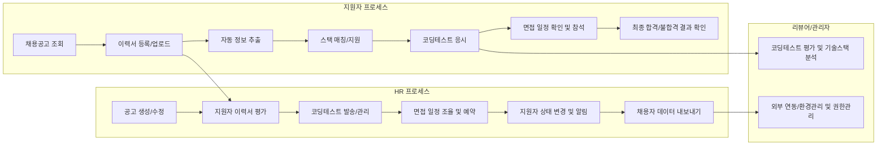

# ATS(atsRecruitment) 시스템 기능 요구 명세서

## 1. 핵심 비즈니스 플로우 개요

atsRecruitment 시스템은 지원자(개인)와 기업의 HR 담당자, 기술 리뷰어, 시스템 관리자가 각자의 역할에서 서로 상호작용하며 채용 프로세스를 효율화하는 것을 목표로 한다. 주요 비즈니스 플로우는 다음과 같다:
- 지원자는 채용공고 확인 → 이력서 등록 및 제출 → 코딩테스트 → 면접 일정 확인·참여 → 최종 합격 여부 확인의 흐름을 따른다.
- HR/채용담당자는 공고 등록 → 지원자 접수 및 관리 → 면접 일정 조율 → 지원자 상태관리(알림 포함) → 채용 완료 및 데이터 관리 업무를 수행한다.
- 기술 리뷰어는 지원자의 코딩테스트 평가·기술스택 분석에 참여한다.
- 시스템 관리자는 전체 시스템 환경, 사용자 권한, 외부 API 연동 환경을 제어한다.

아래 Mermaid 플로우로 전체 흐름을 요약함:

## 2. 기능별 요구명세

각 항목은 EARS(Easy Approach to Requirements Syntax) 포맷으로 요건을 작성한다.

### 2-1. 지원자 이력서 등록 및 분석
- WHEN 지원자가 이력서를 PDF/Word로 업로드할 때, THE atsRecruitment 시스템 SHALL 자동으로 이름, 연락처, 이메일, 학력, 경력 등 필수 정보를 추출한다.
- IF 필수 항목이 추출되지 않을 경우, THEN THE atsRecruitment 시스템 SHALL 추출 불가한 필드를 지원자가 직접 추가로 입력하도록 안내한다.
- WHEN 이력서 업로드가 완료되면, THE atsRecruitment 시스템 SHALL 업로드 이력서의 원본 파일을 안전하게 저장한다.
- THE atsRecruitment 시스템 SHALL 허용된 파일 형식(PDF, DOC, DOCX) 이외 확장자 업로드 시 오류를 안내한다.
- WHERE 지원자가 이미 등록한 이력서를 다시 업로드할 경우, THE atsRecruitment 시스템 SHALL 이전 이력서를 자동으로 대체한다.
- THE atsRecruitment 시스템 SHALL 업로드 가능한 파일의 최대 용량을 10MB로 제한한다.

### 2-2. 기술스택 자동 인식 및 매칭
- WHEN 이력서가 등록/분석될 때, THE atsRecruitment 시스템 SHALL 자연어 처리, 키워드 분석, 외부 AI API를 이용하여 주요 기술 스택(예: Node.js, Python, AWS 등)을 자동 추출한다.
- THE atsRecruitment 시스템 SHALL 채용공고별로 사전 정의된 주요 기술스택과 지원자 이력서 추출 스택을 매칭하여 기술 일치도를 산출한다.
- IF 기술스택이 전혀 매칭되지 않을 경우, THEN THE atsRecruitment 시스템 SHALL HR 담당자에게 알림과 함께 평가 코멘트 입력을 요청한다.
- THE atsRecruitment 시스템 SHALL 기술스택 추출 및 매칭 내역을 지원자 상세 데이터에 포함하여 기록한다.

### 2-3. 채용 공고 등록/관리
- WHERE HR/채용담당자가 공고 등록/수정 화면에서 정보를 입력/수정할 때, THE atsRecruitment 시스템 SHALL 채용 직무, 조건, 주요 기술스택, 지원 마감일, 고용형태 등의 필수 항목 입력을 강제한다.
- WHEN HR/채용담당자가 새로운 공고를 등록하면, THE atsRecruitment 시스템 SHALL 즉시 공고 리스트에 반영하며, 지원자가 확인할 수 있도록 한다.
- THE atsRecruitment 시스템 SHALL 지원 마감일, 상태(노출/비노출), 지원자 수, 담당자 정보를 공고별로 관리한다.

### 2-4. 지원 및 지원자 목록 관리
- WHEN 지원자가 채용공고에 지원할 때, THE atsRecruitment 시스템 SHALL 중복 지원을 방지한다.
- THE atsRecruitment 시스템 SHALL 채용공고별 지원자 목록 및 상태(서류/코딩테스트/면접/합격 등)를 일목요연하게 제공한다.
- WHEN HR/채용담당자가 지원자의 상세 정보를 열람할 때, THE atsRecruitment 시스템 SHALL 이력서, 기술스택 분석, 평가 결과, 상태 이력, 연락처 정보를 확인할 수 있도록 한다.

### 2-5. 코딩 테스트 출제/발송/점수 관리(외부/내부)
- WHERE HR/채용담당자가 코딩테스트를 발송(내부 웹에디터/외부 플랫폼 연동)할 때, THE atsRecruitment 시스템 SHALL 코딩테스트 정보(문제, 마감시간, 제출 방식 등)를 자동으로 기록한다.
- WHEN 지원자가 코딩테스트에 응시 후 제출하면, THE atsRecruitment 시스템 SHALL 자동으로 코드 파일, 테스트 결과, 코드 실행 로그, 제출 시간을 기록한다.
- IF 코딩테스트 결과가 외부 플랫폼(예: Programmers, CodeSignal)에서 연동될 경우, THEN THE atsRecruitment 시스템 SHALL 사전 정의된 방식으로 점수와 결과를 받아 자동 반영한다.
- THE atsRecruitment 시스템 SHALL 코딩테스트 결과를 기술 리뷰어가 열람·평가할 수 있도록 제공한다.
- IF 마감시간이 경과할 경우, THEN THE atsRecruitment 시스템 SHALL 더 이상 제출을 허용하지 않는다.

### 2-6. 면접 일정 조율 및 Google Calendar 연동
- WHEN HR/채용담당자와 지원자 양측의 일정을 조회할 때, THE atsRecruitment 시스템 SHALL Google Calendar API를 연동하여 각자(채용담당자, 지원자)의 개인 구글 계정 일정과 자동으로 비교·조율한다.
- WHERE 양쪽 모두가 가능한 시간대를 선택하면, THE atsRecruitment 시스템 SHALL 확정된 면접 일정을 자동 등록하며, 캘린더에 초대한다.
- THE atsRecruitment 시스템 SHALL 동일 시간대 중복 면접 예약을 방지한다.
- WHEN 면접 일정이 변경되거나 취소될 경우, THE atsRecruitment 시스템 SHALL 실시간으로 연동된 모든 캘린더 및 알림에 반영한다.

### 2-7. 지원자 상태 추적 및 알림(이메일/SMS)
- WHEN 지원자가 상태(서류/코딩테스트/면접/합격 등)가 변경될 때, THE atsRecruitment 시스템 SHALL 이메일/SMS를 통한 변경 알림을 즉시 발송한다.
- THE atsRecruitment 시스템 SHALL 알림용 메시지 내역, 발송시간, 실패/성공 여부를 이력으로 관리한다.
- IF 이메일/SMS 발송이 외부 API에서 실패될 경우, THEN THE atsRecruitment 시스템 SHALL 재시도 또는 관리자에게 오류 알림을 제공한다.

### 2-8. 지원자 데이터 내보내기(CSV/Excel)
- WHEN HR/채용담당자가 지원자 목록/정보를 내보내기 할 때, THE atsRecruitment 시스템 SHALL CSV/Excel 포맷을 제공한다.
- THE atsRecruitment 시스템 SHALL 데이터 내보내기 시 포함 항목, 필터조건, 날짜 범위 등을 HR 담당자가 선택할 수 있도록 지원한다.
- IF 데이터 내보내기 작업 중 오류 발생시, THEN THE atsRecruitment 시스템 SHALL 상세 오류메시지와 재시도 옵션을 안내한다.

### 2-9. AI 기반 면접 질문 추천
- WHEN 지원자의 이력서가 분석될 때, THE atsRecruitment 시스템 SHALL 외부 AI API 또는 사전 학습 모델 기반으로 직무/경력/기술에 맞는 예상 면접 질문을 자동 추천하고, HR/리뷰어가 이를 열람·수정·추가할 수 있도록 한다.
- IF AI 기반 질문 추천이 실패하거나 연결 불가할 경우, THEN THE atsRecruitment 시스템 SHALL 기본질문 셋을 자동으로 제시한다.

## 3. 각 기능별 외부 연동 요구사항
- WHERE 코딩테스트, 이력서 분석, AI 면접질문 추천, Google Calendar, 이메일 및 SMS 발송 등은 반드시 인증키 기반 외부 API/플랫폼과의 연동 및 장애 감지(재시도/오류이력 관리)가 필요하다.
- THE atsRecruitment 시스템 SHALL 외부 연동 실패 시 관리자에게 즉시 알림 및 로그 기록 기능을 제공한다.
- THE atsRecruitment 시스템 SHALL 외부 연동 포인트별로 연동 내역(오류, 상태, 결과 데이터 포함)을 상세 관리한다.

## 4. 예외 처리 및 오류 핸들링
- THE atsRecruitment 시스템 SHALL 주요 입력 항목의 누락, 파일 업로드 실패, 캘린더 연동 오류, 외부 API 실패 등 모든 오류 상황에 명확한 사용자 메시지 및 복구 절차를 제공한다.
- WHEN 일시적 장애 발생시, THE atsRecruitment 시스템 SHALL 동일 작업의 재시도를 지원하며, 반복 오류 발생시 시스템 관리자에게 보고한다.
- WHEN 중복 지원/중복 예약 등 불허 조건 위반 시, THE atsRecruitment 시스템 SHALL 사용자에게 즉시 안내와 함께 선택지(취소/수정)를 제공한다.
- IF 시스템 장애로 인해 데이터 처리(업로드/상태변경/알림 등)가 중단될 경우, THEN THE atsRecruitment 시스템 SHALL 상태 롤백 또는 재처리 방안을 제공한다.

## 5. 성능 및 확장성 기대치
- THE atsRecruitment 시스템 SHALL 이력서 업로드, 정보 추출/매칭, 알림 발송 등 주요 업무 플로우에서 각 기능 호출 후 3초 이내(평균) 응답을 보장한다.
- WHERE 동시 지원 및 처리 요청이 1,000명 이상일 때, THE atsRecruitment 시스템 SHALL 5초 이내 대기시간(피크 기준)을 유지한다.
- THE atsRecruitment 시스템 SHALL 외부 연동(캘린더, 알림, AI 등) 장애 발생 시 최소 1분 단위로 자동 재시도 및 복구를 시도한다.
- THE atsRecruitment 시스템 SHALL 시스템 부하 발생시 즉각 관리자에게 로드 경고 및 가용성 이슈를 알린다.

---

