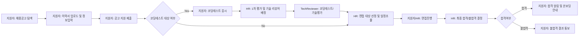
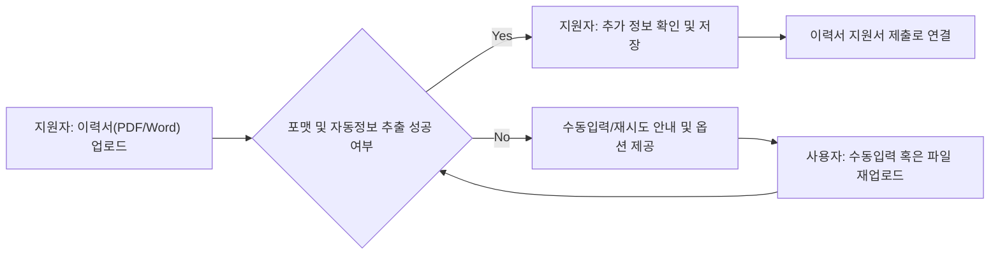

# ATS 지원자 추적 시스템 - 사용자 시나리오 및 플로우 보고서

이 문서는 ATS(Appliant Tracking System) 내의 주요 사용자 역할, 각 역할별 주요 여정, 단계별 시나리오(정상/예외 포함), 그리고 주요 플로우를 머메이드 다이어그램과 함께 상세하게 제공한다. 목적은 백엔드 개발자가 혼동 없이 업무플로우, 비즈니스 룰, 예외처리 흐름까지 모두 구현할 수 있도록 완벽한 비즈니스 맥락을 전달하는 것이다.

## 1. 주요 사용자 페르소나 소개

| 역할명      | 주요 기능 및 권한 설명 |
|-------------|----------------------|
| 지원자(applicant)       | 이력서 업로드, 채용공고 확인/지원, 면접 일정 확인, 코딩테스트 응시 |
| HR/채용 담당(hrRecruiter)| 채용공고 관리, 지원자 목록 관리, 이력서 평가, 면접 예약/조율, 합격/불합격 통지, Google Calendar 연동 |
| 기술 리뷰어(techReviewer)| 지원자 코딩테스트 평가, 기술스택 자동 분석 검토, 기술평가 코멘트 작성 |
| 시스템 관리자(systemAdmin)| ATS 환경설정, 전체 사용자 및 권한 관리, 외부 API 연동 관리 |

### 페르소나 맥락 요약
- **지원자(applicant)**: 새로운 경력/직장을 위해 채용공고를 탐색하고 손쉽게 지원하며, 자신의 상태를 실시간 추적하고 결과를 빠르게 확인하고 싶어한다.
- **HR/채용 담당(hrRecruiter)**: 빠르고 체계적으로 우수 지원자를 선별, 전체 지원 상태 및 진행 단계를 한눈에 파악해 일정 수립과 커뮤니케이션 효율성을 극대화하는 것이 관건이다.
- **기술 리뷰어(techReviewer)**: 지원자의 실제 기술력을 객관적으로 비교, 시스템이 제공하는 코딩테스트/기술분석 자동화와 수동 피드백을 혼합해 신속 정확하게 판단하길 원한다.
- **시스템 관리자(systemAdmin)**: 정상적인 서비스 운영 및 외부 서비스 인프라 연동상태, 사용자 계정관리 업무의 편리한 자동화와 전체 통합관리가 목적이다.

## 2. 핵심 사용자 여정(역할별)

### 2.1 지원자 (applicant) 사용자 플로우

1. **채용공고 검색 및 상세 열람**
   - WHEN 사용자가 ATS 홈에 접속, THE 시스템 SHALL 현재 진행중인 전체 채용공고를 목록·필터·검색 기능으로 제공한다.
   - WHEN 지원자가 특정 공고를 열람, THE 시스템 SHALL 상세내용(직무, 요구, 마감일 등)과 현재 지원상태를 보여준다.

2. **이력서 업로드 및 정보 등록**
   - WHEN 지원자가 이력서 PDF/Word 업로드, THE 시스템 SHALL OCR/NLP로 성명, 연락처, 학력, 경력, 기술스택을 자동 추출하고 신속히 확인시킨다.
   - IF 필수 정보 누락되어 자동 추출 실패시, THEN THE 시스템 SHALL 수동 정보 입력 UI와 신청 취소 옵션을 제공한다.
   - WHEN 지원자가 입력정보 확정, THE 시스템 SHALL 즉시 저장하고 등록 프로그레스 바를 실시간 표시한다.

3. **지원 및 지원상태 추적**
   - WHEN 지원자가 채용공고 지원 클릭, THE 시스템 SHALL 이력서, 추가 입력정보, 코딩테스트 대상 여부를 포함하여 지원이력 생성한다.
   - WHEN 지원 완료 후, THE 시스템 SHALL "서류 접수" 상태로 이력서 상태를 즉시 세팅한다.
   - WHILE '코딩테스트 대상'이면, THE 시스템 SHALL 자동 코딩테스트 초대 및 안내를 한다.
   - WHILE '면접 대상'이면, THE 시스템 SHALL 지원자와 HR의 Google Calendar 일정을 비교해 2차례 이상 후보 일정을 제안한다.

4. **합격/불합격 알림 확인 및 데이터 내보내기**
   - WHEN 지원자의 상태가 최종 결정(합격/불합격)으로 변경, THE 시스템 SHALL 문자/이메일 등으로 알림을 자동 발송하고, 마이페이지에 최종 결과를 명확히 표시한다.
   - WHEN 지원자가 지원이력/개인정보 다운로드 요청, THE 시스템 SHALL CSV/Excel 등으로 안전하게 내보낸다.

### 2.2 HR/채용 담당자 사용자 플로우

1. **채용공고 생성 및 관리**
   - WHEN HR담당자가 채용공고 등록 시도, THE 시스템 SHALL 직무, 경력, 우대조건, 기술스택, 마감일 등 항목 등록 UI를 제공한다.
   - WHEN 공고 등록 확정, THE 시스템 SHALL 즉시 공고를 게시하고 탐색가능하도록 리스트를 갱신한다.

2. **지원자 목록 및 평가**
   - WHEN HR이 공고별 지원자 목록 조회, THE 시스템 SHALL 상태(서류, 코테, 면접 등), 추출된 이력서 정보, 기술스택 매칭 결과를 한눈에 정렬/필터 제공한다.
   - WHEN HR이 각 지원자별 상세 평가진행, THE 시스템 SHALL AI 자동추천 면접질문 리스트와 직접 기입 메모란을 같이 보여준다.

3. **면접 일정 조율 및 예약**
   - WHEN HR이 면접 대상자 선정, THE 시스템 SHALL Google Calendar 연동상 후보 날짜 2개 이상 자동추천 및 지원자 일정과 중복 자동 체크한다.
   - WHEN 후보 일정 확정, THE 시스템 SHALL 양측에 일정 통지 및 불가 알림 포함한 변경 프로세스 제공한다.

4. **지원자 상태 변경 및 알림**
   - WHEN HR이 지원상태 변경(예: 불합격/합격 판단), THE 시스템 SHALL 지원자별로 알림(SMS/이메일), 마이페이지, 데이터 내보내기 툴과 연동 집행한다.

### 2.3 기술 리뷰어(techReviewer) 플로우

1. **코딩테스트 평가/분석**
   - WHEN 기술 리뷰어가 할당된 지원자 코딩테스트 열람, THE 시스템 SHALL 문제, 제출 코드, 자동채점 결과, 지원자 프로필 및 기술스택 자동추출 정보를 제공한다.
   - WHEN 리뷰 결과 입력, THE 시스템 SHALL 점수, 통과여부, 상세피드백(코멘트) 필드 모두 작성가능하게 한다.

2. **AI 기반 기술질문 및 평가 반영**
   - WHEN 리뷰어가 기술 인터뷰/면접질문 입력 화면 진입, THE 시스템 SHALL 이력서와 지원 직무 특성을 바탕으로 자동 추천질문 세트 제공한다.
   - WHEN 리뷰어가 추가 질문 입력, THE 시스템 SHALL 전체 질문 목록과 설명란을 저장, HR/면접관과 공유한다.

### 2.4 시스템 관리자(systemAdmin) 플로우

1. **시스템 환경설정 관리**
   - WHEN 시스템 관리자가 환경설정 메뉴 접근, THE 시스템 SHALL 외부 API 연동(코딩테스트 공급자, OCR, Google Calendar 등) 현황/토큰 관리 화면을 보여준다.
   - WHEN 관리자 권한으로 사용자/역할 관리 진입, THE 시스템 SHALL 신규 계정등록, 권한변경, 휴면처리, 외부ID등록 등 전체 기능을 통합 제공한다.

## 3. 단계별 시나리오 및 예외 케이스(공통 및 특수)

### 3.1 지원자 예외 및 오류 흐름
- IF 파일 포맷이 지원하지 않거나 OCR/NLP 자동추출에 실패, THEN THE 시스템 SHALL 지원자에게 예외 안내와 수동입력 옵션/재시도 링크를 제공한다.
- IF 채용공고 지원 마감일이 경과한 경우, THEN THE 시스템 SHALL 지원불가 메시지와 연관된 유효 기간 정보 표시한다.
- IF 코딩테스트 연결된 외부 API 응답이 3초 이내 정상적으로 수신되지 않을 경우, THEN THE 시스템 SHALL "일시적 오류/다시시도" 안내 및 HR에 장애 알림 자동 생성한다.
- IF 지원자 개인정보 다운로드 중 네트워크 오류 발생, THEN THE 시스템 SHALL 부분저장 안내와 수동 재시도/문의서포트 안내를 함께 제공한다.

### 3.2 HR/리뷰어/관리자 공통 예외
- IF Google Calendar 연동 토큰 만료/권한 미부여시, THEN THE 시스템 SHALL OAuth 재연동 안내와 토큰 복구 플로우 제공한다.
- IF 외부 API 설정값(토큰 등)이 잘못됐을 때, THEN THE 시스템 SHALL 관리자/운영자 알림 및 조치매뉴얼 연결을 제공한다.
- IF 시스템 환경설정 중 잘못된 값 입력/저장실패, THEN THE 시스템 SHALL 적합하지 않은 데이터 메시지, 입력취소, 재입력 프로세스를 안내한다.

## 4. 사용자 플로우 머메이드 다이어그램

### 4.1 전체 ATS 채용 흐름(지원자/HR/TechReviewer)

### 4.2 이력서 업로드 및 정보 검증 플로우

---

## 참고 자료 및 연관 문서
- [서비스 개요/비즈니스 목표 문서](./01-service-overview.md)
- [역할 및 권한 상세 정의 문서](./02-user-roles-and-permissions.md)
- [기능별 세부 요구사항 문서](./03-functional-requirements.md)
- [비즈니스 룰 및 정책 정리 문서](./05-business-rules-and-policies.md)
- [외부 API 연동 요구사항 문서](./06-external-integrations.md)
- [에러/예외 처리 문서](./07-error-handling-and-recovery.md)
