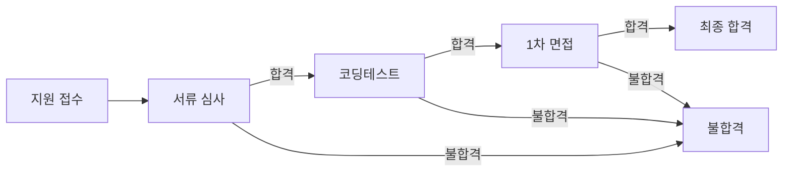

# ATS 비즈니스 룰 및 정책 명세서

## 1. 비즈니스 룰 전체 목록

| 카테고리        | 비즈니스 룰 요약 |
|----------------|---------------------------------------------------|
| 지원자 등록 | 1인 1공고 1회 지원 원칙, 중복 지원 방지 |
| 이력서 업로드 | PDF, DOCX만 허용, 최대 10MB, 이름·연락처 필수 추출, AI 분석 실패 시 재업로드 필요 |
| 채용 공고 | 마감일 이후 지원/변경 금지, 마감/진행 상태 전이 명확화 |
| 코딩테스트 | 1회 응시 원칙, 외부/자체 플랫폼 중복 응시 불가, 결과 자동 연동 실패 시 재알림 |
| 면접 일정 | 지원자/담당자 스케줄 동시 유효 시에만 예약, 동일 시간대 중복 방지 |
| 상태 관리 | 각 지원자는 오직 한 상태(서류, 코딩테스트, 면접 등)에만 위치 가능 |
| 알림 정책 | 상태 변경/오류/합격 등 Event 발생 시 자동 알림 |
| 데이터 내보내기 | 권한자만 가능, 개인정보 포함 시 별도 안내 동의 필요 |

## 2. 입력 및 처리 검증 로직

### 지원자 등록/중복 방지
- WHEN 지원자가 동일한 채용 공고에 이미 지원한 경우, THE 시스템 SHALL 지원을 거부하고 "이미 지원하셨습니다" 메시지를 반환한다.
- WHEN 지원자가 다른 공고에 지원하는 경우, THE 시스템 SHALL 지원 처리한다.

### 이력서 업로드(파일 검증)
- WHEN 이력서 업로드 시 확장자가 PDF 또는 DOCX가 아닌 경우, THE 시스템 SHALL 업로드를 거부한다.
- WHEN 파일 크기가 10MB를 초과하는 경우, THE 시스템 SHALL 업로드를 거부한다.
- WHEN 이력서에서 필수정보(이름, 연락처 등)가 추출되지 않을 경우, THE 시스템 SHALL 업로드 오류 메시지와 함께 재업로드 요청 안내를 제공한다.
- IF 이력서 분석 외부 API 호출이 실패하는 경우, THEN THE 시스템 SHALL 재시도 1회 후, 실패 안내와 수동 등록 옵션 제공한다.

### 채용 공고 상태 및 지원 가능성
- WHEN 채용 공고가 마감된 경우, THE 시스템 SHALL 지원 접수를 불허한다.
- IF HR이 마감일 이전에 공고를 종료 처리하는 경우, THEN THE 시스템 SHALL 즉시 지원 접수를 마감한다.
- WHILE 채용 공고가 진행 상태(열림)인 경우, THE 시스템 SHALL 신규 지원을 허용한다.

### 코딩테스트 응시/제출 검증
- WHEN 지원자가 지정된 코딩테스트에 이미 응시한 경우, THE 시스템 SHALL 추가 응시를 거부한다.
- WHERE 외부 플랫폼과 자체 플랫폼 동시 제공 시, THE 시스템 SHALL 동일 지원자의 중복 응시를 방지한다.
- IF 코딩테스트 결과 연동에 실패할 경우, THEN THE 시스템 SHALL 담당자에게 자동 알림 후 재연동 시도 옵션을 제공한다.

### 면접 일정 확인·조율 검증
- WHEN 면접 예약 요청 시 지원자와 담당자의 일정이 모두 가능한 시간대에 한해 THE 시스템 SHALL 예약을 승인한다.
- IF 동일 시간·담당자에 이미 타 지원자 면접이 존재하면, THEN THE 시스템 SHALL 중복 예약을 방지하고 대체 시간 안내한다.
- WHEN Google Calendar 외부 API 연동에 실패하는 경우, THE 시스템 SHALL 실패 알림과 수동 조율 옵션 제공한다.

### 지원자 상태 변화 검증(상태 전이)
- WHEN 지원자 상태가 "코딩테스트 통과"가 아닌데 "1차 면접"으로 변경 시도 시, THE 시스템 SHALL 상태변경을 거부한다.
- WHEN 상태 전이 규칙을 위반하는 요청이 발생하면, THE 시스템 SHALL 오류 메시지 로깅 및 관리자 알림을 수행한다.
- WHILE 지원자는 반드시 하나의 상태(서류, 코딩테스트, 1차 면접, 최종 등)만 보유한다.

### 알림 및 데이터 내보내기 검증
- WHEN 합격/불합격/면접 일정 변경/기타 주요 상태 변화 발생 시, THE 시스템 SHALL 즉시 이메일 및 문자(SMS)로 알림을 전송한다.
- IF 이메일 또는 문자 발송 외부 API 연동 실패 시, THEN THE 시스템 SHALL 3회까지 재시도 후 실패 시 대체 연락 안내한다.
- WHERE 데이터 내보내기에 개인정보 포함 시, THE 시스템 SHALL 사전 안내 및 동의 절차 확인 후 내보내기를 수행한다.

## 3. 업로드/일정/상태 관리 정책

### 이력서 업로드 정책
- 지원자는 PDF, DOCX 포맷의 이력서 파일만 1건 업로드할 수 있으며, 10MB 이내로 제한한다.
- WHEN 업로드한 파일이 확장자/용량/정보추출 기준 미달 시, THE 시스템 SHALL 오류 메시지 및 안내를 제공한다.

### 면접 일정 정책
- 면접 예약은 지원자·담당자 모두 가능한 시간대만 확정된다.
- 동일 시간대 중복 예약 없이 우선 도착 순으로 예약이 확정된다.
- 예약 확정 후 변경 시, 양측 모두에 변경 알림을 발송한다.

**Mermaid 상태도 예시**

### 상태 관리 정책
- 지원자는 동시에 둘 이상의 처리상태에 놓일 수 없다.
- 상태 변화 허용 경로(상태 전이)는 반드시 위 도식상 허용된 방향만 따른다.
- 상태 변경 실패 및 예외 발생 시, 관리자 알림 및 롤백 처리한다.

## 4. 특별 예외 및 임시 허용정책

### 업로드 예외 처리
- WHERE 시스템 유지보수/외부 API 장애 등으로 이력서 분석 자동화가 임시 중단된 경우, THE 시스템 SHALL PDF/DOCX 단순 파일 업로드를 일시 허용하고, 필수정보 미제출 건은 HR이 수동 검증할 수 있도록 지원한다.

### 일정 예외 정책
- WHERE Google Calendar 연동에 서비스 장애가 있을 때, THE 시스템 SHALL 지원자와 HR에게 서비스 장애 안내 메시지를 전달하고 수동 일정 조율 모드로 전환한다.

### 지원 상태 임시 허용정책
- WHERE 신규 채용 공고 오픈 직후 일시적으로 시스템 점검/알림 지연 등이 있는 경우, THE 시스템 SHALL 지원자 상태변화를 임시로 보류하고, 정상화 후 일괄 처리한다.

## 5. 참고 사항
- 정책·예외·상태 관리의 세부 사항은 [에러 및 복구 명세](./07-error-handling-and-recovery.md) 문서에서 확장 기술됨.
- 데이터 내보내기, 외부 연동 정책 등은 [외부 연동 명세](./06-external-integrations.md)등 연결 문서 참고.

---

이 문서는 비즈니스 요구/로직만을 정의하며, 실제 기술적 아키텍처·DB·API 설계는 개발팀의 자율에 맡깁니다.