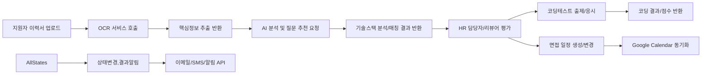

# ATS 시스템 외부 연동 요구사항 명세

## 1. 외부 연동 시스템 개요
ATS(지원자 추적 시스템)는 선진 채용 업무 효율화를 위해 각 기능별로 다양한 외부 서비스를 연동한다. 주요 연동 대상은 다음과 같다:
- 이력서 분석 OCR 서비스(이력서 PDF/Word 업로드시 자동 정보 추출)
- AI 기반 자동분석 서비스(기술스택 추출, 면접 질문 추천)
- 외부 코딩테스트 플랫폼(자동 테스트 출제 및 점수 조회)
- Google Calendar(면접 일정 등록/수정/동기화)
- 이메일/SMS/알림 통합 API(상태변화 실시간 안내, 일정/결과 통지)

## 2. 각 연동 포인트별 트리거 및 사용 목적
### 2.1. OCR/AI 이력서 분석
- **트리거**: 지원자가 이력서를 PDF/Word로 업로드할 때 자동 시작
- **업무 목적**:
  - 인적사항, 연락처, 학력, 경력, 기술스택 등 핵심정보 자동 추출
  - 추출 성과물 기반 AI 분석 후, 직무별로 맞춤형 면접질문과 기술스택 리스트 추천
- **EARS 요구**:
    - WHEN 지원자가 이력서를 업로드할 때, THE 시스템 SHALL 외부 OCR 서비스로 파일을 전달하여 핵심정보를 자동 추출한다.
    - WHEN OCR 결과가 수신되면, THE 시스템 SHALL 외부 AI 서비스로 정보를 전송해 직무·경력 기반 맞춤 면접 질문을 추천받는다.
    - IF 외부 OCR/AI 연동이 실패하면, THEN THE 시스템 SHALL 사용자에게 오류를 알리고 수동입력/재시도를 안내한다.

### 2.2. 기술스택 자동 추출/매칭
- **트리거**: 이력서 OCR/AI 분석 후
- **업무 목적**: 공고별 요구 기술스택과 지원자 능력 자동 매칭(핵심 직무적합도 평가)
- **EARS 요구**:
    - WHEN 지원자 이력서 정보가 자동 추출될 때, THE 시스템 SHALL 지원자의 기술스택 데이터를 외부 AI 서비스에 전달해 머신러닝 기반 자동 매칭 결과를 수신한다.
    - WHERE 지원자의 기술스택이 직무기준과 다를 때, THE 시스템 SHALL 결과를 표시하고 HR 담당자에게 알린다.
    - IF AI 기반 매칭 서비스가 오류를 반환할 때, THEN THE 시스템 SHALL 지원자 정보를 임시보관하고 재시도를 안내한다.

### 2.3. 외부 코딩테스트 플랫폼/자체 코드판 연동
- **트리거**: 직무가 코딩 테스트 평가 대상인 채용공고에 지원한 경우, 지원자 상태가 "코딩테스트"로 진입 시
- **업무 목적**:
  - 지원자별 외부 코딩테스트 자동 출제/초대
  - 결과점수 및 코드 답안 자동수집
  - 자체 웹코드판 선택 지원
- **EARS 요구**:
    - WHEN 지원자가 코딩테스트 대상 직무에 지원하여 단계 진입 시, THE 시스템 SHALL 사전 설정된 외부 테스트 서비스 또는 자체 코드판을 자동 할당한다.
    - WHEN 외부 테스트 서비스에서 점수/답안을 반환하면, THE 시스템 SHALL 지원자 평가 데이터에 자동 반영한다.
    - IF 외부 서비스 연동에 실패하면, THEN THE 시스템 SHALL 재시도 로직 및 알림을 동작시키고, 일시적 실패는 “추후 재처리 목록”에 자동 등재한다.

### 2.4. Google Calendar 연동(면접 일정)
- **트리거**: 면접 일정 생성, 변경, 취소 등 일정 관련 상태 변화 발생 시
- **업무 목적**:
  - 담당자/지원자 개인 구글 캘린더 양방향 동기화
  - 일정 초대/수정/취소 자동 반영
- **EARS 요구**:
    - WHEN ATS 내 면접 일정이 추가/변경/삭제될 때, THE 시스템 SHALL Google Calendar API로 연동 대상 담당자/지원자 개인 계정 일정에 자동 동기화 요청한다.
    - IF 캘린더 연동 실패 시, THEN THE 시스템 SHALL 내부적으로 실패내역을 기록하고 HR 담당자 및 사용자에게 재등록을 안내한다.
    - WHERE 해당 일정이 컨플릭트(겹침)인 경우, THE 시스템 SHALL 충돌 알림과 수동조정 메뉴를 제공한다.

### 2.5. 이메일/SMS/알림 연동
- **트리거**: 지원 단계별 상태변경, 면접 일정 고지, 합격/불합격 결과 통지 등 각종 이벤트 발생 시
- **업무 목적**:
  - 결과/상태변화 실시간 알림(이메일, 문자, 앱푸시 통합)
  - 일정, 안내, 합격여부 등에 대한 자동통지
- **EARS 요구**:
    - WHEN 시스템 상태(면접 안내, 합격/불합격 등)가 변경될 때, THE 시스템 SHALL 외부 알림 API로 대상자에게 이벤트별 실시간 알림을 발송한다.
    - IF 알림 메세지가 전송 실패하면, THEN THE 시스템 SHALL 실패내역을 저장하고, 재전송 또는 수동 안내 옵션을 HR에게 제공한다.
    - WHERE 사용자가 알림 수신을 거부한 경우, THE 시스템 SHALL 관련 이벤트별 알림 전송을 제외한다.

## 3. 데이터 흐름(수집/반환/동기화)
### 3.1. OCR/AI 정보 추출 및 AI 분석
- 지원자 이력서 파일 업로드 → ATS 시스템이 외부 OCR 서비스에 파일 전달 → OCR 결과(이름, 연락처, 학력, 경력 등) 수신 → ATS에서 외부 AI 요청(핵심기술, 경력 요약, 면접질문 추천 등) → 결과 정보 저장 및 UI 반영

### 3.2. 기술스택 분석/매칭
- ATS가 OCR/AI에서 추출된 기술스택을 프로젝트 내부 데이터와 비교, 외부 AI와 매칭
- 기술스택 매칭 결과는 평가 프로세스 및 상태전이에 활용

### 3.3. 코딩테스트/코드판 연동
- ATS에서 외부/내부 서비스에 코딩 테스트 문제 출제 요청 → 서비스에서 문제/링크 발급 → ATS에 결과(점수, 제출 코드 등) 전달 → 지원자 평가/상태 갱신

### 3.4. Google Calendar 동기화
- ATS 일정 생성/수정/취소 → 외부 Google Calendar API에 요청 → 외부 캘린더 상태 반영 → 성공 실패 결과 ATS 내 기록 및 필요시 사용자 재안내

### 3.5. 알림 API 연동
- 상태변경, 일정 이벤트, 결과 안내 등 모든 주요 이벤트 발생시 → 외부 알림 서비스로 정보 전송 → 발송결과 저장 및 실패시 재처리 프로세스 작동

## 4. 예상 오류 및 재처리 흐름
- 외부 API 연동 실패시 (통신오류, 응답 타임아웃, 데이터 누락 등):
    - IF 외부 시스템 응답이 지정시간 내 미도착하면, THEN THE 시스템 SHALL 재시도 정책을 실행하며 최대 시도횟수 이후에는 담당자에게 오류를 알린다.
- 데이터 불일치/유실:
    - IF 외부에서 반환한 데이터가 요구 형식과 불일치하면, THEN THE 시스템 SHALL 오류 로그를 기록하고 담당자 수동 검증 및 재요청을 가능하게 한다.
- 알림 송신 실패:
    - IF 알림 송신 실패가 발생하면, THEN THE 시스템 SHALL 누락된 사용자 목록을 자동 집계하여 재전송 메뉴를 제공한다.
- 일정 동기화 실패:
    - IF Google Calendar 연동이 실패하면, THEN THE 시스템 SHALL 문제 내역과 재처리 방법을 ATS 담당자 화면에 안내한다.

## 5. 부록: 외부 연동 전체 흐름도(머메이드)

---

이 문서는 구현 기술 방식 명시를 포함하지 않으며, 모든 연동은 비즈니스 요구 및 사용 목적 중심으로만 설계함을 명시한다.