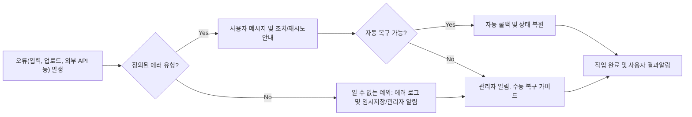

# ATS 채용 시스템 오류 처리 및 복구 정책 명세서

## 1. 에러/예외 상황 카테고리화

### 1.1 입력 데이터/업로드 오류
- 이력서(PDF/Word) 업로드 시 파일 포맷, 용량, 손상 등으로 인한 오류
- 필수 입력값 누락, 형식 불일치(이름, 연락처 등)
- 기술 스택 자동 인식 실패 및 누락
- 대용량(10MB 근접) 파일 반복 업로드 시 네트워크/타임아웃 오류 및 업로드 실패

### 1.2 외부 연동 실패
- 코딩 테스트 플랫폼 API 오류, 응시 결과 처리 실패(연동불가/서비스장애)
- Google Calendar/알림톡/이메일 등 연동 실패(토큰 만료, 반환값 실패)
- 외부 API 시간 초과, 3회 연속 실패와 같은 반복 장애 상황

### 1.3 상태 전이/지원자 프로세스 오류
- 지원 상태 변환 불가 상황(이미 종료/삭제된 지원, 중복 지원, 잘못된 상태 전이, 상태 불일치 등)
- 스케줄 중복(면접 담당자/지원자 일정 겹침 및 중복 예약 요청)

### 1.4 권한/인증/인가 실패
- 미인증 사용자 접근, 권한 없음/담당자가 아닌 경우의 액션 시도
- 토큰 만료, 위변조, 잘못된 인증 정보 등으로 인한 인증 실패

### 1.5 시스템 장애 및 기타 예외
- 서버 장애, 네트워크 불안정, 데이터베이스 오류/죽음
- 알 수 없는 예외 상황 및 미정의 에러

## 2. 유형별 메시지 및 대응 방안

### 2.1 사용자 노출 메시지 원칙
- WHEN 사용자기준 오류 발생, THE 시스템 SHALL 모든 메시지를 구체적으로 사용자 시점에서 전달(무의미한 "알 수 없는 오류" 지양)
- WHEN 시스템 예외(서버/DB/NE 운용 등) 발생, THE 시스템 SHALL 내부 오류 식별번호, 복구 방법 및 관리자 문의 경로를 정확히 안내

#### 표준 에러 메시지(예시)
| 카테고리 | 메시지 예시 |
|---|---|
| 입력값 누락 | "필수 입력값(예: 이름, 이메일)이 누락되었습니다. 항목을 입력해 주세요." |
| 형식 오류 | "이메일 형식이 올바르지 않습니다. 예시: id@email.com" |
| 지원서 업로드 실패 | "업로드 파일 형식(PDF/Word) 또는 용량(10MB 이하)을 확인해주세요." |
| 업로드 재시도 실패 | "반복적인 네트워크 실패로 업로드가 중단되었습니다. 네트워크 상태 확인 및 3분 후 재시도 해주십시오." |
| 외부 연동 실패 | "코딩테스트/캘린더/알림 연동에 실패하였습니다. 1회 재시도 후에도 문제가 지속된다면 관리자에게 문의주십시오." |
| 권한/인증 실패 | "접근 권한이 없습니다. 로그인 상태 및 담당자 권한을 확인해주세요." |
| 상태 전이 오류 | "현재 단계에서는 요청하신 상태변경이 불가합니다. 진척 상황을 확인 바랍니다." |
| 일정 중복 | "선택한 시간이 이미 예약되었습니다. 다른 일정을 선택해 주세요." |
| 시스템 장애 | "일시적 시스템 오류입니다. 잠시 후 재시도하거나, 지속 시 고객센터에 문의 바랍니다. [에러코드: XXXX]" |
| 알 수 없는 예외 | "예기치 않은 오류가 발생했습니다. 관리자에게 문의 바랍니다. [에러코드: XXXX]" |

### 2.2 유형별 상세 복구정책(EARS)
- WHEN 지원서 업로드 실패, THE 시스템 SHALL 실패 사유(포맷/용량/손상 등)별 안내 및 파일 재등록, 수동/자동 입력 경로를 함께 제시한다.
- IF 연속 2회 이상 업로드 실패(예: 네트워크 불안정 등) 시, THEN THE 시스템 SHALL 네트워크 점검 및 5분 후 재시도 안내와 담당자 문의 링크를 제공한다.
- WHEN 필수 입력 누락, THE 시스템 SHALL 어떤 항목이 비었는지 구체적으로 분리 표시하고 입력 UI로 자동 포커싱 유도한다.
- WHEN 외부 연동 API 실패, THE 시스템 SHALL 즉시 사용자 안내(1차), 1회 자동 재시도(2차), 재실패 시 고객센터/관리자 문의 안내를 순차 진행한다.
- IF 외부 연동 3회 연속 실패, THEN THE 시스템 SHALL 자동 로그 적재(재시도 내역), 관련 관리자 긴급 알림, 사용자 안내(대체 경로/개별 연락)를 동시 수행한다.
- WHEN 인증/권한 오류 발생, THE 시스템 SHALL 로그인/권한 오류 안내 메시지→자동 로그아웃 또는 로그인 페이지/상세 권한 안내로 리다이렉트한다.
- WHEN 지원 상태/프로세스 오류(중복 지원, 잘못된 상태 변화, 불일치 등) 발생 시, THE 시스템 SHALL 현재 상태, 허용상태/경로, 정책 링크와 함께 상세 알림 및 수정 안내한다.
- WHEN 서버/DB 등 인프라 장애, THE 시스템 SHALL 내부코드 기록, 관리자 경보, 사용자에는 신속한 안내+추가 작업 차단 및 데이터 유실 방지를 설명한다.
- IF 알 수 없는 예외나 정의되지 않은 에러 발생 시, THEN THE 시스템 SHALL 상세 에러 기록, 임시 이벤트/입력 데이터 임시저장, 관리자 실시간 알림 및 안내문구 표시한다.

### 2.3 복구/재처리 및 롤백 운영 예시(EARS)
- WHEN 외부 API 호출 실패, THE 시스템 SHALL 최대 3회 자동 재시도를 지원(간격 60초)한다. 3회 실패 시 관리자와 대상자 동시 알림, 관련 작업 취소 처리.
- WHEN 데이터 처리과정에서 부분적 실패 발생 시, THE 시스템 SHALL 직전 상태 전체 롤백 및 모든 연관 데이터/로그/상태를 일관되게 유지한다.
- WHEN 네트워크 오류나 파일 업로드 등 클라이언트 측 장애 발생, THE 시스템 SHALL 사용자에게 업로드 이력 버튼 및 파일 저장 후 재시도 안내 제공.
- WHEN 면접 일정 예약이 중복/시간 초과/권한 미부여 등 실패 시, THE 시스템 SHALL 캘린더 및 상태 일정과 동기화 실패 안내 및 대체 조율 프로세스를 제공.
- IF 일정 예약 실패가 반복되는 경우, THEN THE 시스템 SHALL 관리자에게 자동 할당 전환하거나, 대체 일정 선별 옵션을 반드시 노출한다.
- WHEN 지원자 데이터 다운로드/내보내기 과정에서 네트워크 타임아웃, 파일 불완전 생성 등 오류 발생, THE 시스템 SHALL 진행 중 내역 임시저장, 재다운로드 안내 및 담당자 통지한다.

### 2.4 추가 예외 및 복구 시나리오
- IF 대용량(10MB) 이상 파일 업로드 실패가 반복될 때, THEN THE 시스템 SHALL 2회 초과 시 이후 업로드 제한과 담당자 문의 대체안 제시.
- IF 상태전이 오류(비정상 단계, 중복 지원, 처리상태 불일치 등)가 5분 이내 반복될 경우, THEN THE 시스템 SHALL 관련 지원자 데이터 로킹 및 수동 검토 플로우에 자동 등재.
- WHEN 알림(SMS/Email/API) 발송이 반복해서 실패하면, THE 시스템 SHALL 실패 건 집계 후 차단 로직-trap/관리자 수동 확인 프로세스 안내.

## 3. 상태/데이터 복구 및 롤백 지침

### 3.1 데이터 일관성 보장 원칙 (EARS)
- THE 시스템 SHALL 언제나 트랜잭션/작업 단위로 데이터 처리가 실패하면 직전 안정 상태, 정상 데이터로 완전 되돌림(rollback) 정책을 적용한다.
- WHEN 입력/업로드/외부 연동 등 중간 단계 실패 발생, THE 시스템 SHALL 관련 데이터(지원자 정보, 공고, 상태, 알림, 파일 등) 전 영역에 대해 일관성 유지 및 연결 작업 전체 복구해야 한다.
- WHEN 상태 변화 및 논리적 전이가 실패할 경우, THE 시스템 SHALL 지원 내역, 상태, 로그, 사용자 알림 포함 전체 일치성 회복 또는 관련자 자동 재분배(관리자 재검토)[EARS].
- WHEN 예약 일정·알림·외부 연동 등 롤백이 필요한 경우, THE 시스템 SHALL 전체 연관 작업의 트랜잭션 로그 및 복구 로그를 남기고, 데이터와 UI에 확정 결과가 즉시 반영되게 해야 한다.

### 3.2 자동/수동 복구/할당 및 사후 처리
- WHEN 자동 복구가 불가(외부재시도 실패, 지속 오류 등)한 경우, THE 시스템 SHALL 관리자 실시간 알림 및 수동 복구/매뉴얼 링크 안내 기능을 제공한다.
- WHEN 복구(rollback) 완료/불가로 최종 판정 시, THE 시스템 SHALL 담당자, 사용자, 관리자 로그 및 알림 내역에 자동 기록한다.
- IF 예외/에러로 미처리 데이터가 남아있을 경우, THEN THE 시스템 SHALL 해당 데이터/로그를 별도 분리 저장, 추후 수동 보정 및 롤백 가능하도록 유지한다.
- WHEN 트랜잭션/상태 복구 중 중복/반복 오류가 탐지되면, THE 시스템 SHALL 자동 롤백 시도 중단 및 관리자에게 즉각 개입 요청 자동 발송함.

## 4. Mermaid 오류/복구 프로세스 다이어그램

---

이상으로 ATS 시스템의 모든 오류/예외 처리 정책, 대응, 복구·롤백 및 추가 예외 케이스에 대해 EARS 포맷과 명확한 비즈니스 규칙, 구체적 시나리오, 머메이드 도식까지 포함하여 실무 적용 가능한 수준으로 완결 정리하였다. 모든 Mermaid 노드 및 라벨, Arrow 등 문법은 쌍따옴표("")로 표기되며, 이 명세서는 [기능 요구사항](./03-functional-requirements.md) 및 [비즈니스 정책](./05-business-rules-and-policies.md) 등과 함께 개발 현장에서 반드시 참고되어야 한다.