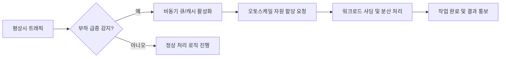
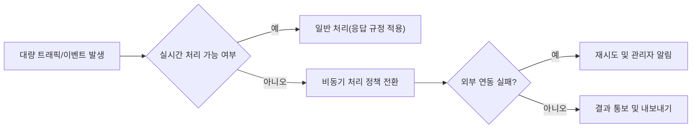

# ATS 시스템 성능 및 확장성 요구사항

## 1. 성능 기준 및 SLA

### 1.1 서비스 응답 시간 기준
- THE "ATS 시스템" SHALL 모든 지원자 및 채용담당자 뷰 API 응답을 평균 1초, 최대 3초 이내로 제공한다.
- THE "ATS 시스템" SHALL 외부 연동(코딩테스트, 캘린더, 알림 API 등) 관련 API 응답을 평균 2초, 최대 5초 이내로 제공한다.
- WHEN 지원자가 이력서(PDF/Word)를 업로드할 때, THE "ATS 시스템" SHALL 전체 추출/분석 과정을 15초 이내에 완료해야 한다.

### 1.2 대량 트래픽 및 동시 사용자 기준
- WHERE "채용대상 공고"에 동시 접속 지원자가 1,000명을 넘는 경우, THE "ATS 시스템" SHALL 각 지원자 요청을 5초 이내에 처리한다.
- THE "ATS 시스템" SHALL 1분당 500건의 코딩테스트 자동 발송을 지원해야 한다.
- WHERE "서비스 전체 동시 접속자"가 2,000명을 초과할 때, THE "ATS 시스템" SHALL 서비스 중단이나 치명적 지연 없이 최소 SLA(응답 10초 이내, 데이터 유실 없음)를 보장해야 한다.

### 1.3 장애/복원 시간 권고
- IF 주요 기능(이력서 분석, 공고 관리, 상태 조회 등) 요청이 실패하면, THEN THE "ATS 시스템" SHALL 30초 이내에 1회 재시도 및 예외처리·알림 프로세스를 동작한다.
- THE "ATS 시스템" SHALL 평균 가용률 99.5% 이상을 보장한다.

### 1.4 측정 및 모니터링
- THE "ATS 시스템" SHALL 트랜잭션별 응답 속도 및 시스템 사용량을 실시간으로 로깅 및 모니터링한다.
- WHEN 지정 임계치(SLA 미달, 에러율 3% 이상, 응답지연 5초 초과)가 발생하면, THE "ATS 시스템" SHALL 시스템 관리자 및 담당자에게 즉시(10초 이내) 알림을 발송한다.

---

## 2. 응답 속도 및 확장 계획

### 2.1 핵심 비즈니스 플로우별 성능 요구
- WHEN 채용담당자가 지원자/공고 목록을 조회할 때, THE "ATS 시스템" SHALL 1,000명 이상 대용량 데이터도 2초 이내 페이지네이션/검색 결과를 반환해야 한다.
- WHEN 기술평가 담당자가 코딩테스트 결과 확인 시, THE "ATS 시스템" SHALL 2초 이내 점수/분석 결과를 반환해야 한다.
- THE "ATS 시스템" SHALL AI 추천 면접 질문 결과 생성에도 10초 이내 완료 기준을 적용한다.

### 2.2 데이터 처리 및 확장 전략
- WHERE 공고/지원/면접 예약/알림 등 비동기성/대기처리 요구가 필요한 경우, THE "ATS 시스템" SHALL 큐(Queue) 기반 비동기 처리 정책(최대 30초 대기)을 적용한다.
- WHEN 대량 알림(이메일/SMS) 1,000건 이상 동시 발송 시, THE "ATS 시스템" SHALL 외부 타임아웃/에러시 2회 재시도 정책을 구현한다.
- THE "ATS 시스템" SHALL 사용자별, 채용공고별 캐시 정책 도입을 허용한다(예: 검색결과 60초 캐싱).

### 2.3 확장성 실현 정책
- THE "ATS 시스템" SHALL 수평 및 수직 확장(마이크로서비스, 컨테이너 오토스케일 등) 요구를 고려하여 설계된다.
- WHEN 단일 지원 이벤트 또는 벌크 코딩테스트 발송 부하가 2,000건/분을 초과할 때, THE "ATS 시스템" SHALL 동적으로 인프라 리소스 할당(비즈니스 로직 분산 실행)을 보장해야 한다.

#### [Mermaid: ATS 시스템 비즈니스 확장 플로우]

---

## 3. 예상 부하/대량 이벤트 처리 시나리오

### 3.1 대량 지원자 폭주 및 공고 마감 집중
- WHEN "채용 마감일 1시간 이내" 동시 지원이 집중되는 경우, THE "ATS 시스템" SHALL 동시 1,000건 이상의 지원처리에도 정상 응답(5초 이내) 보장한다.
- IF 대량 이력서 업로드 트래픽으로 PDF/Word 분석이 지연될 경우, THEN THE "ATS 시스템" SHALL 백오프(Backoff) 및 순차적 처리정책, 대기화면 안내(최대 지연 30초)을 제공한다.

### 3.2 외부 코딩테스트/알림 폭주
- WHEN 1회 최대 2,000건의 코딩테스트 또는 1,000건의 알림 요청이 발생하면, THE "ATS 시스템" SHALL 배치/병렬처리·즉시 예약·결과 알림 기능을 제공한다.
- IF 외부 API 연동 중 타임아웃, 실패율 5% 초과가 발생하면, THEN THE "ATS 시스템" SHALL 즉시 담당자 알림, 2회 자동 재시도, 장애 히스토리 기록 등 복구 정책을 동작한다.

### 3.3 지원자 데이터 대량 내보내기
- WHEN 채용 담당자가 CSV/Excel 데이터 10,000건 이상 내보내기 요청 시, THE "ATS 시스템" SHALL 1분 이내에 비동기 다운로드 링크를 생성 및 알림한다.

#### [Mermaid: 대량 이벤트/장애 대응 플로우]

---

## 4. 성능/확장성 테스트 및 검증 규칙
- THE "ATS 시스템" SHALL 릴리즈 전 모든 주요 기능에 대해 동시 1,000유저, 분당 2,000이벤트 부하테스트를 통과해야 한다.
- WHEN 신규 외부 연동 또는 대규모 캠페인/채용시즌 적용 전, THE "ATS 시스템" SHALL 시뮬레이션 부하테스트 및 성능저하 대응 프로세스를 시행한다.
- THE "ATS 시스템" SHALL SLA, 장애, 성능 이벤트 관련 모든 로그를 6개월 이상 보존한다.

---

이상의 기준, 정책은 [ATS 기능 요구사항 문서](./03-functional-requirements.md) 및 [외부 연동 요구사항 문서](./06-external-integrations.md)와 연계되어 적용되며, 모든 수치는 실제 상용 환경에서도 유지되어야 한다.