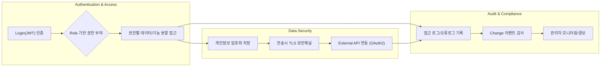

# ATS 채용 시스템 보안 및 컴플라이언스 요구 사양서

## 1. 접근 제어 정책
### 1.1 사용자 인증 및 인가
- THE atsRecruitment 시스템 SHALL 모든 사용자에게 사전 인증(JWT 기반) 후 자원 접근을 허용한다.
- WHEN 인증이 정상적으로 완료된 경우, THE atsRecruitment 시스템 SHALL 사용자의 역할(role)에 따라 접근 권한을 할당한다.
- IF 인증이 실패하거나 토큰이 만료된 경우, THEN THE atsRecruitment 시스템 SHALL 요청을 거절하며, 표준화된 오류코드와 메시지를 제공한다.
- WHERE 외부 서비스 API(코딩테스트, 캘린더, 알림 등) 연동 시, THE atsRecruitment 시스템 SHALL OAuth2 등 표준 프로토콜로 안전하게 토큰을 발급/갱신한다.
- WHERE 시스템관리자 기능(설정, 계정 관리, 외부 연동)은 systemAdmin만 접근 가능하다.
- WHERE 지원자 개인정보(이력서 원본, 연락처, 코딩테스트 결과)가 포함된 자료는 hrRecruiter/techReviewer만 열람 가능하다.
- WHERE 면접 일정 데이터는 해당 공고의 hrRecruiter, 해당 지원자, 관련 techReviewer만 열람/수정 가능하다.

### 1.2 세분화된 권한 관리 (Permission Matrix)
지원자(applicant)
| 기능 | 접근 | 수정 | 삭제 |
|------|-----|------|------|
| 본인 이력서/정보 | ✅ | ✅ | ✅ |
| 이력서 제출 이력 | ✅ |  |  |
| 지원 내역/상태 조회 | ✅ |  |  |
| 면접 일정 확인 | ✅ |  |  |
| 코딩테스트 응시 | ✅ |  |  |

HR/채용담당자(hrRecruiter)
| 기능 | 접근 | 수정 | 삭제 |
|------|-----|------|------|
| 채용 공고 | ✅ | ✅ | ✅ |
| 지원자 목록/상세 | ✅ | 상태/스케쥴 |  |
| 코딩테스트 결과 | ✅ | 코멘트 |  |
| 면접 일정 관리 | ✅ | ✅ |  |
| 합격/불합격 알림 | ✅ | ✅ |  |

기술리뷰어(techReviewer)
| 기능 | 접근 | 수정 | 삭제 |
|------|-----|------|------|
| 지원자 목록(담당배정 건) | ✅ | | |
| 코딩테스트 결과 | ✅ | 평가코멘트 | |
| 기술 스택 분석 결과 | ✅ |  | |

시스템 관리자(systemAdmin)
| 기능 | 접근 | 수정 | 삭제 |
|------|-----|------|------|
| 전체 사용자/권한 | ✅ | ✅ | ✅ |
| 시스템 설정(보안, 정책) | ✅ | ✅ | |
| 외부 API 연동(캘린더, 알림) | ✅ | ✅ | |
| 데이터 익명화 | ✅ | ✅ |  |

## 2. 개인정보 처리 정책
- THE atsRecruitment 시스템 SHALL 지원자의 성명, 연락처, 학력/경력/이력서/코딩테스트 결과 등 민감정보를 안전하게 저장해야 한다.
- WHEN 신규 이력서 업로드 시, THE atsRecruitment 시스템 SHALL 자동 추출·분석된 개인정보 항목을 암호화 적용 후 저장한다.
- WHEN 사용자(지원자)가 본인 정보 열람 또는 수정 요청 시, THE atsRecruitment 시스템 SHALL 암호화 해제 후 필요한 범위에 한해 일시적으로 표시한다.
- WHEN 사용자(지원자)가 본인 정보 삭제 요청 시, THE atsRecruitment 시스템 SHALL 즉시 데이터베이스에서 영구 삭제 처리를 진행한다(단, 법령상 보존이 필요한 일부 항목은 보관).
- WHERE 업무·채용관리 목적상 HR이나 관리자에게 반드시 필요한 데이터만 노출한다.
- WHERE 비식별 처리(익명화)가 가능한 경우, THE atsRecruitment 시스템 SHALL 익명화/마스킹 기능을 제공한다.
- THE atsRecruitment 시스템 SHALL 외부 API(코딩테스트/AI/알림 연동) 송수신 시, 개인정보는 반드시 표준 암호화 채널(HTTPS, TLS 등)을 사용해 전송한다.
- IF 데이터 전송 또는 저장 중 보안 위협이 탐지된 경우, THEN THE atsRecruitment 시스템 SHALL 위협 정보를 로그 기록하고 관리자에게 즉시 경고한다.

## 3. 데이터 보존 및 삭제 원칙
- THE atsRecruitment 시스템 SHALL 지원자 데이터 등록일 기준 계약/법령에 지정된 보존기간(최대 3년, 법별 상이) 동안만 저장한다. 보존기간 만료 후, 즉시 영구 삭제한다.
- WHEN 사용자가 탈퇴/삭제 요청 시, THE atsRecruitment 시스템 SHALL 요청 즉시 데이터 삭제를 실행한다. 단, 분쟁/법무 목적으로 30일 유예기간 설정 가능.
- WHERE 채용이 종료된 경우(최종 합격/불합격), THE atsRecruitment 시스템 SHALL 필수 보관기간 후 자동으로 개인정보를 파기/익명화 한다.
- 모든 삭제 작업은 되돌릴 수 없으며, 작업 로그와 근거를 별도 저장한다.
- THE atsRecruitment 시스템 SHALL 로그/백업 데이터에도 동일한 보안정책(암호화/접근제어 등)을 동일하게 적용한다.

## 4. GDPR 및 법적(국내외 규정) 준수 정책
- THE atsRecruitment 시스템 SHALL 개인정보 처리 목적, 항목, 이용기간, 제3자 제공 정보, 인권 보장 등 GDPR/개인정보보호법 등 관련 규정을 준수한다.
- WHEN 유럽(EU) 등 GDPR 대상 지역 지원자가 서비스 이용 시, THE atsRecruitment 시스템 SHALL GDPR 적용 기준에 맞춰 동의·보호 처리한다.
- WHEN 개인정보 처리방침 변경 시, THE atsRecruitment 시스템 SHALL 즉시 모든 사용자에게 고지한다.
- THE atsRecruitment 시스템 SHALL 정보주체(지원자 본인)의 언제든 본인 정보 조회·정정·삭제·이동권(Portability) 요청을 허용한다.
- IF 법령상 국가기관/수사기관 등 정보요구가 접수되는 경우, THEN THE atsRecruitment 시스템 SHALL 사용자 동의/법적 근거를 사전 확보한 뒤 최소한의 범위로 대응한다.

## 5. 시스템 보안 요구사항
- THE atsRecruitment 시스템 SHALL 모든 개인정보 및 로그인정보, 코딩테스트 응답 결과 등에 대하여 저장시 강력한 암호화(AES 등) 및 비밀번호 단방향 해싱을 적용한다.
- THE atsRecruitment 시스템 SHALL 모든 전송 데이터에 대해 TLS/HTTPS 채널을 필수로 사용한다.
- THE atsRecruitment 시스템 SHALL 접근제어 로그, 오류로그, 이력로그 등 민감로그들을 최소 24개월간 별도 보관한다.
- THE atsRecruitment 시스템 SHALL 관리 콘솔 등 주요 기능은 이중 인증(MFA) 기능을 제공한다.
- THE atsRecruitment 시스템 SHALL 비인가 접근/시도/이상 징후 발생 시 모든 내역 기록 및 관리자 실시간 경보 기능을 제공한다.
- THE atsRecruitment 시스템 SHALL 시스템 구성요소 변경, 권한/정책 변경, 데이터 대량 변경 등 주요 이벤트에 대해 Change-Event 로그를 별도 기록한다.

## 6. 역할별 보안 권한 정책 정리
| 역할          | 민감데이터 접근 | 설정/정책관리 | 로그접근 | 외부API연동 |
|---------------|----------------|---------------|----------|--------------|
| applicant     | 본인 데이터만   | 불가          | 불가     | 불가         |
| hrRecruiter   | 지원자 전체/공고별 | 채용설정     | 불가     | 일부가능     |
| techReviewer  | 담당배정 건만  | 불가          | 불가     | 불가         |
| systemAdmin   | 전체·공고별/모든정보 | 전체 가능  | 전체 가능| 전체가능     |

## 7. 예외 상황 및 오류 처리(보안 관점)
- IF 비인가 접근(토큰 폐기, 권한없음) 시도 시, THEN THE atsRecruitment 시스템 SHALL 표준 오류코드(401, 403)로 응답 및 상세 사유를 기록한다.
- IF 인증정보 조작, 데이터 위·변조 정황이 탐지되는 경우, THEN THE atsRecruitment 시스템 SHALL 관련 요청 즉시 차단 및 관리자 알림/이상징후 추적 프로세스를 작동한다.
- IF 접근제어·암호화·삭제 등에 실패(예: 복구 불가 IO오류) 시, THEN THE atsRecruitment 시스템 SHALL 해당 오류로그 별도 분리 보관 후 관리자 긴급 알림 시스템을 가동한다.

## 8. 시스템 보안 정책 아키텍처 요약 (Mermaid)

## 9. 결론
- 본 문서는 ATS 채용 시스템의 기초 보안·컴플라이언스 요구를 상세히 기술하였으며, 각 요구는 반드시 준수되어야 합니다.
