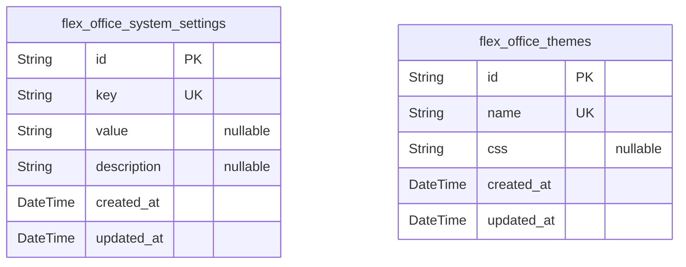
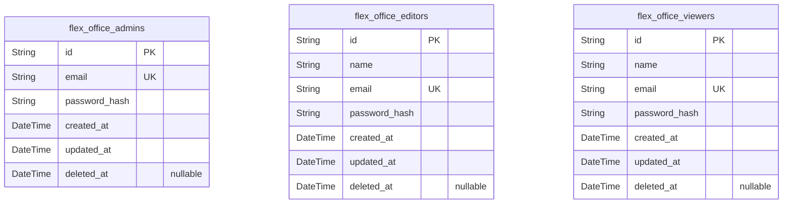
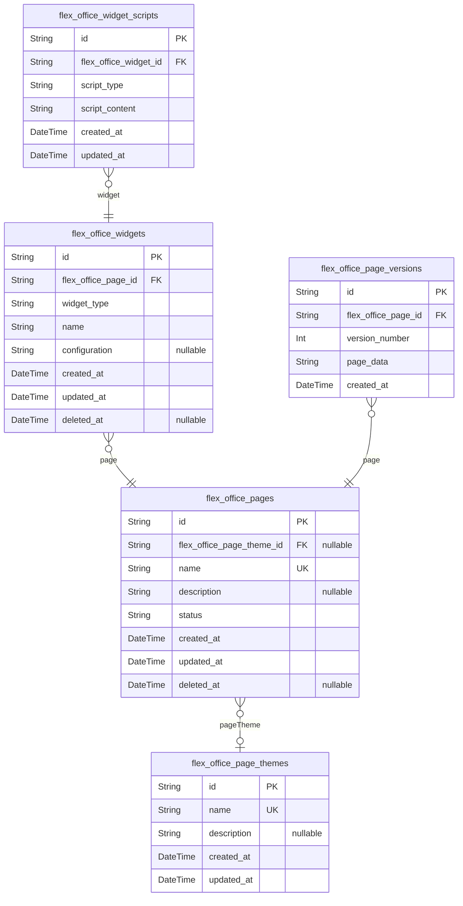
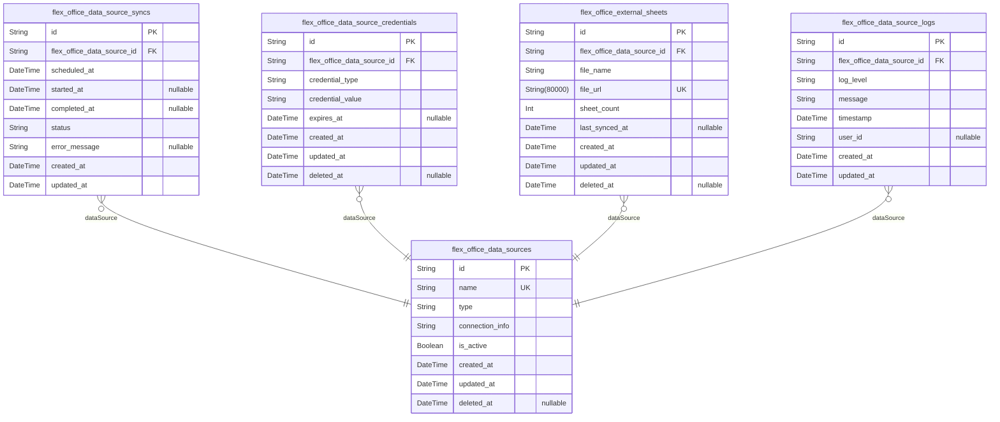
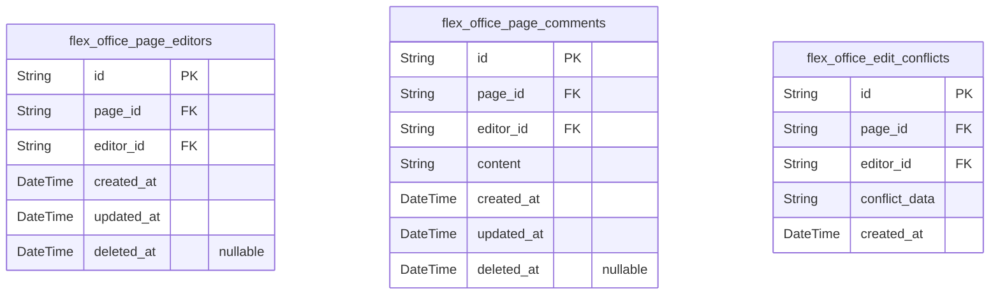
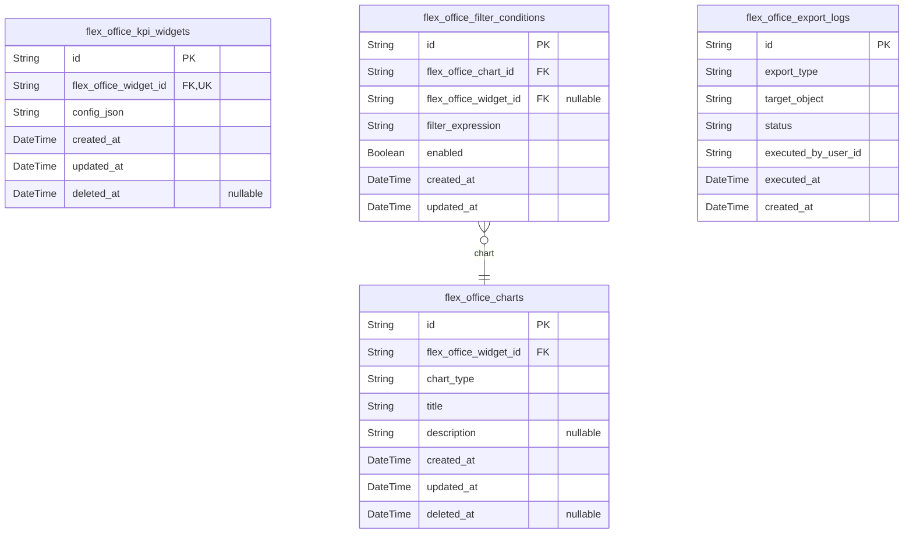
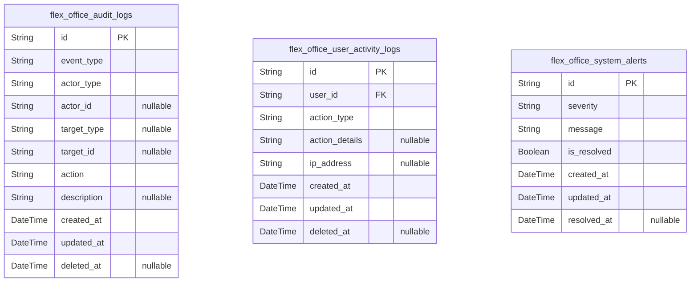
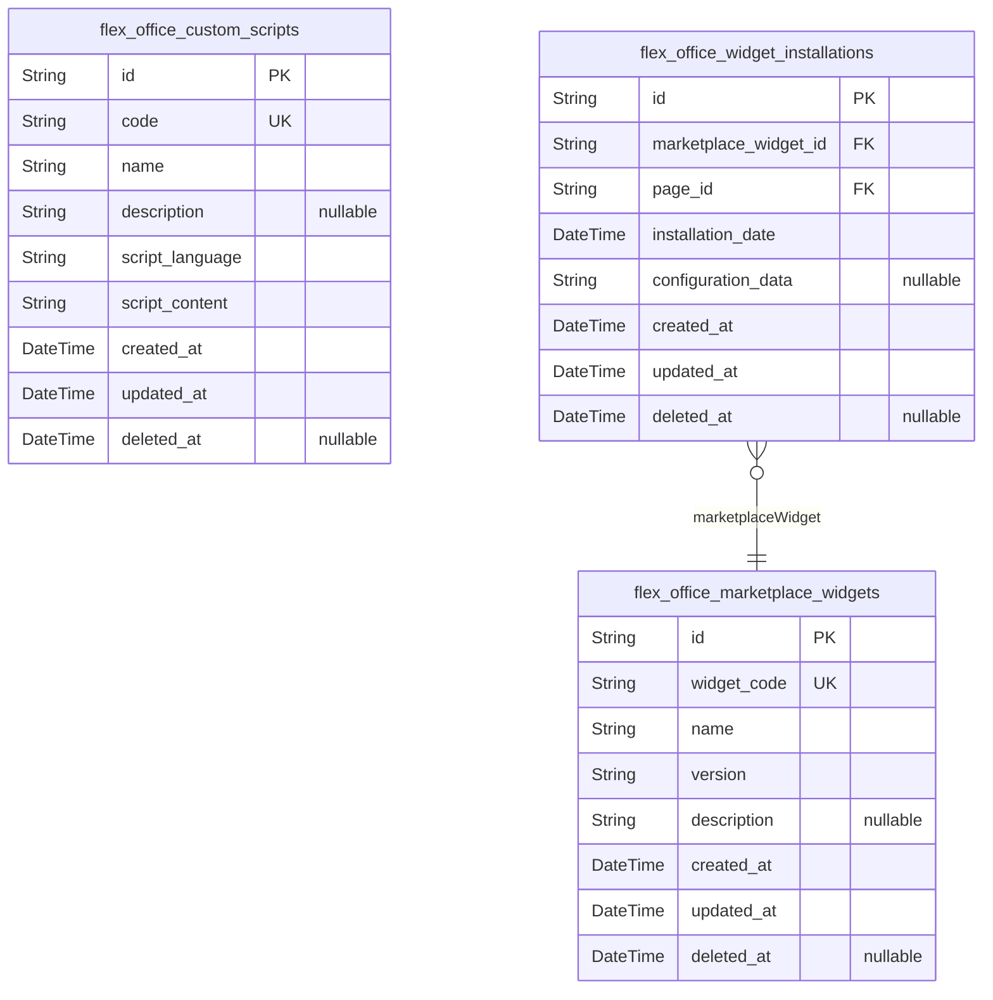
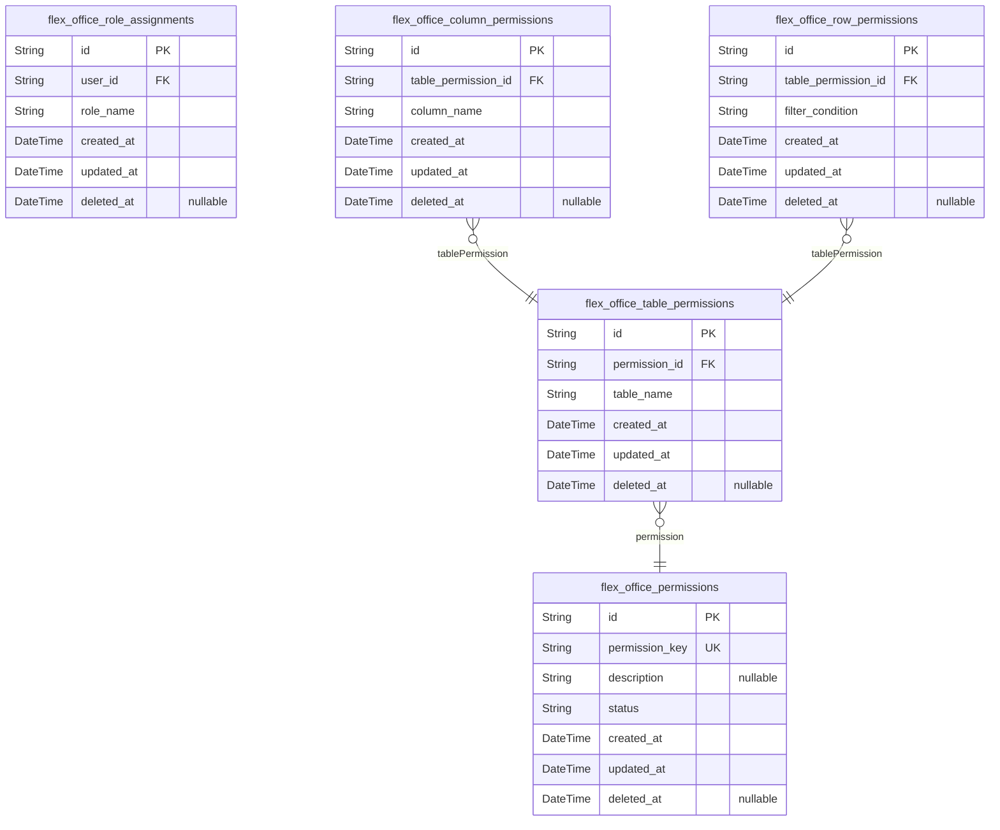

# Prisma Markdown

> Generated by [`prisma-markdown`](https://github.com/samchon/prisma-markdown)

- [Systematic](#systematic)
- [Actors](#actors)
- [UiPages](#uipages)
- [DataSources](#datasources)
- [Collaboration](#collaboration)
- [Analytics](#analytics)
- [Administration](#administration)
- [Extensibility](#extensibility)
- [AccessControl](#accesscontrol)

## Systematic

### `flex_office_system_settings`

System configuration settings for FlexOffice platform. This table stores
global system parameters and feature toggles that influence overall
system behavior. It is foundational for all modules and must be managed
by administrators. No foreign key dependencies. Includes standard created
and updated timestamps for audit trail.

Properties as follows:

- `id`: Primary Key.
- `key`: Unique configuration key identifier.
- `value`: Value associated with the configuration key.
- `description`: Detailed description of the configuration setting.
- `created_at`: Timestamp when the configuration was created.
- `updated_at`: Timestamp when the configuration was last updated.

### `flex_office_themes`

Theme information used in FlexOffice for UI/Page Builder customization.
Each theme defines a set of visual styles and CSS that can be applied
globally or per page. Managed independently to allow multiple themes and
customization options. Tracks creation and update timestamps for
versioning.

Properties as follows:

- `id`: Primary Key.
- `name`: Unique name of the theme.
- `css`: CSS content defining the theme styles.
- `created_at`: Timestamp when the theme was created.
- `updated_at`: Timestamp when the theme was last updated.

## Actors

### `flex_office_admins`

Stores administrative users with full control over the FlexOffice system.
Contains authentication data such as email and password hash, along with
timestamps for audit and soft deletion. Enables system-level user
management and high privilege access. Email is unique across admins to
ensure distinct login identities.

Properties as follows:

- `id`: Primary Key.
- `email`: Administrator's login email address, unique across the system.
- `password_hash`
  > Hashed password for authentication purposes, never storing plain text
  > passwords.
- `created_at`: Timestamp when the admin account record was created.
- `updated_at`: Timestamp when the admin account record was last updated.
- `deleted_at`: Soft deletion timestamp; null if the admin account is active.

### `flex_office_editors`

Represents editor users who can create and manage UI pages and dashboards
within the FlexOffice system. Includes authentication credentials,
timestamps for audit, and soft delete support. Editors have permissions
that are less than admins but allow content modification and
collaboration.

Properties as follows:

- `id`: Primary Key.
- `name`: Full name of the editor user for display and identification purposes.
- `email`: Editor user login email, unique within the system.
- `password_hash`: Hashed password for authentication. Do not store plain passwords.
- `created_at`: Timestamp when the editor account was created.
- `updated_at`: Timestamp when the editor account was last updated.
- `deleted_at`: Soft delete timestamp; null if the editor account is active.

### `flex_office_viewers`

Contains viewer users who have read-only access to dashboards and reports
within FlexOffice. These users have authentication credentials and audit
fields for management and compliance. Viewer accounts are unique by email
and support soft deletion.

Properties as follows:

- `id`: Primary Key.
- `name`: Full name of the viewer for display and identification.
- `email`: Viewer's login email, unique within the system.
- `password_hash`: Hashed credential for authentication, no plain text passwords stored.
- `created_at`: Timestamp when the viewer account was created.
- `updated_at`: Timestamp when the viewer account was last updated.
- `deleted_at`: Soft delete timestamp; null if the viewer account is active.

## UiPages

### `flex_office_pages`

Primary table for storing user-created UI pages, with lifecycle status
and soft delete support. Contains references to themes and supports
versioning via separate snapshot table. Enables independent page
management and editing in the UI/Page Builder.

Properties as follows:

- `id`: Primary Key.
- `flex_office_page_theme_id`: Associated page theme referencing flex_office_page_themes.id.
- `name`: The display name or title of the page.
- `description`: Optional detailed description of the page.
- `status`: Current lifecycle status of the page, e.g., draft, published, archived.
- `created_at`: Record creation timestamp.
- `updated_at`: Record last update timestamp.
- `deleted_at`: Timestamp for soft deletion; null if active.

### `flex_office_widgets`

Stores individual UI widgets that users can place on pages. Independent
management allowed with soft delete and audit timestamps. Widgets link to
pages and support attribute definition and display configurations.

Properties as follows:

- `id`: Primary Key.
- `flex_office_page_id`: The page this widget belongs to, referencing flex_office_pages.id.
- `widget_type`: Type of the widget, e.g., table, chart, filter, button, form.
- `name`: Name or label of the widget.
- `configuration`: JSON string storing widget-specific configuration details.
- `created_at`: Record creation timestamp.
- `updated_at`: Record last update timestamp.
- `deleted_at`: Timestamp for soft deletion; null if active.

### `flex_office_page_versions`

Historical snapshots of UI pages capturing their state at version points
for rollback and auditing. Each version links to a page and stores full
serialized data.

Properties as follows:

- `id`: Primary Key.
- `flex_office_page_id`
  > Referenced UI page for this version snapshot, referencing
  > flex_office_pages.id.
- `version_number`: Sequential version number for the snapshot.
- `page_data`: Serialized JSON data of the page state at snapshot time.
- `created_at`: Version creation timestamp.

### `flex_office_widget_scripts`

Scripts associated with widgets that define custom logic in JavaScript or
Python. Linked to widgets for extensibility and custom behavior.

Properties as follows:

- `id`: Primary Key.
- `flex_office_widget_id`: Associated widget referencing flex_office_widgets.id.
- `script_type`: Type of scripting language, e.g., javascript, python.
- `script_content`: The actual script content as text.
- `created_at`: Script creation timestamp.
- `updated_at`: Last update timestamp of the script.

### `flex_office_page_themes`

Themes that define visual styles for UI pages. Allows users to select and
manage themes for consistent appearance.

Properties as follows:

- `id`: Primary Key.
- `name`: Theme name to identify and select for pages.
- `description`: Optional detailed theme description.
- `created_at`: Theme creation timestamp.
- `updated_at`: Last update timestamp of the theme.

## DataSources

### `flex_office_data_sources`

Stores configuration and metadata for external data sources in
FlexOffice, including connection details, type classification, and
activation status. Serves as the central registry enabling unified access
and management of diverse external databases and spreadsheets.

Properties as follows:

- `id`: Primary Key.
- `name`: Human-readable unique name for the data source.
- `type`
  > Type category of the data source, such as 'mysql', 'postgresql',
  > 'google_sheet', or 'excel'.
- `connection_info`
  > Structured connection details or credentials reference stored securely
  > for accessing the data source.
- `is_active`
  > Flag indicating whether the data source is active and available for
  > synchronization.
- `created_at`: Timestamp when this data source record was created.
- `updated_at`: Timestamp when this data source record was last updated.
- `deleted_at`
  > Timestamp indicating when this data source was soft deleted, if
  > applicable.

### `flex_office_data_source_syncs`

Records scheduled and executed synchronization operations for external
data sources. Tracks timestamps, status, success, and error details
enabling monitoring and retry mechanisms for data refresh workflows.

Properties as follows:

- `id`: Primary Key.
- `flex_office_data_source_id`
  > Foreign key referencing the associated {@link
  > flex_office_data_sources.id} data source.
- `scheduled_at`: Scheduled execution time for the sync operation.
- `started_at`: Timestamp when the actual synchronization started.
- `completed_at`: Timestamp when the synchronization finished.
- `status`
  > Current status of the sync operation, with allowed values such as
  > 'pending', 'running', 'success', 'failed'.
- `error_message`: Error message details if the sync operation failed.
- `created_at`: Record creation timestamp.
- `updated_at`: Last record update timestamp.

### `flex_office_data_source_credentials`

Securely stores credentials used to authenticate access to data sources,
supporting multiple types including OAuth2 tokens and API keys.
Credentials include expiration and soft deletion for secure lifecycle
management.

Properties as follows:

- `id`: Primary Key.
- `flex_office_data_source_id`
  > Foreign key referencing the related [flex_office_data_sources.id](#flex_office_data_sources)
  > data source.
- `credential_type`: The type of credential, e.g., 'oauth2', 'api_key'.
- `credential_value`: The credential token or key value, stored securely.
- `expires_at`: Expiration timestamp for the credential if applicable.
- `created_at`: Credential record creation timestamp.
- `updated_at`: Last credential update timestamp.
- `deleted_at`: Soft deletion timestamp to mark credential revocation.

### `flex_office_external_sheets`

Stores metadata for externally uploaded spreadsheet files, including
Google Sheets and Excel, linked to data sources. Captures file
identification, access URLs, sheet counts, synchronization timestamps,
and soft deletion data.

Properties as follows:

- `id`: Primary Key.
- `flex_office_data_source_id`
  > Foreign key referencing the linked [flex_office_data_sources.id](#flex_office_data_sources)
  > data source.
- `file_name`: Original name of the uploaded spreadsheet file.
- `file_url`: URL location to access the spreadsheet remotely.
- `sheet_count`: Count of individual sheets contained within the spreadsheet.
- `last_synced_at`: Timestamp of the last successful synchronization of the sheet.
- `created_at`: Timestamp when the metadata record was created.
- `updated_at`: Timestamp when this metadata record was last updated.
- `deleted_at`: Soft deletion timestamp for this spreadsheet metadata.

### `flex_office_data_source_logs`

Contains audit and operational log entries related to data sources,
supporting troubleshooting and security auditing. Logs include event
timestamps, severity levels, user attribution, and descriptive messages.

Properties as follows:

- `id`: Primary Key.
- `flex_office_data_source_id`
  > Foreign key linking to the associated [flex_office_data_sources.id](#flex_office_data_sources)
  > data source.
- `log_level`: Severity level of the log entry, e.g., 'info', 'warning', 'error'.
- `message`: Detailed message describing the log event.
- `timestamp`: Event occurrence timestamp.
- `user_id`: User ID if the event is user-triggered; null for system-generated logs.
- `created_at`: Log record creation timestamp.
- `updated_at`: Timestamp when the log record was last updated.

## Collaboration

### `flex_office_page_editors`

Tracks currently active concurrent editors on pages to enforce limits and
manage collaboration sessions. References a page and an editor user.
Supports soft delete for deactivation when an editor leaves. Temporal
fields included for record-keeping.

Properties as follows:

- `id`: Primary Key.
- `page_id`: Referenced page's [flex_office_pages.id](#flex_office_pages).
- `editor_id`: Referenced editor user's [flex_office_editors.id](#flex_office_editors).
- `created_at`: Timestamp when the editor session started.
- `updated_at`: Timestamp when the editor session was last updated.
- `deleted_at`: Timestamp when the editor session was closed or removed (soft delete).

### `flex_office_page_comments`

Stores user comments on pages supporting collaboration and editorial
workflows. Comments belong to a page and an editor user. Supports soft
delete for comment moderation. Allows indexing of comment content for
full-text search.

Properties as follows:

- `id`: Primary Key.
- `page_id`: Belonged page's [flex_office_pages.id](#flex_office_pages).
- `editor_id`: Belonged editor user's [flex_office_editors.id](#flex_office_editors).
- `content`: The text content of the comment.
- `created_at`: Timestamp when the comment was created.
- `updated_at`: Timestamp when the comment was last updated.
- `deleted_at`: Timestamp when the comment was soft deleted or moderated.

### `flex_office_edit_conflicts`

Captures records of edit conflicts occurring in collaborative editing
sessions. Provides historical tracking and audit trails for conflict
resolution. Links to the affected page, involved editor, and the
conflicting change snapshot. Immutable append-only snapshot table
capturing details and timestamps.

Properties as follows:

- `id`: Primary Key.
- `page_id`: Referenced page's [flex_office_pages.id](#flex_office_pages).
- `editor_id`: Referenced editor who caused the conflict [flex_office_editors.id](#flex_office_editors).
- `conflict_data`: JSON encoded data representing conflicting changes.
- `created_at`: Timestamp when the conflict record was created.

## Analytics

### `flex_office_charts`

Store metadata and configuration details of various chart types used in
analytics dashboards. This includes chart identifiers, chart type
specifications, titles, descriptions, and widget associations. Supports
multiple widgets referencing charts for reuse. Stance is primary due to
direct management and CRUD operations by users defining analytics.

Properties as follows:

- `id`: Primary Key.
- `flex_office_widget_id`
  > Associated widget's [flex_office_widgets.id](#flex_office_widgets) that renders this
  > chart.
- `chart_type`
  > Type of chart, e.g., bar, line, pie, histogram etc., defining
  > visualization style.
- `title`: Descriptive title for the chart shown to users.
- `description`: Detailed description or purpose of the chart for business context.
- `created_at`: Timestamp when this chart was created.
- `updated_at`: Timestamp when this chart was last updated.
- `deleted_at`: Soft deletion timestamp; indicates if the chart is deleted.

### `flex_office_kpi_widgets`

Represents KPI widgets used in dashboards to show key performance
indicators. Each widget associates with a UI widget, holds configuration
JSON describing data sources, aggregates and display formats. KPI widgets
enable users to quickly grasp business metrics and are managed
independently, supporting CRUD operations.

Properties as follows:

- `id`: Primary Key.
- `flex_office_widget_id`: Linked UI widget [flex_office_widgets.id](#flex_office_widgets) presenting the KPI data.
- `config_json`
  > JSON string specifying data queries, aggregation methods, and display
  > options for the KPI widget.
- `created_at`: When the KPI widget was created.
- `updated_at`: When the KPI widget was last updated.
- `deleted_at`: Soft deletion timestamp; presence means widget is deleted.

### `flex_office_filter_conditions`

Houses filter condition definitions applied to charts and widgets for
dynamic data querying. Conditions include identifiers, filter
expressions, linked chart/widget references, and enablement flags. This
table supports filtering functionality essential to analytics
personalisation and user-driven data exploration.

Properties as follows:

- `id`: Primary Key.
- `flex_office_chart_id`: The chart this filter condition belongs to [flex_office_charts.id](#flex_office_charts).
- `flex_office_widget_id`
  > Optional reference to the widget [flex_office_widgets.id](#flex_office_widgets) this
  > condition may be attached to.
- `filter_expression`
  > Expression defining the filter logic in a domain-specific language or
  > query format.
- `enabled`
  > Indicates if the filter condition is currently active and should be
  > applied.
- `created_at`: Timestamp of filter condition creation.
- `updated_at`: Timestamp of last update to the filter condition.

### `flex_office_export_logs`

Tracks export operations performed by users including details such as
export type, target data, timestamps and success/failure status. Supports
auditing and monitoring of data sharing activities in analytics reports.
Subsidiary stance as a usage log without user direct modification.

Properties as follows:

- `id`: Primary Key.
- `export_type`: Type/format of the export such as CSV, Excel, PDF.
- `target_object`: Identifier of the exported data or report, e.g., chart or dashboard ID.
- `status`: Result of the export operation, e.g., success, failure.
- `executed_by_user_id`: User ID who performed the export operation.
- `executed_at`: Timestamp when the export was executed.
- `created_at`: Record creation time for audit purposes.

## Administration

### `flex_office_audit_logs`

Audit log records capturing immutable, append-only security and system
events for compliance monitoring. Includes event type, actor, target,
action details, and timestamps. Used for forensic audits and regulatory
compliance.

Properties as follows:

- `id`: Primary Key.
- `event_type`
  > Type/category of the audit event, e.g., 'login', 'permission_change',
  > 'data_access'.
- `actor_type`
  > Role or type of the actor performing the action, e.g., 'admin', 'editor',
  > 'viewer'.
- `actor_id`
  > Unique identifier of the user who performed the action; nullable if
  > system generated event.
- `target_type`
  > Type/category of the target entity affected by the event, e.g., 'page',
  > 'data_source'.
- `target_id`: Unique identifier of the target entity involved in the event.
- `action`
  > Describes the specific action performed, e.g., 'create', 'update',
  > 'delete'.
- `description`: Optional detailed description of the audit event.
- `created_at`: Timestamp when the audit event was recorded.
- `updated_at`: Timestamp when the audit event record was last updated.
- `deleted_at`: Timestamp marking soft deletion; null if not deleted.

### `flex_office_user_activity_logs`

User activity logs tracking user interactions with the system for
monitoring, analytics, and troubleshooting. Records user id, action
types, details, and timestamps. Append-only snapshot table for historical
analysis.

Properties as follows:

- `id`: Primary Key.
- `user_id`
  > Referenced user's [flex_office_admins.id](#flex_office_admins), {@link
  > flex_office_editors.id}, or [flex_office_viewers.id](#flex_office_viewers) depending on
  > role.
- `action_type`
  > Type/category of the action performed by the user, e.g., 'login',
  > 'edit_page', 'view_dashboard'.
- `action_details`: Optional details providing additional context about the user's action.
- `ip_address`: IP address from which the user performed the action.
- `created_at`: Timestamp when the user action was recorded.
- `updated_at`: Timestamp when the user action record was last updated.
- `deleted_at`: Soft delete timestamp; null if not deleted.

### `flex_office_system_alerts`

Operational system alerts representing notifications and warnings about
system health, security, or performance status. Supports creation,
updating, and filtering by severity and status.

Properties as follows:

- `id`: Primary Key.
- `severity`: Alert severity level, e.g., 'info', 'warning', 'critical'.
- `message`: Detailed alert message describing the issue or event.
- `is_resolved`: Flag indicating whether the alert has been resolved.
- `created_at`: Timestamp when the alert was generated.
- `updated_at`: Timestamp when the alert record was last updated.
- `resolved_at`: Timestamp when the alert was resolved, null if unresolved.

## Extensibility

### `flex_office_custom_scripts`

Custom logic scripts for extending FlexOffice functionality. Represents
standalone programmable modules that can execute JavaScript or Python
code. Managed independently by administrators or developers. Supports
soft deletion and audit tracking.

Properties as follows:

- `id`: Primary Key.
- `code`: Unique business identifier for the custom script.
- `name`: Human-readable name of the custom script.
- `description`: Detailed description of the script's purpose and usage.
- `script_language`: Programming language of the custom script (e.g., JavaScript, Python).
- `script_content`: Source code content of the custom script.
- `created_at`: Time of script creation.
- `updated_at`: Time of last script update.
- `deleted_at`
  > Soft deletion timestamp indicating when the script was archived or
  > removed.

### `flex_office_marketplace_widgets`

Prebuilt widgets available in the FlexOffice marketplace that users can
browse and install. Each widget is uniquely identified and includes
metadata such as version and description. Supports audit and soft delete
for lifecycle management.

Properties as follows:

- `id`: Primary Key.
- `widget_code`: Unique code identifying the marketplace widget.
- `name`: Human-friendly widget name.
- `version`: Version string following semantic versioning for the widget.
- `description`: Detailed description of the widget's functionality and features.
- `created_at`: Timestamp when the widget was created in the marketplace.
- `updated_at`: Timestamp of last widget metadata update.
- `deleted_at`
  > Soft deletion timestamp marking if the widget has been deprecated or
  > removed.

### `flex_office_widget_installations`

Records of marketplace widgets installed within FlexOffice pages. Links
marketplace widgets to specific UI pages and captures installation
metadata for management and audit purposes.

Properties as follows:

- `id`: Primary Key.
- `marketplace_widget_id`: Referenced marketplace widget [flex_office_marketplace_widgets.id](#flex_office_marketplace_widgets).
- `page_id`: Associated UI page [flex_office_pages.id](#flex_office_pages).
- `installation_date`: Timestamp when the widget was installed on the page.
- `configuration_data`: JSON string representing configuration settings for the installed widget.
- `created_at`: Record creation timestamp.
- `updated_at`: Record last update timestamp.
- `deleted_at`: Soft deletion timestamp.

## AccessControl

### `flex_office_role_assignments`

Assignment of roles to users within the FlexOffice system. Links users to
roles, enforcing RBAC. Tracks creation, update timestamps and supports
soft deletion. Primary entity enabling role-based access control.

Properties as follows:

- `id`: Primary Key.
- `user_id`
  > Belonged user's flex_office_admins.id, flex_office_editors.id, or
  > flex_office_viewers.id.
- `role_name`: Name of the assigned role, e.g., Admin, Editor, Viewer.
- `created_at`: Record creation timestamp.
- `updated_at`: Record last update timestamp.
- `deleted_at`: Soft delete timestamp to support recoverability.

### `flex_office_permissions`

Defines distinct permissions available in the FlexOffice system.
Permissions describe specific access rights or actions. Supports active
status and audit tracking.

Properties as follows:

- `id`: Primary Key.
- `permission_key`: Unique permission identifier key, e.g., 'edit_pages', 'view_reports'.
- `description`: Detailed description of what this permission grants.
- `status`: Status of the permission, e.g., active or disabled.
- `created_at`: Record creation timestamp.
- `updated_at`: Record last update timestamp.
- `deleted_at`: Soft deletion timestamp for recoverability.

### `flex_office_table_permissions`

Permissions scoped to specific database tables in the FlexOffice system.
Defines which permissions apply to which tables. Subsidiary entity
supporting granular access control.

Properties as follows:

- `id`: Primary Key.
- `permission_id`: Referenced permission's flex_office_permissions.id.
- `table_name`: Name of the database table this permission applies to.
- `created_at`: Record creation timestamp.
- `updated_at`: Record last update timestamp.
- `deleted_at`: Soft deletion timestamp.

### `flex_office_column_permissions`

Permissions scoped to specific columns within tables in FlexOffice.
Supports fine-grained column access control. Subsidiary entity supporting
detailed permission coverage.

Properties as follows:

- `id`: Primary Key.
- `table_permission_id`: Referenced table permission's flex_office_table_permissions.id.
- `column_name`: Name of the column this permission controls.
- `created_at`: Record creation timestamp.
- `updated_at`: Record last update timestamp.
- `deleted_at`: Soft deletion timestamp.

### `flex_office_row_permissions`

Row-level permissions enabling filtering rules for data access control in
FlexOffice. Supports complex conditions for row filtering. Subsidiary
entity for detailed security enforcement.

Properties as follows:

- `id`: Primary Key.
- `table_permission_id`: Referenced table permission's flex_office_table_permissions.id.
- `filter_condition`
  > Filter condition as a SQL WHERE clause or expression for row-level access
  > control.
- `created_at`: Record creation timestamp.
- `updated_at`: Record last update timestamp.
- `deleted_at`: Soft deletion timestamp for record recovery.
