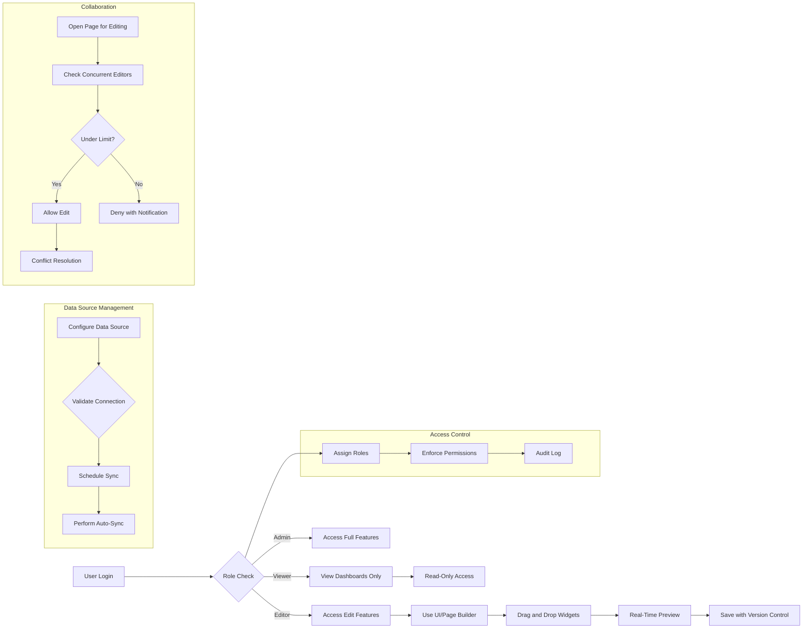

# FlexOffice Backend Requirements Specification

## 1. Business Model

### 1.1 Why This Service Exists
Organizations face challenges in managing scattered internal data and fragmented back-office tools. FlexOffice addresses these pain points by providing a unified platform where data from multiple sources is integrated, and users can build custom dashboards and interfaces without coding. The platform enables real-time data refresh, fine-grained access control, and collaborative workflows that improve operational efficiency and decision-making.

### 1.2 Revenue Strategy
FlexOffice will generate revenue primarily through subscription plans targeting medium to large enterprises needing centralized back-office management. Additional revenue may come from premium plugins and custom integration services.

### 1.3 Growth Plan
Customer acquisition will focus on enterprises facing data silo problems, leveraging partnerships and market awareness campaigns. Retention depends on exceptional system reliability, feature richness, and continuous updates.

### 1.4 Success Metrics
- Number of active organizations
- Data source integrations per organization
- Frequency of dashboard creations
- Volume of collaborative editing sessions
- Customer retention rate

## 2. User Roles and Authentication

### 2.1 Defined Roles
FlexOffice supports three fixed roles with plans for future custom roles:
- Admin: full system control, user management, access rights configuration, audit review, and system monitoring.
- Editor: can create, edit, and manage dashboards, pages, and data under granted permissions.
- Viewer: read-only access to published dashboards and reports.

### 2.2 Authentication Flow
- THE system SHALL support OAuth2 and API Key authentication for connecting data sources.
- THE system SHALL issue JWT tokens for user sessions including access and refresh tokens.
- THE system SHALL expire sessions after inactivity configurable by administrators.
- THE system SHALL embed user role and permissions in the JWT payload.

### 2.3 Role Permissions
| Action                        | Admin | Editor | Viewer |
|------------------------------|-------|--------|--------|
| Manage users                 | ✅    | ❌     | ❌     |
| Configure system settings    | ✅    | ❌     | ❌     |
| Create and edit dashboards   | ✅    | ✅     | ❌     |
| View dashboards and reports  | ✅    | ✅     | ✅     |
| Access audit logs            | ✅    | ❌     | ❌     |

## 3. Functional Requirements

### 3.1 UI/Page Builder
- WHEN an Editor or Admin user drags and drops widgets, THE system SHALL allow placement, resizing, and configuration of tables, charts, filters, buttons, and forms.
- WHEN users apply conditional logic (e.g., button triggers API calls), THE system SHALL store and execute these rules.
- THE system SHALL provide real-time preview with updates reflected within 1 second.
- THE system SHALL support predefined themes and custom CSS.
- THE system SHALL maintain responsive design and compatibility with latest Chrome, Safari, and Edge browsers.
- THE system SHALL persist layout and widget configurations atomically to prevent inconsistencies.
- THE system SHALL maintain version history of pages including timestamps and authorship.

### 3.2 Access Control
- THE system SHALL implement RBAC with Admin, Editor, and Viewer roles.
- THE system SHALL enforce granular permissions at table, column, and row levels.
- THE system SHALL allow Admins to assign roles and permissions.
- THE system SHALL log all user activities in audit logs searchable by Admins.
- THE system SHALL support SSO integrations (Google Workspace, Okta).
- THE system SHALL retain audit logs for at least one year.

### 3.3 Data Source Integration
- THE system SHALL support MySQL and PostgreSQL connections.
- THE system SHALL allow uploading and syncing Google Sheets and Excel files.
- THE system SHALL support user-configurable scheduled auto-sync with intervals configurable down to 1 minute.
- THE system SHALL provide alerts and retry logic on connection failures.

### 3.4 Collaboration Features
- THE system SHALL allow limited concurrent editors per page (default max 5).
- THE system SHALL provide real-time collaborative editing.
- THE system SHALL maintain version control with rollback capabilities.
- THE system SHALL allow comments on page components.
- THE system SHALL implement conflict resolution logic prioritizing last saved or manual resolution.
- THE system SHALL send change notifications to collaborators.

### 3.5 Analytics & Dashboards
- THE system SHALL support bar, line, pie charts, and KPI widgets.
- THE system SHALL provide multi-dimensional filtering and conditional queries.
- THE system SHALL allow CSV and Excel exports of filtered data.

### 3.6 Administration & Monitoring
- THE system SHALL display data source status and system health dashboard.
- THE system SHALL provide real-time alerts for failures and security issues.
- THE system SHALL track and report user and team activity.

### 3.7 Extensibility
- THE system SHALL provide a marketplace for pre-built widgets.
- THE system SHALL support JS/Python custom scripts.
- THE system SHALL expose API SDK for custom module development.

## 4. Business Rules and Validation
- User permissions SHALL strictly limit accessible features and data according to assigned roles.
- Only MySQL, PostgreSQL, Google Sheets, and Excel data sources are supported initially.
- Data sync intervals SHALL be configurable from 1 minute to 24 hours.
- The concurrent editor limit is configurable with a default of 5.
- Audit logs SHALL be immutable and retained securely for at least 12 months.
- Real-time preview SHALL have latency below 1 second.

## 5. Error Handling and Recovery
- IF a data source connection fails, THEN THE system SHALL alert the user, retry sync every 5 minutes, and escalate if unresolved after 3 attempts.
- IF an unauthorized action occurs, THEN THE system SHALL deny the action and provide an appropriate error message.
- IF collaboration conflicts occur, THEN THE system SHALL notify users and apply resolution logic.
- IF save conflicts occur in UI/Page Builder, THEN THE system SHALL provide options to override or merge.

## 6. Performance Requirements
- THE system SHALL process UI/Page Builder interactions and preview updates within 1 second.
- THE system SHALL perform data syncs within configured intervals, completing each sync within 30 seconds.
- THE system SHALL support 100 concurrent active users per organization.

## 7. System Context and Constraints
- THE system SHALL use NestJS as the backend framework.
- THE system SHALL store data primarily in PostgreSQL.
- THE system SHALL guarantee 99.9% uptime excluding planned maintenance.

## 8. Mermaid Diagrams

### Note
This document provides business requirements only. All technical implementation details, including architecture, APIs, and database schemas, are at the discretion of the development team. It focuses solely on WHAT the system must do, not HOW to build it.
