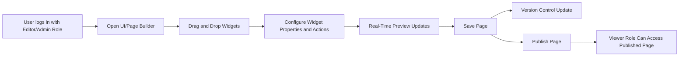

# FlexOffice Functional Requirements Specification

## 1. Overview of Functional Requirements

The FlexOffice platform enables organizations to manage internal data, customize interfaces, enforce access control, collaborate, and gain insights through analytics. Backend services must clearly support these functionalities with precise, measurable requirements.

Development will prioritize the UI/Page Builder feature, followed by vital support functions like Access Control and Data Source Integration, with subsequent modules addressing collaboration, analytics, administration, and extensibility.

## 2. UI/Page Builder Requirements

### Purpose
Empower non-developers to intuitively create and customize back-office interfaces via drag-and-drop components such as tables, charts, filters, buttons, and form widgets, enabling dashboard and operational tool creation without coding.

### User Roles
- Editor: Authorized to create, edit, and manage pages.
- Viewer: Can view published pages only.
- Admin: Complete rights including page permissions management.

### Functional Requirements
- WHEN a user with Editor or Admin role accesses the page builder, THE system SHALL provide a drag-and-drop interface for placing and resizing widgets like tables, charts (bar, line, pie), filters, buttons, and form fields.
- THE system SHALL supply a predefined widget toolkit.
- WHERE custom scripts are enabled, THE system SHALL support widgets executing JavaScript or Python.
- WHEN conditional logic is configured (e.g., button click triggers API call), THE system SHALL store and execute these in real-time.
- THE system SHALL offer predefined visual themes plus custom CSS overrides by Admins.
- WHILE editing, THE system SHALL update the preview pane immediately without reload.
- WHEN saving, THE system SHALL persist page layout and configurations atomically to ensure consistency.
- THE system SHALL maintain detailed version history including timestamps and authorship for pages.

### Non-Functional Requirements
- THE system SHALL support latest Chrome, Safari, and Edge browsers.
- THE system SHALL ensure pages are responsive on PC and tablet devices.

### Business Rules
- ONLY Editors and Admins can create or modify pages.
- Viewers have read-only access.

### Error Handling
- IF save conflicts occur due to concurrency, THEN THE system SHALL notify users with conflict status enabling manual resolution or overwrite.
- IF real-time preview fails to load widgets, THEN THE system SHALL display error messages.

### Performance
- THE system SHALL respond to drag-and-drop and preview updates within 1 second under normal load.

### User Stories
- As an operations staff member, I want to create dashboards by dragging widgets without coding.
- As a team lead, I want immediate preview updates to verify configurations before publishing.

## 3. Access Control Requirements

### Purpose
Secure organizational data and enforce granular access controls through RBAC.

### User Roles
- Admin: Full system privileges.
- Editor: Data and content editing.
- Viewer: Read-only access.

### Functional Requirements
- THE system SHALL implement RBAC with Admin, Editor, Viewer roles.
- THE system SHALL allow role assignments to users.
- THE system SHALL support granular permissions at table, column, and row levels.
- THE system SHALL capture and enable searching of audit logs on user activities.

### Non-Functional Requirements
- THE system SHALL integrate with Single Sign-On providers like Google Workspace and Okta.
- Audit logs SHALL be retained for at least one year.

### Business Rules
- ONLY Admins can assign roles.
- Audit logs SHALL record actor, action, target, timestamp, and result.

### Error Handling
- IF invalid role assignment occurs, THEN THE system SHALL reject the request with descriptive errors.
- IF unauthorized access is attempted, THEN THE system SHALL deny access and log the event.

### Performance
- Access control checks SHALL complete within 100 milliseconds.

### User Stories
- As an admin, I want to assign roles precisely.
- As a compliance officer, I want to audit sensitive operations.

## 4. Data Source Integration

### Purpose
Integrate essential organizational data sources supporting live and offline data.

### Functional Requirements
- THE system SHALL support MySQL and PostgreSQL database connections.
- WHEN configuring a data source, THE system SHALL validate connectivity and credentials.
- THE system SHALL enable Google Sheets and Excel uploads and sync.
- THE system SHALL allow users to configure auto-sync intervals freely.

### Non-Functional Requirements
- THE system SHALL support OAuth2 and API Key authentication with data sources.
- THE system SHALL notify users on connection failure and retry with exponential backoff.

### Business Rules
- Auto-sync intervals SHALL be configurable from 1 to 1440 minutes.
- Data access permissions SHALL be enforced per access control settings.

### Error Handling
- IF data sync repeatedly fails, THEN THE system SHALL alert designated users.
- IF invalid credentials are provided, THEN THE system SHALL reject connection attempts.

### Performance
- Data sync SHALL complete within the configured interval without overlapping.

### User Stories
- As an operations manager, I want live PostgreSQL data querying.
- As a data analyst, I want quick Excel imports for dashboards.

## 5. Collaboration Features

### Purpose
Support concurrent, collaborative page editing with versioning and annotations.

### Functional Requirements
- THE system SHALL allow concurrent editors up to a configurable maximum.
- THE system SHALL provide version control with rollback capability.
- THE system SHALL support comments and annotations on page elements.

### Non-Functional Requirements
- Conflict resolution SHALL prioritize last saved changes or merging with user prompts.
- Collaboration SHALL notify involved users of changes and conflicts promptly.

### Business Rules
- Default concurrent editor limit SHALL be configurable (e.g., default 5 users).

### Error Handling
- IF edit conflicts arise, THEN THE system SHALL prompt for resolution options.

## 6. Analytics and Dashboards

### Purpose
Deliver operational insights via configurable charts and exports.

### Functional Requirements
- THE system SHALL support bar, line, pie charts and KPI widgets.
- THE system SHALL provide multi-dimensional filtering and conditional query capabilities.
- THE system SHALL enable exporting filtered results to CSV or Excel.

### User Stories
- As a business analyst, I want KPI visualizations.
- As a team member, I want to export data for stakeholders.

## 7. Administration and Monitoring

### Functional Requirements
- THE system SHALL display data source status and system health.
- THE system SHALL generate real-time alerts for failures and security issues.
- THE system SHALL report usage analytics of teams and users.

## 8. Extensibility

### Purpose
Allow rapid feature expansion through plugins and custom modules.

### Functional Requirements
- THE system SHALL offer a marketplace of prebuilt widgets.
- THE system SHALL allow JS/Python custom logic scripts.
- THE system SHALL expose an SDK for developer integrations.

## Mermaid Diagram: UI/Page Builder Workflow

---

This document specifies business requirements only. All technical and implementation decisions including architecture, APIs, and data modeling are the responsibility of the development team. It describes WHAT to build, not HOW to build it.