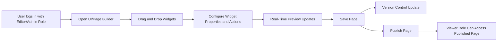

# FlexOffice Functional Requirements Specification

## 1. Overview of Functional Requirements

The FlexOffice platform is designed to enable organizations to manage internal data, customize user interfaces, enforce fine-grained access control, collaborate effectively, and gain actionable insights through analytics dashboards. Backend services shall provide robust support for these business capabilities with clear, measurable requirements.

This document prioritizes the development of the UI/Page Builder as the primary feature and includes detailed requirements for supporting components such as Access Control and Data Source Integration, with later modules addressing collaboration, analytics, administration, and extensibility.

## 2. UI/Page Builder Requirements

### Purpose
Enable non-developers to create and customize back-office interfaces intuitively by dragging and dropping components such as tables, charts, filters, buttons, and form widgets. This empowers business users to build dashboards and operational tools without coding.

### User Roles Involved
- Editor: Can create, edit, and manage pages.
- Viewer: Can only view published pages.
- Admin: Has full management rights including page permissions.

### Functional Requirements

- Drag-and-Drop Builder
  - WHEN a user with Editor or Admin role opens the page builder, THE system SHALL provide an interactive drag-and-drop interface allowing placement and resizing of widgets including tables, charts (bar, line, pie), filters, buttons, and form fields.

- Widget Toolkit
  - THE system SHALL provide a predefined set of widgets as building blocks.
  - WHERE custom scripts are enabled, THE system SHALL support widgets that execute JS/Python logic.

- Conditional Logic
  - WHEN a user configures an action (e.g., "on button click"), THE system SHALL allow defining API calls or internal actions triggered by user interaction.

- Theme Management
  - THE system SHALL provide a set of predefined visual themes.
  - WHERE custom CSS is provided by an Admin, THE system SHALL apply it to override theme styles.

- Real-Time Preview
  - WHILE editing, THE system SHALL update the preview pane immediately to reflect all user changes without requiring a page reload.

- Page Persistence
  - WHEN an Editor saves a page, THE system SHALL persist layout and configuration data atomically to ensure consistency.

- Version Control
  - THE system SHALL maintain a version history of pages with timestamps and author information for rollback.

### Non-Functional Requirements

- Browser Compatibility
  - THE system SHALL support latest versions of Chrome, Safari, and Edge browsers.

- Responsive Design
  - THE system SHALL ensure pages render correctly on PC and tablet devices.

### Business Rules

- ONLY users with Editor or Admin roles SHALL be able to create or modify UI pages.
- Viewer role SHALL have read-only access.

### Error Handling

- IF saving a page fails due to concurrency conflict, THEN THE system SHALL return a conflict status and enable the user to manually resolve or overwrite.
- IF real-time preview fails to load widget data, THEN THE system SHALL show an error message describing the failure.

### Performance

- THE system SHALL respond to drag-and-drop updates and preview refresh within 1 second under normal load.

### User Stories

- As an operations staff member, I want to drag and drop widgets so I can build dashboards without coding.
- As a team lead, I want to preview changes in real time to validate setups before publishing.

---

## 3. Access Control Requirements

### Purpose
Strengthen organizational security by enforcing role-based and granular data access controls.

### User Roles
- Admin: Full system access
- Editor: Content and page editing
- Viewer: Read-only access

### Functional Requirements

- Role-Based Access Control (RBAC)
  - THE system SHALL implement RBAC with predefined roles: Admin, Editor, Viewer.
  - THE system SHALL support assignment of roles to users.

- Granular Permissions
  - THE system SHALL support permission settings at levels: table, column, and row.
  - WHEN configuring permissions, THE system SHALL allow specification of readonly or edit rights.

- Audit Logs
  - THE system SHALL record all user activities related to access and data manipulation with timestamps and user IDs.
  - THE system SHALL provide search and filter capabilities for audit logs.

### Non-Functional Requirements

- Enterprise Authentication Integration
  - THE system SHALL support single sign-on (SSO) systems such as Google Workspace and Okta.

- Log Retention
  - THE system SHALL retain audit logs for at least 1 year.

### Business Rules

- ONLY Admin users SHALL assign roles to other users.
- Audit logs SHALL capture the actor, action, target resource, timestamp, and outcome.

### Error Handling

- IF permission assignment fails due to invalid role, THEN THE system SHALL reject the operation with descriptive error.
- IF unauthorized data access is attempted, THEN THE system SHALL deny access and log the event.

### Performance

- THE system SHALL process access control checks within 100 milliseconds.

### User Stories

- As an admin, I want to assign roles to control access levels.
- As a compliance officer, I want to review audit logs for sensitive operations tracking.

---

## 4. Data Source Integration

### Purpose
Support connection and synchronization of key organizational data sources to allow unified back-office data management.

### Functional Requirements

- Database Connections
  - THE system SHALL support connections to MySQL and PostgreSQL databases.
  - WHEN a user (Editor or Admin) configures a data source, THE system SHALL validate the credentials and connectivity.

- Spreadsheet Integration
  - THE system SHALL allow users to upload and sync Google Sheets and Excel files.

- Data Refresh
  - THE system SHALL support user-configurable scheduled auto-sync intervals.
  - WHEN scheduling is configured, THE system SHALL perform data refreshes at defined intervals without manual intervention.

### Non-Functional Requirements

- Authentication
  - THE system SHALL support OAuth2 and API key methods for authentication with external data sources.

- Reliability
  - THE system SHALL provide alerts on connection failures.
  - THE system SHALL implement retry logic with exponential backoff for transient failures.

### Business Rules

- Editable refresh intervals SHALL be stored in minutes and support values from 1 to 1440 (1 day).
- Users SHALL have permission to access data sources per access control configurations.

### Error Handling

- IF data sync fails after retries, THEN THE system SHALL notify designated users with error details.
- IF incorrect credentials are provided, THEN THE system SHALL reject connection attempts and log the failure.

### Performance

- Data refresh operations SHALL complete within the sync interval to avoid overlapping executions.

### User Stories

- As an operations manager, I want to connect PostgreSQL to query live data.
- As a data analyst, I want to import Excel sheets to build dashboards quickly.

---

## 5. Collaboration Features

### Purpose
Enable multiple users to collaboratively edit and manage back-office tools.

### Functional Requirements

- Real-Time Editing
  - THE system SHALL support concurrent editing with a specified limit on simultaneous editors per page.

- Version Control
  - THE system SHALL track changes on pages and allow rollback to previous versions.

- Comments and Annotations
  - THE system SHALL allow users to add comments and annotations on page components.

### Non-Functional Requirements

- Conflict Resolution
  - THE system SHALL implement conflict resolution logic prioritizing last writer or merge strategies.

- Change Notifications
  - THE system SHALL notify collaborators of changes in real-time or upon reconnection.

### Business Rules

- Maximum concurrent editors per page SHALL be configurable, defaulting to a manageable threshold.

### Error Handling

- IF edit conflicts occur, THEN THE system SHALL prompt users to resolve or accept content.

---

## 6. Analytics and Dashboards

### Purpose
Provide operational insights through data visualization and reporting.

### Functional Requirements

- Chart Types
  - THE system SHALL support bar, line, pie charts, and KPI widgets.

- Filtering and Sorting
  - THE system SHALL support multi-dimensional filtering and conditional queries.

- Data Export
  - THE system SHALL allow export of filtered datasets in CSV or Excel format.

### User Stories

- As a business analyst, I want to visualize KPIs in charts.
- As a team member, I want to export data for sharing.

---

## 7. Administration and Monitoring

### Functional Requirements

- Monitoring Console
  - THE system SHALL display data source status and overall system health.

- Notification Center
  - THE system SHALL provide real-time alerts for failures and security issues.

- Usage Reports
  - THE system SHALL generate activity reports tracking team and user engagement.

---

## 8. Extensibility

### Purpose
Allow expansion beyond core capabilities through plugins and custom modules.

### Functional Requirements

- Widget Marketplace
  - THE system SHALL provide a marketplace to browse and install pre-built widgets.

- Custom Scripts
  - THE system SHALL allow users to add JS/Python scripts to create custom logic.

- API SDK
  - THE system SHALL expose a software development kit enabling custom module integration.

---

## Mermaid Diagram: UI/Page Builder Workflow

---

This document defines business requirements only. All technical implementation decisions including architecture, APIs, and database design are at the discretion of the development team. Backend developers have full autonomy to determine how to satisfy these requirements while ensuring compliance with the described behaviors and constraints.