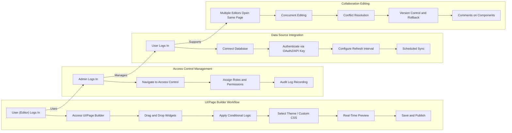

# FlexOffice User Scenario Analysis and Business Workflow Documentation

## 1. Introduction

FlexOffice is a back-office management platform designed to centralize organizational data management, facilitate customizable interface building, and enable collaborative workflows. This document captures primary and edge user scenarios, business workflows, error handling processes, and performance expectations essential for backend development.

## 2. Business Model

### 2.1 Why This Service Exists

Organizations struggle with fragmented internal data sources and complex back-office operations. FlexOffice addresses this by consolidating data access and offering an intuitive, no-code interface customization environment. The platform enhances operational efficiency and data-driven decision making.

### 2.2 Core Value Proposition

- Unified management of databases and spreadsheets
- Intuitive UI/Page Builder for non-developers
- Granular access controls for security
- Real-time collaboration and version management
- Rich analytics and export capabilities

## 3. User Roles and Permissions

### 3.1 Roles Overview
- **Admin:** Full system control including user management, access control configuration, monitoring, and administration tools.
- **Editor:** Can create, edit, and manage back-office data, UI pages, and dashboards within granted permissions.
- **Viewer:** Has read-only access for viewing dashboards, reports, and data as allowed.

### 3.2 Role Permissions in Business Terms
- Admins assign roles, configure permissions, and audit system usage.
- Editors build and customize interfaces, import data, and collaborate on back-office tools.
- Viewers access data visualizations and reports without editing abilities.

## 4. Primary User Scenarios

### 4.1 UI/Page Builder Creation Workflow

**Scenario:** An operations staff member (Editor role) builds a customized dashboard.

**User Journey:**
1. User logs into FlexOffice with Editor credentials.
2. User selects the UI/Page Builder module.
3. User drags and drops widgets such as tables, charts, and filters onto the workspace.
4. User applies conditional logic, e.g., a button triggers an API call.
5. User selects a theme or applies custom CSS.
6. User previews changes in real-time.
7. User saves and publishes the dashboard.

**Business Rules:**
- Only Editors and Admins can create or modify dashboards.
- Editors cannot assign roles or manage system settings.
- Dashboard changes must reflect instantly in the preview.

**Functional Requirements:**
- WHEN an Editor drags a widget, THE system SHALL register the widget placement.
- WHEN the user applies conditional logic, THE system SHALL validate logic consistency.
- WHEN changes are saved, THE system SHALL persist changes with user and timestamp metadata.

### 4.2 Access Control Management

**Scenario:** An Admin manages roles and permissions.

**User Journey:**
1. Admin logs in.
2. Admin navigates to Access Control settings.
3. Admin assigns roles (Admin, Editor, Viewer) to users.
4. Admin adjusts granular permissions at table/column/row level.
5. System records audit logs for all changes.

**Business Rules:**
- Only Admins can modify roles and access permissions.
- Audit trails must include user ID, action, timestamp, and affected object.

### 4.3 Data Source Integration

**Scenario:** Operations manager connects PostgreSQL database.

**User Journey:**
1. User logs in.
2. Navigates to Data Source Integration.
3. Selects PostgreSQL, provides credentials, OAuth2 or API Key authentication.
4. Configures custom data refresh intervals.
5. System performs scheduled data sync.

**Business Rules:**
- System SHALL support MySQL and PostgreSQL initially.
- Users SHALL configure custom intervals for scheduled refresh.
- System SHALL provide alerts on connection failures with retry logic.

### 4.4 Collaboration Editing

**Scenario:** Multiple Editors simultaneously update a page.

**User Journey:**
1. Two or more Editors open the same page.
2. Editors make changes concurrently.
3. System resolves conflicts using prioritization logic.
4. Changes are tracked with version control.
5. Editors leave comments on components.

**Business Rules:**
- Limit concurrent editors to a maximum defined by system settings.
- Changes SHALL be versioned with rollback capability.
- Comments SHALL be associated with specific page components.

## 5. Secondary and Edge Case Scenarios

### 5.1 Role Change During Active Session

**Scenario:** An Admin changes a user’s role while that user is logged in.

**Business Rule:**
- THE system SHALL apply new permissions immediately after role change.
- THE system SHALL terminate or update active sessions violating new permissions.

### 5.2 Data Source Connectivity Interruption

**Scenario:** Scheduled sync fails due to network outage.

**Business Rule:**
- IF a connection failure occurs, THEN THE system SHALL alert Admins immediately.
- THE system SHALL retry sync according to exponential backoff policy.

### 5.3 Conflict in Concurrent Edits

**Scenario:** Two Editors submit conflicting changes simultaneously.

**Business Rule:**
- THE system SHALL detect conflict and alert Editors.
- THE system SHALL prioritize changes based on a deterministic rule, such as "last saved wins," or manual conflict resolution by Admin.

### 5.4 Large Data Upload

**Scenario:** User uploads a very large Excel file.

**Business Rule:**
- THE system SHALL validate file size and accept only up to maximum allowed size (defined by configuration).
- IF the file exceeds size, THEN THE system SHALL reject the upload with a clear error message.

## 6. Error Handling Scenarios

### 6.1 Authentication Failure

**Scenario:** User provides invalid OAuth2 credentials during data source integration.

**Business Rule:**
- WHEN authentication fails, THE system SHALL return an error code and descriptive message.
- THE system SHALL NOT expose sensitive information in error responses.

### 6.2 Permission Denied

**Scenario:** Viewer attempts to edit a dashboard.

**Business Rule:**
- WHEN an unauthorized action is attempted, THE system SHALL respond with an authorization error.
- THE system SHALL log all unauthorized access attempts for audit.

### 6.3 Invalid Widget Configuration

**Scenario:** User configures a widget with invalid parameters.

**Business Rule:**
- THE system SHALL validate widget configuration inputs.
- IF inputs are invalid, THEN THE system SHALL reject save and provide explanatory error details.

## 7. Performance Expectations

- THE system SHALL reflect UI/Page Builder changes in real-time preview with less than 1-second latency.
- THE system SHALL process data sync operations within configured intervals without backlogs.
- THE system SHALL handle up to "X" concurrent editors per page without performance degradation ("X" defined by system settings).
- THE system SHALL deliver access control permission checks within 200 milliseconds on average.

## 8. Conclusion

This document provides a comprehensive set of user scenarios, workflows, error handling, and performance expectations necessary to build a robust, user-focused backend for FlexOffice. It translates business goals into clear, actionable user stories and rules suitable for implementation.

---

> This document provides business requirements only. All technical implementation decisions belong to developers. Developers have full autonomy over architecture, APIs, and database design. This document describes WHAT the system should do, not HOW to build it.

