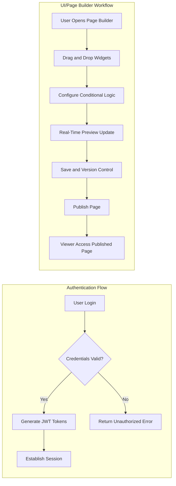

# FlexOffice Backend Requirements Specification

## 1. Introduction

FlexOffice is a back-office management platform designed to unify organizational data management, empower non-developers with customizable UI building, enforce granular access control, enable collaboration, and provide actionable analytics and extensibility capabilities. This document details comprehensive backend business requirements, focusing first on the UI/Page Builder as the development priority.

## 2. Business Model

### 2.1 Why the Service Exists
Many organizations face challenges due to fragmented data sources and inflexible back-office tools that require technical expertise. FlexOffice exists to provide a unified platform for data integration and no-code UI customization, improving operational efficiency and collaboration in back-office functions.

### 2.2 Revenue Strategy
FlexOffice aims to generate revenue via subscription plans targeting medium and large enterprises. Additional income streams include a plugin marketplace offering premium widgets and developer services.

### 2.3 Growth Plan
User acquisition will prioritize enterprise onboarding through targeted marketing, partnerships, and continuous feature enhancements focusing on reliability and usability.

### 2.4 Success Metrics
- Number of active users and session duration
- Volume and frequency of data source connections
- UI/Page Builder usage and published dashboards
- Collaboration session counts and version rollbacks
- Customer retention and satisfaction
- Monitoring and alert resolution times

## 3. User Roles and Authentication

### 3.1 User Role Definitions
- **Admin:** Full system control including user and role management, system configurations, monitoring, audit log access.
- **Editor:** Create, edit, and manage pages, data entries, dashboards; comment and collaborate.
- **Viewer:** Read-only access to dashboards and reports.

### 3.2 Authentication Flow Requirements
- WHEN a user submits login credentials, THE system SHALL validate these credentials securely and establish a session within 2 seconds.
- THE system SHALL support OAuth2 and API Key authentication for external data sources.
- THE system SHALL enable users to log out, ending sessions securely.

### 3.3 Token Management and Session Handling
- THE system SHALL use JSON Web Tokens (JWT) with access tokens expiring after 30 minutes and refresh tokens with 14-day expiry.
- JWT payload SHALL include user ID, role, and permissions.
- THE system SHALL support secure token storage and refresh mechanisms.

### 3.4 Permission Matrix
| Action                        | Admin | Editor | Viewer |
|------------------------------|-------|--------|--------|
| User management              | ✅    | ❌     | ❌     |
| System configuration        | ✅    | ❌     | ❌     |
| Create/Edit pages & widgets  | ✅    | ✅     | ❌     |
| View dashboards              | ✅    | ✅     | ✅     |
| Audit log access            | ✅    | ❌     | ❌     |

## 4. Functional Requirements

### 4.1 UI/Page Builder
- WHEN a user with Editor or Admin role drags and places widgets, THE system SHALL register the changes and update the layout.
- THE system SHALL provide widgets including tables, charts (bar, line, pie), filters, buttons, and forms.
- WHEN users define conditional logic, THE system SHALL store and execute these in real-time.
- THE system SHALL provide real-time previews reflecting changes immediately.
- THE system SHALL support predefined themes and custom CSS application.
- THE system SHALL persist page versions with rollback capabilities.
- THE system SHALL ensure compatibility with latest Chrome, Safari, and Edge, supporting PC and tablet responsive designs.

### 4.2 Access Control
- THE system SHALL implement RBAC with fixed roles initially (Admin, Editor, Viewer).
- THE system SHALL enforce permissions at table, column, and row granularity.
- THE system SHALL maintain audit logs recording all access and modifications.
- SSOs such as Google Workspace and Okta SHALL be supported.
- Audit logs SHALL be stored for at least 1 year.

### 4.3 Data Source Integration
- THE system SHALL support connections to MySQL and PostgreSQL databases.
- THE system SHALL allow upload and syncing of Google Sheets and Excel files.
- Users SHALL be able to configure custom refresh intervals (minimum 1 minute, maximum 24 hours).
- THE system SHALL alert users on connection failures and implement retry logic.

### 4.4 Collaboration Features
- THE system SHALL permit concurrent editing with a configurable maximum of editors per page, default 5.
- THE system SHALL provide version control with change tracking and rollback.
- Comments and annotations SHALL be supported on page components.
- THE system SHALL implement conflict resolution prioritizing deterministic or manual approaches.
- Users SHALL receive change notifications in real-time.

### 4.5 Analytics and Dashboards
- Support bar, line, pie charts and KPI widgets.
- Multi-dimensional filtering and conditional queries.
- Export filtered data as CSV or Excel.

### 4.6 Administration and Monitoring
- Provide a monitoring console showing data source status and system health.
- Notification center for real-time alerts on failures/security events.
- Usage and activity reporting for team and user monitoring.

### 4.7 Extensibility
- Widget marketplace for pre-built widget installation.
- Support for custom JS/Python scripts.
- API SDK for developer module integrations.

## 5. Business Rules and Validation

### 5.1 Role-Based Permissions
- Users can only perform actions permitted by their assigned role.
- Editors cannot access administrative or audit data.
- Viewers have strictly read-only access.

### 5.2 Data Validation
- Data source credentials must be validated before syncing.
- Data integrity shall be checked on each sync; corrupted data batches must be rejected.

### 5.3 Collaboration Limits
- Maximum concurrent editors per page configurable; default limit enforced.
- Attempts to exceed editor limit SHALL be rejected with user notification.

### 5.4 Data Refresh Rules
- Refresh intervals configurable by users, min 1 minute, max 24 hours.
- Failed syncs SHALL trigger retries with exponential backoff and escalation if unresolved.

## 6. Error Handling and Recovery
- IF data source connection fails, THEN notify users within 5 seconds, log error, and start retry cycle.
- IF unauthorized action attempted, THEN deny access and log event.
- IF conflict detected during concurrent editing, THEN apply conflict resolution and notify users.
- IF token expires or is invalid, THEN force user logout with clear message.

## 7. Performance Requirements
- UI/Page Builder preview updates SHALL occur within 1 second of user interaction.
- Data sync SHALL complete within the configured interval with latency under 30 seconds.
- Access control checks SHALL be completed within 100 milliseconds per request.
- System SHALL support up to 1000 concurrent active users with graceful degradation beyond.

## 8. Future Considerations
- Support additional database types beyond MySQL and PostgreSQL.
- Introduce customizable user roles and dynamic permission management.
- Expand collaboration support to unlimited editors with advanced conflict handling.
- Enrich analytics widget options and export capabilities.
- Grow the plugin marketplace ecosystem with third-party developer contributions.

## 9. References
- Refer to the [User Roles and Authentication Document](./02-user-roles.md) for detailed authentication and permission implementation.
- For UI/Page Builder detailed workflows, see [User Scenario Documentation](./04-user-scenarios.md).

---

### Mermaid Diagrams

This document defines business requirements only. All technical implementation decisions including architecture, API design, and database schema are at the discretion of the development team. It describes what the system SHALL do, not how to build it.