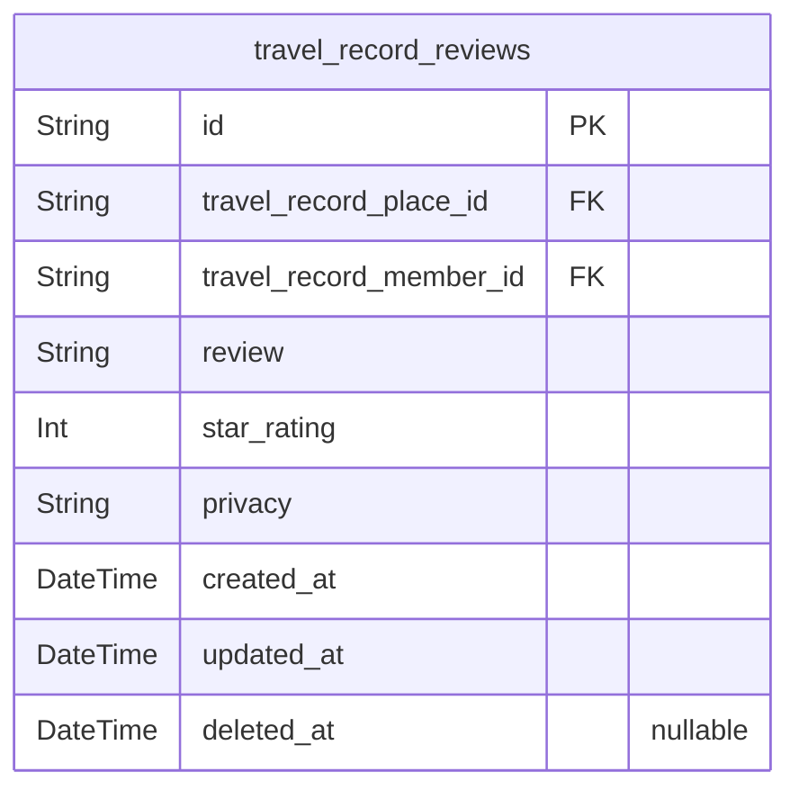

# Prisma Markdown

> Generated by [`prisma-markdown`](https://github.com/samchon/prisma-markdown)

- [Identity](#identity)
- [Records](#records)
- [Reviews](#reviews)
- [Social](#social)

## Identity

### `travel_record_guest`

Guest users of the TravelRecord system, representing unauthenticated or
minimal access users. Guests may browse public content but cannot create
travel records or interact socially. This table maintains guest user
identification and creation and update timestamps for tracking purposes.

Properties as follows:

- `id`: Primary Key.
- `created_at`: Record creation timestamp.
- `updated_at`: Record last update timestamp.

### `travel_record_member`

Authenticated members of travel_record system who can record places
visited, upload photos, write reviews and ratings, manage friendships,
and control privacy. Includes authentication information for login via
Google OAuth, identification details, and timestamps.

Properties as follows:

- `id`: Primary Key.
- `email`: Member's verified email address used as login ID.
- `display_name`: Member's display name for social interactions.
- `google_oauth_id`: Unique Google OAuth identifier for authentication.
- `password_hash`: Hashed password for authentication, if applicable (not stored plaintext).
- `created_at`: Record creation timestamp.
- `updated_at`: Record last update timestamp.
- `deleted_at`: Soft deletion timestamp for account recovery.

### `travel_record_admin`

Administrator users of the TravelRecord system with privileges to manage
users, content, and system settings. Admins have login credentials and
identification information stored securely, along with timestamps for
auditing.

Properties as follows:

- `id`: Primary Key.
- `email`: Administrator's official email address for login.
- `display_name`: Administrator's display name used in system logs and interfaces.
- `password_hash`: Hashed password for secure authentication.
- `created_at`: Record creation timestamp.
- `updated_at`: Record last update timestamp.
- `deleted_at`: Soft deletion timestamp for account deactivation and recovery.

## Records

### `travel_record_places`

Travel record place information stores the details of visited locations
by members including geographical coordinates, visit date, and Google
place identifier. This table is the primary entity for travel records,
supporting independent user interactions and CRUD operations.

Properties as follows:

- `id`: Primary Key.
- `travel_record_member_id`
  > Belonged member's [travel_record_member.id](#travel_record_member). This represents the
  > owner of the travel record place.
- `latitude`: Latitude of the place in decimal degrees.
- `longitude`: Longitude of the place in decimal degrees.
- `visit_date`: Visit date in ISO 8601 date format.
- `place_name`: Name or description of the visited place.
- `google_place_id`: Google Maps unique place ID identifying the place.
- `created_at`: Record creation timestamp.
- `updated_at`: Last update timestamp.
- `deleted_at`: Soft delete timestamp for recovery.

### `travel_record_photos`

Photos associated with travel record places. Each photo belongs to a
single travel record place and stores basic file metadata like URI,
upload timestamp, and file size. Managed as a subsidiary entity dependent
on travel_record_places.

Properties as follows:

- `id`: Primary Key.
- `travel_record_place_id`
  > Belonged travel record place's [travel_record_places.id](#travel_record_places). Indicates
  > which place this photo belongs to.
- `file_uri`: URI of the uploaded photo file.
- `file_size`: Size of the photo file in bytes.
- `uploaded_at`: Timestamp of when the photo was uploaded.
- `created_at`: Record creation timestamp.
- `updated_at`: Last update timestamp.
- `deleted_at`: Soft delete timestamp for recovery.

## Reviews

### `travel_record_reviews`

Stores member reviews with textual content and star ratings (1-5) for
places recorded by members. Supports privacy settings 'public' or
'private' per review. Linked to travel_record_places and
travel_record_member for relational integrity and querying. Includes
timestamps for auditing and optional soft deletion support.

Properties as follows:

- `id`: Primary Key.
- `travel_record_place_id`: Reference to the place being reviewed (travel_record_places.id).
- `travel_record_member_id`: Reference to the member who wrote the review (travel_record_member.id).
- `review`: Textual review content up to 1000 characters.
- `star_rating`: Star rating from 1 to 5 inclusive.
- `privacy`: Privacy setting for review: 'public' or 'private'. Default is 'public'.
- `created_at`: Timestamp when the review was created for auditing.
- `updated_at`: Timestamp when the review was last updated for auditing.
- `deleted_at`: Soft delete timestamp; null if not deleted.

## Social

### `travel_record_friends`

Represents bidirectional friendship relationships between members of the
TravelRecord system. Tracks friendship request lifecycle states such as
pending, accepted, and rejected. Supports soft deletion to allow logical
removal without data loss. Linked to member entities via foreign keys.
Enables efficient queries for friend requests, friend lists, and status
management.

Properties as follows:

- `id`: Primary Key.
- `member_id`: Requesting member's [travel_record_member.id](#travel_record_member).
- `friend_member_id`: Target friend member's [travel_record_member.id](#travel_record_member).
- `status`: Friendship status: pending, accepted, or rejected.
- `created_at`: Timestamp when the friendship record was created.
- `updated_at`: Timestamp when the friendship record was last updated.
- `deleted_at`: Timestamp when the friendship record was soft deleted.

### `travel_record_privacy_settings`

Stores privacy settings for travel records, allowing members to control
visibility of their content to friends and the public. Supports privacy
levels such as 'public' and 'private'. Linked to member entities,
enabling personalized privacy controls. Includes timestamps and soft
deletion support for record lifecycle management.

Properties as follows:

- `id`: Primary Key.
- `member_id`: Owning member's [travel_record_member.id](#travel_record_member).
- `privacy_level`: Privacy level indicating visibility: 'public' or 'private'.
- `created_at`: Timestamp when the privacy setting was created.
- `updated_at`: Timestamp when the privacy setting was last updated.
- `deleted_at`: Timestamp when the privacy setting was soft deleted.
