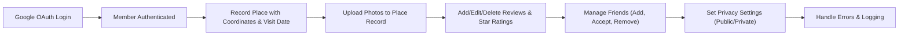

# TravelRecord Backend Functional Requirements

## 1. Introduction and Business Model

TravelRecord is a backend service supporting a map-based travel record application where authenticated members can log visited places, upload photos associated with those locations, write reviews with star ratings, manage friendships, and share their travel records with configurable privacy settings.

The backend handles user data storage, enforces privacy controls, supports social features like friends and sharing, and integrates Google Maps location data and Google OAuth for authentication.

## 2. User Roles and Authentication

### Roles
- **Guest**: Unauthenticated users who can browse publicly shared content but cannot create or modify records.
- **Member**: Authenticated users via Google OAuth who can record visited places, upload photos, write reviews with star ratings, manage friends, and set privacy on records.
- **Admin**: System administrators managing users, content, and system settings.

### Authentication
- THE system SHALL authenticate users exclusively via Google OAuth.
- WHEN a user attempts to login, THE system SHALL initiate and validate OAuth flow with Google.
- THE system SHALL maintain user sessions securely post authentication to authorize access.

## 3. Functional Requirements

### 3.1 Place Recording and Storage

- WHEN a member records a place, THE system SHALL store the following information:
  - The Google Map location coordinates (latitude and longitude) with precise floating point values.
  - The place name or description as a non-empty string.
  - The date of visit in ISO 8601 date format.

- THE system SHALL uniquely identify each place record for the member.

- WHERE photos are included, THE system SHALL associate all uploaded photos with the corresponding place record.

- IF required place information (location coordinates or visit date) is missing or invalid, THEN THE system SHALL reject the recording request with a validation error.

### 3.2 Photo Upload and Management

- WHEN photos are uploaded for a place record, THE system SHALL accept common image formats (e.g., JPEG, PNG) and reject unsupported or corrupted files.

- THE system SHALL associate photo metadata (file size, upload timestamp) with each photo.

- THE system SHALL allow multiple photos per place record.

- IF photos fail validation or encounter upload errors, THEN THE system SHALL respond with a descriptive error and allow retry.

### 3.3 Review and Rating System

- WHEN a member writes a review on a place record, THE system SHALL store the textual review content and a star rating integer between 1 and 5 inclusive.

- IF submitted reviews are empty, or star ratings are outside the 1-5 range, THEN THE system SHALL reject the submission with proper error messages.

- THE system SHALL allow members to update or delete their own reviews.

- THE system SHALL allow retrieval of all reviews for a specific place.

### 3.4 Friend Management

- THE system SHALL allow members to send friend requests to other members.

- WHEN a friend request is accepted, THE system SHALL link both members as friends, reflecting the bidirectional relationship.

- THE system SHALL allow members to remove friends.

- IF friend request actions are invalid (sending duplicate requests, accepting non-existing requests), THEN THE system SHALL return appropriate error responses.

- THE system SHALL provide up-to-date friend lists upon request.

### 3.5 Sharing and Privacy Controls

- THE system SHALL allow members to set the visibility of each place record and its associated content to either 'public' or 'private'.

- THE default state for new place records SHALL be 'public'.

- PUBLIC records SHALL be accessible to all friends and other authenticated users.

- PRIVATE records SHALL be accessible only to the owner member.

- MEMBERS SHALL be able to change privacy settings for their records at any time.

## 4. Error Handling and Recovery

- IF any input validation fails (missing required fields, invalid formats), THEN THE system SHALL reject the request with a clear, descriptive error.

- IF photo uploads fail (due to file format or network issues), THEN THE system SHALL notify the user and support retry attempts.

- IF friend request operations encounter conflicts or inconsistencies, THEN THE system SHALL return appropriate error messages and log the issue for review.

- THE system SHALL log all errors and exceptional states for audit and debugging purposes.

## 5. Performance Expectations

- THE system SHALL respond to place record retrieval requests within 3 seconds under normal load.

- Photo upload operations SHALL complete within 5 seconds providing feedback to users.

- Friend management operations SHALL respond within 2 seconds.

- Review submissions and updates SHALL process within 3 seconds.

## Mermaid Diagram

> This document provides business requirements only for the TravelRecord backend. All technical implementation details, including system architecture, API design, and database schemas, are the responsibility of the development team. Developers have full autonomy to determine how best to meet these functional requirements. The document exclusively specifies WHAT the system must accomplish, not HOW it must be implemented.