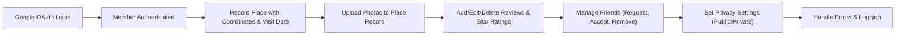

# TravelRecord Backend Functional Requirements

## 1. Introduction and Business Overview

TravelRecord backend service supports a map-based travel logging application that enables users to record places visited, upload photos, write reviews with star ratings, manage friends, and share visit records with privacy controls.

The service uses Google OAuth for user authentication and manages places data based on Google Maps location standards.

## 2. User Roles and Authentication

### 2.1 User Roles

- **Guest**: Unauthenticated visitors who can view public travel records but cannot create or modify any data.
- **Member**: Authenticated users via Google OAuth who can create, edit, and delete their travel records, upload photos, write reviews and ratings, manage friends, and control privacy of their records.
- **Admin**: Administrators with permissions to manage users, review content, and perform system maintenance.

### 2.2 Authentication via Google OAuth

WHEN a user initiates login, THE system SHALL start the Google OAuth authentication flow.

WHEN the Google OAuth token is validated, THE system SHALL create a user session and assign the 'member' role to the user.

WHEN authentication fails due to invalid tokens or errors, THE system SHALL respond with HTTP 401 Unauthorized along with appropriate error codes.

THE system SHALL maintain session expiration after 30 minutes of inactivity.

THE system SHALL allow users to logout, invalidating their session immediately.

## 3. Functional Requirements

### 3.1 Place Recording and Storage

WHEN a member records a place visited, THE system SHALL store:
- The place's latitude and longitude in decimal degrees.
- The place's Google Maps unique place ID.
- The visit date in ISO 8601 date format.

THE system SHALL validate that coordinates and place ID are present and correspond correctly.

IF required fields are missing or invalid, THEN THE system SHALL reject the request with a descriptive validation error.

### 3.2 Photo Upload and Management

WHEN photos are uploaded for a place record, THE system SHALL accept only JPEG or PNG files up to 5MB in size.

THE system SHALL associate each photo with metadata: upload timestamp, file size, and file format.

A place record MAY have zero or multiple photos.

### 3.3 Review and Rating System

WHEN a member submits a review for a place, THE system SHALL accept textual content of up to 1000 characters.

THE system SHALL require a star rating integer between 1 and 5 inclusive.

IF the review text is empty or star rating is out of bounds, THEN THE system SHALL reject submission with an error.

Members SHALL be able to update or delete their own reviews.

### 3.4 Friend Management

Members SHALL be able to send friend requests to other members.

WHEN a friend request is sent, THE system SHALL mark it as "pending" until accepted or rejected by the recipient.

WHEN a friend request is accepted, THE system SHALL establish a bidirectional friendship.

WHEN a friend request is rejected or withdrawn, THE system SHALL delete the pending request.

Members SHALL be able to remove friends, dissolving the friendship relationship.

THE system SHALL prevent duplicate friend requests or friendships.

### 3.5 Sharing and Privacy Controls

Each place record SHALL have a privacy setting:
- "public" (default): visible to friends and public users.
- "private": visible only to the owner member.

Members SHALL be able to update the privacy setting of any of their records.

THE system SHALL enforce privacy settings on all accesses to place records and associated photos and reviews.

## 4. Business Rules and Validation

THE system SHALL prevent duplicate place records for a member for the same location and date.

THE system SHALL maintain referential integrity among users, place records, photos, reviews, and friend relationships.

Photo file types and sizes SHALL be validated on upload.

Star ratings SHALL be integers between 1 and 5.

Review text SHALL not exceed 1000 characters.

Friend requests SHALL only exist once per user pair.

Privacy settings SHALL default to "public" for new records.

## 5. Error Handling and Recovery

IF input data fails validation, THEN THE system SHALL respond with HTTP 400 Bad Request and a descriptive error message.

IF authentication fails, THEN THE system SHALL respond with HTTP 401 Unauthorized.

IF access to a resource is denied due to privacy settings, THEN THE system SHALL respond with HTTP 403 Forbidden.

IF an unexpected server error occurs, THEN THE system SHALL respond with HTTP 500 Internal Server Error and log the incident.

Photo upload failures due to size or format SHALL return specific error codes and messages.

Duplicate friend request attempts SHALL return an error indicating the existing pending or accepted relationship.

## 6. Security and Compliance

THE system SHALL enforce OAuth 2.0 standards for authentication.

THE system SHALL issue JWT tokens with access tokens expiring in 30 minutes and refresh tokens valid for 30 days.

THE system SHALL revoke tokens upon logout.

Role-based access control SHALL be enforced on all API endpoints.

Sensitive data SHALL be encrypted at rest and in transit.

THE system SHALL comply with GDPR and related data protection laws.

## 7. Performance Expectations

Retrieval of place records SHALL respond within 3 seconds under normal load.

Photo uploads SHALL complete within 5 seconds.

Friend management actions SHALL respond within 2 seconds.

Review submissions SHALL process within 3 seconds.

## 8. Permission Matrix

| Action                          | Guest  | Member | Admin  |
|--------------------------------|--------|--------|--------|
| View public place records       | ✅     | ✅     | ✅     |
| Create place records            | ❌     | ✅     | ✅     |
| Upload photos                  | ❌     | ✅     | ✅     |
| Write reviews and ratings       | ❌     | ✅     | ✅     |
| Set privacy of records          | ❌     | ✅     | ✅     |
| Send, accept, reject friend requests | ❌ | ✅      | ✅     |
| Remove friends                  | ❌     | ✅     | ✅     |
| Manage users and content        | ❌     | ❌     | ✅     |

## 9. Mermaid Diagram

> This document provides business requirements only for the TravelRecord backend. All technical implementation details, including system architecture, API design, and database schemas, are the responsibility of the development team. Developers have full autonomy to determine how best to meet these functional requirements. The document exclusively specifies WHAT the system must accomplish, not HOW it must be implemented.