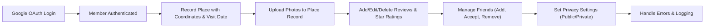

# TravelRecord Backend Functional Requirements

## 1. Introduction and Business Model

TravelRecord는 사용자가 방문한 장소를 Google Maps 좌표로 기록하고, 사진 업로드, 리뷰 작성 및 별점 부여가 가능한 지도 기반 여행 기록 서비스의 백엔드 기능을 지원한다. 사용자 인증은 Google OAuth를 통해 간소화된다.

## 2. User Roles and Authentication

- 사용자는 Google OAuth를 통해 인증된다.
- 인증 실패 시 HTTP 401 상태코드와 오류 메시지가 반환된다.
- 인증 성공 시 세션이 생성되어 사용자의 역할에 따른 접근 권한이 부여된다.

## 3. Functional Requirements

### 3.1 Place Recording and Storage

- WHEN 사용자가 방문 장소를 기록하면, THE 시스템은 Google Maps 좌표(위도 및 경도)를 정확한 부동소수점 값으로 저장해야 한다.
- THE 시스템은 장소 이름과 방문 날짜(ISO 8601 날짜 형식)를 포함해야 한다.
- 필수 요소(좌표, 방문 날짜)가 누락되거나 부정확할 경우, 기록 생성 요청을 3초 이내에 거부하고 설명 가능한 오류를 반환해야 한다.

### 3.2 Photo Upload and Management

- WHEN 사용자가 사진을 업로드하면, THE 시스템은 JPEG, PNG 형식을 지원하고, 손상되거나 미지원 형식은 거부해야 한다.
- THE 시스템은 파일 크기 및 업로드 타임스탬프 등의 메타데이터를 저장해야 한다.
- 업로드 실패 시, THE 시스템은 상세 오류 메시지를 반환하고 재시도를 지원해야 한다.

### 3.3 Review and Rating System

- WHEN 사용자가 특정 장소에 리뷰를 작성하면, THE 시스템은 최소 1자 이상의 텍스트 리뷰와 1~5 범위의 정수 별점을 저장해야 한다.
- 리뷰가 비어있거나 별점이 범위를 벗어날 경우, THE 시스템은 요청을 거부하고 적절한 오류 메시지를 반환해야 한다.
- 사용자는 자신의 리뷰를 수정하거나 삭제할 수 있어야 한다.
- THE 시스템은 특정 장소에 대한 모든 리뷰를 조회할 수 있어야 한다.

### 3.4 Friend Management

- WHEN 사용자가 친구 요청을 보내면, THE 시스템은 중복 요청을 방지하고, 수신된 요청을 사용자가 승인할 때까지 상태를 유지해야 한다.
- 친구 관계는 쌍방향으로 반영되어야 한다.
- 사용자는 친구를 삭제할 수 있어야 하며, 삭제 시 즉시 양방향 친구 관계가 해제되어야 한다.
- 요청 불가능한 경우(중복, 비존재 요청 수락 등)에는 적절한 오류를 반환해야 한다.

### 3.5 Sharing and Privacy Controls

- THE 시스템은 장소 기록과 리뷰의 공개 범위를 'public' 또는 'private'로 설정 가능해야 하며, 기본값은 'public'이다.
- 'public'으로 설정된 기록은 친구 및 인증된 사용자 모두가 접근할 수 있어야 한다.
- 'private'으로 설정된 기록은 기록 작성자 본인만 접근 가능해야 한다.
- 사용자는 언제든지 공개 범위를 변경할 수 있어야 한다.

## 4. Error Handling and Recovery

- 입력 값 검증 실패 시, 시스템은 상세하고 이해 가능한 오류 메시지를 2초 이내에 반환해야 한다.
- 사진 업로드 실패 시, 시스템은 오류 이유를 명확히 전달하고 재시도를 허용해야 한다.
- 친구 요청 관련 오류 발생 시 적절한 상태 코드를 반환하고, 로그를 기록해야 한다.
- 예상치 못한 시스템 오류 발생 시, 5초 이내에 일반 오류 메시지를 반환하고 관리자에게 알림이 가도록 해야 한다.

## 5. Performance Expectations

- 장소 기록 조회 요청은 정상 부하 상태에서 3초 이내에 응답해야 한다.
- 사진 업로드 과정은 5초 이내 완료되어야 하며, 사용자에게 진행 상황이 피드백되어야 한다.
- 친구 관리 작업은 2초 이내에 완료되어야 한다.
- 리뷰 제출 및 수정 작업은 3초 이내 처리되어야 한다.

## Mermaid Diagram

> 이 문서는 TravelRecord 백엔드 기능 요구사항에 대한 비즈니스 요구만을 포함하며, 기술적 구현 방법(시스템 아키텍처, API 설계, 데이터베이스 스키마 등)은 개발팀의 자율에 맡긴다. 문서는 시스템이 "무엇을 해야 하는지"에 집중하고 "어떻게 구현할지는" 다루지 않는다.
