# Prisma Markdown

> Generated by [`prisma-markdown`](https://github.com/samchon/prisma-markdown)

- [Systematic](#systematic)
- [Actors](#actors)
- [Crawling](#crawling)
- [Storage](#storage)
- [Processing](#processing)
- [Popularity](#popularity)
- [API](#api)
- [Alerts](#alerts)

## Systematic

```mermaid
erDiagram
"political_news_crawler_crawl_sources" {
  String id PK
  String source_code UK
  String(80000) source_url UK
  Boolean is_active
  String description "nullable"
  DateTime created_at
  DateTime updated_at
  DateTime deleted_at "nullable"
}
"political_news_crawler_crawl_policies" {
  String id PK
  String policy_name UK
  Int max_crawl_frequency_minutes
  Int max_retry_attempts
  Float backoff_multiplier
  Boolean ban_detection_enabled
  DateTime created_at
  DateTime updated_at
  DateTime deleted_at "nullable"
}
"political_news_crawler_crawl_schedules" {
  String id PK
  String crawl_source_id FK
  String crawl_policy_id FK
  String schedule_expression
  DateTime last_crawled_at "nullable"
  DateTime next_crawl_at "nullable"
  Boolean is_enabled
  DateTime created_at
  DateTime updated_at
  DateTime deleted_at "nullable"
}
"political_news_crawler_crawl_schedules" }o--|| "political_news_crawler_crawl_sources" : crawlSource
"political_news_crawler_crawl_schedules" }o--|| "political_news_crawler_crawl_policies" : crawlPolicy
```

### `political_news_crawler_crawl_sources`

Represents political news crawling sources configuration. Contains source
URLs, status, and metadata for controlling crawl initiation and
processing. Used to manage diverse data feed points for
politicalNewsCrawler.

Properties as follows:

- `id`: Primary Key.
- `source_code`: Unique identifier code for the crawl source.
- `source_url`: The base URL of the crawl source website or API.
- `is_active`
  > Flag indicating whether the crawl source is active and enabled for
  > crawling.
- `description`: Optional description of the crawl source.
- `created_at`: Record creation timestamp.
- `updated_at`: Record last update timestamp.
- `deleted_at`: Soft delete timestamp, if record is deleted.

### `political_news_crawler_crawl_policies`

Configuration for crawl policies governing crawling frequency, retry, and
error handling for political news sources. Ensures adaptive and
respectful crawling behavior according to source limits and bans.

Properties as follows:

- `id`: Primary Key.
- `policy_name`: Unique name identifier for the crawl policy.
- `max_crawl_frequency_minutes`: Maximum allowed crawl frequency in minutes.
- `max_retry_attempts`: Maximum number of retry attempts after failures.
- `backoff_multiplier`: Multiplier factor for exponential backoff on retries.
- `ban_detection_enabled`: Flag to enable detection and handling of bans during crawling.
- `created_at`: Record creation timestamp.
- `updated_at`: Record last update timestamp.
- `deleted_at`: Soft delete timestamp, if record is deleted.

### `political_news_crawler_crawl_schedules`

Schedules defining when and how often crawling runs for each political
news source. References the crawl source and policy to enable adaptive
scheduling and coordination.

Properties as follows:

- `id`: Primary Key.
- `crawl_source_id`
  > Reference to Crawling Source. {@link
  > political_news_crawler_crawl_sources.id}
- `crawl_policy_id`
  > Reference to Crawl Policy. {@link
  > political_news_crawler_crawl_policies.id}
- `schedule_expression`: Cron expression defining the crawl schedule timing.
- `last_crawled_at`: Timestamp when the crawl last occurred.
- `next_crawl_at`: Timestamp for the next scheduled crawl.
- `is_enabled`: Flag indicating if this schedule is enabled.
- `created_at`: Record creation timestamp.
- `updated_at`: Record last update timestamp.
- `deleted_at`: Soft delete timestamp, if record is deleted.

## Actors

### `political_news_crawler_guests`

Stores political news crawler guest user information representing
unauthenticated users accessing APIs. Captures identification via IP and
user agent, includes timestamps for auditing and soft deletion support.
Guests are limited to read-only access with no password or login
credentials.

Properties as follows:

- `id`: Primary Key.
- `ip_address`: IP address of the guest user.
- `user_agent`: User agent string presented by the guest.
- `created_at`: Timestamp when the guest record was created.
- `updated_at`: Timestamp when the guest record was last updated.
- `deleted_at`: Timestamp of soft deletion for the guest record.

## Crawling

### `political_news_crawler_crawl_jobs`

Represents scheduled crawling jobs assigned to specific crawl sources and
schedules, managing operational parameters and state for recurring
political news retrieval tasks.

Properties as follows:

- `id`: Primary Key.
- `crawl_source_id`
  > Referenced crawl source identifier. {@link
  > political_news_crawler_crawl_sources.id}
- `crawl_schedule_id`
  > Referenced crawl schedule identifier. {@link
  > political_news_crawler_crawl_schedules.id}
- `active`: Flag indicating if this crawl job is active and scheduled to run.
- `last_run_started_at`: Timestamp when the last run of the crawl job started, null if never run.
- `last_run_completed_at`
  > Timestamp when the last run of the crawl job completed, null if still
  > running or never run.
- `created_at`: Record creation timestamp.
- `updated_at`: Record last update timestamp.
- `deleted_at`: Soft deletion timestamp, if set the job is considered deleted and ignored.

### `political_news_crawler_crawl_attempts`

Records individual execution attempts of crawl jobs, tracking start and
completion times, success status, errors, and associated raw data
references to enable detailed auditing and failure analysis.

Properties as follows:

- `id`: Primary Key.
- `crawl_job_id`
  > Associated crawl job identifier. {@link
  > political_news_crawler_crawl_jobs.id}
- `raw_data_storage_id`
  > Reference to raw data storage entry for the crawl result. {@link
  > political_news_crawler_raw_data_storage.id}
- `started_at`: Timestamp when this crawl attempt started.
- `completed_at`: Timestamp when this crawl attempt ended; null if still running.
- `success`: Indicator whether this crawl attempt was successful.
- `error_message`: Error message details if the crawl attempt failed.
- `created_at`: Record creation timestamp.
- `updated_at`: Record last update timestamp.

### `political_news_crawler_crawled_news`

Contains metadata for crawled political news articles, linking to the
crawl attempt that obtained the raw content and providing key attributes
for management and filtering.

Properties as follows:

- `id`: Primary Key.
- `crawl_attempt_id`
  > Associated crawl attempt identifier. {@link
  > political_news_crawler_crawl_attempts.id}
- `url`: URL of the crawled news article.
- `title`: Title of the news article, if available.
- `published_at`: Publish timestamp of the news article, if known.
- `created_at`: Record creation timestamp.
- `updated_at`: Record last update timestamp.

## Storage

### `political_news_crawler_raw_data_storage`

Stores metadata and references for raw political news data collected from
various crawling sources. Ensures durable and consistent storage links to
cloud object storage. Tracks source information, crawl job association,
and data integrity validations. Includes audit timestamps for
traceability.

Properties as follows:

- `id`: Primary Key.
- `crawl_source_id`: Belonged crawl source's political_news_crawler_crawl_sources.id.
- `crawl_job_id`: Optional crawl job reference to political_news_crawler_crawl_jobs.id.
- `storage_key`
  > Unique key or path identifying storage location in cloud object storage
  > (e.g., GCP or AWS S3).
- `file_format`
  > Format of the raw data file such as JSON or XML for processing
  > compatibility.
- `file_size_bytes`: Size of the raw data file in bytes.
- `checksum`: Checksum hash to verify file integrity.
- `crawl_timestamp`
  > Timestamp when the raw data was crawled, used for data freshness and
  > scheduling.
- `created_at`: Creation timestamp record.
- `updated_at`: Last update timestamp record.

### `political_news_crawler_local_cache_files`

Tracks local file cache copies of raw crawled political news data with
TTL enforcement and deletion status. Enables fast retrieval during cloud
storage outages and manages file lifecycle with audit timestamps.

Properties as follows:

- `id`: Primary Key.
- `raw_data_storage_id`
  > Reference to related raw data storage record,
  > political_news_crawler_raw_data_storage.id.
- `local_file_path`: Filesystem path or identifier for the local cached file copy.
- `file_size_bytes`: Size of the local cached file in bytes.
- `ttl_expiration_at`
  > Datetime when the cached file expires and is due for deletion under TTL
  > policy.
- `deleted_at`
  > Soft delete timestamp indicating when the cached file was deleted, if
  > applicable.
- `created_at`: Creation timestamp record.
- `updated_at`: Last update timestamp record.

### `political_news_crawler_processed_content`

Stores processed political news content generated by LLM post-processing,
including summaries, highlights, and analysis. Links content to raw data
storage and optionally to the LLM job that generated it. Contains content
type, full text body, generation timestamp, and audit timestamps.
Supports text search through GIN index on content body.

Properties as follows:

- `id`: Primary Key.
- `raw_data_storage_id`
  > Foreign key to the raw data storage record,
  > political_news_crawler_raw_data_storage.id.
- `llm_job_id`: Foreign key to associated LLM job, political_news_crawler_llm_jobs.id.
- `content_type`: Type of processed content, e.g., summary, highlight, or analysis.
- `content_body`: Full textual content produced by LLM processing.
- `generation_timestamp`: Timestamp when this content was generated.
- `created_at`: Record creation timestamp, typically same or near generation time.
- `updated_at`: Last update timestamp record.

## Processing

### `political_news_crawler_llm_jobs`

LLM jobs represent individual processing tasks queued or executed for
political news data. They track the job status, parameters, and
processing flags. This model supports the management and monitoring of
asynchronous LLM post-processing tasks such as generating summaries and
analysis.

Properties as follows:

- `id`: Primary Key.
- `crawl_source_id`
  > The source channel from which the raw news data originated, referencing
  > political_news_crawler_crawl_sources.id.
- `status`
  > Processing status of the job, e.g., 'pending', 'running', 'completed',
  > 'failed'.
- `parameters`: JSON string of parameters or prompts used for this LLM job.
- `created_at`: Job creation timestamp.
- `updated_at`: Job last update timestamp.
- `deleted_at`: Soft delete timestamp, null if not deleted.

### `political_news_crawler_llm_results`

LLM results store the output content generated by LLM jobs, including
summaries, highlights, and analyses. This model links back to the
originating LLM job and preserves output details for retrieval and audit
purposes.

Properties as follows:

- `id`: Primary Key.
- `llm_job_id`: Associated LLM job's political_news_crawler_llm_jobs.id.
- `content_type`: Type of generated content, e.g., 'summary', 'highlight', 'analysis'.
- `content_text`: Generated content text by the LLM.
- `created_at`: Timestamp when the output was created.
- `updated_at`: Timestamp when the output was last updated.
- `deleted_at`: Soft delete timestamp, null if not deleted.

### `political_news_crawler_processing_metadata`

Metadata entries for LLM processing capturing auxiliary information
related to jobs or overall processing context. This table stores
additional attributes to support enhancements and auditability.

Properties as follows:

- `id`: Primary Key.
- `llm_job_id`: Associated LLM job's political_news_crawler_llm_jobs.id.
- `metadata_key`: Key name of the metadata attribute.
- `metadata_value`: Value of the metadata attribute.
- `created_at`: Metadata entry creation timestamp.
- `updated_at`: Metadata entry last update timestamp.
- `deleted_at`: Soft delete timestamp, null if not deleted.

## Popularity

### `political_news_crawler_popularity_scores`

Snapshot table capturing computed popularity scores for political topics
at specific timestamps. Each record represents a historical state of a
popularity calculation for auditing and trend analysis purposes.
References the related popular topic. Includes score metrics and aging
fields consistent with time-decayed ranking models.

Properties as follows:

- `id`: Primary Key.
- `political_news_crawler_popular_topic_id`
  > Referenced popular topic's {@link
  > political_news_crawler_popular_topics.id}.
- `score`: Calculated popularity score for the topic at this snapshot.
- `decay_factor`: Decay factor applied to the score based on the age of the topic mention.
- `snapshot_at`: Timestamp when this popularity score snapshot was taken.
- `created_at`: Record creation timestamp.
- `updated_at`: Record last update timestamp.
- `deleted_at`: Soft deletion timestamp if applicable, otherwise null.

### `political_news_crawler_popular_topics`

Primary table listing all current political news topics with computed
popularity rankings. Maintains unique topic identifiers, titles, and
metadata for efficient querying and API response. Supports independent
management of topics and serves as the main entity for popularity-related
queries.

Properties as follows:

- `id`: Primary Key.
- `topic_code`: Unique code identifier for the political topic.
- `title`: Official title or name of the popular topic.
- `description`: Optional detailed description or context about the popular topic.
- `created_at`: Record creation timestamp.
- `updated_at`: Record last update timestamp.
- `deleted_at`: Soft deletion timestamp if applicable, otherwise null.

### `political_news_crawler_topic_mentions`

Subsidiary table recording mentions of political topics within news
articles. Establishes many-to-one relationships with both topics and
crawled news records. Supports detailed traceability of topic references
and feeds data for popularity calculations. Managed as supporting entity
for topic analytics.

Properties as follows:

- `id`: Primary Key.
- `political_news_crawler_popular_topic_id`
  > Referenced popular topic's {@link
  > political_news_crawler_popular_topics.id}.
- `political_news_crawler_crawled_news_id`
  > Referenced crawled news item's {@link
  > political_news_crawler_crawled_news.id}.
- `mention_context`
  > Optional text snippet or context where the topic is mentioned within the
  > article.
- `created_at`: Record creation timestamp.
- `updated_at`: Record last update timestamp.
- `deleted_at`: Soft deletion timestamp if applicable, otherwise null.

## API

### `political_news_crawler_api_access_logs`

Records detailed log entries for every API access to track client
requests, including request method, path, response status, client IP
address, user agent, request duration in milliseconds, and timestamp.
Supports comprehensive API usage analytics and operational monitoring.

Properties as follows:

- `id`: Primary Key.
- `http_method`: HTTP request method used in the API call, e.g., GET, POST, PUT.
- `path`: API endpoint path being accessed, e.g., /api/v1/popular_topics.
- `status_code`: HTTP response status code returned to the client.
- `client_ip`: IP address of the client making the API request.
- `user_agent`: User agent string of the client or application making the request.
- `duration_ms`: Duration of the API request processing in milliseconds.
- `created_at`: Timestamp when the log entry was created.
- `updated_at`: Timestamp when the log entry was last updated.

### `political_news_crawler_api_error_logs`

Captures detailed records of API errors, including the API path, error
code, error message, client IP, user agent, occurrence timestamp, and
update timestamp. Enables error analysis and system troubleshooting for
API endpoints.

Properties as follows:

- `id`: Primary Key.
- `path`: API endpoint path where the error occurred.
- `error_code`: Error code identifying the type of API error.
- `error_message`: Descriptive error message to assist debugging.
- `client_ip`: IP address of the client causing the error.
- `user_agent`: User agent string of the client application.
- `created_at`: Timestamp when the error log was created.
- `updated_at`: Timestamp when the error log was last updated.

### `political_news_crawler_api_usage_metrics`

Aggregated API usage metrics capturing total counts of API calls by
method and path over specific time periods, including maximum response
times and average durations. Supports performance monitoring and traffic
analysis for API endpoints.

Properties as follows:

- `id`: Primary Key.
- `http_method`: HTTP method for which metrics are aggregated.
- `path`: API endpoint path for which metrics are aggregated.
- `period_start`: Start timestamp of the aggregation period.
- `period_end`: End timestamp of the aggregation period.
- `total_calls`: Total number of API calls observed in the aggregation period.
- `max_response_ms`: Maximum response time in milliseconds recorded during the period.
- `avg_response_ms`: Average response time in milliseconds over the period.
- `created_at`: Timestamp when this aggregated record was created.
- `updated_at`: Timestamp when this aggregated record was last updated.

## Alerts

### `political_news_crawler_crawl_alerts`

Stores alert events related to crawling operations, capturing failures,
bans, or throttle notifications from crawl sources. Links alerts to
specific crawl sources for traceability. Contains timestamp, severity
level, and descriptive message for operational monitoring.

Properties as follows:

- `id`: Primary Key.
- `crawl_source_id`
  > Referenced crawl source's [political_news_crawler_crawl_sources.id](#political_news_crawler_crawl_sources)
  > which triggered the alert.
- `alert_type`
  > Type of alert event indicating the category, e.g., 'ban_detected',
  > 'network_error', 'throttle_warning'.
- `message`
  > Detailed description of the alert event and context for operational
  > understanding.
- `severity`: Severity level of the alert such as 'info', 'warning', 'critical'.
- `created_at`: Timestamp when the alert was created.
- `updated_at`: Timestamp when the alert was last updated.

### `political_news_crawler_processing_alerts`

Captures alert events related to processing pipeline failures including
LLM processing errors, queue backlogs, or retry escalations. Provides
detailed messages and timestamp info for system diagnostics and
resolution procedures.

Properties as follows:

- `id`: Primary Key.
- `alert_type`
  > Category of processing alert such as 'llm_failure', 'queue_overflow',
  > 'retry_limit_reached'.
- `message`: Detailed description of the processing alert event for operational use.
- `severity`: Severity level of the alert (e.g., 'info', 'warning', 'critical').
- `created_at`: Timestamp when the alert was created.
- `updated_at`: Timestamp for last update of the alert.

### `political_news_crawler_api_alerts`

Contains alert records related to API subsystem errors including rate
limiting, endpoint failures, and error spikes. Supports operational
monitoring by storing detailed messages and timestamps of occurrence.

Properties as follows:

- `id`: Primary Key.
- `alert_type`
  > Type of API alert event such as 'rate_limit_exceeded', 'endpoint_error',
  > 'error_spike'.
- `message`: Detailed message describing the API alert context.
- `severity`: Severity level of the alert such as 'info', 'warning', 'critical'.
- `created_at`: Timestamp when the alert was created.
- `updated_at`: Timestamp when the alert was last updated.
