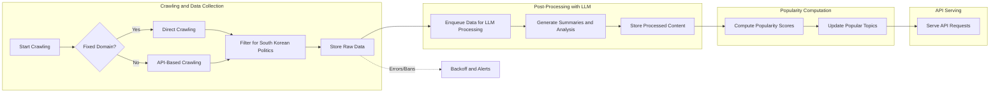

# Functional Requirements Specification for Political News Crawler Backend

## 1. Introduction

The politicalNewsCrawler backend service is designed to collect, process, and serve political news with a primary focus on South Korean politics. It aggregates news data from diverse sources such as fixed news websites, search engine APIs, and third-party news providers. The system processes collected data using large language models (LLMs) to generate enriched contents like summaries, highlights, and analyses to provide value to audiences. The service also computes real-time popularity metrics to present hot political topics.

This document specifies comprehensive business requirements for backend developers to implement the core functionalities required to meet user and business needs. It focuses on business rules, workflows, data management, processing, and API delivery without prescribing technical implementation details.

## 2. Crawling Requirements

### 2.1 Multi-Source Data Collection

- THE system SHALL collect political news data primarily related to South Korean politics from diverse sources combining:
  - Direct crawling within fixed website domains (e.g., New York Times, Korean magazine sites).
  - Utilizing search engine APIs such as SERP to discover relevant news dynamically.
  - Using third-party news APIs and aggregator services such as Tavily.

### 2.2 Crawling Scheduling and Frequency

- WHEN initiating crawling for a source, THE system SHALL determine crawling frequency based on source update behavior with typical intervals within 15 to 30 minutes.
- THE system SHALL support adaptive scheduling to adjust frequency or temporarily suspend crawling based on source response or ban detection.
- THE system SHALL coordinate crawling tasks to avoid making excessive or parallel requests that might trigger bans.

### 2.3 Data Filtering and Relevance

- THE system SHALL filter crawled data to retain only news relevant to South Korean political topics, using content filtering and source meta-information.

### 2.4 Error and Ban Handling

- IF crawler encounters failures such as HTTP errors, bans, or throttling,
  THEN THE system SHALL log the event, notify monitoring services, and employ exponential backoff retry mechanisms.
- IF a source issues bans or blocks persistently,
  THEN THE system SHALL suspend crawling for the affected source temporarily and generate alerts.

### 2.5 Real-Time Crawling Considerations

- WHERE possible, THE system SHALL operate to keep data freshness high with near real-time crawling respecting crawling constraints.
- THE system SHALL balance crawl frequency and source compliance to avoid IP bans or service denial.

## 3. Data Storage Requirements

### 3.1 Raw Data Storage

- THE system SHALL store all raw crawled data persistently in cloud object storage (e.g., GCP, AWS S3).
- A duplicate copy of raw data SHALL be maintained on local file storage to serve as a cache and backup.

### 3.2 Local Storage TTL

- THE system SHALL enforce a strict Time To Live (TTL) policy such that local storage copies older than one month are deleted automatically.

### 3.3 Duplication and Consistency

- THE system SHALL manage data duplication to prevent redundant storage and maintain consistency between cloud and local storage.
- THE system SHALL implement synchronization and verification routines to ensure data integrity.

## 4. LLM Post-Processing Requirements

### 4.1 Cost-Effective LLM Usage

- WHEN selecting LLM models, THE system SHALL prioritize low cost models supplemented by prompt engineering to maximize utility.

### 4.2 Content Generation Feature Set

- THE system SHALL generate at least two feature types from raw news data:
  - Summaries and highlights that condense key points of the articles.
  - Analytical content providing deeper contextual insights on political topics.
- The system SHALL be designed to support additional features iteratively.

### 4.3 Processing Pipeline

- WHEN new raw data is available, THE system SHALL enqueue it for LLM post-processing promptly.
- THE system SHALL meet processing latency targets to deliver content in near real-time.

### 4.4 Data Retention for Processed Content

- THE system SHALL store processed content alongside raw data with metadata including generation timestamp and source reference.

### 4.5 Error Handling

- IF LLM processing fails, THEN THE system SHALL implement retry mechanisms with exponential backoff and escalations if failures persist.

## 5. Popularity Algorithm Requirements

### 5.1 Popularity Metric Design

- THE system SHALL calculate topic popularity considering metrics such as:
  - Recency of news articles mentioning the topic.
  - Frequency and volume of articles on the topic.
  - Source diversity, favoring topics covered by multiple sources.
  - Proxy user engagement signals derived from content volume or analysis features.
  - Geographical relevance to South Korean politics.

### 5.2 Algorithm Processing Steps

- THE system SHALL aggregate articles by topic within a predefined window (e.g., last 24 hours).
- Calculate normalized popularity scores using decay functions to prioritize recent and diverse coverage.

### 5.3 Real-Time Computation

- Popularity metrics SHALL be updated in near real-time with configurable intervals not exceeding 15 minutes where feasible.
- THE system SHALL implement incremental update mechanisms for computational efficiency.

### 5.4 Adaptive Scaling and Failure Handling

- THE system SHALL adapt processing loads based on data volume and usage patterns.
- If algorithms fail, THE system SHALL fallback to the last known stable state.

## 6. API Endpoint Requirements

### 6.1 Endpoint Types

- THE system SHALL expose flexible API endpoints including:
  - Retrieval of latest political news items with filtering (date, source, category).
  - Retrieval of top popular hot topics with popularity scores.
  - Access to generated content such as summaries and analyses.
  - Real-time or near real-time update endpoints for hot topics.
  - Health check and metadata endpoints.

### 6.2 Access and Permissions

- API endpoints SHALL be publicly accessible without authentication.

### 6.3 Response Structure

- Responses SHALL include metadata to justify topic rankings.
- News items SHALL have identifiers, source info, crawling timestamp, raw content references, and processed content where available.

### 6.4 Performance and Error Handling

- API response times SHALL be under 2 seconds under normal load.
- IF data is temporarily unavailable, THEN clear error messages SHALL be returned.
- Invalid requests SHALL receive explicit error responses.

## 7. Non-Functional Requirements

### 7.1 Performance Metrics

- The system SHALL deliver popular topics with less than 5 minutes latency from data ingestion.
- Endpoint response times SHALL be 2 seconds or less typically; 5 seconds under high load.
- Crawl concurrency SHALL support at least 10 parallel sources.

### 7.2 Rate Limiting and Respectful Crawling

- Crawling intervals SHALL respect source limits; minimum interval 15 minutes.
- Back-off on HTTP 429 or 403 errors SHALL be implemented.

### 7.3 Reliability and Scalability

- System availability SHALL be 99.9% uptime.
- Data storage shall be redundant with backups.
- The system SHALL scale horizontally as demand grows.

### 7.4 Compliance and Ethics

- Respect robots.txt and source TOS for crawling.
- Avoid sensitive data collection.
- Comply with relevant data protection laws.

## 8. Analytics and Reporting

### 8.1 Crawling Monitoring

- Track crawl success rates, failure reasons, and latency.
- Alert on failure rates and bans.

### 8.2 Processing Metrics

- Monitor queue sizes, success/failure rates, and processing times for LLM tasks.
- Trigger alerts on error thresholds.

### 8.3 API Usage

- Log and analyze call volumes, response times, and errors.
- Alert on abnormal traffic or error increases.

### 8.4 Popularity Trend Reporting

- Generate daily topic popularity reports and trends over multiple time windows.

## 9. Glossary

- **Crawler**: Component fetching news data.
- **LLM**: Large Language Model used for content processing.
- **TTL**: Time To Live for cached data.
- **Popularity Algorithm**: Business logic for trending topic identification.

---

This specification defines explicit, measurable, and testable business requirements. It provides clarity for backend developers to implement an efficient, compliant, and scalable political news crawler backend service. All technical design, API details, and storage implementation specifics are at the developers' discretion.
